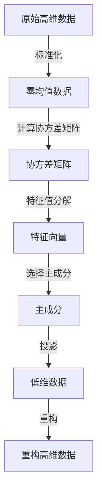

# PCA的调参技巧：优化降维性能

## 1.背景介绍

主成分分析(Principal Component Analysis, PCA)是一种常用的无监督降维技术,广泛应用于数据压缩、噪声去除、可视化等领域。PCA的核心思想是将原始高维数据映射到一个低维空间,同时尽可能多地保留原始数据的差异性。这种降维方法可以有效地提高机器学习算法的性能,减少过拟合风险,加快训练速度。

然而,PCA算法的性能很大程度上取决于参数的选择。不当的参数设置可能导致信息损失或降维效果不佳。因此,合理调参对于发挥PCA的优势至关重要。本文将深入探讨PCA调参的技巧,帮助读者优化降维性能。

## 2.核心概念与联系

### 2.1 主成分分析(PCA)

PCA是一种线性无监督降维技术,通过正交变换将原始数据投影到一个新的坐标系中。这个新坐标系由数据的主成分构成,主成分是原始特征的线性组合,能够最大化数据的方差。

PCA的工作流程如下:

1. 对原始数据进行标准化(零均值化)处理。
2. 计算协方差矩阵。
3. 对协方差矩阵进行特征值分解,得到特征向量。
4. 将原始数据投影到由前K个特征向量构成的低维空间中。

### 2.2 主成分解释方差比例

主成分解释方差比例是一个重要的指标,用于衡量保留的主成分能够解释原始数据方差的程度。该指标的计算公式为:

$$\text{解释方差比例} = \frac{\sum_{i=1}^{k}\lambda_i}{\sum_{i=1}^{d}\lambda_i}$$

其中,$\lambda_i$是第i个特征值,$k$是保留的主成分个数,$d$是原始特征维度。

解释方差比例越高,表明保留的主成分能够越好地描述原始数据。通常,我们希望选择尽可能少的主成分,同时保证解释方差比例在一个可接受的范围内。

### 2.3 主成分选择

确定保留主成分的个数是PCA调参的关键。保留过多主成分可能导致降维效果不佳;保留过少主成分则可能丢失重要信息。常见的主成分选择策略包括:

1. **固定阈值策略**:设置一个解释方差比例的阈值,保留能够解释该阈值以上方差的主成分。
2. **固定个数策略**:直接指定需要保留的主成分个数。
3. **肘部法则**:绘制解释方差比例与主成分个数的折线图,在"肘部"处选择主成分个数。
4. **交叉验证**:在验证集上评估不同主成分个数对模型性能的影响,选择最优个数。

### 2.4 降维后的重构

PCA不仅可以用于降维,还能够将降维后的低维数据重构回原始高维空间。重构的目的是评估降维过程中的信息损失程度。重构误差越小,说明保留的主成分能够越好地描述原始数据。

重构误差可以用均方根误差(RMSE)来衡量:

$$\text{RMSE} = \sqrt{\frac{1}{n}\sum_{i=1}^{n}(x_i - \hat{x}_i)^2}$$

其中,$x_i$是原始数据样本,$\hat{x}_i$是重构后的样本,$n$是样本个数。



## 3.核心算法原理具体操作步骤 

PCA算法的核心步骤如下:

1. **标准化处理**

对原始数据进行标准化(零均值化)处理,确保每个特征具有相同的尺度和均值为0。标准化公式为:

$$x' = \frac{x - \mu}{\sigma}$$

其中,$x$为原始数据,$\mu$为均值,$\sigma$为标准差。

2. **计算协方差矩阵**

协方差矩阵描述了数据特征之间的线性相关性,是PCA的基础。协方差矩阵的计算公式为:

$$\Sigma = \frac{1}{n}\sum_{i=1}^{n}(x_i - \mu)(x_i - \mu)^T$$

其中,$x_i$为第i个样本,$\mu$为样本均值,$n$为样本个数。

3. **特征值分解**

对协方差矩阵$\Sigma$进行特征值分解,得到特征向量$V$和对角特征值矩阵$\Lambda$:

$$\Sigma V = \Lambda V$$

其中,特征向量$V$对应于协方差矩阵的主成分方向,特征值$\Lambda$对应于各主成分的方差。

4. **选择主成分**

根据预设的策略(如解释方差比例阈值、固定个数等)选择前$k$个主成分,构成投影矩阵$W$:

$$W = [v_1, v_2, \cdots, v_k]$$

其中,$v_i$是第$i$个特征向量。

5. **投影与重构**

将原始数据$X$投影到主成分空间,得到降维后的低维数据$Y$:

$$Y = XW$$

如需重构回原始空间,则有:

$$\hat{X} = YW^T$$

重构误差可用RMSE来衡量。

## 4.数学模型和公式详细讲解举例说明

### 4.1 主成分分析的数学模型

设原始数据矩阵为$X \in \mathbb{R}^{n \times d}$,其中$n$为样本数,$d$为特征维度。PCA的目标是找到一个正交投影矩阵$W \in \mathbb{R}^{d \times k}$,将$X$映射到$k$维空间($k < d$):

$$Y = XW$$

其中,$Y \in \mathbb{R}^{n \times k}$是降维后的低维数据。

为了使降维后的数据保留尽可能多的原始数据信息,PCA希望最大化投影后数据的方差:

$$\max_{W} \text{Var}(Y) = \max_{W} \frac{1}{n}\sum_{i=1}^{n}\|y_i\|_2^2$$

其中,$y_i$是第$i$个样本的投影向量。

同时,为了避免平凡解,需要对$W$加入正交约束:

$$W^TW = I$$

上述优化问题等价于最大化投影后数据的散布程度,即最大化投影方向上的方差。通过特征值分解,可以证明最优投影矩阵$W$由协方差矩阵$\Sigma$的前$k$个特征向量构成。

### 4.2 主成分选择的数学解释

主成分选择的目标是在降维过程中尽可能少地丢失原始数据的信息。我们可以通过解释方差比例来衡量信息保留程度。

设$\lambda_1, \lambda_2, \cdots, \lambda_d$为协方差矩阵$\Sigma$的特征值,其中$\lambda_1 \geq \lambda_2 \geq \cdots \geq \lambda_d$。根据矩阵谱定理,原始数据的总方差为:

$$\text{总方差} = \sum_{i=1}^{d}\lambda_i$$

如果我们选择前$k$个主成分进行降维,则保留的方差为:

$$\text{保留方差} = \sum_{i=1}^{k}\lambda_i$$

因此,解释方差比例可以表示为:

$$\text{解释方差比例} = \frac{\sum_{i=1}^{k}\lambda_i}{\sum_{i=1}^{d}\lambda_i}$$

解释方差比例越高,表明保留的主成分能够越好地描述原始数据。通常,我们希望选择尽可能少的主成分,同时保证解释方差比例在一个可接受的范围内(如95%或更高)。

### 4.3 重构误差的数学解释

重构误差用于衡量降维过程中的信息损失程度。设$X$为原始数据矩阵,$\hat{X}$为重构后的数据矩阵,则重构误差可以用均方根误差(RMSE)来表示:

$$\text{RMSE} = \sqrt{\frac{1}{n}\sum_{i=1}^{n}\|x_i - \hat{x}_i\|_2^2}$$

其中,$x_i$和$\hat{x}_i$分别是第$i$个样本的原始向量和重构向量。

我们可以将RMSE与解释方差比例联系起来。由于PCA是通过正交投影实现降维,因此重构误差等于未被保留的主成分对应的方差之和:

$$\text{RMSE}^2 = \frac{1}{n}\sum_{i=k+1}^{d}\lambda_i$$

其中,$\lambda_i$是第$i$个特征值。

由于$\sum_{i=1}^{d}\lambda_i$是原始数据的总方差,因此有:

$$1 - \text{解释方差比例} = \frac{\sum_{i=k+1}^{d}\lambda_i}{\sum_{i=1}^{d}\lambda_i} = \frac{n\text{RMSE}^2}{\sum_{i=1}^{d}\lambda_i}$$

可见,解释方差比例与重构误差成反比关系。当解释方差比例较高时,重构误差较小,说明降维过程中的信息损失较少。

### 4.4 实例说明

假设我们有一个包含1000个样本的数据集,每个样本有10个特征。我们希望使用PCA进行降维,并保留足够的信息。

首先,我们对原始数据进行标准化处理,然后计算协方差矩阵并进行特征值分解。假设得到的特征值为:

$$\lambda_1 = 3.5, \lambda_2 = 2.1, \lambda_3 = 1.8, \lambda_4 = 0.9, \lambda_5 = 0.5, \lambda_6 = 0.4, \lambda_7 = 0.3, \lambda_8 = 0.2, \lambda_9 = 0.1, \lambda_{10} = 0.1$$

我们可以计算出解释方差比例:

- 保留1个主成分时,解释方差比例为$\frac{3.5}{3.5 + 2.1 + 1.8 + 0.9 + 0.5 + 0.4 + 0.3 + 0.2 + 0.1 + 0.1} = 0.35$
- 保留2个主成分时,解释方差比例为$\frac{3.5 + 2.1}{9.9} = 0.56$
- 保留3个主成分时,解释方差比例为$\frac{3.5 + 2.1 + 1.8}{9.9} = 0.74$
- 保留4个主成分时,解释方差比例为$\frac{3.5 + 2.1 + 1.8 + 0.9}{9.9} = 0.83$

如果我们设置解释方差比例阈值为0.9,则需要保留前5个主成分。此时,重构误差为:

$$\text{RMSE} = \sqrt{\frac{1000 \times (0.4^2 + 0.3^2 + 0.2^2 + 0.1^2 + 0.1^2)}{1000}} \approx 0.58$$

相比原始10维数据,保留5个主成分可以有效降低数据维度,同时保证解释方差比例达到90%,重构误差也在可接受范围内。

## 5.项目实践:代码实例和详细解释说明

以下是使用Python中的scikit-learn库实现PCA的代码示例:

```python
from sklearn.decomposition import PCA
import numpy as np

# 生成样本数据
X = np.random.randn(1000, 10)

# 创建PCA对象
pca = PCA(n_components=0.9)  # 保留90%的解释方差比例

# 拟合并转换数据
X_pca = pca.fit_transform(X)

# 输出结果
print(f"原始数据维度: {X.shape[1]}")
print(f"降维后数据维度: {X_pca.shape[1]}")
print(f"解释方差比例: {sum(pca.explained_variance_ratio_):.2f}")

# 可视化解释方差比例
import matplotlib.pyplot as plt
plt.plot(range(1, len(pca.explained_variance_ratio_) + 1), 
         np.cumsum(pca.explained_variance_ratio_), marker='o')
plt.xlabel('Number of Components')
plt.ylabel('Cumulative Explained Variance')
plt.show()
```

代码解