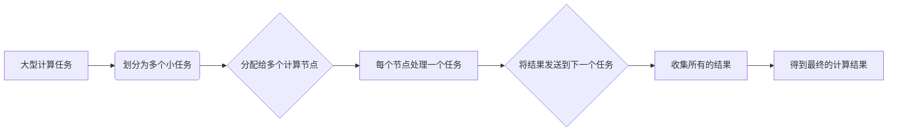

## 1.背景介绍

在当今的计算机科学中，分布式系统已经变得越来越重要。随着云计算和大数据的发展，我们需要更高效、更可靠的方式来处理和存储大量的数据。在这个背景下，Parti算法应运而生。

Parti算法是一种基于图的分布式系统算法，它的核心思想是将大型的计算任务划分为小的部分，然后在多个计算节点上并行处理这些部分。通过这种方式，Parti算法可以大大提高处理大数据的效率。

## 2.核心概念与联系

Parti算法的核心概念是“分区”和“任务”。在Parti算法中，我们将大型的计算任务划分为多个小的任务，这些小的任务可以在多个计算节点上并行处理。每个计算节点处理一个任务，我们称之为一个“分区”。

在Parti算法中，任务之间的联系主要体现在数据的传递上。每个任务处理完后，会将结果发送到下一个任务，形成一个任务链。通过这种方式，Parti算法可以处理大型的计算任务，而不需要在单个计算节点上处理所有的数据。

## 3.核心算法原理具体操作步骤

Parti算法的核心操作步骤如下：

1. 将大型的计算任务划分为多个小的任务。
2. 将这些任务分配给多个计算节点。
3. 每个计算节点处理一个任务，处理完后将结果发送到下一个任务。
4. 当所有的任务都处理完后，收集所有的结果，得到最终的计算结果。

这个过程可以用以下的Mermaid流程图来表示：



## 4.数学模型和公式详细讲解举例说明

在Parti算法中，我们可以使用一些数学模型和公式来描述和分析算法的性能。例如，我们可以使用图论的概念来描述任务的划分和分配。

假设我们有一个大型的计算任务，这个任务可以表示为一个图$G=(V,E)$，其中$V$是节点集合，$E$是边集合。每个节点$v\in V$表示一个小的任务，每条边$(u,v)\in E$表示任务$u$和任务$v$之间的数据传递。

我们可以定义一个函数$T: V\to \mathbb{R}$，表示每个任务的处理时间。我们的目标是最小化所有任务的处理时间的总和，即$\sum_{v\in V}T(v)$。

我们可以使用贪心算法来划分任务。具体来说，我们可以将任务按照处理时间从大到小排序，然后依次分配给计算节点。这个过程可以用以下的伪代码来表示：

```python
def parti(V, E, T):
    V.sort(key=T, reverse=True)
    P = []
    for v in V:
        if len(P) == 0 or P[-1].load + T(v) > threshold:
            P.append(Partition())
        P[-1].add(v)
    return P
```

在这个伪代码中，`V.sort(key=T, reverse=True)`是将任务按照处理时间从大到小排序，`P.append(Partition())`是创建一个新的分区，`P[-1].add(v)`是将任务$v$添加到最后一个分区。

## 5.项目实践：代码实例和详细解释说明

下面我们来看一个具体的代码实例，这个例子是用Python实现的Parti算法。在这个例子中，我们假设有10个任务，每个任务的处理时间是一个随机数。

```python
import random

class Task:
    def __init__(self, time):
        self.time = time

class Partition:
    def __init__(self):
        self.tasks = []
        self.load = 0

    def add(self, task):
        self.tasks.append(task)
        self.load += task.time

def parti(V, threshold):
    V.sort(key=lambda task: task.time, reverse=True)
    P = []
    for task in V:
        if len(P) == 0 or P[-1].load + task.time > threshold:
            P.append(Partition())
        P[-1].add(task)
    return P

V = [Task(random.randint(1, 10)) for _ in range(10)]
P = parti(V, 10)
for i, p in enumerate(P):
    print(f"Partition {i}: load = {p.load}, tasks = {[task.time for task in p.tasks]}")
```

在这个例子中，`Task`类表示一个任务，`Partition`类表示一个分区，`parti`函数是Parti算法的实现。我们首先生成10个随机的任务，然后使用Parti算法将这些任务划分为多个分区，最后打印出每个分区的负载和任务列表。

## 6.实际应用场景

Parti算法在很多实际应用场景中都有广泛的应用，例如：

- 在大数据处理中，我们可以使用Parti算法将大型的数据处理任务划分为多个小的任务，然后在多个计算节点上并行处理这些任务。这样可以大大提高数据处理的效率。

- 在云计算中，我们可以使用Parti算法将复杂的计算任务划分为多个简单的任务，然后在多个计算节点上并行处理这些任务。这样可以大大提高计算的效率。

- 在网络通信中，我们可以使用Parti算法将大型的数据传输任务划分为多个小的任务，然后在多个网络节点上并行处理这些任务。这样可以大大提高数据传输的效率。

## 7.工具和资源推荐

在实际应用Parti算法时，我们可以使用一些工具和资源来帮助我们更好地理解和实现算法，例如：

- [NetworkX](https://networkx.org/): 这是一个Python的图论库，我们可以使用它来创建和操作图，非常适合用来实现Parti算法。

- [Dask](https://dask.org/): 这是一个Python的并行计算库，我们可以使用它来并行处理任务，非常适合用来实现Parti算法。

- [Apache Spark](https://spark.apache.org/): 这是一个大数据处理框架，它内置了Parti算法，我们可以直接使用它来处理大数据。

## 8.总结：未来发展趋势与挑战

随着云计算和大数据的发展，Parti算法的应用将越来越广泛。然而，Parti算法也面临一些挑战，例如如何更好地划分任务，如何更好地分配任务，如何更好地处理任务之间的数据传递等。

在未来，我们需要继续研究和改进Parti算法，以应对这些挑战。同时，我们也需要开发更多的工具和资源，以帮助我们更好地理解和实现Parti算法。

## 9.附录：常见问题与解答

Q: Parti算法适用于哪些场景？

A: Parti算法主要适用于需要处理大型计算任务的场景，例如大数据处理、云计算、网络通信等。

Q: Parti算法的主要优点是什么？

A: Parti算法的主要优点是可以将大型的计算任务划分为多个小的任务，然后在多个计算节点上并行处理这些任务，从而大大提高处理效率。

Q: Parti算法的主要缺点是什么？

A: Parti算法的主要缺点是需要处理任务之间的数据传递，这可能会增加计算的复杂性和通信的开销。

作者：禅与计算机程序设计艺术 / Zen and the Art of Computer Programming