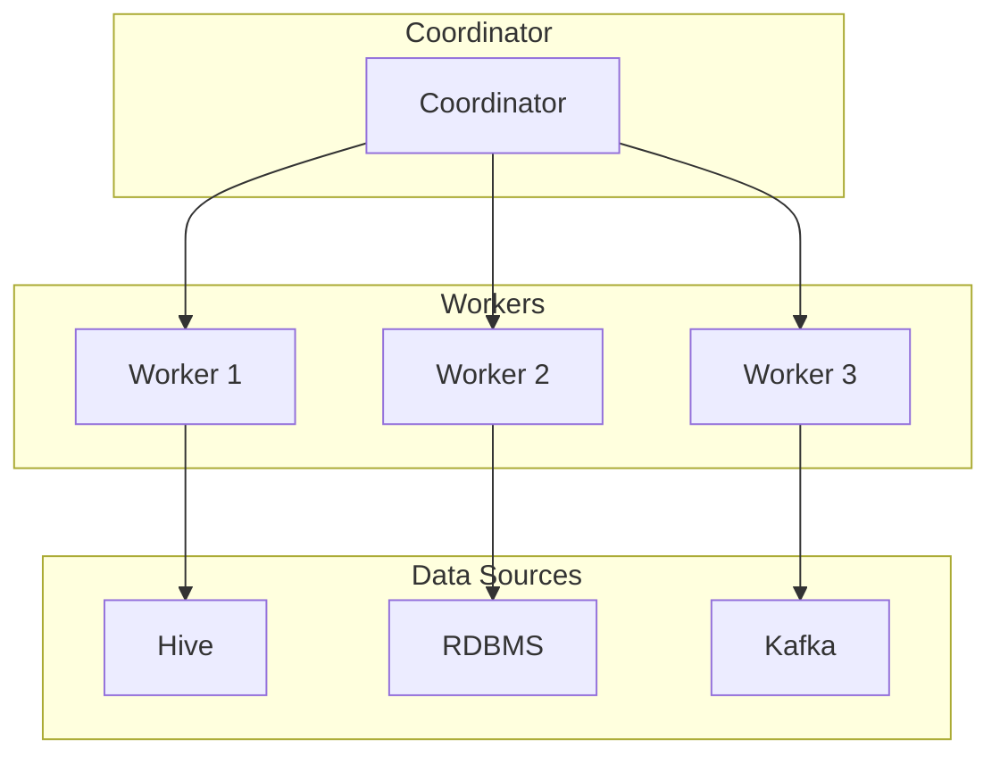
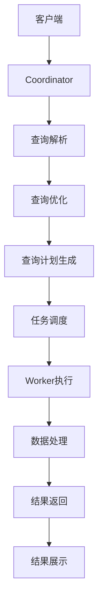
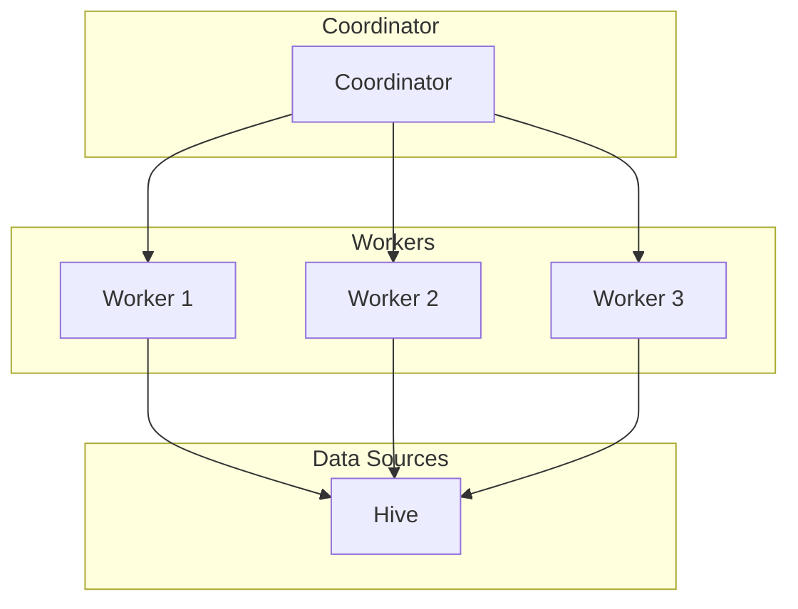

# PrestoSQL语法：简洁易用，查询表达力强

## 1.背景介绍

### 1.1 什么是PrestoSQL?

PrestoSQL是一种开源的分布式SQL查询引擎,旨在对存储在不同数据源(如Hive、Cassandra、关系数据库等)中的大规模数据集进行交互式分析。它最初由Facebook公司开发,后来贡献给了开源社区。

PrestoSQL的设计目标是在保持高性能的同时,提供了一种简单易用的SQL查询语言,使用户能够轻松地分析来自各种异构数据源的数据。它采用了分布式并行查询执行引擎,能够高效地处理PB级别的数据。

### 1.2 PrestoSQL的优势

相比其他大数据查询引擎,PrestoSQL具有以下几个主要优势:

- **简单易用的SQL语法**: PrestoSQL支持ANSI SQL标准,语法简洁直观,易于上手。
- **高查询性能**: 借助分布式并行查询执行引擎,PrestoSQL能够高效处理大规模数据。
- **统一数据视图**: 用户无需关注数据存储细节,PrestoSQL为各种数据源提供了统一的数据抽象视图。
- **支持多种数据源**: 除了Hive、关系数据库等常见数据源,PrestoSQL还支持Cassandra、Kafka等新兴数据源。
- **容错与高可用性**: PrestoSQL具有容错和高可用性特性,能够确保查询的可靠执行。

## 2.核心概念与联系

### 2.1 PrestoSQL架构概览

PrestoSQL的整体架构如下所示:



PrestoSQL架构主要包括以下几个核心组件:

- **Coordinator**: 接收客户端的查询请求,负责查询计划的生成、优化和调度。
- **Worker**: 执行具体的查询任务,从数据源读取数据并进行处理。
- **数据源连接器(Connector)**: 用于连接各种异构数据源,如Hive、关系数据库、Kafka等。

查询执行过程中,Coordinator负责将查询分解为多个阶段(Stage),并将这些阶段分发给Worker节点执行。Worker节点从数据源读取数据,并通过一系列操作符(Operator)进行处理,最终将结果返回给Coordinator。

### 2.2 SQL查询执行流程

PrestoSQL的SQL查询执行流程如下所示:



1. **客户端**发送SQL查询请求到Coordinator。
2. **Coordinator**对SQL查询进行**解析**,构建查询语法树。
3. 基于查询语法树,**Coordinator**进行**查询优化**,如谓词下推、列裁剪等。
4. **Coordinator**生成**查询计划**,将查询划分为多个阶段(Stage)。
5. **Coordinator**将各个阶段的任务**调度**到Worker节点执行。
6. **Worker**节点从数据源读取数据,并通过一系列**操作符**进行**数据处理**。
7. 处理后的**结果**被返回给Coordinator。
8. **Coordinator**将结果**展示**给客户端。

## 3.核心算法原理具体操作步骤  

### 3.1 查询解析

PrestoSQL使用ANTLR作为SQL查询解析器,将SQL语句解析为抽象语法树(AST)。AST是一种树状数据结构,用于表示查询的语法结构。

解析过程包括以下几个步骤:

1. **词法分析**: 将SQL语句拆分为一系列的标记(Token),如关键字、标识符、字面值等。
2. **语法分析**: 根据SQL语法规则,将标记序列构建成AST。
3. **语义分析**: 对AST进行语义检查,如类型检查、作用域检查等。

### 3.2 查询优化

查询优化是PrestoSQL的核心功能之一,旨在生成高效的查询执行计划。主要优化技术包括:

1. **谓词下推**: 将过滤条件尽可能下推到数据源,减少需要处理的数据量。
2. **列裁剪**: 只读取查询中需要使用的列,避免不必要的数据传输。
3. **投影剪裁**: 根据查询条件,剪裁不需要的投影列。
4. **连接重排**: 对连接顺序进行优化,减少中间结果的大小。
5. **常量折叠**: 预计算常量表达式,减少运行时计算。

### 3.3 查询计划生成

经过优化后,PrestoSQL会为查询生成分布式执行计划。执行计划由一系列的阶段(Stage)组成,每个阶段包含多个并行的任务(Task)。

执行计划生成过程包括以下步骤:

1. **查询分解**: 将查询拆分为多个阶段,每个阶段执行特定的操作。
2. **任务划分**: 根据数据分布情况,将每个阶段划分为多个并行任务。
3. **资源分配**: 为每个任务分配所需的计算资源(CPU、内存等)。
4. **任务调度**: 将任务分发到Worker节点执行。

### 3.4 数据处理

Worker节点执行具体的数据处理任务,涉及以下几个关键步骤:

1. **数据读取**: 从数据源(如Hive、RDBMS等)读取所需数据。
2. **操作符执行**: 通过一系列操作符(如过滤、投影、聚合等)对数据进行处理。
3. **数据传输**: 在操作符之间传输处理后的数据。
4. **结果返回**: 将最终结果返回给Coordinator。

数据处理过程中,PrestoSQL采用了多种优化技术,如代码生成、向量化执行、内存管理等,以提高查询性能。

## 4.数学模型和公式详细讲解举例说明

在PrestoSQL中,一些核心算法和优化技术涉及到数学模型和公式,下面将对其进行详细讲解。

### 4.1 代价模型

PrestoSQL使用基于代价的优化策略,选择代价最小的查询执行计划。代价模型主要考虑以下几个因素:

- 数据传输代价
- CPU代价
- 内存代价

数据传输代价主要取决于需要传输的数据量,可以用公式表示为:

$$
\text{Transfer Cost} = \sum_{i=1}^{n} \text{data\_size}(i)
$$

其中,n是数据源的数量,data_size(i)表示从第i个数据源传输的数据量。

CPU代价主要取决于需要执行的操作数量,可以用公式表示为:

$$
\text{CPU Cost} = \sum_{i=1}^{m} \text{op\_cost}(i) \times \text{data\_size}(i)
$$

其中,m是操作符的数量,op_cost(i)表示第i个操作符的单位代价,data_size(i)表示该操作符处理的数据量。

内存代价主要取决于查询执行过程中所需的内存空间,可以用公式表示为:

$$
\text{Memory Cost} = \max_{i=1}^{n} \text{mem\_usage}(i)
$$

其中,n是查询阶段的数量,mem_usage(i)表示第i个阶段所需的内存空间。

PrestoSQL会综合考虑上述三个代价,选择总代价最小的执行计划。

### 4.2 数据分区

为了提高查询性能,PrestoSQL会对数据进行分区,以减少数据洗牌(Data Shuffle)的开销。常用的分区技术包括:

- **Hash分区**: 根据指定列的哈希值进行分区,常用于连接操作。
- **范围分区**: 根据指定列的值范围进行分区,常用于排序操作。

对于Hash分区,PrestoSQL会计算每个分区的大小,并尽量使各分区的大小均衡,以实现负载均衡。假设需要将数据划分为n个分区,第i个分区的大小为size(i),则分区大小的方差可以用公式表示为:

$$
\text{Variance} = \frac{1}{n} \sum_{i=1}^{n} (\text{size}(i) - \overline{\text{size}})^2
$$

其中,$$\overline{\text{size}}$$表示所有分区的平均大小。PrestoSQL会尽量minimizeize这个方差,以实现更好的负载均衡效果。

## 5.项目实践:代码实例和详细解释说明

为了更好地理解PrestoSQL的工作原理,我们来看一个实际的查询示例。假设我们要从Hive表中查询某个部门的员工信息,包括员工姓名、薪资和部门名称,SQL语句如下:

```sql
SELECT e.name, e.salary, d.dept_name
FROM employee e
JOIN dept d ON e.dept_no = d.dept_no
WHERE d.dept_name = 'Engineering';
```

下面我们分步骤解释PrestoSQL是如何执行这个查询的。

### 5.1 查询解析

PrestoSQL首先会将SQL语句解析为抽象语法树(AST),AST的结构如下:

```
QuerySpecification
  SELECT
    AliasedRelation(alias="e")
      TableReference(table=employee)
    AliasedRelation(alias="d")
      TableReference(table=dept)
  FROM
    Join(type=inner, criterion=("e.dept_no" = "d.dept_no"))
      AliasedRelation(alias="e")
        TableReference(table=employee)
      AliasedRelation(alias="d")
        TableReference(table=dept)
  WHERE
    ComparisonExpression(op=eq)
      FieldReference(field="d.dept_name")
      StringLiteral(value="Engineering")
```

可以看到,AST描述了查询的语法结构,包括SELECT列表、FROM子句、JOIN条件和WHERE过滤条件等。

### 5.2 查询优化

接下来,PrestoSQL会对查询进行优化,主要包括以下几个步骤:

1. **谓词下推**: 将WHERE条件`d.dept_name = 'Engineering'`下推到Hive表扫描操作,减少需要处理的数据量。
2. **列裁剪**: 只读取`e.name`、`e.salary`和`d.dept_name`这三列,避免不必要的数据传输。
3. **连接重排**: 由于`dept`表通常比`employee`表小,因此先扫描`dept`表,再与`employee`表进行连接,可以减小中间结果的大小。

经过优化后,查询计划如下所示:

```
Join(type=inner, criterion=("e.dept_no" = "d.dept_no"))
  TableScan(table=employee, filterPushdown=false)
    Columns: ["e.name", "e.salary", "e.dept_no"]
  FilteredTableScan(table=dept, filterPushdown=true)
    Filter: ("d.dept_name" = "Engineering")
    Columns: ["d.dept_no", "d.dept_name"]
```

可以看到,PrestoSQL将WHERE条件下推到`dept`表扫描操作,并对扫描列进行了裁剪。同时,它还调整了连接顺序,先扫描`dept`表,再与`employee`表进行连接。

### 5.3 查询执行

经过优化后,PrestoSQL会生成分布式执行计划,并将任务分发到Worker节点执行。假设我们有3个Worker节点,执行计划可能如下所示:



1. Coordinator将查询分解为两个阶段:扫描`dept`表和扫描`employee`表。
2. 扫描`dept`表的任务被分发到Worker 1执行,并应用WHERE条件`d.dept_name = 'Engineering'`进行过滤。
3. 扫描`employee`表的任务被分发到Worker 2和Worker 3执行,并进行列裁剪,只读取`e.name`、`e.salary`和`e.dept_no`三列。
4. Worker 1将过滤后的`dept`表数