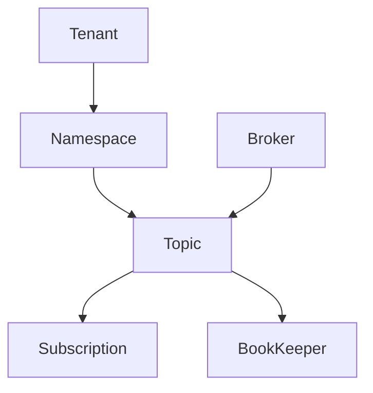
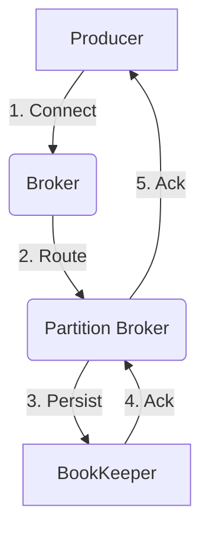
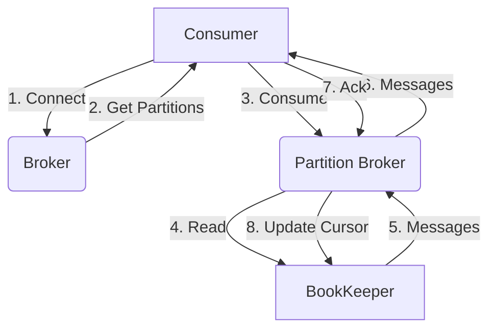
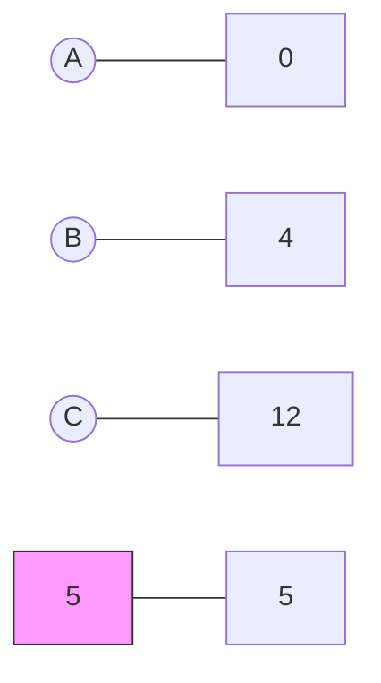

👍 好的，我会严格按照您提供的约束条件，为您撰写一篇高质量的技术博客文章。以下是标题为《Pulsar原理与代码实例讲解》的文章正文内容:

# Pulsar原理与代码实例讲解

## 1.背景介绍

### 1.1 什么是Pulsar?

Apache Pulsar是一个云原生、分布式的消息流处理平台,旨在提供无限水平扩展的消息队列功能。它最初由Yahoo开发并开源,后来加入了Apache软件基金会,成为了Apache顶级项目。

### 1.2 Pulsar的设计目标

Pulsar的主要设计目标包括:

- **无限水平扩展**: 通过分区和分片技术,Pulsar可以无限扩展以处理大量消息流
- **多租户**: 支持多租户隔离,提高资源利用率
- **持久化存储**: 消息持久化到分布式日志,确保数据不丢失
- **高性能**: 通过多种优化手段,实现百万级别的消息传递吞吐量

### 1.3 Pulsar的应用场景

Pulsar适用于需要处理大量消息流的各种场景,如:

- 实时数据管道
- 物联网数据收集
-日志收集和处理
- 实时数据分析等

## 2.核心概念与联系

### 2.1 Tenant

Tenant是Pulsar中的一个逻辑概念,用于对资源进行隔离和集中管理。每个Tenant拥有自己的命名空间、主题和订阅等资源。

### 2.2 Namespace

Namespace是Pulsar中的一个逻辑命名空间,用于对Topic进行分组和隔离。一个Tenant可以拥有多个Namespace。

### 2.3 Topic

Topic是Pulsar中的消息队列,生产者向Topic发送消息,消费者从Topic消费消息。每个Topic都属于一个Namespace。

### 2.4 Subscription

Subscription表示一个或一组消费者订阅了某个Topic。Pulsar支持独占订阅和共享订阅两种模式。

### 2.5 Broker

Broker是Pulsar集群的组成单元,负责处理生产者发送的消息和消费者的消费请求。

### 2.6 BookKeeper

BookKeeper是一个开源的分布式写入ahead日志服务,用于持久化存储Pulsar中的消息数据。

### 2.7 核心概念关系

这些核心概念之间的关系如下所示:



## 3.核心算法原理具体操作步骤  

### 3.1 消息发送流程

当生产者向某个Topic发送消息时,Pulsar的消息发送流程如下:

1. 生产者建立与Broker的TCP连接
2. 生产者通过内部路由策略选择一个Broker作为入口点
3. 入口点Broker根据Topic的路由策略,选择一个根据分区哈希的Broker
4. 分区Broker将消息持久化到BookKeeper
5. 分区Broker返回消息确认给生产者



### 3.2 消息消费流程

当消费者从某个Topic消费消息时,Pulsar的消息消费流程如下:

1. 消费者建立与Broker的TCP连接
2. 消费者获取当前可用的消费分区信息
3. 消费者向分区Broker发送消费请求
4. 分区Broker从BookKeeper读取消息并返回给消费者
5. 消费者发送确认,分区Broker更新已消费消息位移



## 4.数学模型和公式详细讲解举例说明

### 4.1 一致性哈希分区

Pulsar使用一致性哈希算法对Topic进行分区,以实现负载均衡和故障转移。

假设有n个Broker节点,哈希环的大小为2^m,对于任意一个Key(如Topic名称),可以计算出它在哈希环上的位置:

$$
hash(key) = \dfrac{key}{2^m}
$$

然后顺时针找到第一个节点,就是该Key的映射节点。

例如,有3个Broker节点A、B、C,哈希环大小为16,对于Topic "my-topic",计算过程如下:

$$
\begin{aligned}
hash("my-topic") &= \dfrac{"my-topic"}{2^4} \\
                 &= 5
\end{aligned}
$$

在哈希环上,5位于B和C之间,距离B更近,因此"my-topic"被映射到Broker B。



### 4.2 消费分区分配

Pulsar使用统一的分区分配策略为消费者分配消费分区。

假设有n个消费者,k个分区,分配过程如下:

1. 对消费者进行排序,得到有序列表C
2. 对分区进行排序,得到有序列表P
3. 使用Round Robin策略,将P中的分区依次分配给C中的消费者

例如,有3个消费者c1、c2、c3,6个分区p1、p2、p3、p4、p5、p6,分配结果如下:

- c1: p1、p4
- c2: p2、p5  
- c3: p3、p6

### 4.3 有序分发

为了保证消息的有序性,Pulsar采用了分区内有序、分区间无序的策略。

在单个分区内,消息是按照发送顺序被持久化和分发的,从而保证了分区有序性。而在不同分区之间,消息则可能是无序的。

如果应用需要全局有序,可以将所有消息发送到单个分区,从而牺牲了并行度。

## 5.项目实践:代码实例和详细解释说明

本节将通过Java代码示例,演示如何使用Pulsar Client进行消息的生产和消费。

### 5.1 创建Client实例

```java
PulsarClient client = PulsarClient.builder()
        .serviceUrl("pulsar://localhost:6650")
        .build();
```

### 5.2 创建Producer

```java
Producer<byte[]> producer = client.newProducer()
        .topic("my-topic")
        .create();
```

### 5.3 发送消息

```java
producer.send("Hello Pulsar".getBytes());
```

### 5.4 创建Consumer

```java
Consumer<byte[]> consumer = client.newConsumer()
        .topic("my-topic")
        .subscriptionName("my-subscription")
        .subscribe();
```

### 5.5 接收消息

```java
Message<byte[]> msg = consumer.receive();
String value = new String(msg.getData());
System.out.println(value); // Hello Pulsar

// 确认消息消费成功
consumer.acknowledge(msg);
```

### 5.6 关闭Client

```java
producer.close();
consumer.close();
client.close();
```

## 6.实际应用场景

### 6.1 实时数据管道

Pulsar可以作为实时数据管道,将来自各种来源的数据流式传输到下游系统,如数据湖、实时计算引擎等。

### 6.2 物联网数据收集

在物联网场景中,大量的设备会持续产生海量数据,Pulsar可以高效地收集这些数据,并将其传输到后端系统进行存储和分析。

### 6.3 日志收集和处理 

Pulsar可以作为集中式日志收集系统,从分布式应用收集日志数据,并支持对日志数据进行实时处理、转发等操作。

### 6.4 实时数据分析

结合实时计算引擎(如Apache Flink、Spark Streaming等),Pulsar可以构建实时数据分析管道,对流数据进行实时处理和分析。

## 7.工具和资源推荐

### 7.1 Pulsar管理工具

- Pulsar-Manager: 基于Web的Pulsar集群管理界面
- Pulsar-Perf: 用于测试Pulsar集群性能的基准测试工具
- Pulsar-Client: 各种语言的Pulsar客户端库

### 7.2 可视化监控工具

- Apache Prometheus + Grafana: 提供Pulsar集群的监控和可视化

### 7.3 Pulsar相关资源

- Pulsar官方文档: https://pulsar.apache.org/docs/
- Pulsar官方博客: https://streamnative.io/blog
- Pulsar官方社区: https://lists.apache.org/list.html?user@pulsar.apache.org

## 8.总结:未来发展趋势与挑战

### 8.1 云原生和Kubernetes集成

Pulsar作为云原生消息队列,未来将进一步加强与Kubernetes的集成,以更好地适应云环境的需求。

### 8.2 事务消息支持

引入事务消息支持,可以保证消息的精确一次语义,提高数据的一致性。

### 8.3 流处理集成

将流处理功能直接集成到Pulsar,使其成为统一的流数据处理平台。

### 8.4 安全性和合规性

增强Pulsar在安全性、隔离性、合规性等方面的能力,以满足企业级应用的要求。

### 8.5 性能优化

持续优化Pulsar的性能,提高吞吐量和降低延迟,以支持更多的实时数据场景。

## 9.附录:常见问题与解答

### 9.1 Pulsar与Kafka的区别?

Pulsar和Kafka都是分布式消息队列,但两者在设计理念和架构上有所不同:

- Pulsar基于分布式日志存储,而Kafka基于文件系统存储
- Pulsar支持多租户隔离,Kafka则不支持
- Pulsar具有更好的水平扩展能力
- Pulsar支持更多的消息模式,如失败重试、去重等

### 9.2 如何选择合适的分区数?

分区数的选择需要权衡并行度和复杂度:

- 分区数越多,并行度越高,但管理复杂度也越高
- 通常建议将分区数设置为Broker数量的2-4倍

### 9.3 Pulsar的消息顺序性如何保证?

Pulsar通过分区内有序、分区间无序的策略来保证消息顺序性:

- 单个分区内,消息按发送顺序持久化和分发
- 不同分区之间,消息可能是无序的
- 如需全局有序,可以使用单分区主题,但并行度会受限

### 9.4 如何监控和诊断Pulsar集群?

可以使用如下工具来监控和诊断Pulsar集群:

- Prometheus + Grafana: 提供集群指标的监控和可视化
- Pulsar-Manager: 提供集群的Web管理界面
- Pulsar-Perf: 用于测试和诊断集群性能问题

作者: 禅与计算机程序设计艺术 / Zen and the Art of Computer Programming