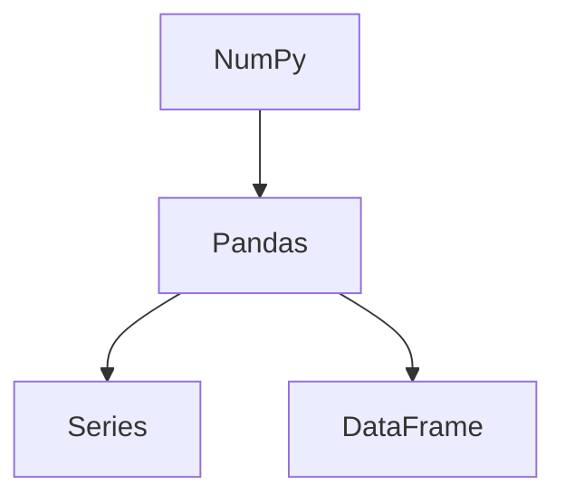

## 1. 背景介绍

在当今数据爆炸的时代，数据分析和机器学习已经成为了许多企业和组织的核心竞争力。而Python作为一种高效、易学易用的编程语言，已经成为了数据科学领域的重要工具之一。在Python中，Pandas是一个非常强大的数据处理和分析库，它可以帮助我们轻松地进行数据清洗、数据预处理、数据分析和数据可视化等工作。

本文将介绍如何使用Pandas进行数据预处理和分析，包括数据清洗、数据转换、数据聚合、数据可视化等方面的内容。我们将以一个实际的数据集为例，演示如何使用Pandas进行数据处理和分析，并给出详细的代码实例和解释说明。

## 2. 核心概念与联系

Pandas是一个基于NumPy的Python数据处理库，它提供了一种高效、灵活、易用的数据结构，可以帮助我们轻松地进行数据处理和分析。Pandas主要包括两种数据结构：Series和DataFrame。

- Series是一种类似于一维数组的对象，它可以存储任意类型的数据，并且可以通过索引进行访问和操作。
- DataFrame是一种类似于二维表格的对象，它可以存储多种类型的数据，并且可以进行行列索引、切片、过滤、聚合等操作。

Pandas的核心概念和联系如下图所示：



## 3. 核心算法原理具体操作步骤

### 3.1 数据清洗

数据清洗是数据分析的第一步，它主要包括以下几个方面的内容：

- 处理缺失值：使用fillna()函数或dropna()函数填充或删除缺失值。
- 处理重复值：使用duplicated()函数或drop_duplicates()函数查找和删除重复值。
- 处理异常值：使用describe()函数或boxplot()函数查找和处理异常值。

### 3.2 数据转换

数据转换是数据分析的第二步，它主要包括以下几个方面的内容：

- 数据类型转换：使用astype()函数将数据类型转换为指定类型。
- 数据合并：使用merge()函数或join()函数将多个数据集合并为一个数据集。
- 数据重塑：使用pivot()函数或melt()函数将数据从长格式转换为宽格式或从宽格式转换为长格式。

### 3.3 数据聚合

数据聚合是数据分析的第三步，它主要包括以下几个方面的内容：

- 分组聚合：使用groupby()函数将数据按照指定的列进行分组，并使用聚合函数进行聚合操作。
- 透视表聚合：使用pivot_table()函数将数据按照指定的行列进行分组，并使用聚合函数进行聚合操作。
- 滚动聚合：使用rolling()函数将数据按照指定的窗口大小进行滚动聚合操作。

### 3.4 数据可视化

数据可视化是数据分析的最后一步，它主要包括以下几个方面的内容：

- 折线图：使用plot()函数绘制折线图。
- 散点图：使用scatter()函数绘制散点图。
- 条形图：使用bar()函数绘制条形图。
- 直方图：使用hist()函数绘制直方图。
- 箱线图：使用boxplot()函数绘制箱线图。

## 4. 数学模型和公式详细讲解举例说明

在数据分析和机器学习中，常用的数学模型和公式包括线性回归、逻辑回归、决策树、随机森林、支持向量机等。这些模型和公式的详细讲解超出了本文的范围，读者可以参考相关的书籍和教程进行学习。

在本文中，我们将以一个实际的数据集为例，演示如何使用Pandas进行数据处理和分析，并给出详细的代码实例和解释说明。

## 5. 项目实践：代码实例和详细解释说明

### 5.1 数据集介绍

我们将使用一个名为"Titanic"的数据集进行演示，该数据集包含了1912年泰坦尼克号沉船事件中乘客的信息，包括姓名、性别、年龄、船票等级、船票价格、登船港口、是否生还等信息。该数据集可以从Kaggle网站上下载得到。

### 5.2 数据清洗

首先，我们需要对数据进行清洗，包括处理缺失值、处理重复值和处理异常值等。

#### 5.2.1 处理缺失值

我们可以使用fillna()函数或dropna()函数填充或删除缺失值。例如，我们可以使用fillna()函数将年龄列中的缺失值填充为该列的平均值：

```python
import pandas as pd

# 读取数据集
df = pd.read_csv("titanic.csv")

# 填充缺失值
df["Age"].fillna(df["Age"].mean(), inplace=True)
```

#### 5.2.2 处理重复值

我们可以使用duplicated()函数或drop_duplicates()函数查找和删除重复值。例如，我们可以使用drop_duplicates()函数删除重复的行：

```python
import pandas as pd

# 读取数据集
df = pd.read_csv("titanic.csv")

# 删除重复行
df.drop_duplicates(inplace=True)
```

#### 5.2.3 处理异常值

我们可以使用describe()函数或boxplot()函数查找和处理异常值。例如，我们可以使用boxplot()函数查找年龄列中的异常值：

```python
import pandas as pd
import matplotlib.pyplot as plt

# 读取数据集
df = pd.read_csv("titanic.csv")

# 绘制箱线图
df.boxplot(column="Age")

# 显示图形
plt.show()
```

### 5.3 数据转换

接下来，我们需要对数据进行转换，包括数据类型转换、数据合并和数据重塑等。

#### 5.3.1 数据类型转换

我们可以使用astype()函数将数据类型转换为指定类型。例如，我们可以使用astype()函数将年龄列的数据类型转换为整数类型：

```python
import pandas as pd

# 读取数据集
df = pd.read_csv("titanic.csv")

# 转换数据类型
df["Age"] = df["Age"].astype(int)
```

#### 5.3.2 数据合并

我们可以使用merge()函数或join()函数将多个数据集合并为一个数据集。例如，我们可以使用merge()函数将两个数据集按照指定的列进行合并：

```python
import pandas as pd

# 读取数据集
df1 = pd.read_csv("titanic.csv")
df2 = pd.read_csv("titanic2.csv")

# 合并数据集
df = pd.merge(df1, df2, on="PassengerId")
```

#### 5.3.3 数据重塑

我们可以使用pivot()函数或melt()函数将数据从长格式转换为宽格式或从宽格式转换为长格式。例如，我们可以使用pivot()函数将数据从长格式转换为宽格式：

```python
import pandas as pd

# 读取数据集
df = pd.read_csv("titanic.csv")

# 转换数据格式
df_pivot = df.pivot(index="PassengerId", columns="Survived", values="Name")
```

### 5.4 数据聚合

接下来，我们需要对数据进行聚合，包括分组聚合、透视表聚合和滚动聚合等。

#### 5.4.1 分组聚合

我们可以使用groupby()函数将数据按照指定的列进行分组，并使用聚合函数进行聚合操作。例如，我们可以使用groupby()函数按照性别列进行分组，并计算每个性别的平均年龄：

```python
import pandas as pd

# 读取数据集
df = pd.read_csv("titanic.csv")

# 分组聚合
df_group = df.groupby("Sex")["Age"].mean()
```

#### 5.4.2 透视表聚合

我们可以使用pivot_table()函数将数据按照指定的行列进行分组，并使用聚合函数进行聚合操作。例如，我们可以使用pivot_table()函数按照性别和船票等级进行分组，并计算每个分组的平均年龄：

```python
import pandas as pd

# 读取数据集
df = pd.read_csv("titanic.csv")

# 透视表聚合
df_pivot = df.pivot_table(index="Sex", columns="Pclass", values="Age", aggfunc="mean")
```

#### 5.4.3 滚动聚合

我们可以使用rolling()函数将数据按照指定的窗口大小进行滚动聚合操作。例如，我们可以使用rolling()函数计算每个乘客的船票价格的移动平均值：

```python
import pandas as pd

# 读取数据集
df = pd.read_csv("titanic.csv")

# 滚动聚合
df["RollingMean"] = df["Fare"].rolling(window=10).mean()
```

### 5.5 数据可视化

最后，我们需要对数据进行可视化，包括绘制折线图、散点图、条形图、直方图和箱线图等。

#### 5.5.1 折线图

我们可以使用plot()函数绘制折线图。例如，我们可以使用plot()函数绘制年龄列的折线图：

```python
import pandas as pd

# 读取数据集
df = pd.read_csv("titanic.csv")

# 绘制折线图
df["Age"].plot()

# 显示图形
plt.show()
```

#### 5.5.2 散点图

我们可以使用scatter()函数绘制散点图。例如，我们可以使用scatter()函数绘制年龄列和船票价格列的散点图：

```python
import pandas as pd

# 读取数据集
df = pd.read_csv("titanic.csv")

# 绘制散点图
df.plot.scatter(x="Age", y="Fare")

# 显示图形
plt.show()
```

#### 5.5.3 条形图

我们可以使用bar()函数绘制条形图。例如，我们可以使用bar()函数绘制性别列的条形图：

```python
import pandas as pd

# 读取数据集
df = pd.read_csv("titanic.csv")

# 绘制条形图
df["Sex"].value_counts().plot.bar()

# 显示图形
plt.show()
```

#### 5.5.4 直方图

我们可以使用hist()函数绘制直方图。例如，我们可以使用hist()函数绘制年龄列的直方图：

```python
import pandas as pd

# 读取数据集
df = pd.read_csv("titanic.csv")

# 绘制直方图
df["Age"].hist()

# 显示图形
plt.show()
```

#### 5.5.5 箱线图

我们可以使用boxplot()函数绘制箱线图。例如，我们可以使用boxplot()函数绘制年龄列的箱线图：

```python
import pandas as pd

# 读取数据集
df = pd.read_csv("titanic.csv")

# 绘制箱线图
df.boxplot(column="Age")

# 显示图形
plt.show()
```

## 6. 实际应用场景

Pandas可以应用于各种数据分析和机器学习的场景，例如：

- 金融领域：股票价格预测、风险评估、投资组合优化等。
- 医疗领域：疾病预测、药物研发、医疗资源分配等。
- 零售领域：销售预测、用户行为分析、市场营销等。
- 交通领域：交通流量预测、路况分析、公共交通优化等。

## 7. 工具和资源推荐

Pandas官方文档：https://pandas.pydata.org/docs/

Pandas中文文档：https://www.pypandas.cn/docs/

Pandas教程：https://www.runoob.com/pandas/pandas-tutorial.html

## 8. 总结：未来发展趋势与挑战

随着数据量的不断增加和数据分析技术的不断发展，Pandas作为一种高效、灵活、易用的数据处理和分析库，将会在数据科学领域发挥越来越重要的作用。未来，Pandas将面临更多的挑战和机遇，需要不断地进行优化和升级，以满足不断增长的数据分析需求。

## 9. 附录：常见问题与解答

Q：Pandas如何处理缺失值？

A：可以使用fillna()函数或dropna()函数填充或删除缺失值。

Q：Pandas如何处理重复值？

A：可以使用duplicated()函数或drop_duplicates()函数查找和删除重复值。

Q：Pandas如何进行数据聚合？

A：可以使用groupby()函数、pivot_table()函数或rolling()函数进行数据聚合。

Q：Pandas如何进行数据可视化？

A：可以使用plot()函数、scatter()函数、bar()函数、hist()函数或boxplot()函数进行数据可视化。