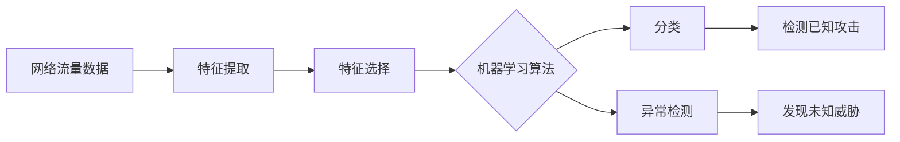

# Python机器学习实战：采用机器学习技术对网络流量进行分析

## 1. 背景介绍

在当今互联网时代,网络已经成为人们生活和工作中不可或缺的一部分。然而,随着网络技术的发展,网络安全问题也日益突出。黑客、病毒、恶意软件等各种网络攻击手段层出不穷,给个人、企业和政府机构带来了巨大的安全隐患和经济损失。

面对日益复杂的网络环境,传统的网络安全防御手段已经难以应对新的挑战。机器学习作为人工智能的重要分支,凭借其强大的数据处理和模式识别能力,为网络安全领域提供了新的解决方案。通过对海量网络流量数据进行分析和建模,机器学习算法可以自动识别异常流量、检测恶意行为,从而实现对网络攻击的实时预警和防御。

本文将以Python为工具,介绍如何利用机器学习技术对网络流量进行分析和异常检测。我们将从网络流量数据的采集和预处理开始,然后介绍几种常用的机器学习算法及其原理,并通过实际的代码示例演示如何使用Python实现这些算法。最后,我们将讨论机器学习在网络安全领域的应用前景和面临的挑战。

## 2. 核心概念与联系

在利用机器学习技术进行网络流量分析之前,我们需要了解一些核心概念:

### 2.1 网络流量

网络流量是指在计算机网络中传输的数据流。它包括了各种网络协议(如TCP/IP、HTTP、FTP等)的数据包。每个数据包都包含了源地址、目的地址、协议类型、端口号、数据内容等信息。网络流量数据是进行网络安全分析的重要数据源。

### 2.2 机器学习

机器学习是人工智能的一个分支,它通过算法来学习数据中的模式和规律,从而对新的未知数据进行预测和决策。常见的机器学习任务包括分类、回归、聚类、异常检测等。在网络安全领域,机器学习主要用于对网络流量进行分类(正常/恶意)和异常检测。

### 2.3 特征工程  

特征工程是将原始数据转换为机器学习算法可以理解的特征表示的过程。对于网络流量数据,我们需要从原始的数据包中提取出有意义的特征(如包长度、时间间隔、协议类型等),并将其转换为数值型向量,以便机器学习算法进行处理。

### 2.4 分类算法

分类是机器学习中的一类监督学习任务,其目标是根据已标记的训练数据构建一个分类器,将输入数据划分到预先定义的类别中。常见的分类算法包括决策树、朴素贝叶斯、支持向量机、神经网络等。在网络流量分析中,分类算法可用于区分正常流量和恶意流量。

### 2.5 异常检测

异常检测是找出数据集中与大多数数据有显著差异的少数数据点(异常点)的过程。与分类不同,异常检测是一类无监督学习任务,我们无需预先知道异常的类别。常见的异常检测算法包括统计方法、基于距离的方法、基于密度的方法等。在网络安全中,异常检测可用于识别未知的攻击和威胁。

下图展示了网络流量分析与机器学习的关系:

## 3. 核心算法原理与具体操作步骤

接下来,我们将详细介绍几种常用的机器学习算法在网络流量分析中的应用,包括决策树、朴素贝叶斯和单类SVM。

### 3.1 决策树

决策树是一种树形结构的分类器,其中每个内部节点表示一个属性测试,每个分支代表一个测试输出,每个叶节点存储一个类别。决策树算法通过递归地选择最佳属性来拆分数据,直到所有样本属于同一类别或满足其他停止条件。

构建决策树分类器的具体步骤如下:

1. 准备训练数据集,其中每个样本由特征向量和对应的类别标签组成。
2. 选择最佳属性作为树的根节点,使用某种度量标准(如信息增益、基尼指数)来评估每个属性的分类能力。 
3. 根据选定的属性对数据集进行拆分,生成子节点。
4. 对每个子节点递归地应用步骤2-3,直到满足停止条件(如所有样本属于同一类别,或达到最大深度)。
5. 在叶节点处存储类别标签。

使用决策树进行分类时,我们从根节点开始,根据样本的特征值进行逐级判断,直到达到叶节点并输出对应的类别。

### 3.2 朴素贝叶斯

朴素贝叶斯是一种基于贝叶斯定理和属性独立性假设的概率分类器。它假设样本的每个属性在给定类别的条件下是相互独立的。尽管这种假设在现实中往往不成立,但朴素贝叶斯仍然在许多领域取得了不错的效果。

朴素贝叶斯分类器的训练过程如下:

1. 准备训练数据集,其中每个样本由特征向量和对应的类别标签组成。
2. 估计每个类别的先验概率P(C),即每个类别在训练集中出现的频率。
3. 对于每个属性A,估计其在每个类别C下的条件概率P(A|C)。对于离散属性,可以直接统计频率;对于连续属性,通常假设其服从某种概率分布(如高斯分布)并估计分布参数。
4. 对于给定的测试样本x,根据贝叶斯定理计算其属于每个类别的后验概率:
$P(C|x) = \frac{P(x|C)P(C)}{P(x)} \propto P(x|C)P(C)$
其中,$P(x|C) = \prod_{i=1}^{d} P(x_i|C)$,d为属性数量。
5. 选择后验概率最大的类别作为测试样本的预测类别。

### 3.3 单类SVM

支持向量机(SVM)是一种经典的二分类算法,其目标是在特征空间中找到一个最大间隔超平面,将两个类别的样本分开。单类SVM是SVM的一个变体,用于异常检测任务。它试图找到一个超球面,将大部分正常样本包含在内,而异常样本在超球面之外。

单类SVM的训练过程如下:

1. 准备训练数据集,其中大部分样本为正常样本,少量样本为异常样本(或不提供异常样本)。
2. 选择合适的核函数(如线性核、高斯核)和惩罚参数C,构建SVM优化问题:
$$
\min_{\mathbf{w},\xi,\rho} \frac{1}{2} \|\mathbf{w}\|^2 + \frac{1}{\nu n} \sum_{i=1}^{n} \xi_i - \rho
$$
$$
\text{s.t.} \quad \mathbf{w}^T \phi(\mathbf{x}_i) \geq \rho - \xi_i, \quad \xi_i \geq 0, \quad i=1,\ldots,n
$$
其中,$\mathbf{w}$和$\rho$为超球面的参数,$\xi_i$为松弛变量,$\phi(\cdot)$为映射函数,$\nu \in (0,1]$控制异常样本的比例。
3. 求解上述优化问题,得到决策函数:
$$
f(\mathbf{x}) = \text{sgn}(\mathbf{w}^T \phi(\mathbf{x}) - \rho)
$$
4. 对于测试样本$\mathbf{x}$,若$f(\mathbf{x})=1$则预测为正常,否则预测为异常。

## 4. 数学模型和公式详细讲解举例说明

在上一节中,我们介绍了几种常用的机器学习算法及其原理。这里,我们将重点讨论朴素贝叶斯算法的数学模型,并给出一个具体的例子。

### 4.1 朴素贝叶斯的数学模型

朴素贝叶斯分类器基于贝叶斯定理和属性独立性假设。对于给定的测试样本$\mathbf{x} = (x_1, \ldots, x_d)$,其属于类别$C_k$的后验概率为:

$$
P(C_k|\mathbf{x}) = \frac{P(\mathbf{x}|C_k)P(C_k)}{P(\mathbf{x})}
$$

根据属性独立性假设,我们有:

$$
P(\mathbf{x}|C_k) = \prod_{i=1}^{d} P(x_i|C_k)
$$

因此,后验概率可以写为:

$$
P(C_k|\mathbf{x}) = \frac{P(C_k) \prod_{i=1}^{d} P(x_i|C_k)}{\sum_{j=1}^{K} P(C_j) \prod_{i=1}^{d} P(x_i|C_j)}
$$

其中,$K$为类别数量。在实际应用中,我们通常忽略分母项,因为它对所有类别都是相同的。因此,朴素贝叶斯分类器的决策规则可以表示为:

$$
\hat{y} = \arg\max_{k} P(C_k) \prod_{i=1}^{d} P(x_i|C_k)
$$

### 4.2 举例说明

假设我们要根据网络流量的特征来判断其是否为恶意流量。我们有以下训练数据:

| 包长度 | 持续时间 | 目的端口 | 类别 |
|-------|----------|----------|------|
| 短    | 短       | 80        | 正常 |
| 短    | 长       | 80        | 恶意 |
| 长    | 短       | 8080      | 恶意 |
| 长    | 长       | 80        | 恶意 |
| 短    | 短       | 8080      | 正常 |

我们要预测一个新的网络流量样本(短,长,8080)的类别。

首先,我们估计每个类别的先验概率:
$$
P(正常) = \frac{2}{5}, \quad P(恶意) = \frac{3}{5}
$$

然后,我们估计每个属性在每个类别下的条件概率:
$$
P(短|正常) = 1, \quad P(长|正常) = 0 \\
P(短|恶意) = \frac{1}{3}, \quad P(长|恶意) = \frac{2}{3} \\
P(短|正常) = \frac{1}{2}, \quad P(长|正常) = \frac{1}{2} \\
P(短|恶意) = \frac{1}{3}, \quad P(长|恶意) = \frac{2}{3} \\
P(80|正常) = \frac{1}{2}, \quad P(8080|正常) = \frac{1}{2} \\
P(80|恶意) = \frac{2}{3}, \quad P(8080|恶意) = \frac{1}{3}
$$

对于测试样本(短,长,8080),我们计算其属于每个类别的后验概率:
$$
P(正常|短,长,8080) \propto P(正常) \cdot P(短|正常) \cdot P(长|正常) \cdot P(8080|正常) = \frac{2}{5} \cdot 1 \cdot 0 \cdot \frac{1}{2} = 0 \\
P(恶意|短,长,8080) \propto P(恶意) \cdot P(短|恶意) \cdot P(长|恶意) \cdot P(8080|恶意) = \frac{3}{5} \cdot \frac{1}{3} \cdot \frac{2}{3} \cdot \frac{1}{3} = \frac{2}{135}
$$

因此,我们预测该网络流量样本为恶意。

## 5. 项目实践：代码实例和详细解释说明

下面,我们将使用Python实现一个基于决策树的网络流量分类器。我们将使用KDD Cup 99数据集,该数据集包含了大量正常和恶意的网络连接记录。每个记录由41个特征组成,如持续时间、协议类型、服务类型等。

### 5.1 数据预