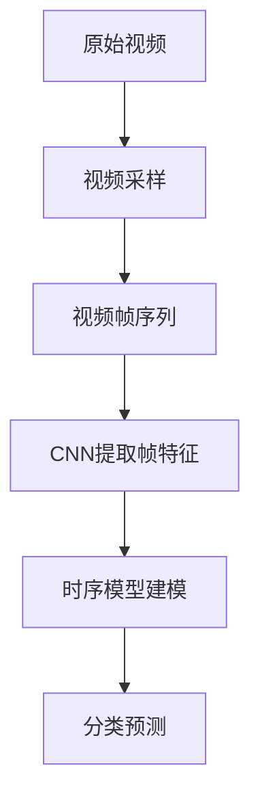
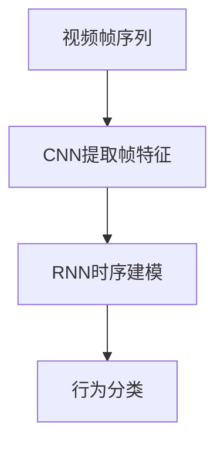
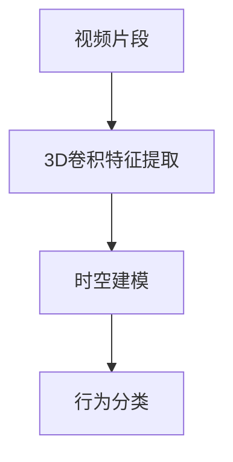
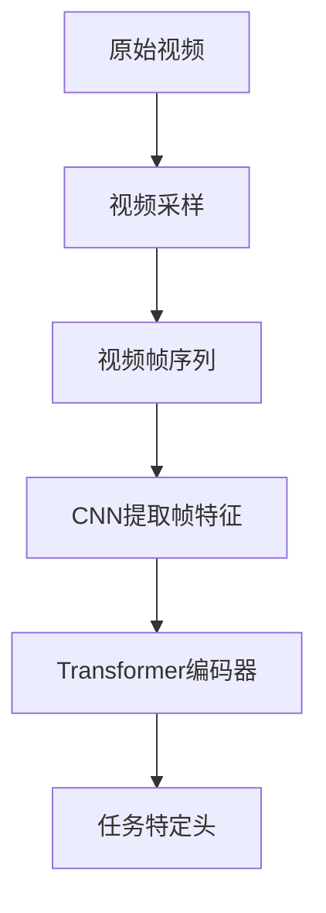

# Python深度学习实践：基于深度学习的视频理解方法

## 1.背景介绍

视频理解是计算机视觉和人工智能领域的一个重要研究方向。随着视频数据的快速增长,对视频内容进行自动理解和分析的需求也越来越迫切。视频理解技术可以广泛应用于视频监控、人机交互、内容审核、自动驾驶等诸多领域。

传统的视频理解方法主要基于手工设计的特征提取和分类器,但这种方法往往缺乏足够的泛化能力,难以适应复杂的视频场景。近年来,深度学习技术在计算机视觉领域取得了巨大成功,也为视频理解任务带来了新的契机。

## 2.核心概念与联系

### 2.1 视频理解任务

视频理解是一个广义的概念,包括以下几个主要任务:

- **视频分类(Video Classification)**: 将整个视频片段归类到预定义的类别中,如运动类型识别、场景分类等。
- **视频目标检测(Video Object Detection)**: 在视频帧中定位并识别出目标物体的类别和位置。
- **视频实例分割(Video Instance Segmentation)**: 在视频帧中对目标实例进行像素级别的分割。
- **行为识别(Action Recognition)**: 识别视频中发生的动作行为,如打球、跳舞等。
- **视频描述(Video Captioning)**: 自动生成描述视频内容的自然语言文本。

### 2.2 深度学习在视频理解中的作用

深度学习模型具有自动学习视觉特征的能力,可以从大量视频数据中提取出高层次的语义信息,从而更好地理解视频内容。常用的深度学习模型包括:

- **卷积神经网络(CNN)**: 擅长从图像或视频帧中提取出空间特征。
- **递归神经网络(RNN)**: 能够有效捕捉序列数据(如视频帧序列)中的时间依赖关系。
- **注意力机制(Attention Mechanism)**: 通过分配不同的注意力权重,使模型能够专注于视频中的关键部分。
- **生成对抗网络(GAN)**: 可用于视频数据增强、视频超分辨率重建等任务。

深度学习模型通常需要大量的标注数据进行训练,因此视频数据集的构建也是一个重要的工作。

## 3.核心算法原理具体操作步骤

### 3.1 基于CNN的视频分类

视频分类任务的目标是将整个视频片段归类到预定义的类别中。基于CNN的视频分类算法通常包括以下步骤:

1. **视频采样**: 从原始视频中采样出固定间隔的帧,构成视频帧序列。
2. **视频帧特征提取**: 使用预训练的CNN模型(如VGGNet、ResNet等)提取每一帧的特征向量。
3. **时间建模**: 将视频帧特征序列输入到时序模型(如RNN、Transformer等)中,捕捉时间上的依赖关系。
4. **分类预测**: 在时序模型的输出上添加全连接层,对视频进行分类预测。

该算法的关键是如何有效地融合空间特征和时间特征。一些经典方法包括Two-Stream网络、C3D网络和I3D网络等。



### 3.2 基于RNN的行为识别

行为识别任务旨在识别视频中发生的动作行为。基于RNN的行为识别算法步骤如下:

1. **视频帧特征提取**: 使用CNN模型提取每一帧的特征向量。
2. **特征序列输入**: 将视频帧特征序列作为RNN(如LSTM或GRU)的输入。
3. **时序建模**: RNN捕捉特征序列中的时间依赖关系。
4. **行为分类**: 在RNN的输出上添加全连接层,对视频中的行为进行分类。

该算法的优点是能够直接对视频序列进行建模,缺点是对长期依赖的建模能力有限。一些改进方法包括使用注意力机制、层次RNN等。



### 3.3 基于3D卷积的行为识别

3D卷积神经网络(3D CNN)能够同时对视频的空间和时间信息进行建模,是行为识别任务中一种流行的方法。算法步骤如下:

1. **视频片段输入**: 将一段连续视频帧作为3D CNN的输入。
2. **3D卷积特征提取**: 使用3D卷积核对输入视频片段进行特征提取,捕捉空间和时间上的模式。
3. **时空建模**: 通过多层3D卷积和池化操作,逐步提取高层次的时空特征。
4. **行为分类**: 在3D CNN的输出上添加全连接层,对视频中的行为进行分类。

相比2D CNN,3D CNN能够更好地利用视频的时间信息,但计算量也更大。一些经典的3D CNN模型包括C3D、I3D、SlowFast网络等。



### 3.4 基于Transformer的视频理解

Transformer是一种全新的序列建模架构,最初被应用于自然语言处理任务。近年来,Transformer也被成功引入到视频理解任务中。算法步骤如下:

1. **视频采样**: 从原始视频中采样出固定间隔的帧,构成视频帧序列。
2. **视频帧特征提取**: 使用CNN模型提取每一帧的特征向量。
3. **Transformer编码器**: 将视频帧特征序列输入到Transformer编码器中,捕捉长程依赖关系。
4. **任务特定头(Head)**: 在Transformer编码器的输出上添加任务特定的头(如分类头、检测头等),完成相应的视频理解任务。

Transformer能够有效地对长期依赖关系进行建模,并通过自注意力机制聚焦于视频中的关键部分。一些代表性工作包括ViT、VideoBERT、VideoTransformer等。



## 4.数学模型和公式详细讲解举例说明

### 4.1 卷积神经网络

卷积神经网络(CNN)是深度学习中最常用的一种网络结构,它通过卷积操作和池化操作来提取图像或视频帧的特征。

卷积操作可以用下式表示:

$$
y_{ij} = \sum_{m}\sum_{n}x_{m,n}w_{ij,m,n} + b_{ij}
$$

其中$x$是输入特征图,$w$是卷积核权重,$b$是偏置项,$y$是输出特征图。卷积操作能够有效地提取输入数据的局部模式。

池化操作则用于下采样特征图,减小数据量并增强特征的鲁棒性。最大池化和平均池化是两种常用的池化方式。

CNN通过堆叠多层卷积层、池化层和全连接层,能够逐步提取出高层次的语义特征,适用于图像分类、目标检测等计算机视觉任务。

### 4.2 递归神经网络

递归神经网络(RNN)是一种处理序列数据的深度学习模型,常用于自然语言处理和时间序列数据建模。RNN的核心思想是将当前时刻的隐藏状态与前一时刻的隐藏状态相关联,从而捕捉序列数据中的时间依赖关系。

RNN的计算过程可以用下式表示:

$$
h_t = f_W(x_t, h_{t-1})
$$

其中$x_t$是当前时刻的输入,$h_t$是当前时刻的隐藏状态,$h_{t-1}$是前一时刻的隐藏状态,$f_W$是由网络参数$W$决定的非线性函数。

传统的RNN存在梯度消失或爆炸的问题,难以捕捉长期依赖关系。长短期记忆网络(LSTM)和门控循环单元(GRU)是两种改进的RNN变体,通过引入门控机制来解决这一问题。

RNN和其变体广泛应用于视频理解任务中,如行为识别、视频描述等,用于对视频帧序列进行时间建模。

### 4.3 注意力机制

注意力机制(Attention Mechanism)是深度学习中一种重要的技术,它允许模型动态地分配不同的注意力权重,聚焦于输入数据的关键部分。

注意力机制的计算过程可以概括为以下三个步骤:

1. **获取查询(Query)向量和键(Key)向量集合**:
   查询向量$q$表示当前需要关注的部分,键向量集合$K=\{k_1, k_2, \dots, k_n\}$表示输入数据的不同部分。

2. **计算注意力分数**:
   通过查询向量和键向量之间的相似性(如点积)计算注意力分数$e_i = \text{score}(q, k_i)$。

3. **计算加权和作为注意力输出**:
   将注意力分数通过softmax函数归一化,得到注意力权重$\alpha_i = \text{softmax}(e_i)$,最终的注意力输出为$\text{attn}(q, K, V) = \sum_{i=1}^{n}\alpha_iv_i$,其中$V=\{v_1, v_2, \dots, v_n\}$是值向量集合。

注意力机制能够自适应地聚焦于输入数据的关键部分,在视频理解任务中常被用于增强模型对视频中关键帧或目标物体的关注度。

### 4.4 Transformer

Transformer是一种全新的序列建模架构,它完全基于注意力机制,不需要像RNN那样的递归操作。Transformer的核心组件是多头自注意力(Multi-Head Attention)和前馈网络(Feed-Forward Network)。

多头自注意力的计算过程如下:

1. 将输入$X$线性映射到查询$Q$、键$K$和值$V$:
   $$Q=XW^Q,\ K=XW^K,\ V=XW^V$$

2. 计算注意力权重:
   $$\text{Attention}(Q, K, V) = \text{softmax}(\frac{QK^T}{\sqrt{d_k}})V$$

3. 多头注意力通过并行计算$h$个注意力头,然后将它们的输出拼接:
   $$\text{MultiHead}(Q, K, V) = \text{Concat}(\text{head}_1, \dots, \text{head}_h)W^O$$

Transformer架构通过层叠多个编码器或解码器层,能够有效地捕捉长程依赖关系,在视频理解任务中表现出色。

## 5.项目实践:代码实例和详细解释说明

在这一部分,我们将通过一个基于PyTorch的视频分类项目实践,来进一步加深对深度学习在视频理解中应用的理解。

### 5.1 数据准备

我们将使用UCF101数据集进行实验,该数据集包含了101种人类行为类别,每个类别有多个视频样本。我们需要先对数据集进行预处理,包括:

1. 从视频中采样固定间隔的帧
2. 对视频帧进行预处理(如裁剪、归一化等)
3. 构建数据加载器

```python
import torch
from torchvision.io import read_video
from torch.utils.data import Dataset, DataLoader

class UCF101Dataset(Dataset):
    def __init__(self, video_paths, transform=None):
        self.video_paths = video_paths
        self.transform = transform

    def __len__(self):
        return len(self.video_paths)

    def __getitem__(self, idx):
        video_path = self.video_paths[idx]
        video, _, _ = read_video(video_path)  # (T, H, W, C)
        video = video.permute(0, 3, 1, 2)  # (T, C, H, W)

        if self.transform:
            video = self.transform(video)

        return video

# 创建数据集和数据