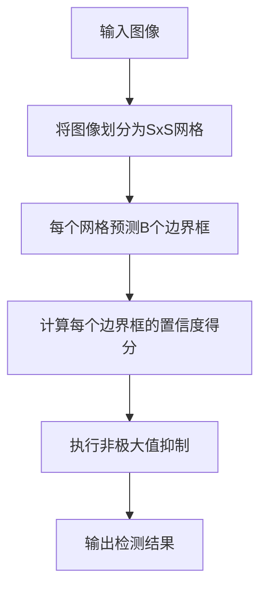

# Python深度学习实践：手把手教你利用YOLO进行对象检测

## 1.背景介绍

在当今的计算机视觉领域,对象检测是一项极具挑战的任务。它旨在从图像或视频中定位并识别出感兴趣的对象。对象检测技术在诸多领域有着广泛的应用,例如安防监控、自动驾驶、机器人视觉等。随着深度学习技术的不断发展,基于卷积神经网络(CNN)的目标检测算法取得了长足的进步,其中YOLO(You Only Look Once)就是一种先进的实时对象检测系统。

### 1.1 对象检测的挑战

对象检测任务面临诸多挑战:

- **尺度变化** 同一物体在不同图像中的大小可能差异巨大
- **遮挡** 部分物体被其他物体遮挡
- **视角变化** 相机视角的变化导致物体的形状发生变形
- **光照变化** 光照条件的变化会影响物体的外观
- **背景杂乱** 复杂的背景会干扰物体的检测

### 1.2 传统方法的局限性

早期的对象检测算法主要基于手工设计的特征和滑动窗口机制。这些传统方法存在一些明显的局限性:

- 特征表达能力有限,难以很好地描述复杂的视觉模式
- 计算效率低下,需要密集地扫描图像的所有区域
- 遇到尺度、形变、光照等变化时,性能会显著下降

### 1.3 基于深度学习的对象检测

近年来,基于深度学习的对象检测算法取得了突破性的进展,主要有以下两种范式:

1. **基于Region Proposal的两阶段方法**
   - 算法流程:先生成候选区域,再对每个区域进行物体分类和边界框回归
   - 代表算法:R-CNN、Fast R-CNN、Faster R-CNN等

2. **基于密集采样的一阶段方法** 
   - 算法流程:直接对密集的先验边界框进行物体分类和边界框回归
   - 代表算法:YOLO、SSD等

相比两阶段方法,一阶段方法检测速度更快,因此更适合实时应用场景。本文将重点介绍YOLO这一经典的一阶段实时对象检测算法。

## 2.核心概念与联系

### 2.1 YOLO算法概述

YOLO(You Only Look Once)是由Joseph Redmon等人于2016年提出的一种实时对象检测系统。它的核心思想是将输入图像划分为S×S个网格,每个网格预测B个边界框以及相应的置信度得分。置信度得分包括两部分:

1. 边界框内包含对象的置信度得分
2. 每个边界框对于特定类别的条件置信度得分

该算法将对象检测任务转化为一个回归问题,通过端到端的训练,直接从图像像素数据预测对象的边界框和类别。与基于Region Proposal的两阶段方法相比,YOLO的优势在于极高的检测速度,能够实现实时的对象检测。

### 2.2 YOLO算法流程

YOLO算法的工作流程如下所示:

1. 将输入图像划分为S×S个网格
2. 对于每个网格,预测B个边界框及其置信度得分
3. 计算每个边界框的置信度得分
4. 执行非极大值抑制(NMS)去除重复检测框
5. 输出最终的检测结果

### 2.3 边界框预测

YOLO算法中,每个网格需要预测B个边界框,每个边界框由以下5个值表示:

- $b_x, b_y$: 边界框中心相对于当前网格的偏移量
- $b_w, b_h$: 边界框的宽度和高度
- $c$: 边界框包含对象的置信度得分

对于每个边界框,还需要预测C个条件置信度得分,表示该边界框内容属于特定类别的概率。因此,每个网格需要预测的输出向量维度为$B \times (5 + C)$。

### 2.4 置信度计算

每个边界框的置信度得分由两部分组成:

1. 包含对象的置信度得分(Objectness Score): $Pr(Object) \times IOU_{pred}^{truth}$
2. 条件置信度得分(Class Confidence Score): $Pr(Class_i|Object) \times Pr(Object) \times IOU_{pred}^{truth}$

其中,$Pr(Object)$表示边界框内包含对象的概率,$IOU_{pred}^{truth}$表示预测边界框与真实边界框的交并比,用于衡量预测的准确性。

在训练过程中,YOLO通过优化二值交叉熵损失函数,同时学习预测包含对象的置信度得分和条件置信度得分。

### 2.5 非极大值抑制

由于每个网格都会预测多个边界框,因此可能会出现多个边界框检测到同一个对象的情况。为了解决这个问题,YOLO采用非极大值抑制(NMS)算法去除重复的检测框。

NMS算法的基本思路是:

1. 根据置信度得分对所有预测框进行排序
2. 从置信度最高的预测框开始,移除与之重叠程度较高的其他预测框
3. 重复上述过程,直到所有重叠的预测框都被移除

通过NMS,可以保留置信度最高且相互不重叠的一组预测框,从而获得最终的检测结果。

## 3.核心算法原理具体操作步骤 

YOLO算法的核心原理可以概括为以下几个关键步骤:

### 3.1 网格划分与边界框预测

1. 将输入图像划分为S×S个网格
2. 对于每个网格,预测B个边界框
3. 每个边界框由5个值表示:$(b_x, b_y, b_w, b_h, c)$
   - $(b_x, b_y)$: 边界框中心相对于当前网格的偏移量
   - $(b_w, b_h)$: 边界框的宽度和高度
   - $c$: 边界框包含对象的置信度得分
4. 同时,对于每个边界框,还需要预测C个条件置信度得分,表示该边界框内容属于特定类别的概率

### 3.2 置信度计算

1. 计算每个边界框的包含对象的置信度得分:
   $$Pr(Object) \times IOU_{pred}^{truth}$$
   其中,$Pr(Object)$表示边界框内包含对象的概率,$IOU_{pred}^{truth}$表示预测边界框与真实边界框的交并比。

2. 计算每个边界框的条件置信度得分:
   $$Pr(Class_i|Object) \times Pr(Object) \times IOU_{pred}^{truth}$$
   表示该边界框内容属于第i个类别的概率。

### 3.3 损失函数优化

在训练过程中,YOLO通过优化如下多任务损失函数,同时学习预测包含对象的置信度得分和条件置信度得分:

$$
\begin{aligned}
\lambda_{\text{coord}}\sum_{i=0}^{S^2}\sum_{j=0}^B\mathbb{1}_{\text{obj}}^{\text{ij}}\left[(x_i-\hat{x}_i)^2+(y_i-\hat{y}_i)^2\right] \\
+\lambda_{\text{coord}}\sum_{i=0}^{S^2}\sum_{j=0}^B\mathbb{1}_{\text{obj}}^{\text{ij}}\left[(\sqrt{w_i}-\sqrt{\hat{w}_i})^2+(\sqrt{h_i}-\sqrt{\hat{h}_i})^2\right] \\
+\sum_{i=0}^{S^2}\sum_{j=0}^B\mathbb{1}_{\text{obj}}^{\text{ij}}(C_i-\hat{C}_i)^2 \\
+\lambda_{\text{noobj}}\sum_{i=0}^{S^2}\sum_{j=0}^B\mathbb{1}_{\text{noobj}}^{\text{ij}}(C_i-\hat{C}_i)^2 \\
-\sum_{i=0}^{S^2}\mathbb{1}_{\text{obj}}^{\text{i}}\sum_{c\in\text{classes}}(p_i(c)\log(\hat{p}_i(c))+(1-p_i(c))\log(1-\hat{p}_i(c)))
\end{aligned}
$$

其中:

- 前两项是边界框坐标的均方误差损失
- 第三项是包含对象的置信度得分的均方误差损失
- 第四项是不包含对象的置信度得分的均方误差损失,用于增强背景区域的预测
- 最后一项是多类别预测的交叉熵损失

通过优化该损失函数,YOLO可以同时学习预测准确的边界框坐标、包含对象的置信度得分和条件置信度得分。

### 3.4 非极大值抑制

1. 根据置信度得分对所有预测框进行排序
2. 从置信度最高的预测框开始,移除与之重叠程度较高的其他预测框
   - 计算当前预测框与其他预测框的交并比(IOU)
   - 移除IOU超过阈值的预测框
3. 重复上述过程,直到所有重叠的预测框都被移除
4. 保留置信度最高且相互不重叠的一组预测框作为最终的检测结果

通过NMS,YOLO可以有效地去除重复的检测框,提高检测的准确性。

## 4.数学模型和公式详细讲解举例说明

### 4.1 边界框编码

在YOLO算法中,每个网格需要预测B个边界框,每个边界框由5个值表示:

$$
(b_x, b_y, b_w, b_h, c)
$$

其中:

- $b_x, b_y$: 边界框中心相对于当前网格的偏移量,取值范围为[0, 1]
- $b_w, b_h$: 边界框的宽度和高度,相对于整个图像的宽高进行了归一化,取值范围为[0, 1]
- $c$: 边界框包含对象的置信度得分,取值范围为[0, 1]

例如,如果一个网格的左上角坐标为(0.2, 0.3),右下角坐标为(0.6, 0.7),并且预测出一个边界框的中心坐标为(0.4, 0.5),宽度为0.3,高度为0.2,那么该边界框的编码为:

$$
\begin{aligned}
b_x &= 0.4 - 0.2 = 0.2 \\
b_y &= 0.5 - 0.3 = 0.2 \\
b_w &= 0.3 \\
b_h &= 0.2 \\
c &= 0.8 \text{ (假设置信度得分为0.8)}
\end{aligned}
$$

通过这种编码方式,YOLO可以直接从网络的输出预测边界框的位置、大小和置信度得分。

### 4.2 置信度计算

YOLO算法中,每个边界框的置信度得分由两部分组成:

1. 包含对象的置信度得分(Objectness Score): $Pr(Object) \times IOU_{pred}^{truth}$
2. 条件置信度得分(Class Confidence Score): $Pr(Class_i|Object) \times Pr(Object) \times IOU_{pred}^{truth}$

#### 4.2.1 包含对象的置信度得分

包含对象的置信度得分表示边界框内包含对象的概率,由两部分相乘得到:

- $Pr(Object)$: 表示边界框内包含对象的概率,由网络直接预测
- $IOU_{pred}^{truth}$: 表示预测边界框与真实边界框的交并比,用于衡量预测的准确性

例如,假设网络预测出一个边界框的$Pr(Object) = 0.8$,并且该边界框与真实边界框的IOU为0.7,那么该边界框的包含对象的置信度得分为:

$$
Pr(Object) \times IOU_{pred}^{truth} = 0.8 \times 0.7 = 0.56
$$

#### 4.2.2 条件置信度得分

条件置信度得分表示该边界框内容属于特定类别的概率,由三部分相乘得到:

- $Pr(Class_i|Object)$: 表示边界框内容属于第i个类别的概率,由网络直接预测