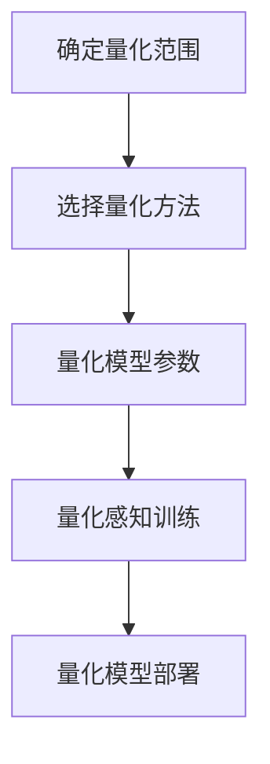
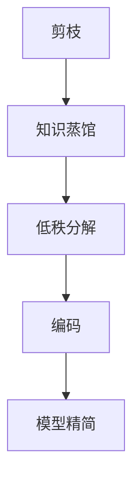

# Python深度学习实践：神经网络的量化和压缩

## 1.背景介绍

随着深度学习模型在各种领域的广泛应用,模型的大小和计算复杂度也在不断增加。然而,在诸如移动设备、物联网和边缘计算等资源受限环境中部署这些大型模型仍然是一个巨大挑战。因此,神经网络的量化和压缩技术应运而生,旨在减小模型的尺寸和计算开销,同时保持模型的精度和性能。

## 2.核心概念与联系

### 2.1 神经网络量化

神经网络量化是一种将浮点数模型参数转换为较低比特宽度的定点数表示的技术。通常情况下,深度学习模型使用32位或16位浮点数来表示权重和激活值,但这种表示方式需要大量的存储空间和计算资源。量化可以将这些参数转换为8位或更低比特宽度的整数表示,从而显著减小模型的尺寸和计算开销。

### 2.2 神经网络压缩

神经网络压缩是一种通过移除冗余参数或结构来减小模型尺寸的技术。常见的压缩方法包括剪枝(Pruning)、知识蒸馏(Knowledge Distillation)、低秩分解(Low-Rank Decomposition)等。这些技术可以有效地减小模型的参数数量,同时保持模型的性能。

### 2.3 量化和压缩的关系

量化和压缩是两种相辅相成的技术,它们可以组合使用以进一步减小模型的尺寸和计算开销。通常情况下,首先对模型进行压缩,然后再进行量化,以获得最佳的压缩效果和精度。

## 3.核心算法原理具体操作步骤

### 3.1 神经网络量化算法

神经网络量化的核心算法包括以下几个步骤:

1. **确定量化范围**: 确定模型权重和激活值的数值范围,以便在量化过程中不会发生过多的精度损失。

2. **选择量化方法**: 常见的量化方法包括线性量化、对数量化和基于训练的量化等。

3. **量化模型参数**: 根据选择的量化方法,将模型权重和激活值转换为定点数表示。

4. **量化感知训练**: 对量化后的模型进行微调,以提高量化模型的精度。

5. **量化模型部署**: 将量化后的模型部署到目标硬件平台上,利用硬件加速器(如GPU或TPU)进行高效计算。



### 3.2 神经网络压缩算法

神经网络压缩的核心算法包括以下几个步骤:

1. **剪枝(Pruning)**: 通过移除模型中的冗余权重或神经元来减小模型的参数数量。

2. **知识蒸馆(Knowledge Distillation)**: 利用一个大型教师模型来指导一个小型学生模型的训练,使学生模型可以学习到教师模型的知识。

3. **低秩分解(Low-Rank Decomposition)**: 将模型权重矩阵分解为两个或多个低秩矩阵的乘积,从而减小参数数量。

4. **编码(Encoding)**: 使用特殊的编码方式来表示模型参数,例如哈夫曼编码或矢量量化等。

5. **模型精简(Model Slimming)**: 通过识别和移除模型中的冗余层或通道来减小模型的计算开销。



## 4.数学模型和公式详细讲解举例说明

### 4.1 线性量化

线性量化是最简单的量化方法之一,它将浮点数值线性映射到定点数表示。具体来说,给定一个浮点数值 $x$,我们希望将其量化为 $k$ 比特的定点数表示 $\hat{x}$。我们首先确定量化范围 $[x_{\min}, x_{\max}]$,然后将浮点数值线性映射到该范围内的整数值:

$$\hat{x} = \mathrm{round}\left(\frac{x - x_{\min}}{x_{\max} - x_{\min}} \times (2^k - 1)\right)$$

其中 $\mathrm{round}(\cdot)$ 表示四舍五入操作。反量化公式如下:

$$x \approx \hat{x} \times \frac{x_{\max} - x_{\min}}{2^k - 1} + x_{\min}$$

线性量化的优点是简单高效,但它可能会引入较大的量化误差,尤其是在量化范围较大时。

### 4.2 对数量化

对数量化是一种更加精细的量化方法,它可以更好地处理具有大动态范围的数值。对数量化的基本思想是将浮点数值首先映射到对数域,然后对对数值进行线性量化,最后反映射回原始域。

具体来说,给定一个浮点数值 $x$,我们首先计算其对数值 $\log_2(|x|)$,然后对该对数值进行线性量化:

$$\hat{l} = \mathrm{round}\left(\frac{\log_2(|x|) - l_{\min}}{l_{\max} - l_{\min}} \times (2^k - 1)\right)$$

其中 $l_{\min}$ 和 $l_{\max}$ 分别表示对数值的最小值和最大值。反量化公式如下:

$$\hat{x} = \mathrm{sign}(x) \times 2^{\hat{l} \times \frac{l_{\max} - l_{\min}}{2^k - 1} + l_{\min}}$$

对数量化可以更好地处理大范围的数值,但它也引入了额外的计算开销。

### 4.3 基于训练的量化

基于训练的量化是一种更加先进的量化方法,它通过在训练过程中引入量化感知损失函数,使模型可以直接学习到量化表示。这种方法可以在保持模型精度的同时实现更高的压缩率。

具体来说,我们定义一个量化函数 $Q(x, \alpha, \beta)$,它将浮点数值 $x$ 量化为定点数表示,其中 $\alpha$ 和 $\beta$ 分别表示量化的比例因子和偏移量。在训练过程中,我们不仅需要优化模型参数,还需要同时优化量化参数 $\alpha$ 和 $\beta$,以最小化量化损失:

$$\mathcal{L}_{\mathrm{quant}} = \mathbb{E}_{x \sim \mathcal{D}}\left[\|Q(x, \alpha, \beta) - x\|_2^2\right]$$

其中 $\mathcal{D}$ 表示训练数据的分布。通过这种方式,模型可以直接学习到最优的量化表示,从而在保持精度的同时实现更高的压缩率。

## 5.项目实践：代码实例和详细解释说明

在本节中,我们将提供一个基于PyTorch的代码示例,演示如何对预训练的ResNet-18模型进行量化和压缩。

### 5.1 导入必要的库

```python
import torch
import torch.nn as nn
import torchvision.models as models
from torch.quantization import get_static_quant_module_mappings
```

### 5.2 加载预训练模型

```python
# 加载预训练的ResNet-18模型
model = models.resnet18(pretrained=True)
```

### 5.3 量化模型

```python
# 设置量化配置
model.qconfig = get_static_quant_module_mappings().values()

# 量化模型
quantized_model = torch.quantization.quantize_static(model, inplace=False)
```

在这个示例中,我们使用PyTorch提供的静态量化方法对预训练的ResNet-18模型进行量化。我们首先设置量化配置,然后调用 `torch.quantization.quantize_static` 函数进行量化。量化后的模型将被存储在 `quantized_model` 变量中。

### 5.4 压缩模型

```python
# 定义剪枝函数
def prune_model(model, prune_ratio):
    for module in model.modules():
        if isinstance(module, nn.Conv2d):
            prune.l1_unstructured(module, 'weight', prune_ratio)
        elif isinstance(module, nn.Linear):
            prune.l1_unstructured(module, 'weight', prune_ratio)

# 压缩模型
prune_ratio = 0.5  # 剪枝比例
prune_model(quantized_model, prune_ratio)
```

在这个示例中,我们使用PyTorch提供的剪枝功能对量化后的模型进行压缩。我们定义了一个 `prune_model` 函数,它遍历模型中的所有卷积层和全连接层,并使用 `prune.l1_unstructured` 函数对这些层的权重进行剪枝。剪枝比例由 `prune_ratio` 参数控制。

### 5.5 微调模型

```python
# 定义微调函数
def finetune_model(model, epochs=10):
    optimizer = torch.optim.Adam(model.parameters(), lr=0.001)
    criterion = nn.CrossEntropyLoss()
    
    for epoch in range(epochs):
        # 训练代码...
        pass

# 微调量化和压缩后的模型
finetune_model(quantized_model, epochs=10)
```

在量化和压缩后,我们需要对模型进行微调,以提高其精度。在这个示例中,我们定义了一个 `finetune_model` 函数,它使用Adam优化器和交叉熵损失函数对模型进行微调。您需要根据自己的数据集和任务来填充训练代码的具体实现。

通过这个示例,您可以了解如何使用PyTorch对深度学习模型进行量化和压缩,从而减小模型的尺寸和计算开销,同时保持模型的精度和性能。

## 6.实际应用场景

神经网络的量化和压缩技术在以下场景中具有广泛的应用:

1. **移动设备和物联网**: 在资源受限的移动设备和物联网设备上部署深度学习模型时,量化和压缩技术可以显著减小模型的尺寸和计算开销,从而提高模型的运行效率和能源效率。

2. **边缘计算**: 在边缘计算环境中,由于计算资源和带宽的限制,量化和压缩技术可以使深度学习模型更容易部署和传输。

3. **云计算**: 在云计算环境中,量化和压缩技术可以减小模型的存储和传输成本,提高整体的计算效率。

4. **自动驾驶和机器人**: 在自动驾驶和机器人领域,实时性和能源效率是关键因素。量化和压缩技术可以使深度学习模型更加高效,从而满足这些应用的实时性和能源效率要求。

5. **物体检测和图像分类**: 在物体检测和图像分类等计算机视觉任务中,量化和压缩技术可以使深度学习模型在移动设备和边缘设备上实现实时推理。

6. **自然语言处理**: 在自然语言处理领域,大型语言模型的部署和推理是一个巨大挑战。量化和压缩技术可以使这些模型更加高效和易于部署。

总的来说,神经网络的量化和压缩技术为在资源受限环境中部署深度学习模型提供了一种有效的解决方案,并且在各种应用领域都有广泛的应用前景。

## 7.工具和资源推荐

在实现神经网络的量化和压缩时,有许多优秀的工具和资源可供参考和使用:

1. **PyTorch Quantization Toolbox**: PyTorch提供了一个内置的量化工具箱,支持静态量化、动态量化和量化感知训练等功能。它易于使用,并与PyTorch深度集成。

2. **TensorFlow Model Optimization Toolkit**: TensorFlow也提供了一个模型优化工具箱,支持量化、剪枝、知识蒸馆等多种压缩技术。它可以与TensorFlow模型无缝集成。

3. **NVIDIA TensorRT**: NVIDIA的TensorRT是一个高性能的深度学习推理优化器,支持多种量化和压缩技术,并提供了硬件加速支持。

4. **Apache TVM**: Apache TVM是一个开源的机器学习编译器,支持多种硬件平台和量化格式,可以实现高效的模型部署和推理。