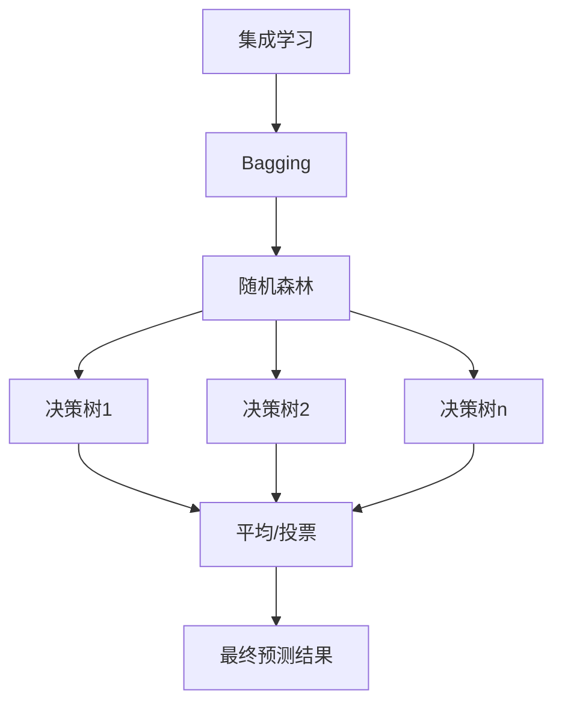
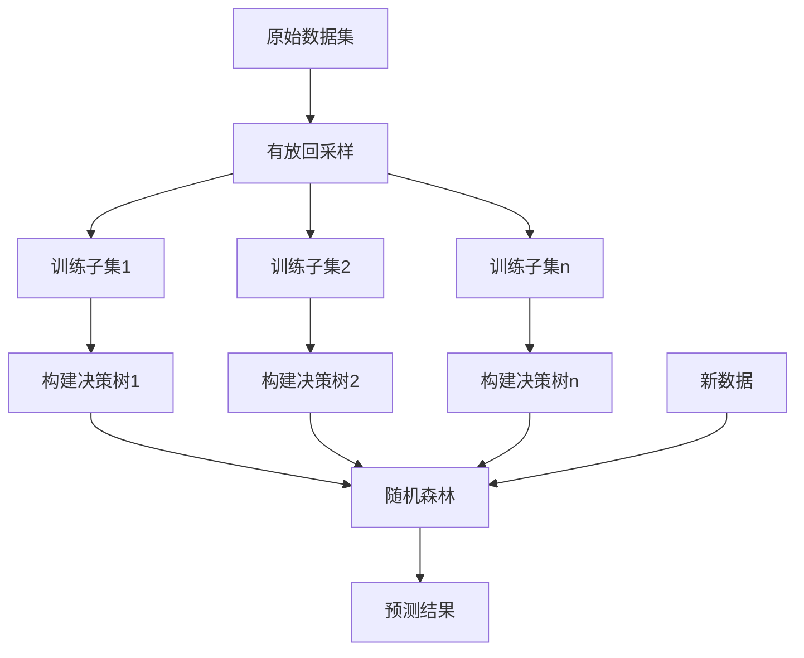

# Random Forest 原理与代码实战案例讲解

## 1.背景介绍

随着数据的快速增长和机器学习算法的不断发展,决策树算法因其简单高效而广受欢迎。然而,单一决策树存在过拟合的风险,因此集成学习方法应运而生。随机森林(Random Forest)便是集成学习中最出色的代表之一,它通过构建多个决策树并将它们的预测结果结合起来,从而提高了模型的准确性和鲁棆性。

随机森林在分类和回归问题中表现出色,被广泛应用于多个领域,如金融风险评估、基因组学、计算机视觉等。它的优势在于训练速度快、对缺失值的tolerence较高、能够处理高维数据且对多重共线性不太敏感。本文将深入探讨随机森林的原理、实现细节以及在实际应用中的实战案例。

## 2.核心概念与联系

### 2.1 决策树

决策树是一种基于树形结构的监督学习算法,它将特征空间递归地划分为较小的区域,并在每个区域内拟合一个简单的模型。决策树的构建过程是自顶向下的,根据特征值将数据集拆分为较小的子集。

### 2.2 集成学习

集成学习的核心思想是通过构建并结合多个学习器来完成学习任务,从而获得比单一学习器更有效的模型。常见的集成方法有Bagging和Boosting。

### 2.3 Bagging

Bagging(Bootstrap Aggregating)是通过自助采样法(Bootstrapping)从原始数据集中产生多个新的训练集,利用这些训练集分别训练出多个模型,然后将这些模型的预测结果进行平均或投票,得到最终的预测结果。

### 2.4 随机森林

随机森林是Bagging思想在决策树上的一个扩展。在构建决策树时,它不仅对样本进行了随机采样,而且在选择划分特征时,也进行了随机的特征子集抽取。这种随机性使得随机森林避免了单一决策树容易过拟合的缺点,从而获得了更好的泛化能力。



## 3.核心算法原理具体操作步骤

随机森林算法的核心步骤如下:

1. **从原始数据集通过有放回的方式抽取 N 个训练子集**。每个子集大约占总样本数的 63.2%,剩下的 36.8% 的样本被称为袋外数据(Out-Of-Bag data,简称 OOB),用于模型评估。

2. **对每个训练子集,以下列方式构建一个决策树:**
   - 在决策树的每个节点上,从全部特征中随机选择 m 个特征(m 远小于总特征数 M)。
   - 在这 m 个特征中,选择最优的一个特征用于分裂节点。
   - 每棵树在构建过程中不进行剪枝。

3. **重复步骤 2,得到 n 棵决策树组成随机森林。**

4. **对新的测试数据,让构建好的 n 棵树分别做出预测,然后通过投票或平均的方式得到最终的预测结果。**

该过程可以用如下 Mermaid 流程图表示:



## 4.数学模型和公式详细讲解举例说明

### 4.1 决策树构建

在构建决策树时,我们需要选择最优的特征进行分裂。常用的指标有基尼指数(Gini Index)和信息增益(Information Gain)。

**基尼指数:**

$$
\begin{aligned}
Gini(D) &= 1 - \sum_{k=1}^{|y|} p_k^2 \\
Gini\_index(D, a) &= \frac{|D_1|}{|D|}Gini(D_1) + \frac{|D_2|}{|D|}Gini(D_2)
\end{aligned}
$$

其中 $p_k$ 表示数据集 D 中第 k 类样本所占的比例, $D_1$ 和 $D_2$ 分别表示根据特征 a 的值将数据集 D 分成的两个子集。我们选择能使 $Gini\_index(D, a)$ 最小的特征 a 作为分裂特征。

**信息增益:**

$$
\begin{aligned}
Ent(D) &= -\sum_{k=1}^{|y|} p_k \log_2 p_k \\
Gain(D, a) &= Ent(D) - \sum_{v=1}^{V}\frac{|D^v|}{|D|}Ent(D^v)
\end{aligned}
$$

其中 $Ent(D)$ 表示数据集 D 的熵, $D^v$ 表示根据特征 a 的取值 v 将数据集 D 分成的子集。我们选择能使 $Gain(D, a)$ 最大的特征 a 作为分裂特征。

通过不断地选择最优特征分裂节点,我们最终可以构建出一棵决策树。

### 4.2 随机森林预测

对于给定的测试数据 $x$,随机森林将会遍历所有决策树,并将每棵树的预测结果记录下来。对于分类问题,通过投票的方式得到最终的类别预测:

$$
\hat{y} = \text{majority\_vote}\{f_i(x)\}_{i=1}^{n}
$$

其中 $f_i(x)$ 表示第 i 棵决策树对 $x$ 的预测结果。

对于回归问题,通过取预测值的平均得到最终的预测结果:

$$
\hat{y} = \frac{1}{n}\sum_{i=1}^{n}f_i(x)
$$

## 5.项目实践:代码实例和详细解释说明

以下是使用 Python 中的 scikit-learn 库实现随机森林的示例代码:

```python
from sklearn.datasets import make_blobs
from sklearn.model_selection import train_test_split
from sklearn.ensemble import RandomForestClassifier
from sklearn.metrics import accuracy_score

# 生成模拟数据
X, y = make_blobs(n_samples=1000, centers=3, n_features=5, random_state=42)

# 划分训练集和测试集
X_train, X_test, y_train, y_test = train_test_split(X, y, test_size=0.2, random_state=42)

# 创建随机森林分类器
rf = RandomForestClassifier(n_estimators=100, max_depth=10, random_state=42)

# 训练模型
rf.fit(X_train, y_train)

# 进行预测
y_pred = rf.predict(X_test)

# 评估模型
accuracy = accuracy_score(y_test, y_pred)
print(f"Accuracy: {accuracy:.2f}")
```

代码解释:

1. 首先使用 `make_blobs` 函数生成一个模拟的数据集,包含 3 个簇,5 个特征。
2. 使用 `train_test_split` 函数将数据划分为训练集和测试集,测试集占 20%。
3. 创建 `RandomForestClassifier` 对象,设置 100 棵决策树,最大深度为 10。
4. 使用 `fit` 方法在训练集上训练随机森林模型。
5. 对测试集进行预测,得到预测结果 `y_pred`。
6. 使用 `accuracy_score` 函数计算模型在测试集上的准确率。

你也可以通过调整随机森林的参数来观察对模型性能的影响,例如增加树的数量 `n_estimators`、限制树的最大深度 `max_depth`、调整特征选择的随机性 `max_features` 等。

## 6.实际应用场景

随机森林因其优秀的性能和易用性,在许多领域都有广泛的应用:

- **金融风险评估**: 随机森林可用于评估贷款违约风险、信用卡欺诈检测等场景。
- **基因组学**: 在基因表达数据分析、疾病诊断等任务中发挥着重要作用。
- **计算机视觉**: 可用于图像分类、目标检测等视觉任务。
- **自然语言处理**: 在文本分类、情感分析等领域有应用。
- **推荐系统**: 可用于个性化推荐,预测用户的兴趣偏好。

除此之外,随机森林还被广泛应用于网络入侵检测、天气预报、生存分析等诸多领域。

## 7.工具和资源推荐

- **scikit-learn**: Python 中流行的机器学习库,提供了随机森林的实现。
- **XGBoost**: 一个高效的梯度提升决策树库,支持并行训练随机森林。
- **LightGBM**: 另一个高性能的梯度提升决策树框架,在大规模数据场景下表现优异。
- **ranger**: 一个快速、高效的 C++ 随机森林库,可用于 R 和 Python。
- **MLlib**: Apache Spark 中的机器学习库,支持分布式训练随机森林。

此外,还有一些在线课程和书籍资源值得推荐:

- **Machine Learning Mastery**: 提供优质的机器学习在线课程。
- 《An Introduction to Statistical Learning》: 经典的机器学习入门教材。
- 《The Elements of Statistical Learning》: 深入探讨统计学习理论的权威著作。

## 8.总结:未来发展趋势与挑战

随机森林在机器学习领域占据重要地位,但仍有一些值得关注的发展趋势和挑战:

- **高维数据处理**: 随着数据维度的增加,随机森林的性能可能会下降。一些改进方法如旋转随机森林(Rotation Forest)等已被提出。
- **非平衡数据处理**: 在类别分布不均衡的情况下,随机森林可能会偏向于主要类别。需要采取一些措施如过采样、欠采样等来解决这一问题。
- **解释性**: 虽然随机森林比单一决策树具有更好的泛化能力,但其内部结构的复杂性也使得解释性降低。提高模型的可解释性是一个重要的研究方向。
- **在线学习**: 目前的随机森林算法主要是批量离线学习,如何在数据流环境下实现在线更新是一个挑战。
- **量化不确定性**: 随机森林虽然能够提供预测结果,但如何量化预测的不确定性仍需进一步研究。

总的来说,随机森林作为一种强大的集成学习方法,未来仍将在理论和应用层面不断发展和完善。

## 9.附录:常见问题与解答

1. **随机森林和决策树相比,哪一个更容易过拟合?**

单一决策树由于其层次结构的特点,很容易过拟合训练数据。而随机森林通过集成多棵决策树,降低了过拟合的风险,因此更不容易过拟合。

2. **为什么要在构建决策树时对特征进行随机选择?**

对特征进行随机选择可以降低决策树之间的相关性,从而提高随机森林的分类或回归性能。如果每棵树都使用全部特征,那么生成的树之间会过于相似,无法很好地发挥集成的优势。

3. **袋外数据(OOB)有什么作用?**

袋外数据可以用于评估随机森林的泛化性能,而无需额外的测试集。通过计算袋外样本的预测误差,我们可以获得一个无偏估计的模型性能指标,这对于调参和模型选择很有帮助。

4. **随机森林对缺失值的处理方式是什么?**

在构建决策树时,随机森林会通过代理值(surrogate values)来处理缺失值。具体来说,对于每个节点,它会找到与分裂特征最相关的其他特征,并使用这些特征的值来近似缺失值。这种处理方式使得随机森林对缺失值具有较高的容错能力。

5. **如何解释随机森林的预测结果?**

虽然单个决策树的结构相对容易解释