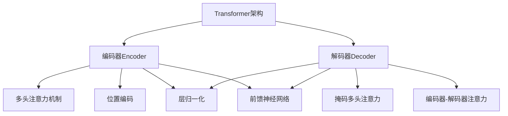
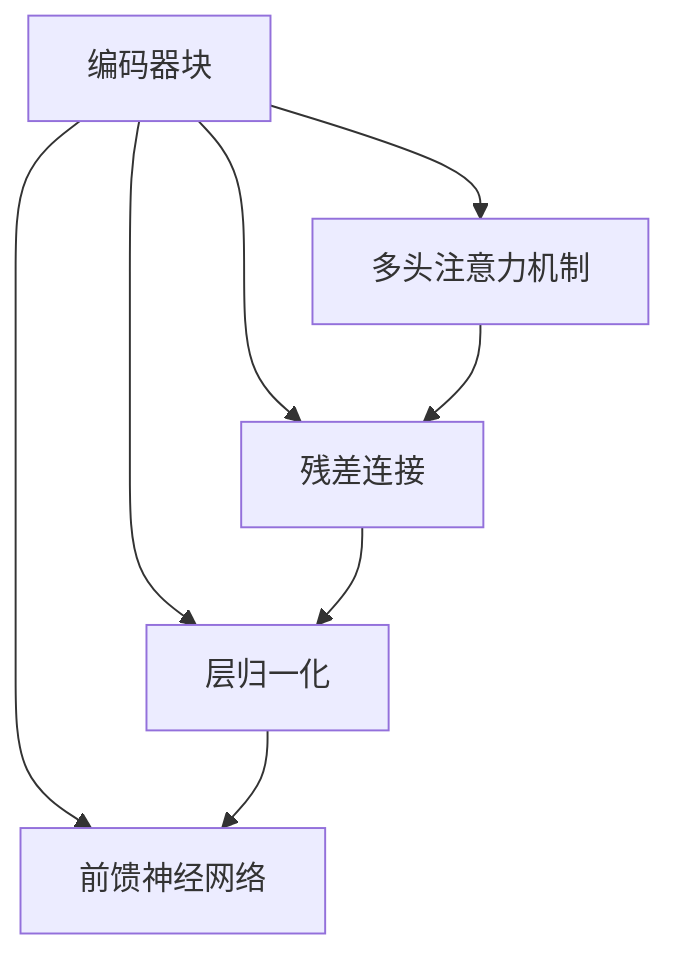

# RoBERTa原理与代码实例讲解

## 1.背景介绍

### 1.1 自然语言处理的重要性

在当今的数字时代,自然语言处理(NLP)已成为人工智能领域中最活跃和最具影响力的研究方向之一。它旨在使计算机能够理解、解释和生成人类语言,为人机交互提供无缝的桥梁。随着大数据和计算能力的不断提升,NLP技术在各个领域得到了广泛应用,如机器翻译、问答系统、情感分析、文本摘要等。

### 1.2 语言模型的重要性

语言模型是NLP的核心组成部分,它通过学习大量文本数据,捕捉语言的统计规律和语义信息,为下游任务提供有价值的语言表示。传统的语言模型如N-gram模型,只能捕捉局部的语法和语义信息。而近年来,基于深度学习的语言模型,如Word2Vec、ELMo、GPT和BERT等,能够学习上下文丰富的语义表示,极大推动了NLP技术的发展。

### 1.3 BERT模型的革命性贡献

2018年,谷歌的研究人员提出了BERT(Bidirectional Encoder Representations from Transformers)模型,这是NLP领域的一个里程碑式进展。BERT是第一个在预训练中使用Transformer编码器的双向模型,能够同时捕捉语句中每个词的左右上下文信息。相比以前的模型,BERT在多项NLP任务上取得了显著的性能提升,成为NLP领域的新标杆。

### 1.4 RoBERTa的出现

尽管BERT模型取得了巨大成功,但其训练过程和模型设计仍存在一些不足。2019年,Facebook AI研究院的研究人员在BERT的基础上,提出了RoBERTa(Robustly Optimized BERT Approach)模型。RoBERTa通过改进训练策略、数据处理方式和超参数选择等,进一步提高了模型的泛化能力和鲁棒性,在多项任务上超过了BERT,成为新的SOTA模型。

## 2.核心概念与联系

### 2.1 Transformer架构

Transformer是一种全新的基于注意力机制(Attention Mechanism)的序列建模架构,不同于传统的RNN或CNN结构。它完全基于注意力机制来捕捉序列中任意两个位置的关系,避免了RNN的梯度消失问题,并支持高效的并行计算。Transformer架构主要由编码器(Encoder)和解码器(Decoder)两部分组成,在机器翻译等序列到序列(Seq2Seq)任务中发挥重要作用。



### 2.2 BERT模型

BERT模型只使用了Transformer的编码器部分,将其应用于下游的NLP任务中。BERT的核心创新在于采用了双向的预训练方式,即在学习每个词的表示时,同时捕捉其左右上下文的信息。这种双向特性使得BERT能够建模更丰富的语义关系,提高了语言理解能力。

BERT的预训练过程包括两个任务:
1. **掩码语言模型(Masked Language Model, MLM)**: 随机掩码部分输入Token,模型需要预测被掩码的Token。
2. **下一句预测(Next Sentence Prediction, NSP)**: 判断两个句子是否为连续的句子对。

通过这两个任务的联合预训练,BERT能够学习到深层次的语义和上下文表示。预训练完成后,BERT可以在各种下游任务上进行微调(fine-tuning),快速迁移到新的数据和任务上。

### 2.3 RoBERTa模型

RoBERTa是在BERT模型的基础上进行改进和优化。主要创新点包括:

1. **更大的训练数据**:使用更大的数据集(160GB)进行预训练,提高了模型的泛化能力。
2. **动态掩码策略**:每次训练时随机掩码Token,增加了数据的多样性。
3. **无NSP任务**:去掉了BERT的下一句预测任务,只保留MLM任务。
4. **更长的训练步数**:采用更长的训练步数,使模型收敛到更优的参数。

RoBERTa在多项NLP基准测试中超过了BERT,展现出更强的语言理解能力。

## 3.核心算法原理具体操作步骤 

### 3.1 输入表示

RoBERTa的输入是一个Token序列,每个Token对应一个词元(Word Piece)的embedding向量。为了保留位置信息,RoBERTa在输入中添加了两种嵌入:

1. **Token Embeddings**: 每个Token对应一个embedding向量。
2. **Position Embeddings**: 根据Token在序列中的位置,添加相应的位置embedding。

最终的输入表示是Token Embeddings和Position Embeddings的元素wise求和。

### 3.2 编码器(Encoder)

RoBERTa的编码器采用了标准的Transformer Encoder架构,由多层相同的编码器块组成。每个编码器块包括以下几个核心组件:

1. **多头注意力机制(Multi-Head Attention)**:允许模型同时关注输入序列中的不同位置,捕捉长程依赖关系。
2. **残差连接(Residual Connection)**:将输入和子层的输出相加,以防止梯度消失。
3. **层归一化(Layer Normalization)**:对输入进行归一化处理,加速收敛。
4. **前馈神经网络(Feed-Forward Network)**:对每个位置的表示进行非线性变换,提取更高层次的特征。



编码器块的堆叠使RoBERTa能够学习到深层次的上下文表示,并且通过自注意力机制捕捉长程依赖关系。

### 3.3 掩码语言模型(MLM)

RoBERTa的预训练任务是掩码语言模型(MLM),其操作步骤如下:

1. **掩码Token**: 随机选择输入序列中的15%的Token,用特殊的`[MASK]`Token替换。
2. **前向传播**: 将带有`[MASK]`Token的序列输入编码器,得到每个位置的上下文表示向量。
3. **预测**: 对于被掩码的Token位置,使用其上下文表示向量,通过一个分类器预测该位置的Token。
4. **损失计算**: 将预测的Token概率分布与实际Token的one-hot编码计算交叉熵损失。
5. **反向传播**: 根据损失对模型参数进行梯度更新。

通过MLM任务的预训练,RoBERTa能够学习到丰富的语义和上下文信息,为下游任务提供强大的语言表示能力。

## 4.数学模型和公式详细讲解举例说明

### 4.1 注意力机制(Attention Mechanism)

注意力机制是Transformer架构的核心,它允许模型动态地关注输入序列中的不同部分,捕捉长程依赖关系。对于一个长度为n的序列$X = (x_1, x_2, ..., x_n)$,注意力机制首先计算每个位置对其他所有位置的注意力分数:

$$
\text{Attention}(Q, K, V) = \text{softmax}(\frac{QK^T}{\sqrt{d_k}})V
$$

其中$Q$、$K$、$V$分别表示Query、Key和Value,它们都是序列$X$通过不同的线性变换得到的。$d_k$是缩放因子,用于防止内积值过大导致softmax饱和。

最终,注意力机制的输出是所有位置的Value向量的加权和,其中权重由相应的注意力分数决定。这种机制使模型能够自适应地聚焦于对当前任务最相关的上下文信息。

### 4.2 多头注意力机制(Multi-Head Attention)

为了捕捉不同的注意力模式,Transformer采用了多头注意力机制。具体来说,将Query、Key和Value分别线性投影到$h$个子空间,然后在每个子空间中并行执行缩放点积注意力机制,最后将所有子空间的注意力输出进行拼接:

$$
\begin{aligned}
\text{MultiHead}(Q, K, V) &= \text{Concat}(\text{head}_1, \text{head}_2, \ldots, \text{head}_h)W^O\\
\text{where}\  \text{head}_i &= \text{Attention}(QW_i^Q, KW_i^K, VW_i^V)
\end{aligned}
$$

其中$W_i^Q$、$W_i^K$、$W_i^V$和$W^O$是可学习的线性变换矩阵。多头注意力机制能够从不同的子空间获取补充信息,提高了模型的表示能力。

### 4.3 位置编码(Positional Encoding)

由于Transformer没有递归或卷积结构,因此需要一种方法来注入序列的位置信息。RoBERTa采用了正弦位置编码的方式,将序列中每个位置$i$映射到一个位置向量$P_{(i)}$:

$$
\begin{aligned}
P_{(i,2j)} &= \sin(i/10000^{2j/d_\text{model}})\\
P_{(i,2j+1)} &= \cos(i/10000^{2j/d_\text{model}})
\end{aligned}
$$

其中$j$是维度索引,取值范围为$[0, d_\text{model}/2)$。这种编码方式能够自然地表示相对位置关系,并且在不同的位置上是不同的。

位置编码向量$P_{(i)}$会与对应位置的Token Embedding相加,从而将位置信息融入到输入表示中。

### 4.4 前馈神经网络(Feed-Forward Network)

除了注意力子层,每个编码器块还包含一个前馈全连接子层,它对每个位置的表示进行非线性变换:

$$
\text{FFN}(x) = \max(0, xW_1 + b_1)W_2 + b_2
$$

其中$W_1$、$b_1$、$W_2$、$b_2$是可学习的参数。这个前馈网络引入了非线性变换,提取了更高层次的特征表示。

## 5.项目实践:代码实例和详细解释说明

以下是使用Hugging Face的Transformers库加载和微调RoBERTa模型的Python代码示例:

### 5.1 加载预训练模型

```python
from transformers import RobertaConfig, RobertaModel

# 加载配置
config = RobertaConfig.from_pretrained('roberta-base')

# 加载模型
model = RobertaModel.from_pretrained('roberta-base', config=config)
```

上述代码加载了RoBERTa的基础版本(`roberta-base`)。`RobertaConfig`包含了模型的配置参数,而`RobertaModel`是RoBERTa的编码器部分。

### 5.2 前向传播

```python
import torch

# 输入序列
input_ids = torch.tensor([[1, 2, 3, 4, 5]])  # 批量大小为1

# 前向传播
outputs = model(input_ids)
last_hidden_state = outputs.last_hidden_state
```

`model`接受一个输入Token序列`input_ids`作为输入,返回一个包含最后一层隐藏状态的`outputs`对象。`last_hidden_state`是一个三维张量,其形状为`(batch_size, sequence_length, hidden_size)`。

### 5.3 微调RoBERTa

为了在下游任务上使用RoBERTa,我们需要对预训练模型进行微调(fine-tuning)。以文本分类任务为例:

```python
from transformers import RobertaForSequenceClassification

# 加载分类头
model = RobertaForSequenceClassification.from_pretrained('roberta-base', num_labels=2)

# 微调
# ...
# 训练循环
for batch in train_dataloader:
    # 获取输入
    input_ids, labels = batch
    
    # 前向传播
    outputs = model(input_ids, labels=labels)
    loss = outputs.loss
    
    # 反向传播
    loss.backward()
    optimizer.step()
    # ...
```

上述代码展示了如何使用`RobertaForSequenceClassification`模型进行文本分类任务的微调。在训