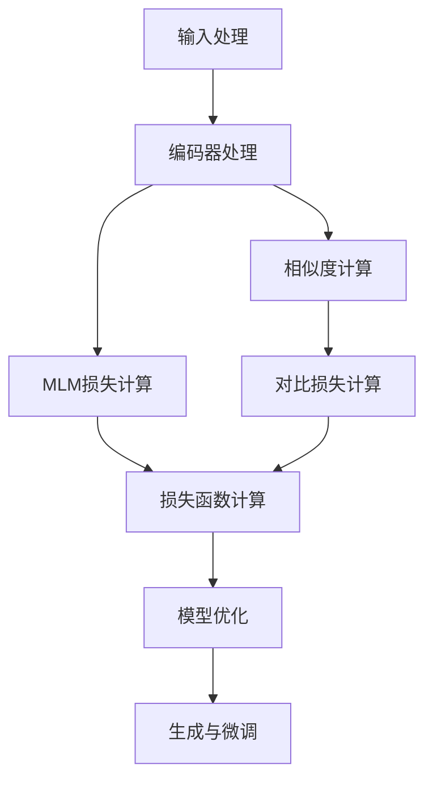

# SimMIM原理与代码实例讲解

## 1.背景介绍

随着人工智能技术的不断发展,大型语言模型(Large Language Models, LLMs)已经成为自然语言处理领域的核心技术之一。LLMs可以通过在大规模语料库上进行预训练,学习到丰富的语言知识和上下文信息,从而在下游任务中表现出优异的性能。然而,传统的LLMs在生成长文本时往往存在一些缺陷,如生成内容的一致性和连贯性较差、缺乏长期依赖关系的建模能力等。

为了解决这些问题,近年来提出了一种新型的LLM架构,即SimMIM(Siamese Masked Language Model)。SimMIM通过引入Siamese网络结构和掩码语言模型(Masked Language Model, MLM)预训练目标,有效地捕获了长期依赖关系,提高了生成文本的一致性和连贯性。本文将详细介绍SimMIM的原理、算法实现以及代码实例,帮助读者深入理解这一创新技术。

## 2.核心概念与联系

### 2.1 Transformer模型

Transformer是一种基于自注意力机制的序列到序列模型,广泛应用于自然语言处理任务。它由编码器(Encoder)和解码器(Decoder)两个主要部分组成,可以有效地捕获输入序列的上下文信息,并生成相应的输出序列。

### 2.2 掩码语言模型(MLM)

掩码语言模型(Masked Language Model, MLM)是一种自监督学习方法,通过在输入序列中随机掩码部分词元,并要求模型预测被掩码的词元,从而学习到有效的语言表示。MLM在BERT等模型中被广泛应用,取得了卓越的成功。

### 2.3 Siamese网络

Siamese网络是一种特殊的神经网络架构,它包含两个或多个共享权重的子网络,用于计算输入样本之间的相似度。在SimMIM中,Siamese网络被用于捕获文本序列之间的长期依赖关系。

### 2.4 SimMIM架构

SimMIM将Transformer模型、MLM和Siamese网络有机结合,形成了一种新型的LLM架构。它由两个共享权重的Transformer编码器组成,分别对原始文本序列和掩码文本序列进行编码。通过计算两个编码器输出的相似度,SimMIM可以有效地捕获长期依赖关系,提高生成文本的一致性和连贯性。

## 3.核心算法原理具体操作步骤

SimMIM的核心算法原理可以概括为以下几个步骤:

1. **输入处理**: 将原始文本序列和掩码文本序列作为输入,其中掩码文本序列是通过在原始序列中随机替换部分词元得到的。

2. **编码器处理**: 使用两个共享权重的Transformer编码器分别对原始序列和掩码序列进行编码,得到两个编码器输出表示。

3. **相似度计算**: 计算两个编码器输出表示之间的相似度,通常采用余弦相似度或点积相似度等方法。

4. **MLM损失计算**: 使用掩码序列的编码器输出表示和掩码位置的真实词元计算MLM损失,作为模型的预训练目标之一。

5. **对比损失计算**: 将原始序列和掩码序列的编码器输出表示之间的相似度作为正样本,同时构造负样本对(通过随机采样或者特定策略),计算对比损失(Contrastive Loss),作为模型的另一个预训练目标。

6. **模型优化**: 将MLM损失和对比损失相加,得到总的损失函数,并使用优化算法(如Adam)对模型参数进行更新。

7. **生成与微调**: 在预训练完成后,可以将SimMIM模型应用于下游生成任务,或者进一步在特定数据集上进行微调,以提高性能。

上述算法步骤可以用以下Mermaid流程图直观地表示:



## 4.数学模型和公式详细讲解举例说明

### 4.1 Transformer编码器

Transformer编码器的核心是多头自注意力机制,用于捕获输入序列中词元之间的长程依赖关系。给定输入序列 $X = (x_1, x_2, \dots, x_n)$,自注意力机制计算每个词元的注意力权重,并根据权重对其他词元进行加权求和,得到该词元的表示向量。具体计算过程如下:

$$\begin{aligned}
Q &= XW^Q \\
K &= XW^K \\
V &= XW^V \\
\text{Attention}(Q, K, V) &= \text{softmax}\left(\frac{QK^T}{\sqrt{d_k}}\right)V
\end{aligned}$$

其中, $W^Q, W^K, W^V$ 分别是查询(Query)、键(Key)和值(Value)的线性变换矩阵, $d_k$ 是缩放因子。多头注意力机制通过并行计算多个注意力头,并将它们的结果拼接起来,从而捕获不同的依赖关系模式。

### 4.2 MLM损失

MLM损失是SimMIM的一个重要预训练目标,用于学习有效的语言表示。给定掩码序列 $X^m = (x_1^m, x_2^m, \dots, x_n^m)$,其中部分词元被掩码替换,MLM损失的计算公式如下:

$$\mathcal{L}_\text{MLM} = -\frac{1}{N}\sum_{i=1}^N \log P(x_i^m | X^m \setminus x_i^m; \theta)$$

其中, $N$ 是掩码词元的数量, $X^m \setminus x_i^m$ 表示除去第 $i$ 个掩码词元的掩码序列, $\theta$ 是模型参数, $P(x_i^m | X^m \setminus x_i^m; \theta)$ 是模型预测第 $i$ 个掩码词元为 $x_i^m$ 的概率。

### 4.3 对比损失

对比损失是SimMIM的另一个预训练目标,用于捕获原始序列和掩码序列之间的长期依赖关系。给定原始序列 $X$ 和掩码序列 $X^m$,以及它们对应的编码器输出表示 $h_X$ 和 $h_{X^m}$,对比损失的计算公式如下:

$$\mathcal{L}_\text{contrast} = -\log \frac{\exp(\text{sim}(h_X, h_{X^m}) / \tau)}{\sum_{X^n \in \mathcal{N}(X)} \exp(\text{sim}(h_X, h_{X^n}) / \tau)}$$

其中, $\text{sim}(\cdot, \cdot)$ 是相似度函数(如余弦相似度或点积相似度), $\tau$ 是温度超参数, $\mathcal{N}(X)$ 是原始序列 $X$ 的负样本集合。对比损失的目标是最大化原始序列和掩码序列之间的相似度,同时最小化原始序列与负样本之间的相似度。

通过优化MLM损失和对比损失的加权和,SimMIM可以同时学习有效的语言表示和长期依赖关系建模能力。

## 5.项目实践:代码实例和详细解释说明

以下是一个使用PyTorch实现的SimMIM模型示例代码,包括Transformer编码器、SimMIM模型以及训练和评估函数。

### 5.1 Transformer编码器

```python
import torch
import torch.nn as nn

class TransformerEncoder(nn.Module):
    def __init__(self, d_model, nhead, num_layers, dim_feedforward, dropout=0.1):
        super(TransformerEncoder, self).__init__()
        encoder_layer = nn.TransformerEncoderLayer(d_model, nhead, dim_feedforward, dropout)
        self.transformer_encoder = nn.TransformerEncoder(encoder_layer, num_layers)

    def forward(self, src):
        output = self.transformer_encoder(src)
        return output
```

这个代码定义了一个Transformer编码器模块,它包含了多个编码器层,每个编码器层由多头自注意力机制和前馈神经网络组成。`forward`函数接受输入序列`src`,并返回编码后的序列表示`output`。

### 5.2 SimMIM模型

```python
class SimMIM(nn.Module):
    def __init__(self, d_model, nhead, num_layers, dim_feedforward, dropout=0.1):
        super(SimMIM, self).__init__()
        self.encoder1 = TransformerEncoder(d_model, nhead, num_layers, dim_feedforward, dropout)
        self.encoder2 = TransformerEncoder(d_model, nhead, num_layers, dim_feedforward, dropout)
        self.encoder2.transformer_encoder.weight = self.encoder1.transformer_encoder.weight  # 共享权重

    def forward(self, src, src_mask):
        output1 = self.encoder1(src)
        output2 = self.encoder2(src_mask)
        return output1, output2
```

这个代码定义了SimMIM模型,它包含两个共享权重的Transformer编码器。`forward`函数接受原始序列`src`和掩码序列`src_mask`,分别通过两个编码器进行编码,并返回两个编码器的输出`output1`和`output2`。

### 5.3 训练和评估函数

```python
import torch.nn.functional as F

def train_step(model, src, src_mask, optimizer):
    optimizer.zero_grad()
    output1, output2 = model(src, src_mask)
    mlm_loss = F.cross_entropy(output2.view(-1, output2.size(-1)), src_mask.view(-1))
    contrast_loss = -torch.mean(torch.cosine_similarity(output1, output2, dim=-1))
    loss = mlm_loss + contrast_loss
    loss.backward()
    optimizer.step()
    return loss.item()

def evaluate(model, data_loader):
    model.eval()
    total_loss = 0
    with torch.no_grad():
        for src, src_mask in data_loader:
            output1, output2 = model(src, src_mask)
            mlm_loss = F.cross_entropy(output2.view(-1, output2.size(-1)), src_mask.view(-1), reduction='sum')
            contrast_loss = -torch.sum(torch.cosine_similarity(output1, output2, dim=-1))
            total_loss += mlm_loss.item() + contrast_loss.item()
    return total_loss / len(data_loader.dataset)
```

这个代码定义了训练步骤`train_step`和评估函数`evaluate`。

`train_step`函数接受模型`model`、原始序列`src`、掩码序列`src_mask`和优化器`optimizer`。它计算MLM损失和对比损失,将两者相加得到总损失`loss`,然后反向传播并更新模型参数。

`evaluate`函数用于在验证集或测试集上评估模型性能。它遍历数据加载器`data_loader`,计算MLM损失和对比损失的总和,并返回平均损失值。

### 5.4 使用示例

以下是一个使用上述代码进行SimMIM模型训练和评估的示例:

```python
# 准备数据
train_data = ...  # 训练数据集
val_data = ...    # 验证数据集
batch_size = 32

# 创建模型和优化器
model = SimMIM(d_model=512, nhead=8, num_layers=6, dim_feedforward=2048)
optimizer = torch.optim.Adam(model.parameters(), lr=1e-4)

# 训练循环
for epoch in range(num_epochs):
    train_loader = DataLoader(train_data, batch_size=batch_size, shuffle=True)
    for src, src_mask in train_loader:
        loss = train_step(model, src, src_mask, optimizer)
        # 记录训练损失

    # 在验证集上评估模型
    val_loader = DataLoader(val_data, batch_size=batch_size)
    val_loss = evaluate(model, val_loader)
    # 记录验证损失

# 在测试集上评估模型
test_data = ...  # 测试数据集
test_loader = DataLoader(test_data, batch_size=batch_size)
test_loss = evaluate(model, test_loader)
print(f"Test loss: {test_loss}")
```

在这个示例中,我们首先准备训练数据集`train_data`和验证数据集`val_data`,创建SimMIM模型`model`和优化器`optimizer`。然后,我们进入训练循环,在每个epoch中,遍历训练数据加载器`train_loader`,对每个批次调用`train_step`函数进行模型训练。在每个epoch结束时,我们在验证数据集`val_data`上评估模型性能,记录验证损失。最后,我们在测试数据集`test_data`上评估模型,并打印测试损失。