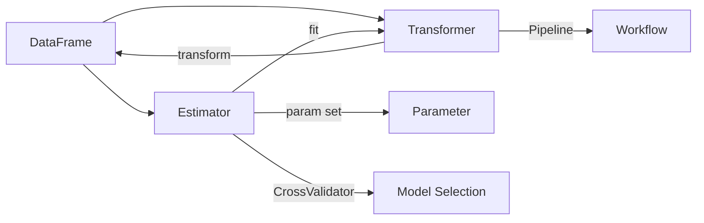

# Spark MLlib机器学习库原理与代码实例讲解

## 1.背景介绍

### 1.1 大数据时代的机器学习需求
在当今大数据时代,各行各业都在产生海量的数据。如何从这些数据中挖掘出有价值的信息和知识,成为企业获得竞争优势的关键。机器学习作为人工智能的核心技术之一,为大数据分析提供了有力的工具和手段。然而,传统的机器学习算法和框架在处理海量数据时往往力不从心,无法满足实时性、可扩展性等需求。

### 1.2 Spark带来的机遇
Apache Spark作为新一代大数据处理引擎,凭借其快速、通用、可扩展等特点,受到了业界的广泛关注和应用。Spark提供了一个统一的大数据处理平台,支持批处理、交互式查询、实时流处理、图计算和机器学习等多种场景。尤其是Spark内置的MLlib机器学习库,将机器学习算法无缝整合到Spark大数据处理流程中,极大地方便了机器学习在大数据场景下的应用。

### 1.3 MLlib概述
MLlib是Spark的机器学习库,提供了常用的机器学习算法和工具,包括分类、回归、聚类、协同过滤、降维等。MLlib基于Spark的分布式计算框架实现,可以利用Spark的并行计算能力来加速机器学习的训练和预测过程。MLlib 既提供了底层的优化算法,也提供了高层的管道API,兼顾了性能和易用性。

## 2.核心概念与联系

### 2.1 DataFrame 
DataFrame是Spark SQL的核心数据结构,以分布式的方式存储结构化数据。它与关系型数据库中的二维表格类似,但是可以横跨多台机器进行存储和计算。DataFrame支持多种数据源(如Hive、Avro、Parquet、JSON等),提供了丰富的数据转换和操作API(如 select、filter、join等),是Spark数据处理的统一入口。MLlib使用DataFrame来表示训练数据和预测结果。

### 2.2 Transformer
Transformer是一种将一个DataFrame转换为另一个DataFrame的算法。比如分类模型就是一种Transformer,它接收特征DataFrame,预测标签列并输出结果DataFrame。再比如特征转换算法(如标准化、哈希等)也是Transformer,用于在训练前对特征进行预处理。Transformer是MLlib管道的基本构件单元。

### 2.3 Estimator
Estimator是一种学习算法,它接收一个DataFrame,经过训练产生一个Transformer。常见的Estimator包括分类器、回归器、聚类器、推荐算法等。调用Estimator的fit方法就可以训练出一个模型(Transformer)。Estimator和Transformer的关系类似于类和实例的关系。

### 2.4 Parameter
大多数的机器学习算法都有一些参数,用于控制算法的行为和性能。例如逻辑回归有正则化参数,随机森林有树的个数和最大深度等参数。MLlib使用Parameter来封装这些参数,通过为Estimator设置参数,可以在训练时对算法进行调优。

### 2.5 Pipeline
机器学习的过程通常包括数据预处理、特征工程、训练、评估等多个步骤。MLlib使用Pipeline(管道)来描述这一系列操作,将多个Transformer和Estimator串联成一个工作流。只需调用Pipeline的fit方法,就可以按顺序训练出各个阶段的模型,最终得到一个整体的Transformer,应用到测试集上进行预测。Pipeline简化了端到端的机器学习过程。

### 2.6 交叉验证
为了选择最佳的模型和调优参数,我们通常使用交叉验证的方法对模型进行评估。MLlib提供了CrossValidator进行k折交叉验证,将数据集划分为k个子集,分别取每个子集作为验证集,其余部分作为训练集,训练k个模型,取验证误差平均值最小的参数为最优参数。CrossValidator支持并行化训练和调优。

下图展示了MLlib的核心概念以及它们之间的关系:



## 3.核心算法原理与具体操作步骤

### 3.1 分类算法

#### 3.1.1 逻辑回归

逻辑回归是一种常用的二分类算法,通过拟合sigmoid函数来估计标签为1的后验概率。对于给定的特征向量$x$,逻辑回归模型预测标签为1的概率为:

$$
P(y=1|x) = \frac{1}{1+e^{-w^Tx}}
$$

其中$w$是待学习的权重向量。逻辑回归通过最小化负对数似然函数来求解最优权重:

$$
\min_w \sum_i -y_i \log(P(y_i=1|x_i)) - (1-y_i) \log(1-P(y_i=1|x_i)) + \lambda ||w||_2^2
$$

$\lambda$为L2正则化系数,用于控制过拟合。MLlib中逻辑回归的主要超参数包括:
- family: 分布族,可以是"binomial"(二项分布)或"multinomial"(多项分布)。
- elasticNetParam: 弹性网络混合参数,控制L1和L2正则化的组合,范围为[0,1]。
- regParam: 正则化参数,控制正则化的强度,默认为0。
- maxIter: 最大迭代次数,默认为100。

使用示例:

```scala
import org.apache.spark.ml.classification.LogisticRegression

// 准备训练数据
val training = spark.createDataFrame(Seq(
  (1.0, Vectors.dense(0.0, 1.1, 0.1)),
  (0.0, Vectors.dense(2.0, 1.0, -1.0)),
  (0.0, Vectors.dense(2.0, 1.3, 1.0)),
  (1.0, Vectors.dense(0.0, 1.2, -0.5))
)).toDF("label", "features")

// 创建逻辑回归估计器
val lr = new LogisticRegression()
  .setMaxIter(10)
  .setRegParam(0.3)
  .setElasticNetParam(0.8)

// 训练模型
val lrModel = lr.fit(training)

// 打印模型权重
println(s"Coefficients: ${lrModel.coefficients}")
println(s"Intercept: ${lrModel.intercept}")
```

#### 3.1.2 支持向量机

支持向量机(SVM)通过寻找最大间隔超平面来进行分类。对于线性可分的数据,SVM试图最大化两个类别间的距离,对应的优化目标为:

$$
\min_{w, b} \frac{1}{2} ||w||^2 \\
s.t. \quad y_i(w^T x_i + b) \geq 1, \quad i=1,\dots,n
$$

对于线性不可分的情况,SVM引入松弛变量$\xi_i$和惩罚因子$C$,优化目标变为:

$$
\min_{w, b, \xi} \frac{1}{2} ||w||^2 + C \sum_{i=1}^n \xi_i \\
s.t. \quad y_i(w^T x_i + b) \geq 1 - \xi_i, \quad \xi_i \geq 0, \quad i=1,\dots,n
$$

MLlib中SVM的主要超参数包括:
- maxIter: 最大迭代次数,默认为100。 
- regParam: 正则化参数,控制正则化强度,默认为0。
- tol: 迭代收敛阈值,默认为1e-4。

使用示例:

```scala
import org.apache.spark.ml.classification.LinearSVC

// 准备训练数据
val training = spark.createDataFrame(Seq(
  (1.0, Vectors.dense(0.0, 1.0, 1.0)),
  (0.0, Vectors.dense(2.0, 1.0, 0.0)),
  (1.0, Vectors.dense(1.0, 0.0, 1.0)),
  (0.0, Vectors.dense(2.0, 0.0, 0.0))
)).toDF("label", "features")

// 创建SVM估计器
val svm = new LinearSVC()
  .setMaxIter(10)
  .setRegParam(0.1)

// 训练模型  
val model = svm.fit(training)

// 打印模型权重
println(s"Coefficients: ${model.coefficients}")
println(s"Intercept: ${model.intercept}")
```

#### 3.1.3 决策树和随机森林

决策树通过递归地构建一棵树来进行分类。它每次选择一个最优的特征作为分裂节点,使得分裂后的子节点更加纯净。决策树的关键在于分裂准则的选择,常用的有信息增益、增益率和基尼指数等。

随机森林是多棵决策树的集成,每棵树使用数据集的一个bootstrap样本训练,在每个节点分裂时,随机选择一个特征子集进行分裂。最终的预测结果通过多数投票产生。随机森林通过引入随机性,提高了模型的泛化能力,减少过拟合。

MLlib中决策树和随机森林的主要超参数包括:
- maxDepth: 树的最大深度,默认为5。
- maxBins: 连续特征分桶的最大个数,默认为32。
- minInstancesPerNode: 每个节点的最小实例数,默认为1。
- minInfoGain: 最小信息增益,默认为0。
- numTrees: 随机森林中树的个数,默认为20。
- featureSubsetStrategy: 特征子集采样策略,可以是"auto"、"all"、"sqrt"、"log2"或"onethird",默认为"auto"。

使用示例:

```scala
import org.apache.spark.ml.classification.{DecisionTreeClassifier, RandomForestClassifier}
import org.apache.spark.ml.evaluation.MulticlassClassificationEvaluator

// 准备训练数据
val data = spark.createDataFrame(Seq(
  (Vectors.dense(4.0, 0.2, 3.0, 4.0, 5.0), 1.0),
  (Vectors.dense(3.0, 0.3, 1.0, 4.1, 5.0), 1.0),
  (Vectors.dense(2.0, 0.5, 3.2, 4.0, 5.0), 1.0),
  (Vectors.dense(5.0, 0.7, 1.5, 4.0, 5.0), 1.0),
  (Vectors.dense(1.0, 0.1, 7.0, 4.0, 5.0), 0.0),
  (Vectors.dense(8.0, 0.3, 5.0, 1.0, 7.0), 0.0)
)).toDF("features", "label")

// 分割训练集和测试集  
val Array(trainingData, testData) = data.randomSplit(Array(0.7, 0.3))

// 创建决策树估计器
val dt = new DecisionTreeClassifier()
  .setLabelCol("label")
  .setFeaturesCol("features")
  .setMaxDepth(3)
  
// 训练决策树模型
val dtModel = dt.fit(trainingData)

// 创建随机森林估计器
val rf = new RandomForestClassifier()
  .setLabelCol("label")
  .setFeaturesCol("features")
  .setNumTrees(10)
  
// 训练随机森林模型  
val rfModel = rf.fit(trainingData)

// 分别对两个模型在测试集上进行预测评估
val dtPredictions = dtModel.transform(testData)
val rfPredictions = rfModel.transform(testData)

val evaluator = new MulticlassClassificationEvaluator()
  .setLabelCol("label")
  .setPredictionCol("prediction")
  .setMetricName("accuracy")

val dtAccuracy = evaluator.evaluate(dtPredictions)  
val rfAccuracy = evaluator.evaluate(rfPredictions)

println(s"Decision Tree Accuracy = $dtAccuracy")
println(s"Random Forest Accuracy = $rfAccuracy")
```

### 3.2 回归算法

#### 3.2.1 线性回归

线性回归试图学习一个线性模型,使得预测值与真实值的残差平方和最小。对于数据集$\{(x_i, y_i)\}_{i=1}^n$,线性回归的优化目标为:

$$
\min_{w,b} \frac{1}{2n} \sum_{i=1}^n (w^T x_i + b - y_i)^2 + \lambda ||w||_2^2
$$

其中$\lambda$为L2正则化系数。当$\lambda=0$时,为普通最小二乘法。MLlib支持多种线性回归模型,包括普通最小二乘、岭回归、Lasso回归和弹性网络。主要超参数有:

- elasticNetParam: 弹性网络混合参数,控制L1和L2正则化的组合,范围为