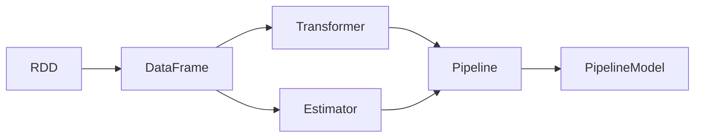

# SparkMLlib的进阶教程：解锁高级功能与技巧

## 1. 背景介绍

### 1.1 SparkMLlib概述
Apache Spark是一个快速、通用的大规模数据处理引擎，Spark MLlib是其中的机器学习库。MLlib提供了各种机器学习算法，包括分类、回归、聚类、协同过滤等，以及相关的评估指标和数据导入工具。MLlib使用线性代数运算和统计操作来优化这些算法的性能。

### 1.2 MLlib的优势
- 易用性：MLlib提供了高层API，可以轻松地构建机器学习管道。
- 可扩展性：MLlib可以在集群上运行，处理超大规模数据集。
- 速度：MLlib利用Spark的分布式计算能力，实现了高性能。
- 多语言支持：MLlib支持Java、Scala、Python和R语言。

### 1.3 MLlib的应用场景
MLlib广泛应用于各个领域，包括：
- 推荐系统：如电商网站的商品推荐
- 欺诈检测：如金融领域的信用卡欺诈检测
- 文本分类：如新闻分类、情感分析等
- 预测分析：如销量预测、趋势预测等

## 2. 核心概念与联系

### 2.1 DataFrame与RDD
MLlib支持DataFrame和RDD两种数据结构。DataFrame是一种以列的形式组织的分布式数据集合，它提供了Schema信息，更加结构化。RDD是Spark的基础数据结构，代表弹性分布式数据集。DataFrame可以通过toDF方法从RDD转换而来。

### 2.2 Transformer与Estimator
Transformer和Estimator是MLlib中的两个基本概念。
- Transformer：一种将DataFrame转换为新DataFrame的算法。如分词、哈希等特征转换操作。
- Estimator：一种可以在数据上进行拟合的算法，生成一个Transformer。如分类器、回归器等。

### 2.3 Pipeline与PipelineModel
Pipeline和PipelineModel用于构建机器学习工作流。
- Pipeline：将多个Transformer和Estimator串联成一个工作流。
- PipelineModel：拟合后的Pipeline，可用于预测。

### 2.4 概念关系图


## 3. 核心算法原理与步骤

### 3.1 分类算法
#### 3.1.1 逻辑回归
逻辑回归是一种常用的二分类算法，通过Sigmoid函数将线性回归的输出映射到0~1之间，表示样本属于某一类的概率。
步骤：
1. 创建逻辑回归模型：`LogisticRegression`
2. 设置参数：如正则化参数、最大迭代次数等
3. 训练模型：调用`fit`方法
4. 模型评估：用测试集预测，计算准确率等指标
5. 模型预测：对新数据进行预测

#### 3.1.2 决策树
决策树通过一系列if-then规则来进行分类，可以处理连续和离散特征，易于解释。
步骤：
1. 创建决策树模型：`DecisionTreeClassifier`
2. 设置参数：如最大深度、最小信息增益等
3. 训练模型：调用`fit`方法
4. 模型评估：用测试集预测，计算准确率等指标  
5. 模型预测：对新数据进行预测

#### 3.1.3 随机森林
随机森林是多个决策树的集成，每棵树用数据的一个随机子集训练，最后取多数票作为预测结果。
步骤：
1. 创建随机森林模型：`RandomForestClassifier`
2. 设置参数：如树的数量、特征子集采样策略等
3. 训练模型：调用`fit`方法
4. 模型评估：用测试集预测，计算准确率等指标
5. 模型预测：对新数据进行预测

### 3.2 回归算法
#### 3.2.1 线性回归
线性回归用一个线性模型来拟合输入特征和连续型输出标签之间的关系。
步骤：
1. 创建线性回归模型：`LinearRegression`
2. 设置参数：如正则化参数、求解器类型等
3. 训练模型：调用`fit`方法
4. 模型评估：用测试集预测，计算均方误差等指标
5. 模型预测：对新数据进行预测

#### 3.2.2 决策树回归
决策树回归与分类类似，只是叶子节点存储的是连续值而不是类别。
步骤：
1. 创建决策树回归模型：`DecisionTreeRegressor`
2. 设置参数：如最大深度、最小信息增益等
3. 训练模型：调用`fit`方法 
4. 模型评估：用测试集预测，计算均方误差等指标
5. 模型预测：对新数据进行预测

### 3.3 聚类算法
#### 3.3.1 K-Means
K-Means通过迭代将数据点分配到K个簇，每个簇由其质心表示。
步骤：
1. 创建K-Means模型：`KMeans`
2. 设置参数：如簇数K、最大迭代次数等
3. 训练模型：调用`fit`方法
4. 模型评估：计算轮廓系数等指标
5. 模型预测：对新数据进行预测

#### 3.3.2 高斯混合模型
高斯混合模型用多个高斯分布的线性组合来建模数据分布。
步骤：
1. 创建高斯混合模型：`GaussianMixture`
2. 设置参数：如高斯分布数、最大迭代次数等
3. 训练模型：调用`fit`方法
4. 模型评估：计算对数似然等指标  
5. 模型预测：对新数据进行预测

### 3.4 推荐算法
#### 3.4.1 交替最小二乘(ALS)
ALS通过交替固定用户因子和物品因子，优化另一个因子的二乘误差，从而学习隐式因子模型。
步骤：
1. 创建ALS模型：`ALS`
2. 设置参数：如隐因子数、正则化参数等
3. 训练模型：调用`fit`方法
4. 模型评估：计算均方根误差等指标
5. 模型预测：对新用户或物品进行评分预测

## 4. 数学模型和公式详解

### 4.1 逻辑回归
逻辑回归的数学模型为：
$$
P(y=1|x) = \frac{1}{1+e^{-(\beta_0+\beta_1x_1+...+\beta_nx_n)}}
$$
其中，$\beta_0,\beta_1,...,\beta_n$为模型参数，$x_1,x_2,...,x_n$为输入特征。

损失函数为交叉熵：
$$
J(\beta) = -\frac{1}{m}\sum_{i=1}^m[y^{(i)}\log(h_\beta(x^{(i)}))+(1-y^{(i)})\log(1-h_\beta(x^{(i)}))]
$$
其中，$m$为样本数，$y^{(i)}$为第$i$个样本的真实标签，$h_\beta(x^{(i)})$为模型预测的概率值。

### 4.2 线性回归
线性回归的数学模型为：
$$
y = \beta_0 + \beta_1x_1 + \beta_2x_2 + ... + \beta_nx_n
$$
其中，$\beta_0,\beta_1,...,\beta_n$为模型参数，$x_1,x_2,...,x_n$为输入特征。

损失函数为均方误差：
$$
J(\beta) = \frac{1}{2m}\sum_{i=1}^m(h_\beta(x^{(i)})-y^{(i)})^2
$$
其中，$m$为样本数，$y^{(i)}$为第$i$个样本的真实值，$h_\beta(x^{(i)})$为模型预测值。

### 4.3 K-Means
K-Means的目标是最小化样本点到其所属簇质心的平方和：
$$
J(c,\mu) = \sum_{i=1}^m\sum_{j=1}^k w_{ij}||x^{(i)}-\mu_j||^2
$$
其中，$m$为样本数，$k$为簇数，$w_{ij}$表示样本$i$属于簇$j$的指示变量，$\mu_j$为簇$j$的质心。

算法交替执行以下两步直至收敛：
1. 簇分配：固定质心，将每个样本点分配到最近的质心所在簇。
2. 质心更新：固定簇分配，更新每个簇的质心为簇内样本的均值。

### 4.4 交替最小二乘(ALS)
ALS的目标是最小化评分矩阵$R$与用户矩阵$U$和物品矩阵$V$乘积的平方误差：
$$
J(U,V) = \sum_{(i,j):r_{ij}\neq0}(r_{ij}-u_i^Tv_j)^2 + \lambda(\sum_i||u_i||^2+\sum_j||v_j||^2)
$$
其中，$r_{ij}$为用户$i$对物品$j$的评分，$u_i$为用户$i$的隐因子向量，$v_j$为物品$j$的隐因子向量，$\lambda$为正则化参数。

算法交替固定$U$和$V$，优化另一个矩阵直至收敛。当固定$U$时，$V$有解析解：
$$
v_j = (U^TU+\lambda I)^{-1}U^TR_j
$$
其中，$R_j$为评分矩阵的第$j$列。$U$的更新与之类似。

## 5. 项目实践：代码实例和详解

### 5.1 数据准备
首先，我们从CSV文件中加载数据，创建DataFrame：
```python
data = spark.read.format("csv").option("header", "true").load("data.csv")
```

然后，将数据划分为训练集和测试集：
```python
train_data, test_data = data.randomSplit([0.8, 0.2], seed=42)
```

### 5.2 特征工程
使用`VectorAssembler`将多个列组合成特征向量：
```python
from pyspark.ml.feature import VectorAssembler

assembler = VectorAssembler(inputCols=["col1", "col2"], outputCol="features")
train_data = assembler.transform(train_data)
test_data = assembler.transform(test_data)
```

### 5.3 模型训练与评估
以逻辑回归为例，创建模型并设置参数：
```python
from pyspark.ml.classification import LogisticRegression

lr = LogisticRegression(maxIter=10, regParam=0.01)
```

训练模型：
```python
model = lr.fit(train_data)
```

在测试集上评估模型：
```python
from pyspark.ml.evaluation import BinaryClassificationEvaluator

predictions = model.transform(test_data)
evaluator = BinaryClassificationEvaluator(rawPredictionCol="rawPrediction")
auc = evaluator.evaluate(predictions)
print("AUC: ", auc)
```

### 5.4 参数调优
使用`ParamGridBuilder`和`CrossValidator`进行参数网格搜索和交叉验证：
```python
from pyspark.ml.tuning import ParamGridBuilder, CrossValidator

paramGrid = ParamGridBuilder() \
    .addGrid(lr.regParam, [0.1, 0.01]) \
    .addGrid(lr.maxIter, [10, 20]) \
    .build()

cv = CrossValidator(estimator=lr, estimatorParamMaps=paramGrid, evaluator=evaluator, numFolds=3)
cvModel = cv.fit(train_data)
print("Best AUC: ", evaluator.evaluate(cvModel.transform(test_data)))
```

### 5.5 模型持久化与加载
将训练好的模型保存到磁盘：
```python
model.save("model")
```

从磁盘加载模型：
```python
from pyspark.ml.classification import LogisticRegressionModel

loadedModel = LogisticRegressionModel.load("model")
```

## 6. 实际应用场景

### 6.1 推荐系统
利用MLlib的ALS算法，可以构建商品推荐系统。通过用户的历史行为数据，学习用户和商品的隐因子，预测用户对未评分商品的兴趣度，从而给用户推荐感兴趣的商品。

### 6.2 欺诈检测
利用MLlib的分类算法如决策树和随机森林，可以构建金融欺诈检测模型。通过大量历史交易数据进行训练，学习正常交易和欺诈交易的模式，对新交易进行实时预测，识别出潜在的欺诈行为。

### 6.3 文本分类
利用MLlib的特征提取和分类算法，可以实现文本分