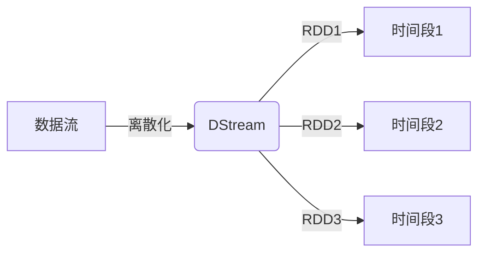
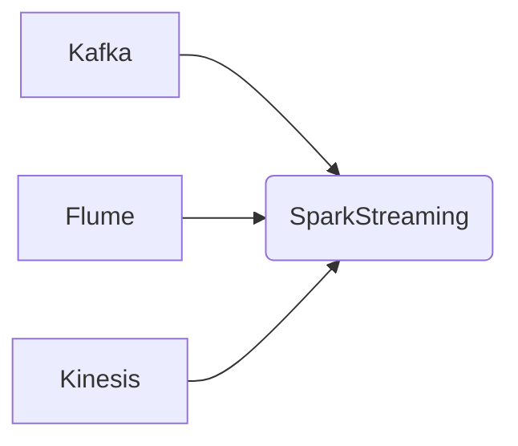
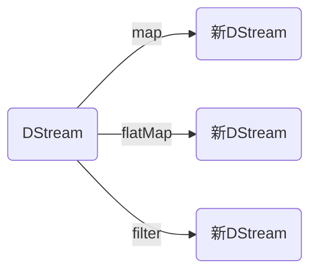
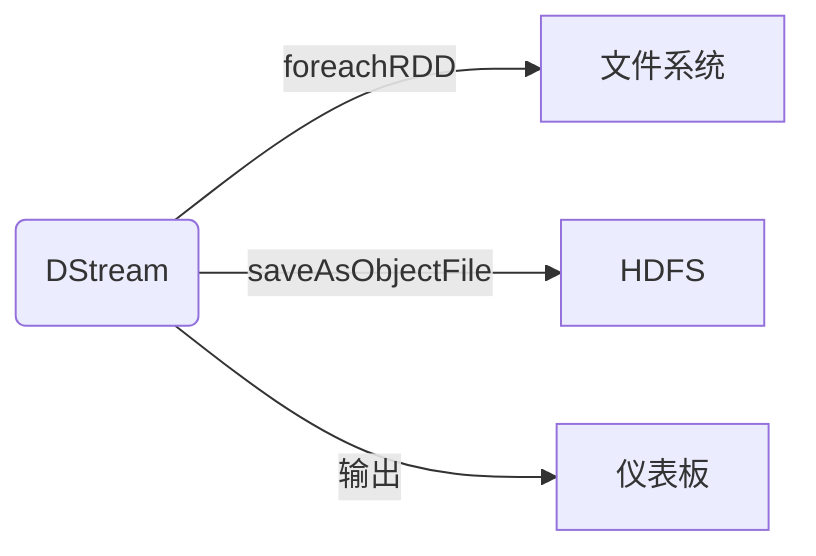
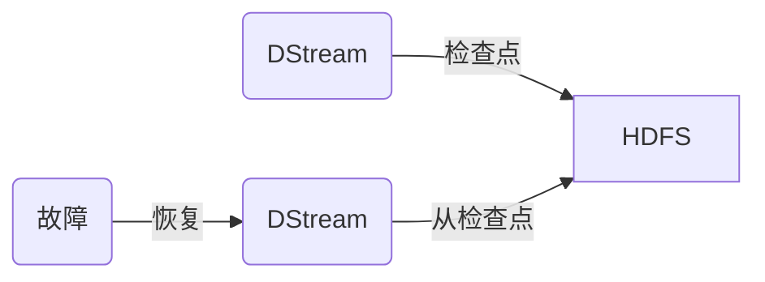
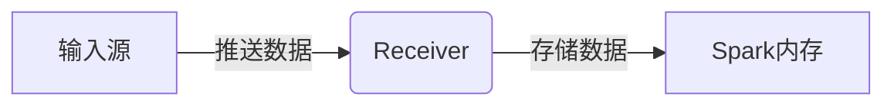
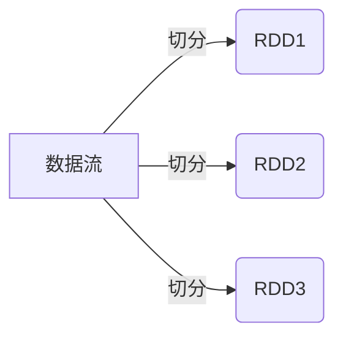
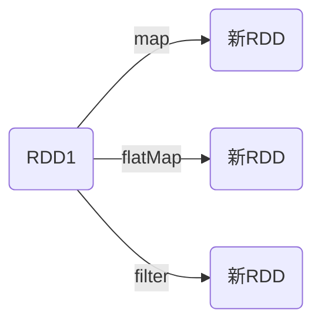
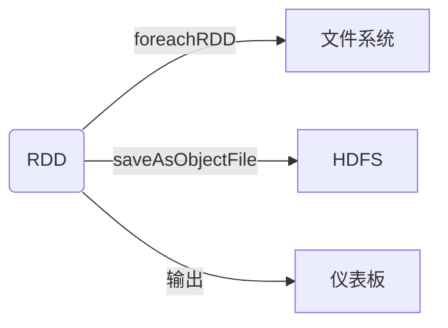

# SparkStreaming在实时资产交易与市场分析中的应用

## 1. 背景介绍

在当今快节奏的金融市场中,资产交易和市场分析需要实时处理大量数据流,以便及时做出明智决策。传统的批处理系统已经无法满足这种实时需求,因此需要一种新的处理范式来应对这一挑战。Apache Spark的流式处理引擎SparkStreaming应运而生,它提供了一种高度可扩展、容错且统一的流式处理框架,可以实时处理来自各种来源的数据流。

### 1.1 实时数据处理的重要性

在金融市场中,实时数据处理对于做出正确决策至关重要。股票、期货、外汇等资产的价格每时每刻都在波动,投资者需要实时掌握市场动态,以便抓住投资机会或规避风险。此外,实时处理还可以用于检测欺诈行为、监控交易活动、优化交易策略等应用场景。

### 1.2 传统批处理系统的局限性

传统的批处理系统通常采用定期运行的作业来处理累积的数据,无法满足实时处理的需求。此外,批处理系统通常需要复杂的数据管道和多个组件协同工作,增加了系统的复杂性和维护成本。

### 1.3 SparkStreaming的优势

SparkStreaming作为Spark生态系统的一部分,可以与Spark的其他组件无缝集成,如Spark SQL、Spark MLlib等。它提供了一种统一的流式处理框架,能够实时处理来自各种来源的数据流,如Kafka、Flume、Kinesis等。SparkStreaming采用微批处理的方式,将流数据切分为小批次进行处理,从而实现了低延迟和高吞吐量。此外,SparkStreaming还具有容错能力,可以在发生故障时自动重新计算丢失的数据。

## 2. 核心概念与联系

在深入探讨SparkStreaming的应用之前,我们需要了解一些核心概念及它们之间的关系。

### 2.1 DStream(Discretized Stream)

DStream是SparkStreaming中最基本的抽象,它代表一个连续的数据流。DStream由一系列的RDD(Resilient Distributed Dataset)组成,每个RDD包含一个特定时间间隔内的数据。DStream支持各种转换操作,如map、flatMap、filter等,这些操作会作用于底层的RDD。



### 2.2 输入源(Input Sources)

SparkStreaming支持多种输入源,如Kafka、Flume、Kinesis等。这些输入源负责从外部系统接收数据流,并将其推送到SparkStreaming进行处理。



### 2.3 转换操作(Transformations)

SparkStreaming提供了丰富的转换操作,如map、flatMap、filter、reduceByKey等,用于对DStream进行转换和处理。这些操作与Spark RDD API中的操作类似,但需要考虑流式处理的特殊性。



### 2.4 输出操作(Output Operations)

处理完数据流后,SparkStreaming支持将结果输出到各种外部系统,如文件系统、数据库、仪表板等。常见的输出操作包括foreachRDD、saveAsObjectFile等。



### 2.5 容错机制(Fault Tolerance)

SparkStreaming通过检查点(Checkpoint)机制实现容错能力。检查点可以将DStream的元数据信息保存到可靠的存储系统中,如HDFS。在发生故障时,SparkStreaming可以从最近的检查点重新计算丢失的数据。



## 3. 核心算法原理具体操作步骤

SparkStreaming采用微批处理的方式来处理数据流。它将流式数据切分为小批次,每个批次由一个RDD表示。然后,SparkStreaming对这些RDD执行转换操作和输出操作。这种方式可以实现低延迟和高吞吐量,同时还能利用Spark的容错机制和优化技术。

### 3.1 数据接收

SparkStreaming通过Receiver从各种输入源接收数据流。Receiver是一个长期运行的任务,它负责从输入源拉取数据,并将数据存储在Spark的内存中。



### 3.2 数据切分

Receiver将接收到的数据流切分为小批次,每个批次由一个RDD表示。批次的时间间隔可以由用户配置,通常设置为几秒钟。



### 3.3 转换操作

对于每个批次的RDD,SparkStreaming会应用用户定义的转换操作,如map、flatMap、filter等。这些操作与Spark RDD API中的操作类似,但需要考虑流式处理的特殊性。



### 3.4 输出操作

对转换后的RDD执行输出操作,将结果输出到各种外部系统,如文件系统、数据库、仪表板等。常见的输出操作包括foreachRDD、saveAsObjectFile等。



### 3.5 容错机制

SparkStreaming通过检查点机制实现容错能力。它会定期将DStream的元数据信息保存到可靠的存储系统中,如HDFS。在发生故障时,SparkStreaming可以从最近的检查点重新计算丢失的数据。


## 4. 数学模型和公式详细讲解举例说明

在金融市场分析中,常常需要使用各种数学模型和公式来描述和预测资产价格的变化。SparkStreaming可以与Spark MLlib和其他数据分析库集成,实现实时的数学建模和分析。

### 4.1 时间序列分析

时间序列分析是金融市场分析的一个重要组成部分。它研究资产价格随时间的变化模式,以预测未来的价格走势。常用的时间序列模型包括自回归移动平均模型(ARIMA)、指数平滑模型等。

ARIMA模型的一般形式如下:

$$
y_t = c + \phi_1 y_{t-1} + \phi_2 y_{t-2} + ... + \phi_p y_{t-p} + \theta_1 \epsilon_{t-1} + \theta_2 \epsilon_{t-2} + ... + \theta_q \epsilon_{t-q} + \epsilon_t
$$

其中:
- $y_t$ 是时间 $t$ 时的观测值
- $c$ 是常数项
- $\phi_1, \phi_2, ..., \phi_p$ 是自回归参数
- $\theta_1, \theta_2, ..., \theta_q$ 是移动平均参数
- $\epsilon_t$ 是时间 $t$ 时的残差项

使用SparkStreaming和Spark MLlib,我们可以实时拟合ARIMA模型,并基于模型预测未来的资产价格。

### 4.2 风险管理

在资产交易中,风险管理是一个关键环节。我们需要量化和控制各种风险,如市场风险、信用风险、流动性风险等。常用的风险度量指标包括值at风险(VaR)、期望缺口(Expected Shortfall)等。

VaR的计算公式如下:

$$
\text{VaR}_\alpha(X) = \inf \{ x \in \mathbb{R} : P(X \leq x) \geq \alpha \}
$$

其中:
- $\alpha$ 是置信水平,通常取值为 0.95 或 0.99
- $X$ 是投资组合的损失
- $\text{VaR}_\alpha(X)$ 表示在置信水平 $\alpha$ 下,投资组合的最大可能损失

使用SparkStreaming和Spark MLlib,我们可以实时计算投资组合的VaR,并根据VaR的变化调整交易策略,控制风险敞口。

### 4.3 算法交易

算法交易是利用计算机程序自动执行交易策略的一种交易方式。常见的算法交易策略包括均值回复策略、对冲套利策略、高频交易策略等。这些策略通常需要实时处理大量市场数据,并快速做出交易决策。

均值回复策略的基本思路是:当资产价格偏离其长期均值时,就买入(或卖出)该资产,等待价格回归均值时再卖出(或买入)。我们可以使用以下公式计算资产价格与均值的偏离程度:

$$
z_t = \frac{P_t - \mu_t}{\sigma_t}
$$

其中:
- $z_t$ 是资产价格与均值的标准化偏离程度
- $P_t$ 是资产在时间 $t$ 时的价格
- $\mu_t$ 是资产在时间 $t$ 时的均值
- $\sigma_t$ 是资产在时间 $t$ 时的标准差

当 $|z_t|$ 超过一定阈值时,我们就执行买入或卖出操作。

使用SparkStreaming,我们可以实时计算资产价格的均值和标准差,并根据均值回复策略执行交易。同时,我们还可以结合机器学习算法,优化策略参数,提高交易收益。

## 5. 项目实践: 代码实例和详细解释说明

为了更好地理解SparkStreaming在实时资产交易与市场分析中的应用,我们将通过一个实际项目来演示。该项目将从Kafka接收实时股票行情数据,并执行以下任务:

1. 计算每只股票的实时价格统计信息,包括最新价格、最高价、最低价等。
2. 检测股票价格的异常波动,并发送警报。
3. 使用均值回复策略执行模拟交易。

### 5.1 项目设置

首先,我们需要安装和配置Spark、Kafka和相关依赖库。以下是一些关键步骤:

1. 下载并解压Spark发行版。
2. 下载并启动Kafka服务器。
3. 在项目中添加Spark Streaming和Kafka依赖。

```scala
// build.sbt
libraryDependencies ++= Seq(
  "org.apache.spark" %% "spark-core" % "3.3.2",
  "org.apache.spark" %% "spark-streaming" % "3.3.2",
  "org.apache.spark" %% "spark-streaming-kafka-0-10" % "3.3.2"
)
```

### 5.2 接收实时股票数据

我们使用Kafka作为实时股票数据的输入源。首先,我们需要创建一个Kafka消费者,并将其连接到Kafka集群。

```scala
import org.apache.kafka.common.serialization.StringDeserializer
import org.apache.spark.streaming.kafka010._
import org.apache.spark.streaming.kafka010.LocationStrategies.PreferConsistent
import org.apache.spark.streaming.kafka010.ConsumerStrategies.Subscribe

val kafkaParams = Map(
  "bootstrap.servers" -> "localhost:9092",
  "key.deserializer" -> classOf[StringDeserializer],
  "value.deserializer" -> classOf[StringDeserializer],
  "group.id" -> "stock-consumer",
  "auto.offset.reset" -> "latest",
  "enable.auto.commit" -> (false: java.lang.Boolean)
)

val topics = Array("stock-data")
val stream = KafkaUtils.createDirectStream(
  streamingContext,
  PreferConsistent,
  Subscribe[String, String](topics, kafkaParams)
)
```

接下来,我们需