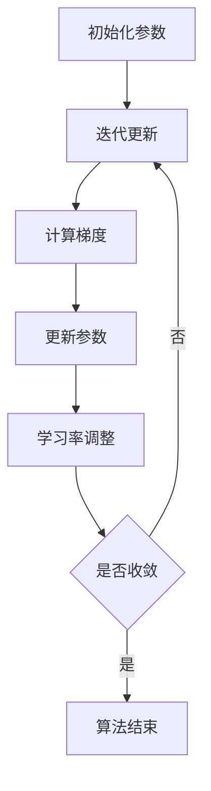

# Stochastic Gradient Descent (SGD)原理与代码实例讲解

## 1.背景介绍

在机器学习和深度学习领域，优化算法是模型训练的核心。随机梯度下降（Stochastic Gradient Descent, SGD）作为一种经典的优化算法，广泛应用于各种机器学习模型的训练中。SGD的高效性和简单性使其成为许多复杂模型的首选优化方法。本文将深入探讨SGD的原理、数学模型、实际应用以及代码实现，帮助读者全面理解和掌握这一重要技术。

## 2.核心概念与联系

### 2.1 梯度下降法

梯度下降法是一种用于寻找函数最小值的优化算法。其基本思想是通过迭代更新参数，使得目标函数逐步逼近最小值。梯度下降法的更新公式为：

$$
\theta_{t+1} = \theta_t - \eta \nabla J(\theta_t)
$$

其中，$\theta_t$ 表示第 $t$ 次迭代的参数，$\eta$ 是学习率，$\nabla J(\theta_t)$ 是目标函数 $J(\theta)$ 在 $\theta_t$ 处的梯度。

### 2.2 随机梯度下降法

随机梯度下降法（SGD）是梯度下降法的一种变体。与传统梯度下降法不同，SGD在每次迭代中仅使用一个样本来计算梯度，从而大大减少了计算量。SGD的更新公式为：

$$
\theta_{t+1} = \theta_t - \eta \nabla J(\theta_t; x_i, y_i)
$$

其中，$(x_i, y_i)$ 是训练数据中的一个样本。

### 2.3 小批量梯度下降法

小批量梯度下降法（Mini-batch Gradient Descent）介于梯度下降法和SGD之间。它在每次迭代中使用一个小批量的样本来计算梯度，从而在计算效率和收敛稳定性之间取得平衡。其更新公式为：

$$
\theta_{t+1} = \theta_t - \eta \frac{1}{m} \sum_{i=1}^{m} \nabla J(\theta_t; x_i, y_i)
$$

其中，$m$ 是小批量的样本数量。

## 3.核心算法原理具体操作步骤

### 3.1 初始化参数

首先，随机初始化模型参数 $\theta$。初始化的参数可以是零向量，也可以是随机数。

### 3.2 迭代更新

在每次迭代中，随机选择一个样本 $(x_i, y_i)$，计算目标函数 $J(\theta)$ 在该样本处的梯度 $\nabla J(\theta; x_i, y_i)$，并根据更新公式更新参数 $\theta$。

### 3.3 学习率调整

学习率 $\eta$ 是影响SGD收敛速度和稳定性的关键参数。通常，学习率会随着迭代次数逐渐减小，以保证算法在接近最优解时能够稳定收敛。

### 3.4 收敛判断

当目标函数的值或参数的变化量小于预设的阈值时，算法停止迭代，认为已收敛。

以下是SGD算法的流程图：



## 4.数学模型和公式详细讲解举例说明

### 4.1 线性回归中的SGD

以线性回归为例，假设我们有一个训练数据集 $\{(x_i, y_i)\}_{i=1}^n$，其中 $x_i$ 是输入特征，$y_i$ 是输出标签。线性回归模型的目标是找到参数 $\theta$，使得预测值 $\hat{y} = \theta^T x$ 与真实值 $y$ 之间的均方误差最小。目标函数为：

$$
J(\theta) = \frac{1}{2n} \sum_{i=1}^n (\theta^T x_i - y_i)^2
$$

SGD的更新公式为：

$$
\theta_{t+1} = \theta_t - \eta (\theta_t^T x_i - y_i) x_i
$$

### 4.2 逻辑回归中的SGD

对于逻辑回归，目标函数是交叉熵损失函数：

$$
J(\theta) = -\frac{1}{n} \sum_{i=1}^n [y_i \log(h_\theta(x_i)) + (1 - y_i) \log(1 - h_\theta(x_i))]
$$

其中，$h_\theta(x) = \frac{1}{1 + e^{-\theta^T x}}$ 是逻辑回归模型的预测函数。SGD的更新公式为：

$$
\theta_{t+1} = \theta_t - \eta (h_\theta(x_i) - y_i) x_i
$$

## 5.项目实践：代码实例和详细解释说明

### 5.1 线性回归的SGD实现

以下是使用Python实现线性回归的SGD算法的代码示例：

```python
import numpy as np

# 生成模拟数据
np.random.seed(42)
X = 2 * np.random.rand(100, 1)
y = 4 + 3 * X + np.random.randn(100, 1)

# 添加偏置项
X_b = np.c_[np.ones((100, 1)), X]

# 超参数设置
learning_rate = 0.1
n_iterations = 1000
m = 100

# 初始化参数
theta = np.random.randn(2, 1)

# SGD算法
for iteration in range(n_iterations):
    for i in range(m):
        random_index = np.random.randint(m)
        xi = X_b[random_index:random_index+1]
        yi = y[random_index:random_index+1]
        gradients = 2 * xi.T.dot(xi.dot(theta) - yi)
        theta = theta - learning_rate * gradients

print("SGD得到的参数：", theta)
```

### 5.2 逻辑回归的SGD实现

以下是使用Python实现逻辑回归的SGD算法的代码示例：

```python
import numpy as np

# 生成模拟数据
np.random.seed(42)
X = 2 * np.random.rand(100, 1)
y = (4 + 3 * X + np.random.randn(100, 1) > 6).astype(np.int)

# 添加偏置项
X_b = np.c_[np.ones((100, 1)), X]

# 超参数设置
learning_rate = 0.1
n_iterations = 1000
m = 100

# 初始化参数
theta = np.random.randn(2, 1)

# Sigmoid函数
def sigmoid(z):
    return 1 / (1 + np.exp(-z))

# SGD算法
for iteration in range(n_iterations):
    for i in range(m):
        random_index = np.random.randint(m)
        xi = X_b[random_index:random_index+1]
        yi = y[random_index:random_index+1]
        gradients = xi.T.dot(sigmoid(xi.dot(theta)) - yi)
        theta = theta - learning_rate * gradients

print("SGD得到的参数：", theta)
```

## 6.实际应用场景

### 6.1 深度学习中的应用

在深度学习中，SGD及其变种（如动量SGD、Adam等）是训练神经网络的主要优化算法。由于神经网络通常包含大量参数，使用SGD可以有效减少计算量，加速训练过程。

### 6.2 自然语言处理

在自然语言处理任务中，如词向量训练、文本分类等，SGD同样被广泛应用。特别是在大规模数据集上，SGD的高效性尤为重要。

### 6.3 强化学习

在强化学习中，SGD用于更新策略网络和价值网络的参数。通过不断迭代，SGD可以帮助智能体找到最优策略。

## 7.工具和资源推荐

### 7.1 开源库

- **TensorFlow**：谷歌开发的开源深度学习框架，支持多种优化算法，包括SGD。
- **PyTorch**：Facebook开发的开源深度学习框架，具有灵活的动态计算图和强大的优化算法库。
- **scikit-learn**：Python机器学习库，提供了多种机器学习算法和工具，包括SGD。

### 7.2 在线课程

- **Coursera**：提供多门机器学习和深度学习课程，涵盖SGD及其变种的详细讲解。
- **edX**：提供多门计算机科学和人工智能课程，适合不同层次的学习者。

### 7.3 书籍推荐

- **《深度学习》**：Ian Goodfellow等人编写的经典教材，详细介绍了SGD及其在深度学习中的应用。
- **《机器学习实战》**：Peter Harrington编写的实用指南，包含多种机器学习算法的实现和应用。

## 8.总结：未来发展趋势与挑战

SGD作为一种经典的优化算法，已经在机器学习和深度学习领域取得了广泛应用。然而，随着数据规模和模型复杂度的不断增加，SGD也面临着新的挑战。未来，如何进一步提高SGD的收敛速度和稳定性，如何在大规模分布式系统中高效实现SGD，将是研究的重点方向。

## 9.附录：常见问题与解答

### 9.1 为什么SGD比传统梯度下降法更高效？

SGD在每次迭代中仅使用一个样本计算梯度，大大减少了计算量，特别适用于大规模数据集。

### 9.2 如何选择合适的学习率？

学习率的选择需要根据具体问题进行调试。通常，可以从较大的学习率开始，逐步减小，观察目标函数的变化情况。

### 9.3 SGD是否总能收敛到全局最优解？

SGD由于其随机性，可能会陷入局部最优解。为了提高收敛到全局最优解的概率，可以结合其他优化算法，如动量SGD、Adam等。

### 9.4 如何处理SGD中的噪声问题？

SGD中的噪声问题可以通过增加小批量样本的数量、使用动量方法等手段来缓解。

### 9.5 SGD在深度学习中的应用有哪些注意事项？

在深度学习中，SGD的超参数（如学习率、批量大小等）对训练效果影响较大，需要根据具体任务进行调试。此外，正则化方法（如L2正则化、Dropout等）也可以帮助提高模型的泛化能力。

---

作者：禅与计算机程序设计艺术 / Zen and the Art of Computer Programming