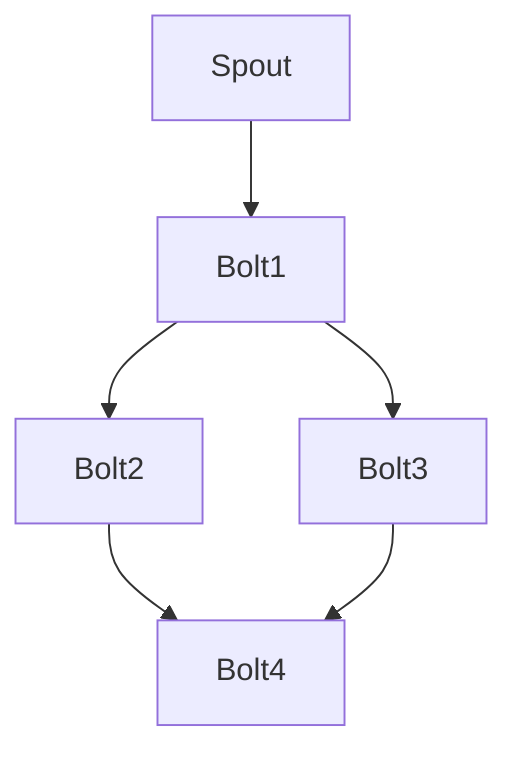

# 《StormBolt源码解析》

## 1.背景介绍

在大数据处理和实时计算领域，Apache Storm 是一个非常重要的开源框架。它能够处理大量的数据流，并且具有高吞吐量和低延迟的特点。Storm 的核心组件之一是 Bolt，它负责处理和转换数据流。本文将深入解析 StormBolt 的源码，帮助读者理解其内部工作原理和实现细节。

## 2.核心概念与联系

### 2.1 什么是 Bolt

在 Storm 中，Bolt 是一个处理节点，它接收一个或多个数据流（Stream），对其进行处理，然后可能会发出新的数据流。Bolt 可以执行各种操作，如过滤、聚合、连接等。

### 2.2 Bolt 的生命周期

Bolt 的生命周期包括以下几个阶段：

1. **初始化**：Bolt 被实例化并进行初始化。
2. **准备**：Bolt 的 `prepare` 方法被调用，进行资源分配和初始化。
3. **执行**：Bolt 的 `execute` 方法被调用，处理输入的数据流。
4. **清理**：Bolt 的 `cleanup` 方法被调用，进行资源释放。

### 2.3 Bolt 与 Spout 的关系

在 Storm 中，Spout 是数据源，它负责生成数据流并发送给 Bolt。Bolt 接收 Spout 发送的数据流进行处理。一个拓扑（Topology）通常由多个 Spout 和 Bolt 组成，它们通过数据流相互连接。

## 3.核心算法原理具体操作步骤

### 3.1 数据流处理

Bolt 的核心任务是处理数据流。数据流处理的基本步骤如下：

1. **接收数据**：Bolt 从输入队列中接收数据。
2. **处理数据**：Bolt 对接收到的数据进行处理。
3. **发送数据**：Bolt 将处理后的数据发送到下一个 Bolt 或者输出。

### 3.2 并行处理

Storm 支持并行处理，Bolt 可以在多个线程或进程中并行执行。并行度可以通过配置文件进行设置。

### 3.3 容错机制

Storm 提供了强大的容错机制，Bolt 的处理结果可以被确认（ack）或失败（fail）。如果处理失败，Storm 会重新发送数据，确保数据不丢失。

## 4.数学模型和公式详细讲解举例说明

### 4.1 数据流模型

Storm 中的数据流可以用有向无环图（DAG）来表示。每个节点代表一个 Spout 或 Bolt，边代表数据流。



### 4.2 并行度计算

假设一个 Bolt 的并行度为 $p$，每个实例处理的数据量为 $D$，总的数据量为 $T$，则每个实例的处理时间为：

$$
t = \frac{T}{pD}
$$

### 4.3 容错机制公式

假设数据处理的成功率为 $s$，失败率为 $f$，则重新发送数据的次数期望值为：

$$
E = \frac{1}{s}
$$

## 5.项目实践：代码实例和详细解释说明

### 5.1 Bolt 的实现

以下是一个简单的 Bolt 实现示例：

```java
public class MyBolt extends BaseRichBolt {
    private OutputCollector collector;

    @Override
    public void prepare(Map<String, Object> topoConf, TopologyContext context, OutputCollector collector) {
        this.collector = collector;
    }

    @Override
    public void execute(Tuple input) {
        String value = input.getStringByField("field");
        // 处理数据
        String result = processData(value);
        // 发出数据
        collector.emit(new Values(result));
        // 确认处理成功
        collector.ack(input);
    }

    @Override
    public void cleanup() {
        // 释放资源
    }

    private String processData(String value) {
        // 数据处理逻辑
        return value.toUpperCase();
    }
}
```

### 5.2 详细解释

1. **prepare 方法**：进行初始化，分配资源。
2. **execute 方法**：接收数据，处理数据，发出数据，并确认处理成功。
3. **cleanup 方法**：释放资源。

## 6.实际应用场景

### 6.1 实时数据分析

StormBolt 可以用于实时数据分析，如日志分析、点击流分析等。通过 Bolt 对数据进行过滤、聚合和转换，可以实时获取有价值的信息。

### 6.2 实时监控

在实时监控系统中，Bolt 可以用于处理监控数据，检测异常情况，并触发报警。

### 6.3 实时推荐系统

在推荐系统中，Bolt 可以用于实时计算用户的行为数据，生成个性化的推荐结果。

## 7.工具和资源推荐

### 7.1 开发工具

- **IntelliJ IDEA**：强大的 Java 开发工具，支持 Storm 开发。
- **Maven**：项目管理工具，方便依赖管理和构建。

### 7.2 资源推荐

- **Apache Storm 官方文档**：详细的 Storm 使用和开发指南。
- **GitHub**：丰富的开源项目和示例代码。

## 8.总结：未来发展趋势与挑战

### 8.1 未来发展趋势

随着大数据和实时计算需求的不断增长，Storm 作为一个成熟的实时计算框架，将继续发展和优化。未来，Storm 可能会在以下几个方面有所突破：

1. **性能优化**：进一步提高处理性能，降低延迟。
2. **易用性提升**：简化开发和部署流程，降低使用门槛。
3. **功能扩展**：增加更多的功能和特性，满足不同场景的需求。

### 8.2 挑战

尽管 Storm 具有很多优点，但在实际应用中仍然面临一些挑战：

1. **复杂性**：Storm 的配置和调优较为复杂，需要深入理解其内部机制。
2. **资源消耗**：Storm 的高并发处理需要大量的计算资源和内存。
3. **容错机制**：尽管 Storm 提供了容错机制，但在大规模应用中，仍然需要仔细设计和优化。

## 9.附录：常见问题与解答

### 9.1 如何设置 Bolt 的并行度？

可以在拓扑配置文件中设置 Bolt 的并行度，例如：

```java
TopologyBuilder builder = new TopologyBuilder();
builder.setBolt("myBolt", new MyBolt(), 4); // 设置并行度为4
```

### 9.2 如何处理 Bolt 的失败情况？

可以在 `execute` 方法中捕获异常，并调用 `collector.fail(input)` 方法，通知 Storm 处理失败。例如：

```java
@Override
public void execute(Tuple input) {
    try {
        String value = input.getStringByField("field");
        String result = processData(value);
        collector.emit(new Values(result));
        collector.ack(input);
    } catch (Exception e) {
        collector.fail(input);
    }
}
```

### 9.3 如何调试 Bolt 的代码？

可以使用日志记录和调试工具进行调试。例如，使用 `Log4j` 记录日志：

```java
private static final Logger LOG = Logger.getLogger(MyBolt.class);

@Override
public void execute(Tuple input) {
    try {
        String value = input.getStringByField("field");
        LOG.info("Received value: " + value);
        String result = processData(value);
        collector.emit(new Values(result));
        collector.ack(input);
    } catch (Exception e) {
        LOG.error("Error processing tuple", e);
        collector.fail(input);
    }
}
```

---

作者：禅与计算机程序设计艺术 / Zen and the Art of Computer Programming