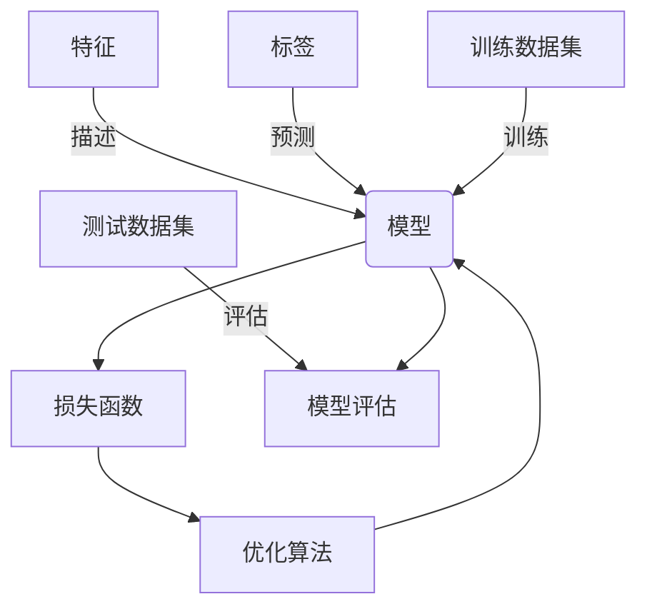

# Supervised Learning原理与代码实例讲解

## 1.背景介绍

监督学习(Supervised Learning)是机器学习中最基本和最广泛使用的一种范式。它的核心思想是利用已有的标记数据(labeled data)训练模型,使之能够对新的未知数据做出准确的预测或分类。监督学习在现实世界中有着广泛的应用,如图像识别、自然语言处理、推荐系统等。

在监督学习中,我们拥有一个包含输入特征(features)和相应标签(labels)的训练数据集。模型的目标是从训练数据中学习出输入和输出之间的映射关系,从而能够对新的未标记数据做出正确的预测。根据标签的性质,监督学习可分为两大类:

1. **回归(Regression)**: 当标签为连续值时,如预测房价、销售额等,这属于回归问题。
2. **分类(Classification)**: 当标签为离散值时,如判断图像中物体的类别、确定垃圾邮件等,这属于分类问题。

监督学习算法的性能很大程度上取决于训练数据的质量和数量。高质量的标记数据对于训练出准确的模型至关重要。同时,大量的训练数据也有助于提高模型的泛化能力,避免过拟合。

## 2.核心概念与联系

监督学习中有几个核心概念,理解它们及其相互关系对于掌握整个范式非常重要。

### 2.1 特征(Features)

特征是用于描述输入数据的属性,是模型学习的基础。在图像识别任务中,像素值就是特征;在文本分类中,单词频率就是特征。选择合适的特征对模型的性能有很大影响。

### 2.2 标签(Labels)

标签是我们希望模型预测或分类的目标值。在房价预测中,标签就是房屋的实际价格;在垃圾邮件检测中,标签是"垃圾"或"非垃圾"。

### 2.3 训练数据集(Training Dataset)

训练数据集是包含特征和对应标签的数据集合,它是模型学习的基础。高质量的训练数据对于训练出准确的模型至关重要。

### 2.4 测试数据集(Test Dataset)

测试数据集是一个独立的数据集,用于评估模型在未见过的数据上的性能。它可以检测模型是否过拟合(overfitting)训练数据。

### 2.3 损失函数(Loss Function)

损失函数用于衡量模型的预测值与真实值之间的差异。通过最小化损失函数,我们可以训练出更准确的模型。不同的任务会使用不同的损失函数,如均方误差(MSE)用于回归,交叉熵(Cross Entropy)用于分类等。

### 2.4 优化算法(Optimization Algorithm)

优化算法用于调整模型的参数,使损失函数最小化。常用的优化算法有梯度下降(Gradient Descent)、Adam等。

### 2.5 模型评估(Model Evaluation)

模型评估指标用于衡量模型在测试数据集上的性能,如准确率(Accuracy)、精确率(Precision)、召回率(Recall)、F1分数等。选择合适的评估指标对于不同任务非常重要。

### 2.6 过拟合与欠拟合(Overfitting & Underfitting)

过拟合指模型过于复杂,将训练数据中的噪声也学习到了,导致在新数据上的性能下降。欠拟合则指模型过于简单,无法有效拟合数据。我们需要在两者之间寻找平衡。

上述概念相互关联,共同构建了监督学习的理论框架。理解它们有助于我们更好地设计、训练和评估机器学习模型。



## 3.核心算法原理具体操作步骤

虽然监督学习算法有多种变体,但它们的工作原理大致遵循以下步骤:

1. **数据预处理**: 对原始数据进行清洗、标准化、特征工程等预处理,使其符合模型的输入要求。

2. **划分数据集**: 将预处理后的数据划分为训练集和测试集,通常采用80:20或其他合理的比例划分。

3. **选择模型**: 根据任务的性质(回归或分类)和数据的特点,选择合适的模型,如线性回归、逻辑回归、决策树、神经网络等。

4. **初始化模型参数**: 大多数模型都需要初始化一些参数,如权重、偏置等,通常使用小的随机值进行初始化。

5. **定义损失函数**: 选择合适的损失函数,用于衡量模型预测值与真实值之间的差异,如均方误差(MSE)、交叉熵损失(Cross-Entropy Loss)等。

6. **选择优化算法**: 选择优化算法,如梯度下降(Gradient Descent)、Adam等,用于最小化损失函数,从而不断调整模型参数,提高模型性能。

7. **训练模型**: 使用训练数据集训练模型,通过优化算法不断迭代,更新模型参数,直到模型收敛或达到停止条件。

8. **模型评估**: 使用测试数据集评估模型在未见过的数据上的性能,计算评估指标,如准确率、精确率、召回率等。

9. **模型调优(可选)**: 根据模型评估的结果,可以通过调整超参数、特征工程、集成学习等方法来提高模型性能。

10. **模型部署**: 如果模型性能满足要求,就可以将其部署到实际的生产环境中使用。

上述步骤并非一成不变,不同的算法和任务可能会有一些细微差异,但总体思路是相似的。掌握这些核心步骤有助于我们更好地理解和应用监督学习算法。

## 4.数学模型和公式详细讲解举例说明

监督学习算法通常都有其数学模型和公式作为理论基础。本节将详细介绍一些常见算法的数学原理,并结合实例进行说明。

### 4.1 线性回归(Linear Regression)

线性回归是一种基本的回归算法,它试图找到一条最佳拟合直线,使输入特征$\mathbf{x}$和输出标签$y$之间的残差平方和最小化。

对于单变量线性回归,其数学模型为:

$$\hat{y} = \theta_0 + \theta_1 x$$

其中$\hat{y}$是预测值,$\theta_0$是偏置项,$\theta_1$是权重。我们的目标是找到最优的$\theta_0$和$\theta_1$,使得损失函数$J(\theta_0, \theta_1)$最小化:

$$J(\theta_0, \theta_1) = \frac{1}{2m}\sum_{i=1}^{m}(y^{(i)} - \hat{y}^{(i)})^2$$

这里$m$是训练样本数量。通过梯度下降法可以不断迭代更新$\theta_0$和$\theta_1$,直到损失函数收敛。

例如,假设我们有一个数据集,包含房屋面积($x$)和房价($y$)。我们可以使用线性回归来拟合这些数据,从而预测新房屋的价格。

### 4.2 逻辑回归(Logistic Regression)

逻辑回归是一种常用的分类算法,它使用逻辑sigmoid函数将输入特征$\mathbf{x}$映射到0到1之间的概率值,表示样本属于正类的可能性。

对于二分类问题,逻辑回归的数学模型为:

$$\hat{y} = \sigma(\theta^T x) = \frac{1}{1 + e^{-\theta^T x}}$$

其中$\sigma$是sigmoid函数,$\theta$是权重向量。我们的目标是找到最优的$\theta$,使得损失函数$J(\theta)$最小化:

$$J(\theta) = -\frac{1}{m}\sum_{i=1}^{m}[y^{(i)}\log\hat{y}^{(i)} + (1 - y^{(i)})\log(1 - \hat{y}^{(i)})]$$

这里的损失函数是交叉熵损失(Cross-Entropy Loss)。同样可以使用梯度下降法来优化$\theta$。

例如,假设我们有一个数据集,包含电子邮件的特征(如单词频率)和标签(垃圾邮件或非垃圾邮件)。我们可以使用逻辑回归来训练一个垃圾邮件分类器,对新邮件进行分类。

### 4.3 支持向量机(Support Vector Machines, SVM)

支持向量机是一种常用的分类算法,它试图找到一个最优超平面,将不同类别的样本分开,同时使得每类样本到超平面的距离最大化。

对于线性可分的二分类问题,SVM的数学模型为:

$$\hat{y} = \text{sign}(\mathbf{w}^T \mathbf{x} + b)$$

其中$\mathbf{w}$是权重向量,$b$是偏置项。我们的目标是找到最优的$\mathbf{w}$和$b$,使得以下约束条件满足:

$$y^{(i)}(\mathbf{w}^T \mathbf{x}^{(i)} + b) \geq 1, \quad i = 1, 2, \dots, m$$

同时,我们希望最大化超平面到最近样本点的距离(即间隔),这可以通过最小化$\frac{1}{2}\|\mathbf{w}\|^2$来实现。

对于线性不可分的情况,我们可以引入核技巧(Kernel Trick),将数据映射到高维空间,使其在高维空间中变为线性可分。常用的核函数有线性核、多项式核和高斯核等。

例如,假设我们有一个数据集,包含不同类别的图像及其特征。我们可以使用SVM来训练一个图像分类器,对新图像进行分类。

以上只是监督学习中一些基本算法的数学模型,实际上还有很多其他算法,如决策树、随机森林、神经网络等,它们的数学原理也各不相同。深入理解这些模型有助于我们更好地应用和优化算法。

## 5.项目实践:代码实例和详细解释说明

理论知识固然重要,但将其付诸实践才是掌握监督学习算法的关键。本节将使用Python及其流行的机器学习库Scikit-Learn,通过代码示例讲解如何实现一些常见的监督学习算法。

### 5.1 线性回归实例

我们将使用著名的波士顿房价数据集,基于房屋的特征(如房间数量、邻里等)预测房价。

```python
# 导入相关库
import numpy as np
from sklearn.datasets import load_boston
from sklearn.linear_model import LinearRegression
from sklearn.model_selection import train_test_split
from sklearn.metrics import mean_squared_error

# 加载波士顿房价数据集
boston = load_boston()
X, y = boston.data, boston.target

# 划分训练集和测试集
X_train, X_test, y_train, y_test = train_test_split(X, y, test_size=0.2, random_state=42)

# 创建线性回归模型
model = LinearRegression()

# 训练模型
model.fit(X_train, y_train)

# 在测试集上评估模型
y_pred = model.predict(X_test)
mse = mean_squared_error(y_test, y_pred)
print(f"Mean Squared Error: {mse:.2f}")
```

上述代码首先导入必要的库,然后加载波士顿房价数据集。接着,我们使用`train_test_split`函数将数据划分为训练集和测试集。

创建`LinearRegression`对象后,我们调用`fit`方法使用训练数据训练模型。最后,我们在测试集上评估模型的性能,计算均方误差(MSE)作为评估指标。

### 5.2 逻辑回归实例

我们将使用著名的鸢尾花数据集,基于花朵的特征(如花萼长度、花瓣宽度等)对鸢尾花的种类进行分类。

```python
# 导入相关库
from sklearn.datasets import load_iris
from sklearn.linear_model import LogisticRegression
from sklearn.model_selection import train_test_split
from sklearn.metrics import accuracy_score

# 加载鸢尾花数据集
iris = load_iris()
X, y = iris.data, iris.target

# 划分训练集和