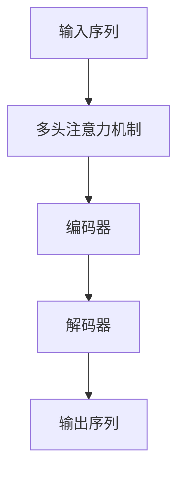
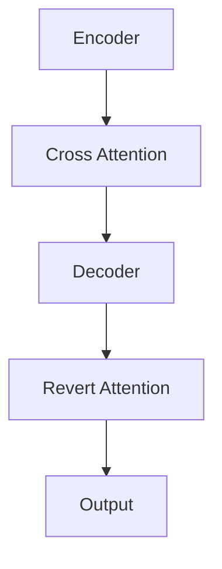
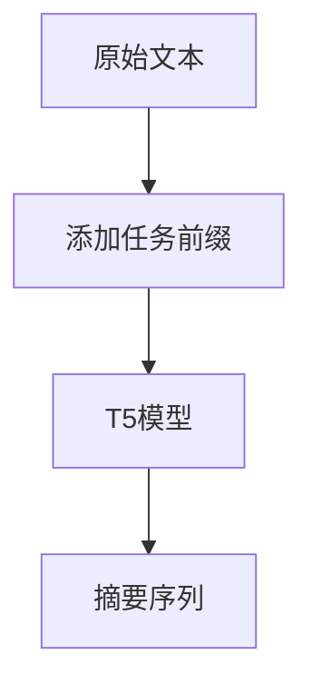

# T5在文本摘要中的奇妙应用

## 1.背景介绍

随着信息时代的到来,海量的文本数据不断涌现,对文本的自动理解和摘要成为了一个迫切的需求。传统的文本摘要方法主要包括规则提取和特征提取两大类,但是这些方法往往需要大量的人工特征工程,且泛化能力较差。近年来,随着深度学习的兴起,基于神经网络的文本摘要技术取得了长足的进展,其中以 Transformer 为代表的自注意力机制成为了主流方法。

T5(Text-to-Text Transfer Transformer)是谷歌于2019年提出的一种新型的编码器-解码器(Encoder-Decoder)结构,它将所有的自然语言处理任务统一成为一个相同的"文本到文本"的转换问题,从而实现了跨任务的迁移学习。T5在诸多自然语言处理任务上表现出色,其中就包括文本摘要任务。本文将重点介绍T5在文本摘要领域的应用及其奇妙之处。

## 2.核心概念与联系

### 2.1 Transformer 

Transformer是一种全新的基于注意力机制的神经网络模型,由编码器(Encoder)和解码器(Decoder)组成。与传统的循环神经网络(RNN)和卷积神经网络(CNN)不同,Transformer完全摒弃了这些结构,而是通过多头注意力机制来捕捉输入序列中的长程依赖关系。



编码器将输入序列映射为一系列连续的向量表示,解码器则根据编码器的输出生成目标序列。由于注意力机制可以直接关注全局信息,因此Transformer在长序列任务上表现优异,同时也避免了梯度消失和梯度爆炸的问题。

### 2.2 T5

T5是基于Transformer的全新范式,将所有的自然语言处理任务统一成"文本到文本"的转换问题。无论是文本分类、机器翻译还是摘要生成,输入和输出都被视为文本序列。这种统一的框架使得T5可以在大规模语料上进行预训练,并在多个任务上进行迁移学习,从而显著提高了性能。


T5在编码器和解码器中都采用了Transformer的结构,并引入了一些改进,如相对位置编码(Relative Position Encoding)和反馈注意力(Revert Attention)等。在预训练阶段,T5在大规模语料上学习文本到文本的转换,从而获得了强大的语义理解能力。

### 2.3 文本摘要任务

文本摘要是指自动生成一段文本的简洁版本,保留原文的核心内容和主旨。根据摘要的生成方式,可以分为抽取式摘要(Extractive Summarization)和生成式摘要(Abstractive Summarization)两种。

- 抽取式摘要是从原文中抽取出一些重要的句子拼接而成,优点是语法通顺,但缺乏概括能力。
- 生成式摘要则是基于原文的语义表示,生成一段全新的摘要文本,具有更强的概括能力,但可能出现语法错误。

T5作为一种通用的序列到序列模型,可以同时用于抽取式摘要和生成式摘要任务。对于抽取式摘要,输入为原文本,输出为原文中的一些句子索引;对于生成式摘要,输入为原文本,输出为摘要文本。

## 3.核心算法原理具体操作步骤

### 3.1 T5模型结构

T5的模型结构与标准的Transformer编码器-解码器架构类似,主要区别在于引入了一些改进,如相对位置编码和反馈注意力机制。

#### 3.1.1 相对位置编码

在标准的Transformer中,位置编码是通过将序列的绝对位置信息编码为向量后直接相加到输入的嵌入向量中。而T5采用了相对位置编码(Relative Position Encoding),即将每个位置相对于其他位置的相对位置编码为向量,并通过注意力机制将其融合到计算中。

相对位置编码的优点是可以有效地捕捉长距离依赖关系,同时保持了位置信息的不变性。对于长序列任务,相对位置编码可以显著提高模型的性能。

#### 3.1.2 反馈注意力

反馈注意力(Revert Attention)机制是T5中另一个创新,它允许解码器注意力不仅关注编码器的输出,还可以关注之前解码器的输出。这种机制有助于捕捉解码器历史状态中的信息,从而生成更加连贯的输出序列。



### 3.2 T5在文本摘要中的应用

#### 3.2.1 输入输出格式

对于文本摘要任务,T5将其视为一个序列到序列的转换问题。输入为原始文本,输出则根据任务的不同而不同。

- 抽取式摘要: 输出为原文本中句子的索引序列,如"1 3 5"表示选择原文的第1、3、5句作为摘要。
- 生成式摘要: 输出为摘要文本序列。

为了指示模型输出的格式,需要在输入序列前添加一个任务前缀(Task Prefix),如"summarize"表示生成式摘要,"extract"表示抽取式摘要。

#### 3.2.2 模型微调

由于T5在大规模语料上进行了预训练,因此可以直接在下游的文本摘要任务上进行微调(Fine-tuning)。微调的过程是:

1. 准备训练数据集,包括原始文本和对应的摘要(或句子索引)。
2. 将原始文本和任务前缀拼接作为模型的输入,摘要(或句子索引)作为模型的输出目标。
3. 在训练数据集上微调T5模型的参数,优化序列到序列的条件概率 P(output|input)。
4. 在验证集上评估模型性能,选择最优模型进行推理。

在推理阶段,将新的文本输入到微调后的T5模型,模型会生成对应的摘要序列作为输出。



需要注意的是,对于抽取式摘要任务,生成的句子索引序列需要进一步处理才能得到最终的摘要文本。而生成式摘要任务的输出则直接就是摘要文本。

## 4.数学模型和公式详细讲解举例说明

在T5模型中,输入序列 $X = (x_1, x_2, ..., x_n)$ 和输出序列 $Y = (y_1, y_2, ..., y_m)$ 都被视为文本序列。T5的目标是最大化输出序列 $Y$ 给定输入序列 $X$ 的条件概率 $P(Y|X)$。

### 4.1 自注意力机制

T5的编码器和解码器都采用了自注意力机制,用于捕捉输入序列中的长程依赖关系。给定一个序列 $X = (x_1, x_2, ..., x_n)$,自注意力机制计算每个位置 $i$ 对应的注意力向量 $a_i$ 如下:

$$a_i = \text{softmax}\left(\frac{q_iK^T}{\sqrt{d_k}}\right)V$$

其中 $q_i$、$K$ 和 $V$ 分别表示查询(Query)、键(Key)和值(Value)向量,它们是通过线性变换得到的:

$$\begin{aligned}
q_i &= X_iW^Q \\
K &= XW^K \\
V &= XW^V
\end{aligned}$$

$d_k$ 是缩放因子,用于防止点积的值过大导致梯度消失。最终,注意力向量 $a_i$ 就是序列 $X$ 在位置 $i$ 处的表示。

多头注意力机制(Multi-Head Attention)则是将多个注意力向量进行拼接,从而捕捉不同的子空间信息:

$$\text{MultiHead}(Q, K, V) = \text{Concat}(a_1, a_2, ..., a_h)W^O$$

其中 $a_i$ 是第 $i$ 个注意力头的输出,共有 $h$ 个注意力头。$W^O$ 是一个可训练的线性变换。

### 4.2 编码器-解码器架构

T5采用了标准的编码器-解码器架构,编码器将输入序列 $X$ 映射为连续的向量表示 $C = (c_1, c_2, ..., c_n)$,解码器则根据 $C$ 生成输出序列 $Y$。

在解码器中,除了自注意力机制外,还引入了编码器-解码器注意力机制,用于关注编码器的输出表示 $C$:

$$a_i^{enc-dec} = \text{softmax}\left(\frac{q_i^dC^T}{\sqrt{d_k}}\right)C$$

其中 $q_i^d$ 是解码器在位置 $i$ 处的查询向量。解码器的最终输出是将自注意力向量 $a_i$ 和编码器-解码器注意力向量 $a_i^{enc-dec}$ 进行拼接和线性变换得到的。

在生成摘要时,解码器会根据输入序列 $X$ 和之前生成的部分序列 $y_1, y_2, ..., y_{i-1}$ 预测下一个词 $y_i$,直至生成完整的摘要序列 $Y$。

### 4.3 示例说明

以一篇关于"机器学习"的文章为例,原文如下:

```
机器学习是一门人工智能的科学,它赋予了计算机在没有明确程序的情况下,通过利用数据或以往的经验自动分析并"学习"的能力。机器学习已广泛应用于数据挖掘、计算机视觉、自然语言处理、生物特征识别、搜索引擎、医疗诊断、检测信用卡欺诈、证券市场分析、DNA序列测序等领域。机器学习按学习方式可分为监督学习、非监督学习、半监督学习和强化学习四种基本范式。
```

假设我们希望生成一个简短的摘要,输入为:

```
summarize: 机器学习是一门人工智能的科学,它赋予了计算机在没有明确程序的情况下,通过利用数据或以往的经验自动分析并"学习"的能力。机器学习已广泛应用于数据挖掘、计算机视觉、自然语言处理、生物特征识别、搜索引擎、医疗诊断、检测信用卡欺诈、证券市场分析、DNA序列测序等领域。机器学习按学习方式可分为监督学习、非监督学习、半监督学习和强化学习四种基本范式。
```

经过T5模型处理后,可能的输出为:

```
机器学习是通过利用数据让计算机自动学习的人工智能技术,广泛应用于数据挖掘、计算机视觉、自然语言处理等领域,包括监督学习、非监督学习等范式。
```

可以看到,T5生成的摘要概括了原文的核心内容,包括机器学习的定义、应用领域和学习范式,且语言通顺、信息丰富。

## 5.项目实践:代码实例和详细解释说明

本节将提供一个使用T5进行文本摘要的实践案例,并对关键代码进行详细解释。我们将使用Hugging Face的Transformers库,这是一个提供了多种预训练语言模型的流行库。

### 5.1 数据准备

首先,我们需要准备文本摘要的数据集。这里以CNN/DailyMail数据集为例,它包含了大量新闻文章及其对应的摘要。我们可以使用Hugging Face的datasets库直接加载该数据集:

```python
from datasets import load_dataset

dataset = load_dataset("cnn_dailymail", "3.0.0")
```

数据集包含了三个字段:`article`(原文)、