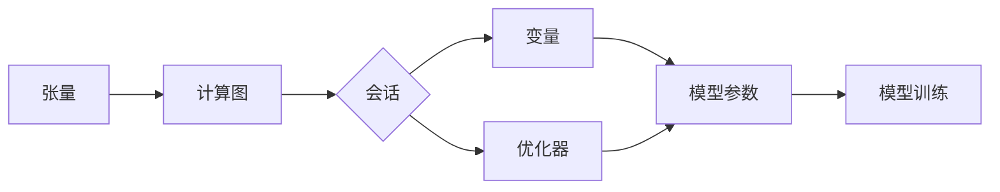

# TensorFlow 原理与代码实战案例讲解

## 1. 背景介绍

### 1.1 人工智能与深度学习的发展

人工智能(Artificial Intelligence, AI)是计算机科学的一个重要分支,旨在研究如何让计算机模拟甚至超越人类的智能。近年来,随着计算能力的提升和大数据时代的到来,人工智能取得了突飞猛进的发展。其中,深度学习(Deep Learning, DL)作为人工智能的一个重要分支,更是受到广泛关注。

深度学习是机器学习的一个子集,它通过构建类似于人脑结构的深层神经网络,实现了对数据的高层抽象和特征提取。深度学习在计算机视觉、语音识别、自然语言处理等领域取得了显著成果,甚至在某些任务上已经超越了人类的表现。

### 1.2 TensorFlow 的诞生与发展

TensorFlow 是由 Google Brain 团队开发的一个开源机器学习框架。它于 2015 年首次公开发布,旨在简化机器学习模型的开发和部署。TensorFlow 提供了一个灵活且高效的平台,可以轻松地构建和训练各种类型的机器学习模型,特别适用于深度学习。

自发布以来,TensorFlow 迅速成为最受欢迎的深度学习框架之一。它拥有活跃的社区支持,不断推出新的版本和改进。TensorFlow 2.0 的发布更是引入了许多新特性,如 Eager Execution、Keras 集成等,使得模型开发变得更加简单和直观。

本文将深入探讨 TensorFlow 的核心概念、原理和实战应用,帮助读者全面了解这个强大的深度学习框架。

## 2. 核心概念与联系

### 2.1 张量(Tensor)

张量是 TensorFlow 中最基本的数据单元。它可以看作是一个多维数组,用于表示数据。张量具有形状(Shape)、数据类型(dtype)和值(Value)三个属性。形状描述了张量的维度信息,数据类型指定了张量中元素的类型,值则是张量中实际存储的数据。

### 2.2 计算图(Computation Graph) 

计算图是 TensorFlow 的核心概念之一。它是一种用于描述计算过程的数据流图。在计算图中,节点表示数学操作,边表示在这些操作之间流动的张量。TensorFlow 通过构建计算图来定义机器学习模型,并在执行时通过图的遍历来计算结果。

### 2.3 会话(Session)

会话提供了一个上下文环境,用于执行计算图中的操作。通过创建会话并将计算图传递给会话,可以启动计算过程并获得结果。会话会分配资源(如 GPU 和 CPU)来执行计算,并负责资源的管理和释放。

### 2.4 变量(Variable)

变量是一种特殊的张量,它的值可以在计算过程中被修改。在机器学习中,变量通常用于表示模型的参数,如神经网络的权重和偏置。通过优化算法不断调整变量的值,使模型能够学习并适应数据。

### 2.5 优化器(Optimizer)

优化器是用于最小化损失函数的算法。在机器学习中,我们通过定义一个损失函数来衡量模型的预测结果与真实值之间的差距。优化器根据损失函数的梯度信息,调整模型的参数,使损失函数的值不断减小,从而使模型的性能不断提升。常见的优化器包括梯度下降(Gradient Descent)、Adam、RMSprop 等。

### 2.6 张量、计算图、会话、变量和优化器之间的联系

下面通过一个 Mermaid 流程图来展示这些核心概念之间的联系:



从图中可以看出,张量作为基本的数据单元,被用于构建计算图。计算图定义了模型的计算过程,包含了变量和优化器。会话负责执行计算图,并管理变量和资源。优化器根据损失函数的梯度信息,调整变量(即模型参数)的值,实现模型的训练和优化。

## 3. 核心算法原理具体操作步骤

### 3.1 前向传播

前向传播是神经网络的基本计算过程。它从输入层开始,逐层计算每个神经元的激活值,直到输出层。具体步骤如下:

1. 将输入数据传递给输入层神经元。
2. 对于每一层的每个神经元,计算加权和:将上一层神经元的输出与对应的权重相乘,并求和。
3. 对加权和应用激活函数,得到该神经元的激活值。常见的激活函数包括 ReLU、sigmoid、tanh 等。
4. 将当前层的激活值传递给下一层,重复步骤 2-3,直到达到输出层。
5. 输出层的激活值即为神经网络的预测结果。

### 3.2 反向传播

反向传播是神经网络训练的核心算法。它通过计算损失函数对各层参数的梯度,并使用梯度下降等优化算法更新参数,使模型不断优化。具体步骤如下:

1. 计算损失函数:比较神经网络的预测结果与真实标签,计算损失函数的值。常见的损失函数包括均方误差、交叉熵等。
2. 计算输出层的梯度:根据损失函数对输出层神经元的激活值求导,得到输出层的梯度。
3. 反向传播梯度:根据链式法则,将输出层的梯度逐层传递到前面的层,计算每一层的梯度。
4. 更新参数:使用优化算法(如梯度下降)根据梯度信息更新每一层的权重和偏置。
5. 重复步骤 1-4,直到达到预定的迭代次数或满足一定的停止条件。

### 3.3 梯度下降

梯度下降是一种常用的优化算法,用于最小化损失函数。其基本思想是沿着损失函数梯度的反方向调整参数,使损失函数的值不断减小。具体步骤如下:

1. 初始化模型参数(权重和偏置)。
2. 计算损失函数对各参数的梯度。
3. 根据梯度下降公式更新参数:$\theta = \theta - \alpha \cdot \nabla J(\theta)$,其中 $\theta$ 表示参数,$\alpha$ 表示学习率,$\nabla J(\theta)$ 表示损失函数对参数的梯度。
4. 重复步骤 2-3,直到达到预定的迭代次数或满足一定的停止条件。

常见的梯度下降变体包括批量梯度下降(Batch Gradient Descent)、随机梯度下降(Stochastic Gradient Descent, SGD)和小批量梯度下降(Mini-Batch Gradient Descent)。

## 4. 数学模型和公式详细讲解举例说明

### 4.1 线性回归

线性回归是一种简单但广泛使用的机器学习算法。它试图找到一个线性函数来拟合输入和输出之间的关系。假设我们有一组训练数据 $\{(x_1, y_1), (x_2, y_2), \ldots, (x_n, y_n)\}$,其中 $x_i$ 是输入特征向量,$y_i$ 是对应的目标值。线性回归模型可以表示为:

$$\hat{y} = w^T x + b$$

其中 $\hat{y}$ 是模型的预测值,$w$ 是权重向量,$b$ 是偏置项。

为了训练线性回归模型,我们需要最小化损失函数。常用的损失函数是均方误差(Mean Squared Error, MSE):

$$J(w, b) = \frac{1}{2n} \sum_{i=1}^n (\hat{y}_i - y_i)^2$$

其中 $\hat{y}_i$ 是模型对第 $i$ 个样本的预测值,$y_i$ 是真实值,$n$ 是样本数量。

我们可以使用梯度下降算法来最小化损失函数。权重 $w$ 和偏置 $b$ 的更新公式为:

$$w := w - \alpha \cdot \frac{1}{n} \sum_{i=1}^n (\hat{y}_i - y_i) x_i$$
$$b := b - \alpha \cdot \frac{1}{n} \sum_{i=1}^n (\hat{y}_i - y_i)$$

其中 $\alpha$ 是学习率,控制每次更新的步长。

### 4.2 逻辑回归

逻辑回归是一种常用的二分类算法。它通过将输入特征映射到 (0, 1) 区间,得到样本属于正类的概率。逻辑回归模型可以表示为:

$$\hat{y} = \sigma(w^T x + b)$$

其中 $\sigma$ 是 sigmoid 函数,定义为:

$$\sigma(z) = \frac{1}{1 + e^{-z}}$$

sigmoid 函数将实数映射到 (0, 1) 区间,使其可以解释为概率。

逻辑回归的损失函数通常选择二元交叉熵(Binary Cross-Entropy):

$$J(w, b) = -\frac{1}{n} \sum_{i=1}^n [y_i \log(\hat{y}_i) + (1 - y_i) \log(1 - \hat{y}_i)]$$

其中 $y_i$ 是第 $i$ 个样本的真实标签(0 或 1),$\hat{y}_i$ 是模型的预测概率。

同样,我们可以使用梯度下降算法来最小化损失函数,更新权重和偏置。

## 5. 项目实践:代码实例和详细解释说明

下面我们通过一个简单的线性回归示例来展示如何使用 TensorFlow 2.0 构建和训练模型。

```python
import tensorflow as tf
import numpy as np

# 生成随机数据
X = np.random.rand(100, 1)
y = 2 * X + 1 + np.random.randn(100, 1) * 0.1

# 定义模型
model = tf.keras.Sequential([
    tf.keras.layers.Dense(1, input_shape=(1,))
])

# 编译模型
model.compile(optimizer='sgd', loss='mse')

# 训练模型
model.fit(X, y, epochs=100, batch_size=10)

# 评估模型
print(model.evaluate(X, y))

# 使用模型进行预测
print(model.predict(np.array([[0.5], [0.8]])))
```

代码解释:

1. 首先,我们生成一些随机数据作为训练集。这里我们生成 100 个样本,每个样本有一个特征。目标值 $y$ 由 $2x+1$ 加上一些随机噪声构成。

2. 接下来,我们使用 Keras Sequential API 定义一个简单的线性回归模型。模型只包含一个全连接层(Dense),输入形状为 (1,),表示每个样本有一个特征。

3. 然后,我们编译模型。这里指定使用随机梯度下降(sgd)优化器和均方误差(mse)损失函数。

4. 调用 `fit()` 方法训练模型。我们将训练数据 `X` 和 `y` 传递给模型,设置训练轮数(epochs)为 100,批量大小(batch_size)为 10。

5. 训练完成后,我们可以使用 `evaluate()` 方法在训练数据上评估模型的性能。这里会输出模型的损失值。

6. 最后,我们可以使用训练好的模型对新数据进行预测。这里我们预测两个样本 `[0.5]` 和 `[0.8]` 的目标值。

通过这个简单的例子,我们看到了如何使用 TensorFlow 2.0 快速构建和训练一个机器学习模型。Keras Sequential API 提供了一种直观而简洁的方式来定义模型,使得模型的创建变得非常容易。

## 6. 实际应用场景

TensorFlow 在各个领域都有广泛的应用,下面列举几个典型的应用场景:

### 6.1 图像分类

图像分类是计算机视觉中的一个基本任务,旨在将图像分配到预定义的类别中。使用 TensorFlow,我们可以构建卷积神经网络(Convolutional Neural Network, CNN)来进行图像分类。CNN 通过卷积层和池化层提取图像的特征,并使用全连接层进行分类。常见的 CNN 架构包括 LeNet、AlexNet