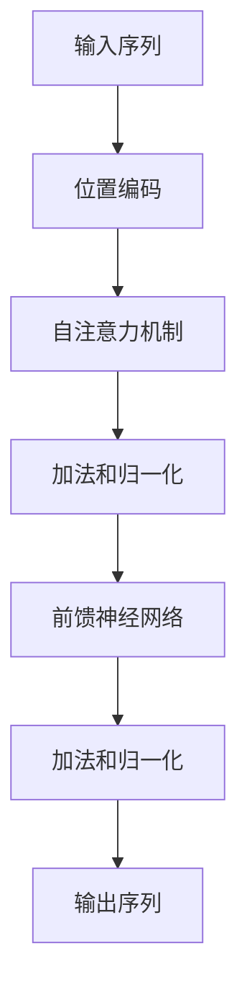

# Transformer 原理与代码实战案例讲解

## 1.背景介绍

在自然语言处理（NLP）领域，Transformer 模型的出现标志着一个重要的里程碑。自从 Vaswani 等人在 2017 年提出 Transformer 模型以来，它迅速成为了 NLP 任务中的主流模型。Transformer 模型不仅在机器翻译、文本生成等任务中表现出色，还在图像处理、语音识别等领域展现了强大的应用潜力。

### 1.1 传统模型的局限性

在 Transformer 出现之前，循环神经网络（RNN）和长短期记忆网络（LSTM）是处理序列数据的主要工具。然而，这些模型存在一些固有的局限性：

- **长距离依赖问题**：RNN 和 LSTM 在处理长序列时，信息传递会逐渐衰减，导致模型难以捕捉长距离依赖关系。
- **并行计算困难**：RNN 和 LSTM 需要逐步处理序列数据，难以进行并行计算，导致训练速度较慢。

### 1.2 Transformer 的优势

Transformer 模型通过引入自注意力机制（Self-Attention）和完全基于注意力的架构，克服了传统模型的局限性：

- **捕捉长距离依赖**：自注意力机制能够直接关注序列中的任意位置，轻松捕捉长距离依赖关系。
- **并行计算**：Transformer 模型不依赖于序列顺序，可以进行并行计算，大大提高了训练速度。

## 2.核心概念与联系

Transformer 模型的核心在于其独特的架构设计和自注意力机制。以下是一些关键概念：

### 2.1 自注意力机制

自注意力机制是 Transformer 模型的核心组件。它通过计算输入序列中每个元素与其他元素的相关性，生成一个新的表示。自注意力机制的计算过程如下：

1. **计算 Query、Key 和 Value**：将输入序列通过线性变换生成 Query、Key 和 Value 矩阵。
2. **计算注意力权重**：通过点积计算 Query 和 Key 的相似度，并使用 Softmax 函数归一化。
3. **加权求和**：将注意力权重与 Value 矩阵相乘，得到新的表示。

### 2.2 多头注意力机制

多头注意力机制通过并行计算多个自注意力机制，捕捉不同子空间的特征。每个头独立计算自注意力，然后将结果拼接并通过线性变换生成最终输出。

### 2.3 位置编码

由于 Transformer 模型不依赖于序列顺序，需要引入位置编码来保留序列的位置信息。位置编码通过正弦和余弦函数生成，添加到输入序列中。

### 2.4 编码器-解码器架构

Transformer 模型采用编码器-解码器架构：

- **编码器**：由多个相同的编码器层堆叠而成，每层包含自注意力机制和前馈神经网络。
- **解码器**：由多个相同的解码器层堆叠而成，每层包含自注意力机制、编码器-解码器注意力机制和前馈神经网络。

以下是 Transformer 模型的架构图：



## 3.核心算法原理具体操作步骤

Transformer 模型的训练和推理过程可以分为以下几个步骤：

### 3.1 数据预处理

在训练 Transformer 模型之前，需要对数据进行预处理，包括分词、构建词汇表和生成位置编码。

### 3.2 模型初始化

初始化 Transformer 模型的参数，包括编码器和解码器的层数、隐藏层维度、注意力头数等。

### 3.3 前向传播

在前向传播过程中，输入序列通过编码器生成编码表示，然后解码器根据编码表示和目标序列生成输出序列。

### 3.4 损失计算

使用交叉熵损失函数计算预测序列与目标序列之间的误差。

### 3.5 反向传播和参数更新

通过反向传播算法计算梯度，并使用优化器（如 Adam）更新模型参数。

### 3.6 模型评估

在验证集上评估模型性能，调整超参数以提高模型效果。

## 4.数学模型和公式详细讲解举例说明

Transformer 模型的数学原理可以通过以下公式详细说明：

### 4.1 自注意力机制

自注意力机制的计算过程如下：

1. **计算 Query、Key 和 Value**：

$$
Q = XW_Q, \quad K = XW_K, \quad V = XW_V
$$

其中，$X$ 是输入序列，$W_Q, W_K, W_V$ 是可训练的权重矩阵。

2. **计算注意力权重**：

$$
\text{Attention}(Q, K, V) = \text{softmax}\left(\frac{QK^T}{\sqrt{d_k}}\right)V
$$

其中，$d_k$ 是 Key 的维度。

### 4.2 多头注意力机制

多头注意力机制的计算过程如下：

1. **并行计算多个自注意力**：

$$
\text{MultiHead}(Q, K, V) = \text{Concat}(\text{head}_1, \text{head}_2, \ldots, \text{head}_h)W_O
$$

其中，每个头的计算方式为：

$$
\text{head}_i = \text{Attention}(QW_{Q_i}, KW_{K_i}, VW_{V_i})
$$

2. **拼接并线性变换**：

$$
\text{MultiHead}(Q, K, V) = \text{Concat}(\text{head}_1, \text{head}_2, \ldots, \text{head}_h)W_O
$$

### 4.3 位置编码

位置编码的计算方式如下：

$$
PE_{(pos, 2i)} = \sin\left(\frac{pos}{10000^{2i/d_{model}}}\right)
$$

$$
PE_{(pos, 2i+1)} = \cos\left(\frac{pos}{10000^{2i/d_{model}}}\right)
$$

其中，$pos$ 是位置，$i$ 是维度索引，$d_{model}$ 是模型维度。

## 5.项目实践：代码实例和详细解释说明

在这一部分，我们将通过一个具体的代码实例来展示如何实现和训练一个简单的 Transformer 模型。

### 5.1 数据预处理

首先，我们需要对数据进行预处理。以下是一个简单的分词和构建词汇表的示例：

```python
import torch
from torchtext.data.utils import get_tokenizer
from torchtext.vocab import build_vocab_from_iterator

# 分词器
tokenizer = get_tokenizer('basic_english')

# 构建词汇表
def yield_tokens(data_iter):
    for text in data_iter:
        yield tokenizer(text)

vocab = build_vocab_from_iterator(yield_tokens(train_data), specials=["<unk>"])
vocab.set_default_index(vocab["<unk>"])
```

### 5.2 模型定义

接下来，我们定义一个简单的 Transformer 模型：

```python
import torch.nn as nn
import torch.nn.functional as F

class TransformerModel(nn.Module):
    def __init__(self, vocab_size, d_model, nhead, num_encoder_layers, num_decoder_layers, dim_feedforward, dropout=0.1):
        super(TransformerModel, self).__init__()
        self.model_type = 'Transformer'
        self.src_embedding = nn.Embedding(vocab_size, d_model)
        self.tgt_embedding = nn.Embedding(vocab_size, d_model)
        self.pos_encoder = PositionalEncoding(d_model, dropout)
        self.transformer = nn.Transformer(d_model, nhead, num_encoder_layers, num_decoder_layers, dim_feedforward, dropout)
        self.fc_out = nn.Linear(d_model, vocab_size)

    def forward(self, src, tgt, src_mask, tgt_mask, memory_mask):
        src = self.src_embedding(src) * math.sqrt(self.d_model)
        tgt = self.tgt_embedding(tgt) * math.sqrt(self.d_model)
        src = self.pos_encoder(src)
        tgt = self.pos_encoder(tgt)
        memory = self.transformer(src, tgt, src_mask, tgt_mask, memory_mask)
        output = self.fc_out(memory)
        return output
```

### 5.3 训练模型

定义好模型后，我们可以开始训练：

```python
import torch.optim as optim

# 初始化模型
model = TransformerModel(vocab_size=len(vocab), d_model=512, nhead=8, num_encoder_layers=6, num_decoder_layers=6, dim_feedforward=2048, dropout=0.1)
optimizer = optim.Adam(model.parameters(), lr=0.0001)
criterion = nn.CrossEntropyLoss()

# 训练循环
for epoch in range(num_epochs):
    model.train()
    for batch in train_dataloader:
        src, tgt = batch.src, batch.tgt
        optimizer.zero_grad()
        output = model(src, tgt, src_mask, tgt_mask, memory_mask)
        loss = criterion(output.view(-1, vocab_size), tgt.view(-1))
        loss.backward()
        optimizer.step()
```

### 5.4 模型评估

在验证集上评估模型性能：

```python
model.eval()
total_loss = 0
with torch.no_grad():
    for batch in val_dataloader:
        src, tgt = batch.src, batch.tgt
        output = model(src, tgt, src_mask, tgt_mask, memory_mask)
        loss = criterion(output.view(-1, vocab_size), tgt.view(-1))
        total_loss += loss.item()

avg_loss = total_loss / len(val_dataloader)
print(f'Validation Loss: {avg_loss}')
```

## 6.实际应用场景

Transformer 模型在多个领域展现了强大的应用潜力，以下是一些典型的应用场景：

### 6.1 机器翻译

Transformer 模型在机器翻译任务中表现出色。通过编码器-解码器架构，Transformer 能够将源语言序列编码为上下文表示，再解码为目标语言序列。

### 6.2 文本生成

Transformer 模型在文本生成任务中也取得了显著成果。通过自回归生成方式，Transformer 可以生成连贯且具有上下文一致性的文本。

### 6.3 图像处理

Transformer 模型在图像处理任务中也展现了潜力。Vision Transformer（ViT）通过将图像分割为固定大小的块，并将其视为序列数据进行处理，实现了图像分类、目标检测等任务。

### 6.4 语音识别

Transformer 模型在语音识别任务中也得到了应用。通过将语音信号转换为特征序列，Transformer 可以实现高效的语音识别。

## 7.工具和资源推荐

在实际项目中，以下工具和资源可以帮助你更好地使用 Transformer 模型：

### 7.1 PyTorch

PyTorch 是一个流行的深度学习框架，提供了丰富的工具和库来实现和训练 Transformer 模型。

### 7.2 Hugging Face Transformers

Hugging Face Transformers 是一个开源库，提供了预训练的 Transformer 模型和便捷的接口，方便进行各种 NLP 任务。

### 7.3 TensorFlow

TensorFlow 是另一个流行的深度学习框架，也提供了丰富的工具和库来实现和训练 Transformer 模型。

### 7.4 数据集

以下是一些常用的数据集，可以用于训练和评估 Transformer 模型：

- WMT：用于机器翻译任务的多语言数据集。
- COCO：用于图像处理任务的图像数据集。
- LibriSpeech：用于语音识别任务的语音数据集。

## 8.总结：未来发展趋势与挑战

Transformer 模型在多个领域展现了强大的应用潜力，但也面临一些挑战和未来发展趋势：

### 8.1 模型规模和计算资源

Transformer 模型的参数量和计算复杂度较高，训练和推理需要大量的计算资源。未来的发展趋势是如何在保证模型性能的前提下，降低计算资源的需求。

### 8.2 模型解释性

Transformer 模型的复杂性使得其内部机制难以解释。未来的研究方向之一是提高模型的可解释性，帮助理解模型的决策过程。

### 8.3 多模态融合

未来的发展趋势之一是多模态融合，即将文本、图像、语音等多种模态的数据进行融合处理，提升模型的综合能力。

### 8.4 实时应用

Transformer 模型在实时应用中的性能仍需提升。未来的研究方向之一是如何在保证模型性能的前提下，提高其在实时应用中的效率。

## 9.附录：常见问题与解答

### 9.1 Transformer 模型的优势是什么？

Transformer 模型通过自注意力机制和并行计算，克服了传统 RNN 和 LSTM 模型的长距离依赖问题和并行计算困难，表现出色。

### 9.2 如何选择 Transformer 模型的超参数？

选择 Transformer 模型的超参数需要根据具体任务和数据集进行调整。常见的超参数包括编码器和解码器的层数、隐藏层维度、注意力头数等。

### 9.3 Transformer 模型的训练时间长吗？

Transformer 模型的训练时间较长，尤其是在大规模数据集上。可以通过使用分布式训练和高效的优化算法来加速训练过程。

### 9.4 Transformer 模型可以应用于哪些领域？

Transformer 模型可以应用于多个领域，包括自然语言处理、图像处理、语音识别等。

### 9.5 如何提高 Transformer 模型的性能？

可以通过增加模型的层数、隐藏层维度和注意力头数来提高 Transformer 模型的性能。同时，使用预训练模型和数据增强技术也可以提升模型效果。

---

作者：禅与计算机程序设计艺术 / Zen and the Art of Computer Programming