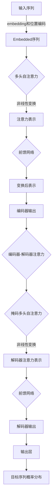

# Transformer 模型 原理与代码实例讲解

## 1. 背景介绍

在自然语言处理(NLP)和序列数据建模领域,Transformer模型是一种革命性的架构,它完全依赖于注意力机制,摒弃了传统的循环神经网络和卷积神经网络结构。自2017年被提出以来,Transformer模型在机器翻译、文本生成、语音识别等各种任务中表现出色,成为NLP领域的主导模型之一。

Transformer模型的核心思想是通过自注意力机制来捕捉输入序列中任意两个位置之间的依赖关系,而不再依赖于序列的顺序结构。这使得该模型能够高效地并行计算,大大提高了训练效率。此外,Transformer还引入了多头注意力机制和位置编码等创新,进一步增强了模型的表达能力和泛化性能。

## 2. 核心概念与联系

### 2.1 自注意力机制(Self-Attention)

自注意力机制是Transformer模型的核心组件,它允许模型在计算目标位置的表示时,直接关注整个输入序列中的所有位置。具体来说,对于每个目标位置,自注意力机制会计算它与输入序列中所有其他位置的相关性分数,然后根据这些分数对所有位置的表示进行加权求和,得到该目标位置的最终表示。

自注意力机制可以用以下公式表示:

$$\mathrm{Attention}(Q, K, V) = \mathrm{softmax}\left(\frac{QK^T}{\sqrt{d_k}}\right)V$$

其中 $Q$ 表示查询(Query)向量, $K$ 表示键(Key)向量, $V$ 表示值(Value)向量, $d_k$ 是缩放因子,用于防止点积过大导致梯度消失。

### 2.2 多头注意力机制(Multi-Head Attention)

为了进一步提高模型的表达能力,Transformer引入了多头注意力机制。多头注意力机制将查询、键和值向量首先分别线性映射到不同的子空间,然后在每个子空间内计算自注意力,最后将所有子空间的结果拼接起来作为最终的注意力表示。

多头注意力机制可以用以下公式表示:

$$\mathrm{MultiHead}(Q, K, V) = \mathrm{Concat}(\mathrm{head}_1, \ldots, \mathrm{head}_h)W^O$$
$$\mathrm{head}_i = \mathrm{Attention}(QW_i^Q, KW_i^K, VW_i^V)$$

其中 $W_i^Q$、$W_i^K$、$W_i^V$ 分别表示第 $i$ 个头的查询、键和值的线性映射矩阵, $W^O$ 是最终的线性映射矩阵。

### 2.3 位置编码(Positional Encoding)

由于Transformer模型完全放弃了循环和卷积结构,因此它无法像RNN和CNN那样自然地捕捉序列的位置信息。为了解决这个问题,Transformer引入了位置编码,它将序列中每个位置的位置信息编码为一个向量,并将其加到该位置的输入表示上。

位置编码可以通过不同的函数来实现,最常用的是正弦和余弦函数:

$$\mathrm{PE}_{(pos, 2i)} = \sin\left(pos / 10000^{2i / d_\mathrm{model}}\right)$$
$$\mathrm{PE}_{(pos, 2i+1)} = \cos\left(pos / 10000^{2i / d_\mathrm{model}}\right)$$

其中 $pos$ 表示位置索引, $i$ 表示维度索引, $d_\mathrm{model}$ 是模型的embedding维度。

## 3. 核心算法原理具体操作步骤

Transformer模型的核心算法原理可以分为以下几个步骤:

1. **输入embedding和位置编码**

   首先,将输入序列转换为embedding向量表示,然后将位置编码加到embedding上,以提供位置信息。

2. **多头自注意力**

   将embedded序列输入到多头自注意力层,计算每个位置与其他所有位置的注意力分数,并根据这些分数对所有位置的表示进行加权求和,得到每个位置的注意力表示。

3. **前馈网络**

   将注意力表示输入到前馈网络中,进行非线性变换。前馈网络通常由两个线性层和一个ReLU激活函数组成。

4. **编码器层归纳**

   重复步骤2和3,构建编码器的多层结构。每一层的输出将作为下一层的输入。

5. **解码器层归纳**

   解码器的结构与编码器类似,但有两个主要区别:
   
   a. 解码器还需要计算目标序列中每个位置与输入序列中所有位置的注意力,这被称为"编码器-解码器注意力"。
   
   b. 为了在生成过程中保持自回归属性,解码器的自注意力需要被掩码,使得每个位置只能关注之前的位置。

6. **输出层**

   最后,将解码器的输出通过一个线性层和softmax层,生成目标序列的概率分布。

整个过程可以用下面的流程图直观地表示:

上述流程图展示了Transformer模型的整体架构,包括编码器和解码器的主要组件及其计算流程。值得注意的是,在实际应用中,可能会根据具体任务对模型进行一些修改和优化。

## 4. 数学模型和公式详细讲解举例说明

在上一节中,我们已经介绍了Transformer模型的核心概念和算法原理。现在,让我们深入探讨一下模型中涉及的数学模型和公式,并通过具体的例子来加深理解。

### 4.1 缩放点积注意力(Scaled Dot-Product Attention)

自注意力机制的核心是计算查询(Query)向量与键(Key)向量之间的相似性分数,然后根据这些分数对值(Value)向量进行加权求和。最常用的相似性度量是点积,即查询向量与键向量的内积。但是,当向量维度较大时,点积的值也会变大,这可能导致softmax函数的梯度较小,从而难以进行有效的梯度更新。

为了解决这个问题,Transformer模型引入了缩放点积注意力机制,它在计算点积之前,先将点积除以一个缩放因子 $\sqrt{d_k}$,其中 $d_k$ 是键向量的维度。具体公式如下:

$$\mathrm{Attention}(Q, K, V) = \mathrm{softmax}\left(\frac{QK^T}{\sqrt{d_k}}\right)V$$

其中,查询向量 $Q \in \mathbb{R}^{n \times d_q}$,键向量 $K \in \mathbb{R}^{n \times d_k}$,值向量 $V \in \mathbb{R}^{n \times d_v}$,其中 $n$ 表示序列长度, $d_q$、$d_k$、$d_v$ 分别表示查询、键和值的embedding维度。

让我们通过一个简单的例子来理解缩放点积注意力的计算过程。假设我们有一个长度为4的序列,embedding维度为3,则查询、键和值向量可以表示为:

$$Q = \begin{bmatrix}
1 & 2 & 3\\
4 & 5 & 6\\
7 & 8 & 9\\
10 & 11 & 12
\end{bmatrix}, K = \begin{bmatrix}
2 & 1 & 4\\
3 & 5 & 1\\
6 & 2 & 8\\
9 & 7 & 3
\end{bmatrix}, V = \begin{bmatrix}
1 & 0 & 1\\
2 & 1 & 0\\
0 & 2 & 1\\
1 & 1 & 2
\end{bmatrix}$$

首先,我们计算 $QK^T$:

$$QK^T = \begin{bmatrix}
1 & 2 & 3\\
4 & 5 & 6\\
7 & 8 & 9\\
10 & 11 & 12
\end{bmatrix} \begin{bmatrix}
2 & 3 & 6 & 9\\
1 & 5 & 2 & 7\\
4 & 1 & 8 & 3
\end{bmatrix} = \begin{bmatrix}
26 & 17 & 54 & 39\\
76 & 53 & 156 & 117\\
126 & 89 & 258 & 195\\
176 & 125 & 360 & 273
\end{bmatrix}$$

然后,我们将 $QK^T$ 除以缩放因子 $\sqrt{3}$:

$$\frac{QK^T}{\sqrt{3}} = \begin{bmatrix}
15.0 & 9.8 & 31.2 & 22.5\\
43.9 & 30.6 & 90.0 & 67.5\\
72.7 & 51.4 & 148.9 & 112.5\\
101.6 & 72.2 & 207.8 & 157.5
\end{bmatrix}$$

接下来,我们对上述矩阵的每一行应用softmax函数,得到注意力分数矩阵:

$$\mathrm{softmax}\left(\frac{QK^T}{\sqrt{3}}\right) = \begin{bmatrix}
0.0005 & 0.0001 & 0.9993 & 0.0001\\
0.0001 & 0.0001 & 0.9997 & 0.0001\\
0.0001 & 0.0001 & 0.9997 & 0.0001\\
0.0001 & 0.0001 & 0.9997 & 0.0001
\end{bmatrix}$$

最后,我们将注意力分数矩阵与值向量 $V$ 相乘,得到注意力输出:

$$\mathrm{Attention}(Q, K, V) = \begin{bmatrix}
0.0005 & 0.0001 & 0.9993 & 0.0001\\
0.0001 & 0.0001 & 0.9997 & 0.0001\\
0.0001 & 0.0001 & 0.9997 & 0.0001\\
0.0001 & 0.0001 & 0.9997 & 0.0001
\end{bmatrix} \begin{bmatrix}
1 & 0 & 1\\
2 & 1 & 0\\
0 & 2 & 1\\
1 & 1 & 2
\end{bmatrix} = \begin{bmatrix}
0.9993 & 2.0001 & 0.9993\\
1.9997 & 3.9997 & 0.9997\\
0.9997 & 3.9997 & 0.9997\\
0.9997 & 3.9997 & 1.9997
\end{bmatrix}$$

可以看到,在这个例子中,注意力机制主要关注了第三个位置,这是因为在计算 $QK^T$ 时,第三列的值较大,导致softmax函数在第三列上的输出值最大。

### 4.2 多头注意力(Multi-Head Attention)

单一的自注意力机制可能难以捕捉到输入序列中所有的依赖关系。为了增强模型的表达能力,Transformer引入了多头注意力机制,它将查询、键和值向量首先分别线性映射到不同的子空间,然后在每个子空间内计算自注意力,最后将所有子空间的结果拼接起来作为最终的注意力表示。

多头注意力机制可以用以下公式表示:

$$\mathrm{MultiHead}(Q, K, V) = \mathrm{Concat}(\mathrm{head}_1, \ldots, \mathrm{head}_h)W^O$$
$$\mathrm{head}_i = \mathrm{Attention}(QW_i^Q, KW_i^K, VW_i^V)$$

其中 $W_i^Q$、$W_i^K$、$W_i^V$ 分别表示第 $i$ 个头的查询、键和值的线性映射矩阵, $W^O$ 是最终的线性映射矩阵, $h$ 是头的数量。

让我们继续上面的例子,假设我们使用4个注意力头,查询、键和值的embedding维度为3,每个头的维度