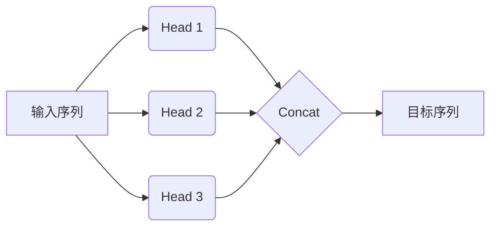

# Transformer代码实现

## 1.背景介绍

### 1.1 序列到序列模型

在自然语言处理领域,有许多任务可以被视为将一个序列映射为另一个序列的问题,例如机器翻译、文本摘要、对话系统等。传统的序列到序列模型通常采用编码器-解码器(Encoder-Decoder)架构,其中编码器将输入序列编码为一个向量表示,解码器则根据该向量生成输出序列。

### 1.2 注意力机制

虽然编码器-解码器架构取得了不错的成绩,但它存在一个主要缺陷:编码器压缩整个输入序列信息为一个固定长度的向量,对长序列来说会带来信息丢失的问题。注意力机制(Attention Mechanism)应运而生,它允许模型在生成每个目标词时,直接参考源序列中的全部词,从而解决了长程依赖问题。

### 1.3 Transformer模型

2017年,Transformer被提出并在机器翻译任务上取得了优异的表现。Transformer完全抛弃了循环神经网络和卷积神经网络,纯粹基于注意力机制构建,因此被称为"注意力是全部"(Attention is All You Need)模型。它克服了循环神经网络的缺陷,可以高效并行计算,大大提高了训练效率。

## 2.核心概念与联系

### 2.1 自注意力机制(Self-Attention)

Transformer的核心是自注意力机制。在计算目标序列的每个词时,它会参考源序列中的全部词,并基于两者的关联程度赋予不同的权重。自注意力机制可以有效捕获长程依赖关系,是Transformer取得优异表现的关键所在。


### 2.2 多头注意力机制(Multi-Head Attention)

为了捕获不同子空间的信息,Transformer采用了多头注意力机制。它将注意力机制复制成多个注意力头,每个头对应一个线性投影,最后将所有头的结果拼接起来作为最终的注意力表示。



### 2.3 位置编码(Positional Encoding)

由于Transformer完全基于注意力机制,没有递归或卷积结构,因此需要一些方法来注入序列的位置信息。位置编码就是为序列的每个词添加一个位置相关的向量,使模型能够捕获序列的顺序信息。

### 2.4 层归一化(Layer Normalization)

为了加快训练收敛速度并提高模型性能,Transformer采用了层归一化技术。它对每一层的输入进行归一化处理,使数据在每一层的分布保持一致,从而缓解了内部协变量偏移的问题。

### 2.5 残差连接(Residual Connection)

Transformer的编码器和解码器都采用了残差连接,将输入直接传递到下一层,并与当前层的输出相加。这种结构有助于梯度反向传播,缓解了深层网络的梯度消失问题。

## 3.核心算法原理具体操作步骤

Transformer的核心算法原理可以分为以下几个步骤:

### 3.1 输入embedding和位置编码

首先,将输入序列的每个词映射为一个embedding向量,并与对应的位置编码向量相加,得到最终的输入表示。

### 3.2 多头自注意力计算

1. 对输入进行线性投影,得到查询(Query)、键(Key)和值(Value)向量。
2. 计算查询与所有键的点积,应用Softmax函数得到注意力权重。
3. 将注意力权重与值向量相乘,并对所有头进行拼接,得到注意力表示。

### 3.3 前馈神经网络

将注意力表示输入到前馈神经网络中,进行非线性变换。前馈神经网络包含两个线性变换和一个ReLU激活函数。

### 3.4 残差连接和层归一化

将前馈神经网络的输出与输入相加,得到残差连接的结果。然后对结果进行层归一化处理。

### 3.5 编码器和解码器堆叠

编码器由N个相同的层堆叠而成,每层包含多头自注意力机制和前馈神经网络。解码器除了包含编码器的所有子层外,还包含一个额外的注意力子层,用于关注编码器的输出。

### 3.6 生成输出序列

解码器一次生成一个输出词,并将其作为下一个位置的输入,重复该过程直到生成完整的输出序列。

## 4.数学模型和公式详细讲解举例说明

### 4.1 注意力机制计算

给定一个查询向量 $\boldsymbol{q}$、一组键向量 $\boldsymbol{K}=\{\boldsymbol{k}_1, \boldsymbol{k}_2, \ldots, \boldsymbol{k}_n\}$ 和一组值向量 $\boldsymbol{V}=\{\boldsymbol{v}_1, \boldsymbol{v}_2, \ldots, \boldsymbol{v}_n\}$,注意力机制的计算过程如下:

$$\begin{aligned}
\text{Score}(\boldsymbol{q}, \boldsymbol{k}_i) &= \boldsymbol{q} \cdot \boldsymbol{k}_i^\top \\
\alpha_i &= \frac{\exp(\text{Score}(\boldsymbol{q}, \boldsymbol{k}_i))}{\sum_{j=1}^n \exp(\text{Score}(\boldsymbol{q}, \boldsymbol{k}_j))} \\
\text{Attention}(\boldsymbol{q}, \boldsymbol{K}, \boldsymbol{V}) &= \sum_{i=1}^n \alpha_i \boldsymbol{v}_i
\end{aligned}$$

其中 $\text{Score}(\boldsymbol{q}, \boldsymbol{k}_i)$ 表示查询向量与第 $i$ 个键向量的相关性分数,通常使用点积计算。$\alpha_i$ 是通过 Softmax 函数归一化后的注意力权重。最终的注意力表示 $\text{Attention}(\boldsymbol{q}, \boldsymbol{K}, \boldsymbol{V})$ 是所有值向量的加权和。

### 4.2 多头注意力计算

多头注意力机制将注意力机制复制 $h$ 次,每次使用不同的线性投影,最后将所有头的结果拼接起来:

$$\begin{aligned}
\text{head}_i &= \text{Attention}(\boldsymbol{q}\boldsymbol{W}_i^Q, \boldsymbol{K}\boldsymbol{W}_i^K, \boldsymbol{V}\boldsymbol{W}_i^V) \\
\text{MultiHead}(\boldsymbol{q}, \boldsymbol{K}, \boldsymbol{V}) &= \text{Concat}(\text{head}_1, \text{head}_2, \ldots, \text{head}_h)\boldsymbol{W}^O
\end{aligned}$$

其中 $\boldsymbol{W}_i^Q$、$\boldsymbol{W}_i^K$、$\boldsymbol{W}_i^V$ 和 $\boldsymbol{W}^O$ 是可学习的线性投影参数。

### 4.3 位置编码

位置编码使用正弦和余弦函数计算,公式如下:

$$\begin{aligned}
\text{PE}_{(pos, 2i)} &= \sin\left(\frac{pos}{10000^{2i/d_\text{model}}}\right) \\
\text{PE}_{(pos, 2i+1)} &= \cos\left(\frac{pos}{10000^{2i/d_\text{model}}}\right)
\end{aligned}$$

其中 $pos$ 是词的位置索引,而 $i$ 是维度索引。这种位置编码可以很好地捕获序列的位置信息。

### 4.4 层归一化

层归一化的计算公式如下:

$$\begin{aligned}
\boldsymbol{\mu} &= \frac{1}{H}\sum_{i=1}^H x_i \\
\boldsymbol{\sigma}^2 &= \frac{1}{H}\sum_{i=1}^H(x_i - \boldsymbol{\mu})^2 \\
\text{LayerNorm}(\boldsymbol{x}) &= \boldsymbol{\alpha} \odot \frac{\boldsymbol{x} - \boldsymbol{\mu}}{\sqrt{\boldsymbol{\sigma}^2 + \epsilon}} + \boldsymbol{\beta}
\end{aligned}$$

其中 $\boldsymbol{x}$ 是输入向量,而 $\boldsymbol{\alpha}$ 和 $\boldsymbol{\beta}$ 是可学习的缩放和偏移参数。层归一化可以加快模型收敛并提高性能。

## 5.项目实践:代码实例和详细解释说明

以下是使用 PyTorch 实现 Transformer 模型的代码示例,包括编码器(Encoder)和解码器(Decoder)的实现。

### 5.1 导入必要的库

```python
import math
import torch
import torch.nn as nn
from torch.nn import TransformerEncoder, TransformerEncoderLayer
```

### 5.2 位置编码实现

```python
class PositionalEncoding(nn.Module):
    def __init__(self, d_model, dropout=0.1, max_len=5000):
        super(PositionalEncoding, self).__init__()
        self.dropout = nn.Dropout(p=dropout)

        pe = torch.zeros(max_len, d_model)
        position = torch.arange(0, max_len, dtype=torch.float).unsqueeze(1)
        div_term = torch.exp(torch.arange(0, d_model, 2).float() * (-math.log(10000.0) / d_model))
        pe[:, 0::2] = torch.sin(position * div_term)
        pe[:, 1::2] = torch.cos(position * div_term)
        pe = pe.unsqueeze(0).transpose(0, 1)
        self.register_buffer('pe', pe)

    def forward(self, x):
        x = x + self.pe[:x.size(0), :]
        return self.dropout(x)
```

这段代码实现了位置编码的计算,用于为序列的每个位置添加位置信息。

### 5.3 多头注意力实现

```python
class MultiHeadAttention(nn.Module):
    def __init__(self, heads, d_model, dropout=0.1):
        super().__init__()

        self.d_model = d_model
        self.d_k = d_model // heads
        self.h = heads

        self.q_linear = nn.Linear(d_model, d_model)
        self.v_linear = nn.Linear(d_model, d_model)
        self.k_linear = nn.Linear(d_model, d_model)
        self.dropout = nn.Dropout(dropout)
        self.out = nn.Linear(d_model, d_model)

    def attention(self, q, k, v, d_k, mask=None, dropout=None):
        scores = torch.matmul(q, k.transpose(-2, -1)) / math.sqrt(d_k)

        if mask is not None:
            mask = mask.unsqueeze(1)
            scores = scores.masked_fill(mask == 0, -1e9)

        scores = nn.Softmax(dim=-1)(scores)

        if dropout is not None:
            scores = dropout(scores)

        output = torch.matmul(scores, v)
        return output

    def forward(self, q, k, v, mask=None):
        bs = q.size(0)

        # perform linear operation and split into h heads
        k = self.k_linear(k).view(bs, -1, self.h, self.d_k)
        q = self.q_linear(q).view(bs, -1, self.h, self.d_k)
        v = self.v_linear(v).view(bs, -1, self.h, self.d_k)

        # transpose to get batch first
        k = k.transpose(1, 2)
        q = q.transpose(1, 2)
        v = v.transpose(1, 2)

        scores = self.attention(q, k, v, self.d_k, mask, self.dropout)

        # concatenate heads and put through final linear layer
        concat = scores.transpose(1, 2).contiguous().view(bs, -1, self.d_model)
        output = self.out(concat)

        return output
```

这段代码实现了多头注意力机制,包括查询(Query)、键(Key)和值(Value)的线性投影,以及注意力分数的计算和注意力权重的应用。

### 5.4 编码器层实现

```python
class EncoderLayer(nn.Module):
    def __init__(self, d_model, heads, dropout=0.1):
        super().__init__()
        self.norm_1 = nn.LayerNorm(d_model)
        self.norm_2 = nn.LayerNorm(d_model)
        self.attn = MultiHeadAttention(heads, d_model, dropout=dropout)
        self.ff = nn.Sequential(
            nn.Linear(d_model, 4 * d_model),
            nn.ReLU(),
            nn.Linear(4 * d_model, d_model