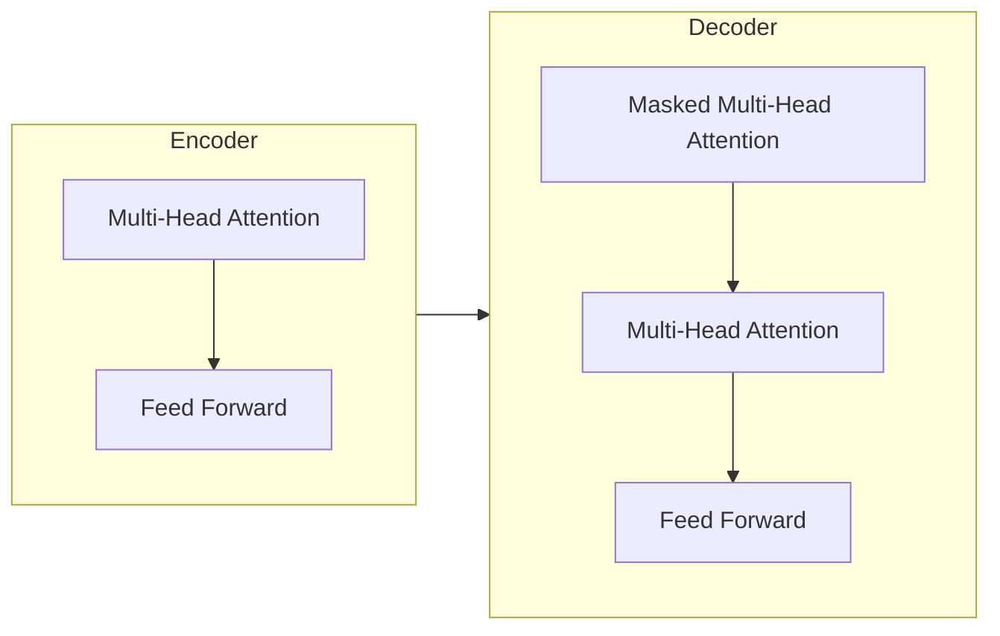
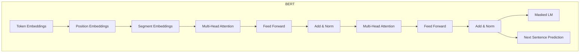

# Transformer大模型实战 BERT-base

## 1.背景介绍

在自然语言处理(NLP)领域,Transformer模型及其变体BERT(Bidirectional Encoder Representations from Transformers)取得了巨大成功,成为当前最先进的语言模型之一。BERT通过预训练和微调两阶段学习,能够捕捉文本的深层语义表示,广泛应用于文本分类、问答系统、机器翻译等各种下游任务。

### 1.1 Transformer模型革命

2017年,Transformer模型在机器翻译任务中表现出色,打破了基于RNN(循环神经网络)的模型框架。Transformer完全基于注意力机制,摒弃了RNN的递归结构,更易于并行计算,有效解决了长期依赖问题。自注意力机制使其能够捕捉输入序列中任意两个位置间的关系,显著提高了模型性能。

### 1.2 BERT模型的重大突破 

2018年,谷歌推出了BERT模型,在NLP领域掀起了新的革命浪潮。BERT通过Transformer的Encoder结构,以双向无监督方式预训练语言模型,学习文本的上下文语义表示。与传统单向语言模型相比,BERT能更好地理解句子的语境,为下游任务带来显著性能提升。

## 2.核心概念与联系

### 2.1 Transformer模型架构

Transformer模型主要由编码器(Encoder)和解码器(Decoder)两部分组成。编码器将输入序列编码为高维向量表示,解码器则根据编码器输出及自身输入生成目标序列。



### 2.2 BERT模型结构

BERT模型由多层Transformer的Encoder堆叠而成,预训练时学习双向表示,包括两种无监督预训练任务:

1. **Masked Language Modeling(MLM)**: 随机掩码部分输入Token,模型需预测被掩码的Token。
2. **Next Sentence Prediction(NSP)**: 判断两个句子是否连续。



### 2.3 BERT-base与BERT-large

BERT有两个预训练版本:BERT-base和BERT-large,区别在于Transformer块数量、注意力头数和隐层大小。

- BERT-base: L=12层, H=768隐层, A=12注意力头
- BERT-large: L=24层, H=1024隐层, A=16注意力头

BERT-large在下游任务上通常表现更优,但需要更多计算资源。

## 3.核心算法原理具体操作步骤  

### 3.1 输入表示

BERT的输入由三部分组成:Token Embeddings、Segment Embeddings和Position Embeddings,将词汇、句子和位置信息融合到一个向量表示中。

1. **Token Embeddings**: 将输入Token(词汇)映射为embeddings向量。
2. **Segment Embeddings**: 标识Token属于句子A还是句子B。
3. **Position Embeddings**: 标识Token在句子中的位置。

$$\text{Input Representation} = \text{Token Embeddings} + \text{Position Embeddings} + \text{Segment Embeddings}$$

### 3.2 注意力机制

BERT使用Multi-Head Self-Attention机制,允许每个Token关注其他Token,捕捉长距离依赖关系。

对于序列 $X = (x_1, x_2, ..., x_n)$, 注意力机制计算如下:

$$\text{Attention}(Q, K, V) = \text{softmax}(\frac{QK^T}{\sqrt{d_k}})V$$

其中 $Q$、$K$、$V$ 分别为 Query、Key和Value,通过线性变换得自 $X$。

### 3.3 位置编码

由于Self-Attention没有捕捉位置信息的能力,BERT引入了Position Embeddings来注入位置信息。位置编码的计算公式为:

$$
PE_{(pos, 2i)} = \sin(pos / 10000^{2i / d_{model}})\\
PE_{(pos, 2i+1)} = \cos(pos / 10000^{2i / d_{model}})
$$

其中 $pos$ 为位置索引, $i$ 为维度索引。

### 3.4 BERT预训练

BERT通过两个无监督预训练任务学习通用语言表示:

1. **Masked LM**: 随机遮蔽15%的Token,模型需预测被遮蔽的Token。
2. **Next Sentence Prediction**: 判断两个句子是否连续,以捕捉句子间的关系。

预训练过程中,模型需最小化MLM和NSP两个任务的损失函数之和。

### 3.5 BERT微调

在下游任务上,BERT通过在预训练模型基础上追加一个输出层,并进行端到端的微调(fine-tuning),使模型适应特定任务。这种迁移学习方式大幅减少了标注数据需求,提高了性能。

## 4.数学模型和公式详细讲解举例说明

### 4.1 Self-Attention注意力机制

Self-Attention是Transformer的核心,它允许每个输入Token关注其他Token,捕捉长距离依赖关系。我们以一个简单例子来解释其计算过程:

假设输入序列为 $X = (x_1, x_2, x_3)$,我们计算 $x_3$ 对其他Token的注意力权重:

1. 将 $X$ 通过三个线性变换得到 Query($Q$)、Key($K$)和Value($V$)矩阵:

$$Q = X \cdot W_Q, \quad K = X \cdot W_K, \quad V = X \cdot W_V$$

其中 $W_Q$、$W_K$、$W_V$ 为可训练参数。

2. 计算 $x_3$ 对其他Token的注意力权重:

$$\begin{aligned}
\text{Attention}(x_3) &= \text{softmax}(\frac{Q_3 \cdot (K_1^T, K_2^T, K_3^T)}{\sqrt{d_k}}) \cdot (V_1, V_2, V_3)\\
&= \text{softmax}(\frac{1}{\sqrt{d_k}}[q_3 \cdot k_1^T, q_3 \cdot k_2^T, q_3 \cdot k_3^T]) \cdot [v_1, v_2, v_3]
\end{aligned}$$

其中 $d_k$ 为缩放因子,用于防止内积值过大导致梯度饱和。

3. $x_3$ 的表示为加权和:

$$x_3' = \text{Attention}(x_3) = \alpha_1 v_1 + \alpha_2 v_2 + \alpha_3 v_3$$

其中 $\alpha_i$ 为 $x_3$ 对 $x_i$ 的注意力权重。

通过Self-Attention,每个Token都可以关注其他Token,从而捕捉长距离依赖关系。

### 4.2 多头注意力机制

为了捕捉不同子空间的信息,BERT采用了Multi-Head Attention机制。具体做法是将Query、Key和Value分别通过不同的线性变换,并行计算多个注意力头,最后将所有头拼接:

$$\begin{aligned}
\text{MultiHead}(Q, K, V) &= \text{Concat}(\text{head}_1, ..., \text{head}_h) W^O\\
\text{where } \text{head}_i &= \text{Attention}(QW_i^Q, KW_i^K, VW_i^V)
\end{aligned}$$

其中 $W_i^Q$、$W_i^K$、$W_i^V$ 和 $W^O$ 为可训练参数。

### 4.3 BERT损失函数

BERT预训练阶段的损失函数为MLM和NSP两个任务损失之和:

$$\mathcal{L} = \mathcal{L}_{\text{MLM}} + \mathcal{L}_{\text{NSP}}$$

其中MLM损失为:

$$\mathcal{L}_{\text{MLM}} = -\sum_{i=1}^{N} \log P(x_i^\text{masked} | \mathbf{x}^\text{masked}, \theta)$$

NSP损失为:

$$\mathcal{L}_{\text{NSP}} = -\log P(y | \mathbf{x}^A, \mathbf{x}^B, \theta)$$

这里 $\theta$ 为BERT模型参数, $y$ 为两句是否连续的标签。

## 5.项目实践：代码实例和详细解释说明

以下是使用Hugging Face Transformers库对BERT-base进行微调的Python代码示例,用于文本分类任务:

```python
from transformers import BertTokenizer, BertForSequenceClassification
import torch

# 加载预训练模型和分词器
model = BertForSequenceClassification.from_pretrained('bert-base-uncased')
tokenizer = BertTokenizer.from_pretrained('bert-base-uncased')

# 示例输入
text = "This is a great movie!"
encoding = tokenizer.encode_plus(
    text,
    add_special_tokens=True,
    max_length=64,
    padding='max_length',
    truncation=True,
    return_tensors='pt'
)

# 前向传播
output = model(**encoding)
logits = output.logits

# 预测类别
pred = torch.argmax(logits, dim=1).tolist()[0]
print(f"Predicted class: {pred}")
```

代码解释:

1. 导入必要的模块和预训练BERT模型。
2. 使用`tokenizer`将文本转换为BERT输入格式,包括Token ID、Attention Mask和Token Type ID。
3. 将编码后的输入传递给`BertForSequenceClassification`模型进行前向计算。
4. 从模型输出中获取logits(未归一化的分数),并使用`argmax`获取预测的类别索引。

在实际项目中,你还需要准备训练数据、定义训练循环、计算损失和优化器更新等步骤。Hugging Face提供了一致的API,使BERT在各种NLP任务上的微调过程变得简单高效。

## 6.实际应用场景

BERT及其变体模型在自然语言处理领域有着广泛的应用,主要包括但不限于:

1. **文本分类**: 将文本分配到预定义的类别,如情感分析、新闻分类等。
2. **命名实体识别(NER)**: 识别文本中的人名、地名、组织机构名等实体。
3. **问答系统(QA)**: 根据给定的上下文,回答相关问题。
4. **机器翻译**: 将一种语言的文本翻译成另一种语言。
5. **文本摘要**: 自动生成文本的摘要或概述。
6. **自然语言推理**: 判断一个假设是否能从给定的前提中推导出来。

此外,BERT在一些特殊领域也有应用,如生物医学文献挖掘、法律文本分析等。随着BERT模型的不断改进和新型变体的出现,其应用场景也在不断扩大。

## 7.工具和资源推荐

对于想要学习和使用BERT模型的开发者,以下是一些推荐的工具和资源:

1. **Hugging Face Transformers**: 提供了BERT等多种预训练模型的代码实现,并支持各种下游任务的微调,是目前最流行的NLP工具库。
2. **TensorFlow官方模型**: TensorFlow提供了BERT的官方实现,包括预训练模型和示例代码。
3. **PyTorch官方模型**: PyTorch也有BERT的官方实现,适合熟悉PyTorch的开发者使用。
4. **Google AI博客**: 谷歌AI团队在这里分享了BERT的技术细节和最新进展。
5. **Papers With Code**: 收集了BERT相关的论文、代码和模型,是研究BERT的绝佳资源。
6. **BERT相关书籍**: 如《Natural Language Processing with Transformers》、《Transformer模型与自然语言处理》等,对BERT原理和应用有深入探讨。

此外,一些在线课程和教程也可以帮助开发者快速入门BERT模型。选择合适的工具和资源,结合实践经验,将有助于更好地掌握BERT及其在NLP领域的应用。

## 8.总结:未来发展趋势与挑战

BERT模型自问世以来,在NLP领域掀起了新的浪