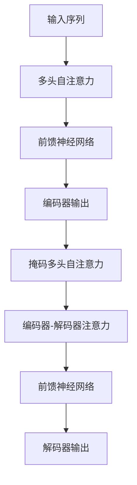

# Transformer大模型实战 俄语的RuBERT 模型

## 1.背景介绍

### 1.1 自然语言处理的重要性

在当今的数字时代,自然语言处理(NLP)技术已经成为人工智能领域中最重要和最具影响力的分支之一。作为人类与机器之间沟通的桥梁,NLP技术使计算机能够理解、处理和生成人类语言,从而实现智能系统与人类的自然交互。

### 1.2 预训练语言模型的兴起

传统的NLP方法主要依赖于人工设计的特征工程,需要大量的领域知识和人工努力。而近年来,预训练语言模型(Pre-trained Language Model,PLM)的出现,极大地推动了NLP技术的发展。这些模型通过在大规模语料库上进行自监督学习,获取了丰富的语言知识,为下游任务提供了强大的语义表示能力。

### 1.3 Transformer模型的革命性影响

2017年,Transformer模型在机器翻译任务中取得了突破性的成功,它完全摒弃了传统的循环神经网络结构,采用了全新的自注意力机制,能够有效地捕捉长距离依赖关系。Transformer模型的出现,不仅推动了机器翻译技术的飞跃发展,也为NLP领域带来了深远的影响。

### 1.4 RuBERT:俄语预训练语言模型

作为一种重要的世界语言,俄语在政治、经济、文化等多个领域扮演着重要角色。然而,与英语等主流语言相比,俄语在NLP领域的研究和应用相对滞后。为了弥补这一空白,DeepPavlov团队开发了RuBERT,这是一个基于Transformer模型的俄语预训练语言模型,旨在为俄语NLP任务提供强大的语义表示能力。

## 2.核心概念与联系

### 2.1 Transformer模型架构

Transformer模型的核心架构由编码器(Encoder)和解码器(Decoder)两个部分组成,如下Mermaid流程图所示:



编码器的主要作用是捕捉输入序列中的上下文信息,而解码器则负责根据编码器的输出生成目标序列。两者之间通过编码器-解码器注意力机制进行交互。

### 2.2 自注意力机制

自注意力机制是Transformer模型的核心创新,它允许模型在计算目标位置的表示时,直接关注整个输入序列的所有位置,捕捉长距离依赖关系。多头自注意力机制则进一步提高了模型的表示能力。

### 2.3 BERT模型

BERT(Bidirectional Encoder Representations from Transformers)是一种基于Transformer的双向编码器模型,通过掩蔽语言模型(Masked Language Model)和下一句预测(Next Sentence Prediction)两个预训练任务,学习到了深层次的语义表示。BERT模型在多个NLP任务上取得了卓越的表现,成为了预训练语言模型的里程碑式作品。

### 2.4 RuBERT模型

RuBERT是DeepPavlov团队基于BERT模型,针对俄语语料库训练得到的预训练语言模型。它采用了与BERT相同的预训练任务和模型架构,但在预训练语料库、词汇表、模型参数等方面进行了针对性的优化,使其更加适用于俄语NLP任务。

## 3.核心算法原理具体操作步骤

### 3.1 Transformer模型训练流程

1. **输入embedding**:将输入序列转换为embedding向量表示。
2. **位置编码**:为每个位置添加位置信息,捕捉序列的位置依赖关系。
3. **多头自注意力**:计算每个位置与其他位置的注意力权重,捕捉长距离依赖关系。
4. **前馈神经网络**:对注意力输出进行非线性变换,提取高阶特征。
5. **残差连接和层归一化**:加入残差连接和层归一化,提高模型的训练稳定性。
6. **编码器-解码器注意力**:解码器利用编码器的输出,计算目标序列的注意力权重。
7. **输出层**:根据解码器的输出,生成目标序列的概率分布。
8. **损失函数**:计算预测结果与真实标签之间的损失,反向传播更新模型参数。

### 3.2 BERT预训练任务

1. **掩蔽语言模型(Masked Language Model,MLM)**:随机掩蔽部分输入token,模型需要根据上下文预测被掩蔽的token。
2. **下一句预测(Next Sentence Prediction,NSP)**:判断两个句子是否为连续的句子对。

通过这两个预训练任务,BERT模型学习到了深层次的语义表示,为下游任务提供了强大的迁移能力。

### 3.3 RuBERT模型训练

RuBERT模型的训练过程与BERT基本相同,主要区别在于:

1. **预训练语料库**:使用大规模的俄语语料库,包括网页数据、新闻文本、书籍等。
2. **词汇表**:根据俄语语料库构建专门的词汇表,包含俄语特有的字符和单词。
3. **模型参数初始化**:使用多语种BERT模型的参数进行初始化,加速训练过程。
4. **微调**:在下游俄语NLP任务上进行微调,进一步提高模型的性能。

## 4.数学模型和公式详细讲解举例说明

### 4.1 自注意力机制

自注意力机制是Transformer模型的核心创新,它允许模型在计算目标位置的表示时,直接关注整个输入序列的所有位置,捕捉长距离依赖关系。具体计算过程如下:

给定输入序列 $X = (x_1, x_2, \dots, x_n)$,我们需要计算查询向量 $q$、键向量 $k$ 和值向量 $v$:

$$q = X W^Q$$
$$k = X W^K$$ 
$$v = X W^V$$

其中 $W^Q$、$W^K$ 和 $W^V$ 分别是查询、键和值的线性变换矩阵。

然后,我们计算查询向量与所有键向量的点积,得到注意力分数矩阵 $S$:

$$S = \frac{qk^T}{\sqrt{d_k}}$$

其中 $d_k$ 是键向量的维度,用于缩放注意力分数。

接下来,我们对注意力分数矩阵 $S$ 进行 softmax 操作,得到注意力权重矩阵 $A$:

$$A = \text{softmax}(S)$$

最后,我们将注意力权重矩阵 $A$ 与值向量 $v$ 相乘,得到自注意力的输出表示 $y$:

$$y = Av$$

多头自注意力机制则是将多个注意力头的输出进行拼接,捕捉不同的注意力模式。

### 4.2 BERT损失函数

BERT模型的预训练任务包括掩蔽语言模型(MLM)和下一句预测(NSP),对应的损失函数为:

$$\mathcal{L} = \mathcal{L}_{\text{MLM}} + \mathcal{L}_{\text{NSP}}$$

其中,MLM损失函数为:

$$\mathcal{L}_{\text{MLM}} = -\sum_{i=1}^{n} \log P(x_i^m | x^{\backslash m})$$

$x^{\backslash m}$ 表示除了被掩蔽的token之外的输入序列,目标是最大化被掩蔽token $x_i^m$ 的条件概率。

NSP损失函数为:

$$\mathcal{L}_{\text{NSP}} = -\log P(y | x_1, x_2)$$

其中 $y$ 表示两个句子是否为连续的句子对,目标是最大化正确标签的概率。

通过联合优化这两个损失函数,BERT模型学习到了深层次的语义表示,为下游任务提供了强大的迁移能力。

## 5.项目实践:代码实例和详细解释说明

以下是使用 Hugging Face 的 Transformers 库对 RuBERT 模型进行微调的示例代码:

```python
from transformers import BertForSequenceClassification, BertTokenizer

# 加载预训练模型和分词器
model = BertForSequenceClassification.from_pretrained("DeepPavlov/rubert-base-cased-sentence")
tokenizer = BertTokenizer.from_pretrained("DeepPavlov/rubert-base-cased-sentence")

# 定义文本分类任务
text = "Это был хороший фильм."
inputs = tokenizer(text, return_tensors="pt")

# 模型预测
outputs = model(**inputs)
logits = outputs.logits

# 获取预测结果
predicted_class = logits.argmax().item()
print(f"Predicted class: {predicted_class}")
```

代码解释:

1. 首先,我们从 Hugging Face 模型中心加载预训练的 RuBERT 模型和分词器。
2. 定义一个文本分类任务的示例输入文本。
3. 使用分词器对输入文本进行编码,得到模型所需的输入张量。
4. 将编码后的输入张量传递给模型,获取模型的输出 logits。
5. 从 logits 中选取概率最大的类别作为预测结果。

通过这个简单的示例,我们可以看到如何使用 RuBERT 模型进行下游任务的微调和推理。在实际应用中,您还需要准备训练数据、定义训练过程、评估模型性能等步骤。

## 6.实际应用场景

RuBERT 作为一种针对俄语优化的预训练语言模型,可以广泛应用于各种俄语 NLP 任务,例如:

1. **文本分类**: 将文本分类到预定义的类别中,如新闻分类、情感分析等。
2. **命名实体识别(NER)**: 识别文本中的人名、地名、组织机构名等实体。
3. **关系抽取**: 从文本中抽取实体之间的语义关系。
4. **问答系统**: 根据给定的问题,从文本中检索相关答案。
5. **机器翻译**: 将俄语文本翻译成其他语言,或从其他语言翻译成俄语。
6. **文本生成**: 根据给定的提示或上下文,生成连贯的俄语文本。

除了上述常见的 NLP 任务之外,RuBERT 还可以应用于俄语语音识别、语音合成、对话系统等多种场景,为俄语人工智能应用提供强大的语言理解和生成能力。

## 7.工具和资源推荐

在开发和应用 RuBERT 模型时,以下工具和资源可能会非常有用:

1. **Hugging Face Transformers库**: 提供了预训练模型的加载、微调和推理功能,支持多种 Transformer 模型。
2. **DeepPavlov**: 一个开源的对话AI库,包含了 RuBERT 模型及其预训练权重。
3. **俄语语料库**: 如 Russian Wikipedia、俄语新闻语料库等,可用于模型的进一步预训练或微调。
4. **标注数据集**: 针对特定任务(如文本分类、NER等)的俄语标注数据集,用于模型的微调和评估。
5. **评测基准**: 如 RUSSIANSUPERGLUE、RUCOS等,提供了多个俄语 NLP 任务的评测基准。
6. **在线演示**: DeepPavlov 提供了 RuBERT 模型的在线演示,方便快速体验模型的能力。

利用这些工具和资源,您可以更高效地开发和部署基于 RuBERT 的俄语 NLP 应用。

## 8.总结:未来发展趋势与挑战

RuBERT 的出现为俄语 NLP 领域带来了新的机遇和发展动力。然而,与英语等主流语言相比,俄语 NLP 仍然面临一些挑战和发展方向:

1. **数据资源不足**: 相比于英语,高质量的俄语语料库和标注数据集仍然较为缺乏,限制了模型的性能提升。
2. **多语种迁移**: 探索如何将多语种预训练模型的知识有效迁移到