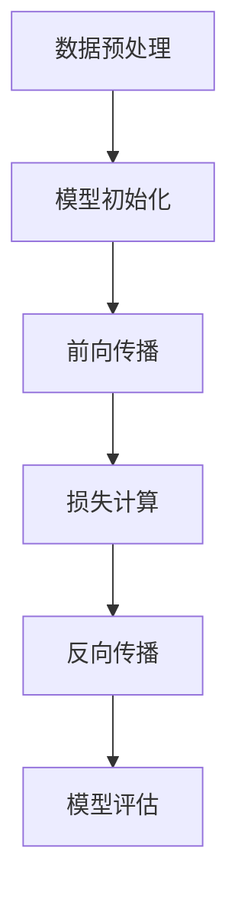

# Transformer大模型实战 训练ALBERT 模型

## 1.背景介绍

在自然语言处理（NLP）领域，Transformer架构已经成为了主流。自从Vaswani等人在2017年提出Transformer以来，基于这一架构的模型如BERT、GPT、T5等相继问世，并在各种NLP任务中取得了显著的效果。ALBERT（A Lite BERT）是BERT的一个轻量级版本，通过参数共享和分解嵌入矩阵等技术，显著减少了模型参数量，同时保持了性能。

ALBERT的设计目标是解决BERT模型在参数量和计算资源上的瓶颈，使得大规模预训练模型在实际应用中更加高效和可行。本文将详细介绍ALBERT模型的核心概念、算法原理、数学模型、项目实践、实际应用场景、工具和资源推荐，并探讨其未来发展趋势与挑战。

## 2.核心概念与联系

### 2.1 Transformer架构

Transformer架构是基于自注意力机制的深度学习模型，主要由编码器和解码器组成。其核心组件包括多头自注意力机制、前馈神经网络、残差连接和层归一化。

### 2.2 BERT模型

BERT（Bidirectional Encoder Representations from Transformers）是基于Transformer编码器的双向语言模型，通过掩码语言模型（MLM）和下一句预测（NSP）任务进行预训练。

### 2.3 ALBERT模型

ALBERT是BERT的轻量级版本，通过以下技术实现参数量的减少：
- **参数共享**：在所有层之间共享参数，减少了模型的参数量。
- **分解嵌入矩阵**：将大词汇表的嵌入矩阵分解为两个小矩阵的乘积，进一步减少参数量。

### 2.4 核心联系

ALBERT继承了BERT的双向编码器结构，但通过参数共享和分解嵌入矩阵等技术，显著减少了模型的参数量和计算资源需求。

## 3.核心算法原理具体操作步骤

### 3.1 参数共享

在ALBERT中，所有层之间共享参数，这意味着每一层的权重矩阵都是相同的。这种方法不仅减少了参数量，还使得模型在训练过程中更加稳定。

### 3.2 分解嵌入矩阵

ALBERT通过将大词汇表的嵌入矩阵分解为两个小矩阵的乘积来减少参数量。具体来说，假设原始嵌入矩阵为 $E \in \mathbb{R}^{V \times H}$，其中 $V$ 是词汇表大小，$H$ 是嵌入维度。ALBERT将其分解为两个矩阵 $E_1 \in \mathbb{R}^{V \times E}$ 和 $E_2 \in \mathbb{R}^{E \times H}$，其中 $E$ 是一个较小的维度。

### 3.3 训练步骤

1. **数据预处理**：对输入文本进行分词、标注和掩码处理。
2. **模型初始化**：初始化ALBERT模型的参数。
3. **前向传播**：通过多层共享参数的Transformer编码器进行前向传播。
4. **损失计算**：计算掩码语言模型（MLM）和下一句预测（NSP）的损失。
5. **反向传播**：通过反向传播算法更新模型参数。
6. **模型评估**：在验证集上评估模型性能。

以下是ALBERT模型的Mermaid流程图：



## 4.数学模型和公式详细讲解举例说明

### 4.1 自注意力机制

自注意力机制是Transformer的核心组件，其计算公式如下：

$$
\text{Attention}(Q, K, V) = \text{softmax}\left(\frac{QK^T}{\sqrt{d_k}}\right)V
$$

其中，$Q$、$K$、$V$ 分别表示查询、键和值矩阵，$d_k$ 是键的维度。

### 4.2 多头自注意力

多头自注意力机制通过并行计算多个自注意力头，然后将其拼接并线性变换：

$$
\text{MultiHead}(Q, K, V) = \text{Concat}(\text{head}_1, \ldots, \text{head}_h)W^O
$$

其中，$\text{head}_i = \text{Attention}(QW_i^Q, KW_i^K, VW_i^V)$，$W_i^Q$、$W_i^K$、$W_i^V$ 和 $W^O$ 是可训练的权重矩阵。

### 4.3 分解嵌入矩阵

ALBERT通过分解嵌入矩阵来减少参数量：

$$
E = E_1 \times E_2
$$

其中，$E_1 \in \mathbb{R}^{V \times E}$，$E_2 \in \mathbb{R}^{E \times H}$，$V$ 是词汇表大小，$H$ 是嵌入维度，$E$ 是一个较小的维度。

### 4.4 损失函数

ALBERT的损失函数包括掩码语言模型（MLM）和下一句预测（NSP）：

$$
\mathcal{L} = \mathcal{L}_{\text{MLM}} + \mathcal{L}_{\text{NSP}}
$$

其中，$\mathcal{L}_{\text{MLM}}$ 是掩码语言模型的交叉熵损失，$\mathcal{L}_{\text{NSP}}$ 是下一句预测的交叉熵损失。

## 5.项目实践：代码实例和详细解释说明

### 5.1 环境准备

首先，确保你已经安装了必要的Python库，如TensorFlow或PyTorch，以及Transformers库。

```bash
pip install tensorflow transformers
```

### 5.2 数据预处理

使用Transformers库中的Tokenizer对输入文本进行分词和掩码处理。

```python
from transformers import AlbertTokenizer

tokenizer = AlbertTokenizer.from_pretrained('albert-base-v2')
text = "这是一个示例文本。"
inputs = tokenizer(text, return_tensors='tf', max_length=128, truncation=True, padding='max_length')
```

### 5.3 模型初始化

初始化ALBERT模型。

```python
from transformers import TFAlbertModel

model = TFAlbertModel.from_pretrained('albert-base-v2')
```

### 5.4 前向传播

通过模型进行前向传播。

```python
outputs = model(inputs)
last_hidden_states = outputs.last_hidden_state
```

### 5.5 损失计算和反向传播

定义损失函数并进行反向传播。

```python
import tensorflow as tf

loss_fn = tf.keras.losses.SparseCategoricalCrossentropy(from_logits=True)
optimizer = tf.keras.optimizers.Adam(learning_rate=3e-5)

with tf.GradientTape() as tape:
    outputs = model(inputs)
    logits = outputs.logits
    loss = loss_fn(labels, logits)

grads = tape.gradient(loss, model.trainable_variables)
optimizer.apply_gradients(zip(grads, model.trainable_variables))
```

### 5.6 模型评估

在验证集上评估模型性能。

```python
from sklearn.metrics import accuracy_score

predictions = tf.argmax(logits, axis=-1)
accuracy = accuracy_score(labels, predictions)
print(f'Validation Accuracy: {accuracy}')
```

## 6.实际应用场景

### 6.1 文本分类

ALBERT可以用于各种文本分类任务，如情感分析、垃圾邮件检测等。通过预训练模型进行微调，可以在特定任务上取得优异的性能。

### 6.2 问答系统

ALBERT在问答系统中表现出色，特别是在SQuAD等数据集上。通过微调，ALBERT可以理解上下文并生成准确的答案。

### 6.3 机器翻译

虽然ALBERT主要用于编码任务，但其编码器部分可以与解码器结合，用于机器翻译任务。

### 6.4 语义相似度计算

ALBERT可以用于计算两个文本的语义相似度，应用于文本匹配、信息检索等场景。

## 7.工具和资源推荐

### 7.1 开源库

- **Transformers**：由Hugging Face提供的开源库，支持多种预训练模型，包括ALBERT。
- **TensorFlow**：谷歌开发的深度学习框架，支持ALBERT的训练和推理。
- **PyTorch**：Facebook开发的深度学习框架，支持ALBERT的训练和推理。

### 7.2 数据集

- **SQuAD**：用于问答系统的标准数据集。
- **GLUE**：用于多种NLP任务的基准数据集。
- **IMDB**：用于情感分析的电影评论数据集。

### 7.3 在线资源

- **Hugging Face Model Hub**：提供预训练模型和微调模型的下载。
- **TensorFlow Hub**：提供预训练模型的下载和使用示例。
- **PyTorch Hub**：提供预训练模型的下载和使用示例。

## 8.总结：未来发展趋势与挑战

### 8.1 未来发展趋势

- **模型压缩与加速**：未来的研究将继续致力于模型压缩与加速，使得大规模预训练模型在资源受限的环境中也能高效运行。
- **多模态学习**：结合文本、图像、音频等多种模态的信息，提升模型的理解能力和应用范围。
- **自监督学习**：进一步探索自监督学习方法，减少对大规模标注数据的依赖。

### 8.2 挑战

- **计算资源需求**：尽管ALBERT已经显著减少了参数量，但大规模预训练模型仍然需要大量的计算资源。
- **数据隐私与安全**：在实际应用中，如何保护用户数据的隐私和安全是一个重要的挑战。
- **模型泛化能力**：如何提升模型在不同任务和领域中的泛化能力，仍然是一个亟待解决的问题。

## 9.附录：常见问题与解答

### 9.1 ALBERT与BERT的主要区别是什么？

ALBERT通过参数共享和分解嵌入矩阵等技术，显著减少了模型的参数量，而BERT没有这些优化。

### 9.2 如何选择适合的预训练模型？

选择预训练模型时，需要考虑任务的具体需求、计算资源和模型的性能。对于资源受限的环境，ALBERT是一个不错的选择。

### 9.3 如何微调ALBERT模型？

微调ALBERT模型的步骤包括数据预处理、模型初始化、定义损失函数和优化器、进行前向传播和反向传播、在验证集上评估模型性能。

### 9.4 ALBERT可以应用于哪些NLP任务？

ALBERT可以应用于文本分类、问答系统、机器翻译、语义相似度计算等多种NLP任务。

### 9.5 如何提升ALBERT模型的性能？

可以通过增加训练数据、调整超参数、使用更大的预训练模型等方法来提升ALBERT模型的性能。

---

作者：禅与计算机程序设计艺术 / Zen and the Art of Computer Programming