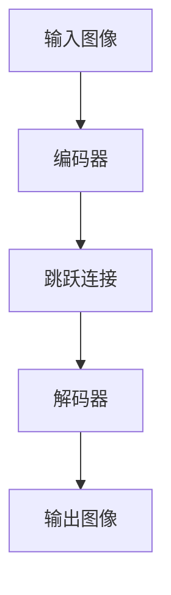
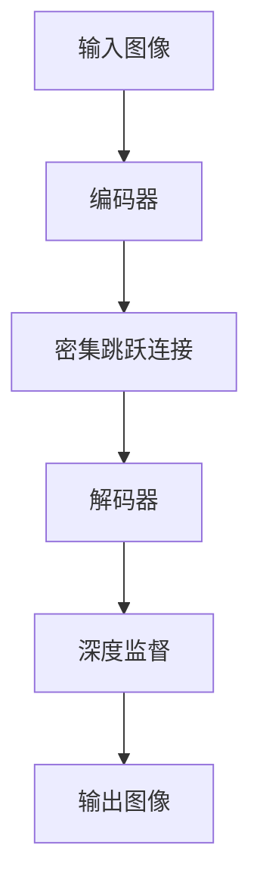

# U-Net++原理与代码实例讲解

## 1.背景介绍

在医学图像处理领域，图像分割是一个至关重要的任务。U-Net作为一种经典的卷积神经网络架构，已经在医学图像分割中取得了显著的成功。然而，随着需求的增加和技术的进步，U-Net的局限性也逐渐显现出来。U-Net++作为U-Net的改进版本，通过引入密集跳跃连接和深度监督机制，进一步提升了分割性能。本文将详细介绍U-Net++的原理、算法、数学模型、代码实例及其实际应用场景。

## 2.核心概念与联系

### 2.1 U-Net架构回顾

U-Net是一种编码器-解码器结构的卷积神经网络。其主要特点是通过跳跃连接将编码器和解码器的特征图进行融合，从而保留更多的细节信息。U-Net的基本结构如下：



### 2.2 U-Net++的改进

U-Net++在U-Net的基础上进行了两大改进：

1. **密集跳跃连接**：通过引入密集跳跃连接，U-Net++能够更好地融合不同层次的特征，提高分割精度。
2. **深度监督**：在解码器的每一层都引入了监督信号，使得网络在训练过程中能够更快地收敛。



## 3.核心算法原理具体操作步骤

### 3.1 编码器部分

编码器部分由多个卷积层和池化层组成，其主要作用是提取图像的高层次特征。每个卷积层后面都跟有一个ReLU激活函数和一个最大池化层。

### 3.2 密集跳跃连接

在U-Net++中，密集跳跃连接通过将不同层次的特征图进行融合，从而保留更多的细节信息。具体操作步骤如下：

1. 将编码器的每一层特征图与解码器的每一层特征图进行连接。
2. 对连接后的特征图进行卷积操作，得到新的特征图。

### 3.3 解码器部分

解码器部分由多个反卷积层和卷积层组成，其主要作用是将高层次特征还原为原始图像的分割结果。每个反卷积层后面都跟有一个ReLU激活函数和一个卷积层。

### 3.4 深度监督

在解码器的每一层都引入了监督信号，使得网络在训练过程中能够更快地收敛。具体操作步骤如下：

1. 在解码器的每一层输出一个分割结果。
2. 将每一层的分割结果与真实标签进行比较，计算损失函数。
3. 将所有层的损失函数进行加权求和，得到最终的损失函数。

## 4.数学模型和公式详细讲解举例说明

### 4.1 卷积操作

卷积操作是卷积神经网络的核心，其数学表达式为：

$$
Y(i, j) = \sum_{m=0}^{M-1} \sum_{n=0}^{N-1} X(i+m, j+n) \cdot K(m, n)
$$

其中，$X$表示输入特征图，$K$表示卷积核，$Y$表示输出特征图。

### 4.2 池化操作

池化操作用于降低特征图的分辨率，其数学表达式为：

$$
Y(i, j) = \max_{0 \leq m < M, 0 \leq n < N} X(i+m, j+n)
$$

其中，$X$表示输入特征图，$Y$表示输出特征图。

### 4.3 反卷积操作

反卷积操作用于将低分辨率的特征图还原为高分辨率的特征图，其数学表达式为：

$$
Y(i, j) = \sum_{m=0}^{M-1} \sum_{n=0}^{N-1} X(i-m, j-n) \cdot K(m, n)
$$

其中，$X$表示输入特征图，$K$表示反卷积核，$Y$表示输出特征图。

### 4.4 损失函数

U-Net++的损失函数由多个部分组成，其数学表达式为：

$$
L = \sum_{l=1}^{L} \alpha_l \cdot L_l
$$

其中，$L$表示总损失函数，$L_l$表示第$l$层的损失函数，$\alpha_l$表示第$l$层的权重。

## 5.项目实践：代码实例和详细解释说明

### 5.1 环境配置

首先，我们需要配置Python环境，并安装必要的库：

```bash
pip install tensorflow keras numpy matplotlib
```

### 5.2 数据预处理

在进行模型训练之前，我们需要对数据进行预处理。以下是一个简单的数据预处理示例：

```python
import numpy as np
import matplotlib.pyplot as plt
from tensorflow.keras.preprocessing.image import load_img, img_to_array

def preprocess_image(image_path, target_size=(128, 128)):
    image = load_img(image_path, target_size=target_size)
    image = img_to_array(image)
    image = image / 255.0
    return image

image = preprocess_image('path_to_image.jpg')
plt.imshow(image)
plt.show()
```

### 5.3 模型构建

接下来，我们构建U-Net++模型：

```python
from tensorflow.keras.layers import Input, Conv2D, MaxPooling2D, UpSampling2D, concatenate
from tensorflow.keras.models import Model

def unet_plus_plus(input_size=(128, 128, 3)):
    inputs = Input(input_size)
    
    # 编码器部分
    conv1 = Conv2D(64, 3, activation='relu', padding='same')(inputs)
    conv1 = Conv2D(64, 3, activation='relu', padding='same')(conv1)
    pool1 = MaxPooling2D(pool_size=(2, 2))(conv1)
    
    conv2 = Conv2D(128, 3, activation='relu', padding='same')(pool1)
    conv2 = Conv2D(128, 3, activation='relu', padding='same')(conv2)
    pool2 = MaxPooling2D(pool_size=(2, 2))(conv2)
    
    # 密集跳跃连接
    up1 = UpSampling2D(size=(2, 2))(conv2)
    merge1 = concatenate([conv1, up1], axis=3)
    conv3 = Conv2D(64, 3, activation='relu', padding='same')(merge1)
    conv3 = Conv2D(64, 3, activation='relu', padding='same')(conv3)
    
    # 解码器部分
    up2 = UpSampling2D(size=(2, 2))(conv3)
    merge2 = concatenate([inputs, up2], axis=3)
    conv4 = Conv2D(64, 3, activation='relu', padding='same')(merge2)
    conv4 = Conv2D(64, 3, activation='relu', padding='same')(conv4)
    
    # 输出层
    outputs = Conv2D(1, 1, activation='sigmoid')(conv4)
    
    model = Model(inputs, outputs)
    return model

model = unet_plus_plus()
model.compile(optimizer='adam', loss='binary_crossentropy', metrics=['accuracy'])
model.summary()
```

### 5.4 模型训练

我们使用预处理后的数据进行模型训练：

```python
from tensorflow.keras.callbacks import ModelCheckpoint, EarlyStopping

# 加载数据
X_train = np.load('X_train.npy')
Y_train = np.load('Y_train.npy')

# 定义回调函数
checkpoint = ModelCheckpoint('unet_plus_plus.h5', monitor='val_loss', save_best_only=True)
early_stopping = EarlyStopping(monitor='val_loss', patience=10)

# 训练模型
history = model.fit(X_train, Y_train, validation_split=0.2, epochs=50, batch_size=16, callbacks=[checkpoint, early_stopping])
```

### 5.5 模型评估

最后，我们评估模型的性能：

```python
# 加载测试数据
X_test = np.load('X_test.npy')
Y_test = np.load('Y_test.npy')

# 评估模型
loss, accuracy = model.evaluate(X_test, Y_test)
print(f'Test Loss: {loss}')
print(f'Test Accuracy: {accuracy}')
```

## 6.实际应用场景

U-Net++在多个实际应用场景中表现出色，以下是几个典型的应用场景：

### 6.1 医学图像分割

U-Net++在医学图像分割中表现尤为突出，特别是在肿瘤分割、器官分割等任务中。其高精度和高效率使得医生能够更准确地进行诊断和治疗。

### 6.2 遥感图像处理

在遥感图像处理领域，U-Net++被广泛应用于土地覆盖分类、建筑物检测等任务。其多层次特征融合能力使得其在复杂场景下依然能够保持高精度。

### 6.3 自动驾驶

U-Net++在自动驾驶中的应用主要集中在道路分割、车道线检测等任务中。其高效的分割能力使得自动驾驶系统能够更准确地感知周围环境，提高行车安全性。

## 7.工具和资源推荐

### 7.1 开源框架

- **TensorFlow**：一个开源的机器学习框架，支持多种深度学习模型的构建和训练。
- **Keras**：一个高级神经网络API，能够快速构建和训练深度学习模型。

### 7.2 数据集

- **ISIC 2018**：一个皮肤病变分割数据集，包含大量的皮肤病变图像及其分割标签。
- **Cityscapes**：一个城市景观分割数据集，包含大量的城市街景图像及其分割标签。

### 7.3 参考文献

- **U-Net++: A Nested U-Net Architecture for Medical Image Segmentation**：U-Net++的原始论文，详细介绍了其架构和实验结果。
- **Deep Learning for Medical Image Segmentation: A Review**：一篇综述文章，详细介绍了深度学习在医学图像分割中的应用。

## 8.总结：未来发展趋势与挑战

### 8.1 未来发展趋势

随着深度学习技术的不断进步，U-Net++及其变种将在更多的应用场景中得到广泛应用。未来的发展趋势主要包括：

1. **更高效的模型架构**：通过引入新的模型架构和优化算法，进一步提升分割精度和效率。
2. **多模态数据融合**：通过融合多种模态的数据，提高模型的鲁棒性和泛化能力。
3. **自动化模型设计**：通过自动化机器学习技术，自动设计和优化模型架构，减少人工干预。

### 8.2 挑战

尽管U-Net++在多个领域取得了显著的成功，但仍然面临一些挑战：

1. **数据依赖性**：深度学习模型对大规模、高质量的数据依赖较大，数据获取和标注成本较高。
2. **计算资源需求**：深度学习模型的训练和推理过程需要大量的计算资源，特别是在处理高分辨率图像时。
3. **模型解释性**：深度学习模型的黑箱特性使得其解释性较差，难以理解其内部工作机制。

## 9.附录：常见问题与解答

### 9.1 U-Net++与U-Net的主要区别是什么？

U-Net++在U-Net的基础上引入了密集跳跃连接和深度监督机制，从而提高了分割精度和效率。

### 9.2 如何选择合适的损失函数？

在医学图像分割任务中，常用的损失函数包括交叉熵损失、Dice损失等。可以根据具体任务和数据特点选择合适的损失函数。

### 9.3 如何处理数据不平衡问题？

可以通过数据增强、重采样、加权损失函数等方法来处理数据不平衡问题。

### 9.4 U-Net++是否适用于实时应用？

U-Net++的计算复杂度较高，实时应用中需要进行模型压缩和加速优化。

### 9.5 如何评估模型性能？

可以通过交叉验证、混淆矩阵、ROC曲线等方法来评估模型性能。

---

作者：禅与计算机程序设计艺术 / Zen and the Art of Computer Programming