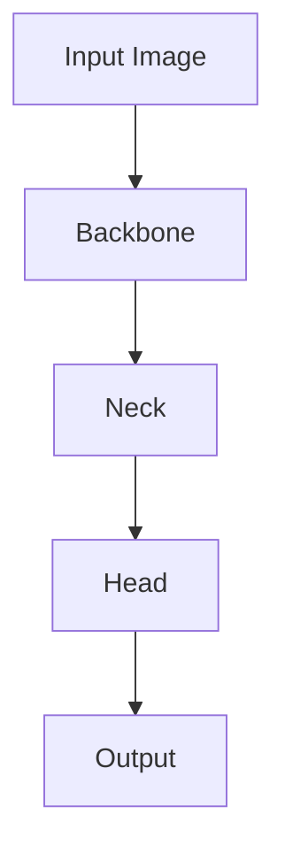

# YOLOv7原理与代码实例讲解

## 1.背景介绍

在计算机视觉领域，目标检测一直是一个重要的研究方向。目标检测的任务是识别图像中的所有目标，并确定每个目标的类别和位置。近年来，深度学习技术的快速发展使得目标检测算法取得了显著的进步。YOLO（You Only Look Once）系列算法作为其中的佼佼者，以其高效的实时性能和较高的检测精度受到了广泛关注。

YOLOv7是YOLO系列的最新版本，它在保持高效性的同时进一步提升了检测精度。本文将深入探讨YOLOv7的核心概念、算法原理、数学模型，并通过代码实例展示其实际应用。

## 2.核心概念与联系

### 2.1 YOLO系列的演变

YOLO系列算法自YOLOv1发布以来，经历了多个版本的迭代，每个版本都在性能和精度上有所提升。以下是YOLO系列的主要版本及其特点：

- **YOLOv1**：首次提出了将目标检测问题转化为回归问题的思路，实现了端到端的目标检测。
- **YOLOv2**：引入了Batch Normalization、Anchor Boxes等技术，提升了检测精度。
- **YOLOv3**：采用了多尺度特征融合的策略，进一步提高了小目标的检测能力。
- **YOLOv4**：引入了CSPNet、Mish激活函数等新技术，显著提升了检测性能。
- **YOLOv5**：虽然命名上是YOLO系列，但实际上是由Ultralytics团队开发的，进一步优化了模型结构和训练策略。
- **YOLOv7**：在YOLOv4的基础上进行了改进，采用了新的网络结构和训练方法，进一步提升了检测精度和速度。

### 2.2 YOLOv7的核心创新

YOLOv7在以下几个方面进行了创新：

- **Efficient Layer Aggregation Networks (ELAN)**：通过引入高效的层聚合网络，提升了特征提取的能力。
- **Dynamic Head**：采用动态头部结构，根据输入图像的特征自适应调整检测头，提高了检测精度。
- **Anchor-free Mechanism**：引入了无锚机制，减少了锚框的设计复杂度，提高了检测效率。

## 3.核心算法原理具体操作步骤

### 3.1 网络结构

YOLOv7的网络结构可以分为三个主要部分：Backbone、Neck和Head。以下是YOLOv7的网络结构图：



- **Backbone**：负责提取图像的基础特征，通常采用预训练的卷积神经网络。
- **Neck**：通过多尺度特征融合，进一步提取高层次特征。
- **Head**：根据特征图进行目标分类和定位。

### 3.2 特征提取

YOLOv7采用了ELAN结构，通过多层特征的聚合，提升了特征提取的能力。具体操作步骤如下：

1. **输入图像**：将输入图像进行预处理，调整到固定尺寸。
2. **卷积层**：通过一系列卷积层提取基础特征。
3. **ELAN模块**：通过多层特征的聚合，提升特征提取的能力。

### 3.3 多尺度特征融合

YOLOv7通过Neck部分的多尺度特征融合，提升了对不同尺度目标的检测能力。具体操作步骤如下：

1. **特征金字塔**：构建特征金字塔，提取不同尺度的特征图。
2. **特征融合**：通过上采样和下采样操作，将不同尺度的特征图进行融合。

### 3.4 动态头部结构

YOLOv7的Head部分采用了动态头部结构，根据输入图像的特征自适应调整检测头。具体操作步骤如下：

1. **特征图输入**：将Neck部分输出的特征图输入到Head部分。
2. **动态调整**：根据特征图的特征，自适应调整检测头的参数。
3. **目标分类和定位**：通过分类和回归操作，输出目标的类别和位置。

## 4.数学模型和公式详细讲解举例说明

### 4.1 损失函数

YOLOv7的损失函数由三部分组成：分类损失、定位损失和置信度损失。具体公式如下：

$$
L = L_{cls} + L_{loc} + L_{conf}
$$

其中：

- $L_{cls}$：分类损失，采用交叉熵损失函数。
- $L_{loc}$：定位损失，采用平滑L1损失函数。
- $L_{conf}$：置信度损失，采用二元交叉熵损失函数。

### 4.2 分类损失

分类损失用于衡量预测类别与真实类别之间的差异，公式如下：

$$
L_{cls} = -\sum_{i=1}^{N} y_i \log(p_i)
$$

其中，$y_i$为真实类别，$p_i$为预测概率。

### 4.3 定位损失

定位损失用于衡量预测框与真实框之间的差异，公式如下：

$$
L_{loc} = \sum_{i=1}^{N} \text{smooth}_{L1}(t_i - t_i^*)
$$

其中，$t_i$为预测框参数，$t_i^*$为真实框参数。

### 4.4 置信度损失

置信度损失用于衡量预测框是否包含目标的置信度，公式如下：

$$
L_{conf} = -\sum_{i=1}^{N} [y_i \log(p_i) + (1 - y_i) \log(1 - p_i)]
$$

其中，$y_i$为真实置信度，$p_i$为预测置信度。

## 5.项目实践：代码实例和详细解释说明

### 5.1 环境配置

在开始项目实践之前，我们需要配置好开发环境。以下是所需的主要工具和库：

- Python 3.8+
- PyTorch 1.7+
- OpenCV
- Numpy

可以通过以下命令安装所需库：

```bash
pip install torch torchvision opencv-python numpy
```

### 5.2 数据准备

我们将使用COCO数据集进行训练和测试。可以通过以下命令下载COCO数据集：

```bash
# 下载COCO数据集
wget http://images.cocodataset.org/zips/train2017.zip
wget http://images.cocodataset.org/zips/val2017.zip
wget http://images.cocodataset.org/annotations/annotations_trainval2017.zip

# 解压数据集
unzip train2017.zip
unzip val2017.zip
unzip annotations_trainval2017.zip
```

### 5.3 模型定义

以下是YOLOv7模型的定义代码：

```python
import torch
import torch.nn as nn

class YOLOv7(nn.Module):
    def __init__(self, num_classes):
        super(YOLOv7, self).__init__()
        self.backbone = self._build_backbone()
        self.neck = self._build_neck()
        self.head = self._build_head(num_classes)

    def _build_backbone(self):
        # 定义Backbone部分
        layers = []
        # 添加卷积层、ELAN模块等
        return nn.Sequential(*layers)

    def _build_neck(self):
        # 定义Neck部分
        layers = []
        # 添加特征金字塔、特征融合等
        return nn.Sequential(*layers)

    def _build_head(self, num_classes):
        # 定义Head部分
        layers = []
        # 添加动态头部结构
        return nn.Sequential(*layers)

    def forward(self, x):
        x = self.backbone(x)
        x = self.neck(x)
        x = self.head(x)
        return x
```

### 5.4 训练模型

以下是训练YOLOv7模型的代码：

```python
import torch.optim as optim
from torch.utils.data import DataLoader
from torchvision.datasets import CocoDetection
from torchvision.transforms import transforms

# 定义数据集和数据加载器
transform = transforms.Compose([
    transforms.Resize((640, 640)),
    transforms.ToTensor()
])
train_dataset = CocoDetection(root='train2017', annFile='annotations/instances_train2017.json', transform=transform)
train_loader = DataLoader(train_dataset, batch_size=16, shuffle=True, num_workers=4)

# 定义模型、损失函数和优化器
model = YOLOv7(num_classes=80)
criterion = nn.CrossEntropyLoss()
optimizer = optim.Adam(model.parameters(), lr=0.001)

# 训练模型
for epoch in range(50):
    model.train()
    for images, targets in train_loader:
        optimizer.zero_grad()
        outputs = model(images)
        loss = criterion(outputs, targets)
        loss.backward()
        optimizer.step()
    print(f'Epoch [{epoch+1}/50], Loss: {loss.item():.4f}')
```

### 5.5 测试模型

以下是测试YOLOv7模型的代码：

```python
# 定义测试数据集和数据加载器
test_dataset = CocoDetection(root='val2017', annFile='annotations/instances_val2017.json', transform=transform)
test_loader = DataLoader(test_dataset, batch_size=16, shuffle=False, num_workers=4)

# 测试模型
model.eval()
with torch.no_grad():
    for images, targets in test_loader:
        outputs = model(images)
        # 计算精度、召回率等指标
```

## 6.实际应用场景

YOLOv7在多个实际应用场景中表现出色，以下是一些典型的应用场景：

### 6.1 自动驾驶

在自动驾驶领域，YOLOv7可以用于检测道路上的车辆、行人、交通标志等目标，帮助自动驾驶系统做出正确的决策。

### 6.2 安防监控

在安防监控领域，YOLOv7可以用于实时监控视频中的异常行为检测，如入侵检测、打架斗殴等，提高安防系统的智能化水平。

### 6.3 医疗影像分析

在医疗影像分析领域，YOLOv7可以用于检测医学影像中的病灶，如肿瘤、病变等，辅助医生进行诊断。

### 6.4 无人机巡检

在无人机巡检领域，YOLOv7可以用于检测巡检视频中的目标，如电力设备、管道等，帮助无人机进行自动巡检。

## 7.工具和资源推荐

### 7.1 开发工具

- **PyTorch**：深度学习框架，支持动态计算图，适合YOLOv7的开发。
- **OpenCV**：计算机视觉库，提供图像处理和视频处理功能。
- **Jupyter Notebook**：交互式开发环境，适合进行实验和调试。

### 7.2 数据集

- **COCO**：常用的目标检测数据集，包含多种类别的目标。
- **Pascal VOC**：经典的目标检测数据集，适合初学者使用。
- **ImageNet**：大规模图像分类数据集，可用于预训练模型。

### 7.3 学习资源

- **《深度学习》**：Ian Goodfellow等人编写的经典教材，适合深入学习深度学习理论。
- **PyTorch官方文档**：提供详细的API说明和示例代码。
- **YOLOv7论文**：详细介绍了YOLOv7的算法原理和实验结果。

## 8.总结：未来发展趋势与挑战

YOLOv7作为YOLO系列的最新版本，在目标检测领域取得了显著的进展。然而，随着应用场景的不断扩展和需求的不断增加，YOLOv7仍面临一些挑战和发展机遇。

### 8.1 未来发展趋势

- **轻量化模型**：随着移动设备和嵌入式设备的普及，轻量化模型将成为未来的发展趋势。如何在保证检测精度的同时，进一步压缩模型体积和计算量，是一个重要的研究方向。
- **多任务学习**：未来的目标检测模型将不仅仅局限于目标检测，还将结合其他任务，如图像分割、姿态估计等，实现多任务学习，提高模型的综合能力。
- **自监督学习**：自监督学习可以利用大量未标注的数据进行训练，减少对标注数据的依赖。如何将自监督学习应用于目标检测，是一个值得探索的方向。

### 8.2 面临的挑战

- **小目标检测**：尽管YOLOv7在小目标检测方面有所改进，但仍存在一定的挑战。如何进一步提升小目标的检测精度，是一个需要解决的问题。
- **实时性能**：在一些高实时性要求的应用场景中，如自动驾驶、无人机巡检等，如何在保证检测精度的同时，进一步提升实时性能，是一个重要的挑战。
- **鲁棒性**：在复杂环境下，如光照变化、遮挡等，如何提高模型的鲁棒性，是一个需要深入研究的问题。

## 9.附录：常见问题与解答

### 9.1 YOLOv7与YOLOv5的区别是什么？

YOLOv7在网络结构和训练方法上进行了改进，引入了ELAN结构和动态头部结构，提升了检测精度和速度。而YOLOv5是由Ultralytics团队开发的，虽然命名上是YOLO系列，但实际上是独立开发的版本。

### 9.2 如何提高YOLOv7的检测精度？

可以通过以下几种方法提高YOLOv7的检测精度：

- 使用更大的数据集进行训练。
- 采用数据增强技术，如随机裁剪、旋转、翻转等。
- 调整模型的超参数，如学习率、批量大小等。
- 采用预训练模型进行微调。

### 9.3 YOLOv7是否支持多GPU训练？

是的，YOLOv7支持多GPU训练。可以通过PyTorch的`DataParallel`或`DistributedDataParallel`模块实现多GPU训练。

### 9.4 如何在嵌入式设备上部署YOLOv7？

可以通过模型压缩和量化技术，将YOLOv7模型压缩到适合嵌入式设备的大小，并使用TensorRT、OpenVINO等工具进行部署。

### 9.5 YOLOv7是否支持视频目标检测？

是的，YOLOv7支持视频目标检测。可以通过OpenCV读取视频帧，并将每一帧输入到YOLOv7模型中进行检测。

---

作者：禅与计算机程序设计艺术 / Zen and the Art of Computer Programming