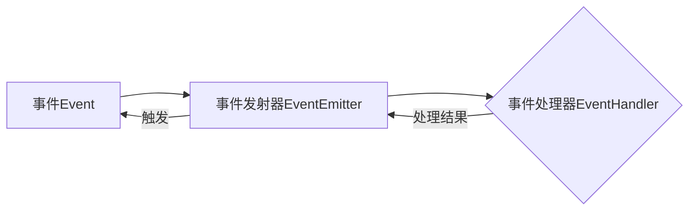

# Yarn的事件驱动模型解析

## 1. 背景介绍
### 1.1 Yarn的起源与发展
### 1.2 事件驱动模型的概念
### 1.3 事件驱动在Yarn中的应用价值

## 2. 核心概念与联系
### 2.1 事件(Event)
#### 2.1.1 事件的定义
#### 2.1.2 事件的属性
#### 2.1.3 事件的分类
### 2.2 事件发射器(EventEmitter)  
#### 2.2.1 EventEmitter的作用
#### 2.2.2 EventEmitter的原理
#### 2.2.3 EventEmitter的使用
### 2.3 事件处理器(Event Handler)
#### 2.3.1 事件处理器的概念
#### 2.3.2 事件处理器的注册
#### 2.3.3 事件处理器的执行
### 2.4 事件循环(Event Loop)
#### 2.4.1 事件循环的原理
#### 2.4.2 事件循环的阶段
#### 2.4.3 事件循环与EventEmitter的关系

## 3. 核心算法原理具体操作步骤
### 3.1 事件注册
#### 3.1.1 on方法
#### 3.1.2 once方法 
#### 3.1.3 prependListener方法
### 3.2 事件触发
#### 3.2.1 emit方法
#### 3.2.2 异步事件触发
#### 3.2.3 错误处理
### 3.3 事件移除
#### 3.3.1 off方法
#### 3.3.2 removeListener方法
#### 3.3.3 removeAllListeners方法

## 4. 数学模型和公式详细讲解举例说明
### 4.1 事件驱动模型的数学表示
#### 4.1.1 事件集合 $E=\{e_1,e_2,...,e_n\}$  
#### 4.1.2 事件处理器集合 $H=\{h_1,h_2,...,h_m\}$
#### 4.1.3 事件到处理器的映射 $f:E \rightarrow H$ 
### 4.2 事件触发的数学模型
#### 4.2.1 单事件触发 $\exists e_i \in E, f(e_i)=\{h_j|h_j \in H\}$
#### 4.2.2 多事件触发 $\forall e_i \in E_s \subseteq E, f(e_i)=\{h_j|h_j \in H\}$
### 4.3 事件处理器执行的数学模型 
#### 4.3.1 串行执行 $h_1 \circ h_2 \circ ... \circ h_k$ 
#### 4.3.2 并行执行 $h_1 \parallel h_2 \parallel ... \parallel h_k$

## 5. 项目实践：代码实例和详细解释说明
### 5.1 创建EventEmitter实例
```javascript
const EventEmitter = require('events');
const myEmitter = new EventEmitter();
```
### 5.2 注册事件处理器
```javascript
myEmitter.on('event', () => {
  console.log('触发事件');
});
```
### 5.3 触发事件
```javascript
myEmitter.emit('event');
// 输出: 触发事件 
```
### 5.4 只执行一次的事件处理器
```javascript
myEmitter.once('event', () => {
  console.log('只触发一次的事件');
});
```
### 5.5 移除事件处理器
```javascript
const handleEvent = () => {
  console.log('触发事件');
};
myEmitter.on('event', handleEvent);
// 移除指定的事件处理器
myEmitter.off('event', handleEvent); 
```

## 6. 实际应用场景
### 6.1 异步流程控制
#### 6.1.1 文件读写
#### 6.1.2 网络请求响应
### 6.2 模块解耦
#### 6.2.1 鼠标键盘事件处理
#### 6.2.2 插件机制
### 6.3 消息通信
#### 6.3.1 进程间通信
#### 6.3.2 WebSocket通信

## 7. 工具和资源推荐
### 7.1 Node.js官方events模块文档
### 7.2 EventEmitter2 - 增强的EventEmitter实现
### 7.3 EventEmitter3 - 高性能EventEmitter实现
### 7.4 Yarn官方文档

## 8. 总结：未来发展趋势与挑战
### 8.1 事件驱动模型的优势
#### 8.1.1 松耦合
#### 8.1.2 高扩展性
#### 8.1.3 非阻塞I/O
### 8.2 事件驱动的局限性
#### 8.2.1 调试困难 
#### 8.2.2 内存泄漏风险
#### 8.2.3 异常处理复杂
### 8.3 未来发展趋势
#### 8.3.1 结合反应式编程范式
#### 8.3.2 多语言互操作 
#### 8.3.3 云原生事件驱动

## 9. 附录：常见问题与解答
### 9.1 EventEmitter可以用于浏览器环境吗？
### 9.2 如何实现一个自定义的EventEmitter？
### 9.3 EventEmitter能否实现"发布-订阅"模式？
### 9.4 事件驱动模型与观察者模式有何区别？

## 事件驱动模型核心架构图


Yarn作为现代化的JavaScript包管理器,其内部实现高度依赖Node.js提供的events模块。该模块是Node.js事件驱动架构的基石,提供了EventEmitter类作为事件发射与订阅的核心抽象。

事件Event是事件驱动模型的基本组成单元,可以是用户的操作如鼠标点击、键盘敲击,也可以是系统状态的变化如文件读取完成、网络连接建立等。每个事件通常包含type(事件类型)、timestamp(时间戳)等基本属性,以及根据事件类型附加的其他属性。

事件发射器EventEmitter是整个事件驱动模型的枢纽,负责注册事件处理器、维护事件与处理器之间的映射关系,并在适当的时机触发事件。EventEmitter暴露了on、once、emit、off等方法来实现事件的注册、触发和移除等操作。

当某个事件被触发时,EventEmitter会同步地调用该事件类型对应的所有处理器。处理器执行完毕后,EventEmitter还会继续触发其他类型的事件,从而推动整个事件循环的运转。这种异步非阻塞的工作模式,是Node.js 高并发、高吞吐的关键所在。

在实际项目中,事件驱动模型被广泛应用于异步流程控制、模块解耦、消息通信等场景。以文件读写为例,当文件读取完成后,会触发一个事件,提醒EventEmitter去调用对应的处理器,执行后续操作。这种方式可以显著提升I/O密集型应用的性能。

事件驱动虽然为开发者提供了极大的灵活性,但同时也引入了一些复杂性。比如,过度使用事件驱动会导致代码逻辑割裂,调试困难;匿名的事件处理器也可能引发内存泄漏;try/catch无法捕获异步代码的异常,需要额外的错误处理机制。

未来,事件驱动模型可能会与反应式编程、函数式编程等范式结合,进一步增强代码的声明性与可维护性。同时,在云原生时代,事件驱动在微服务解耦、Serverless编排等领域也将扮演重要角色。

总之,事件驱动模型作为一种松耦合、高扩展、非阻塞的架构范式,其重要性已经得到业界的广泛认可。深入理解EventEmitter的原理和最佳实践,对于掌握Node.js乃至现代Web编程的核心范式,都具有重要意义。

作者：禅与计算机程序设计艺术 / Zen and the Art of Computer Programming