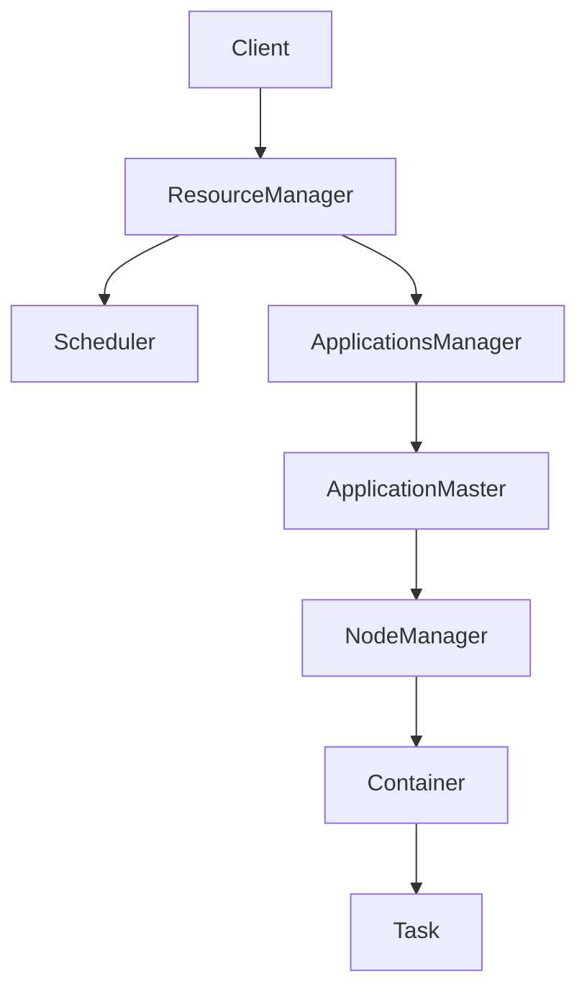

# Yarn资源管理和任务调度原理与代码实例讲解

## 1. 背景介绍
### 1.1 大数据计算的发展历程
#### 1.1.1 单机时代的数据处理
#### 1.1.2 集群计算框架的诞生
#### 1.1.3 资源管理和任务调度的重要性
### 1.2 Hadoop生态系统概述  
#### 1.2.1 Hadoop的核心组件
#### 1.2.2 MapReduce计算框架
#### 1.2.3 Yarn在Hadoop生态中的地位
### 1.3 Yarn的设计理念与目标
#### 1.3.1 资源利用率最大化
#### 1.3.2 任务调度的灵活性
#### 1.3.3 多框架支持和兼容性

## 2. 核心概念与联系
### 2.1 Yarn架构概览
#### 2.1.1 ResourceManager
#### 2.1.2 NodeManager 
#### 2.1.3 ApplicationMaster
### 2.2 资源模型和抽象
#### 2.2.1 Container的概念
#### 2.2.2 资源请求和分配
#### 2.2.3 资源隔离与多租户
### 2.3 任务调度模型 
#### 2.3.1 调度器分类
#### 2.3.2 FIFO调度器
#### 2.3.3 Capacity调度器
#### 2.3.4 Fair调度器

## 3. 核心算法原理具体操作步骤
### 3.1 资源管理流程详解
#### 3.1.1 应用程序提交
#### 3.1.2 ApplicationMaster启动
#### 3.1.3 资源分配与协商
#### 3.1.4 任务执行与监控
### 3.2 任务调度算法原理
#### 3.2.1 FIFO调度算法
#### 3.2.2 Capacity调度算法
#### 3.2.3 Fair调度算法
#### 3.2.4 调度算法对比分析
### 3.3 资源隔离与预留 
#### 3.3.1 队列容量管理
#### 3.3.2 资源预留机制
#### 3.3.3 任务优先级控制

## 4. 数学模型和公式详细讲解举例说明
### 4.1 资源需求建模
#### 4.1.1 CPU资源需求计算
#### 4.1.2 内存资源需求估算
#### 4.1.3 动态资源需求预测
### 4.2 任务调度优化模型
#### 4.2.1 作业完成时间最小化
#### 4.2.2 资源利用率最大化
#### 4.2.3 多目标权衡优化
### 4.3 公平性与效率权衡
#### 4.3.1 Max-Min公平性
#### 4.3.2 比例公平性
#### 4.3.3 效率与公平性的折中

## 5. 项目实践：代码实例和详细解释说明
### 5.1 Yarn环境搭建
#### 5.1.1 单机模式部署
#### 5.1.2 集群模式部署
#### 5.1.3 配置参数优化
### 5.2 作业提交与监控
#### 5.2.1 使用Yarn客户端提交作业
#### 5.2.2 ApplicationMaster开发
#### 5.2.3 作业执行进度跟踪
### 5.3 自定义调度器开发
#### 5.3.1 调度器插件机制
#### 5.3.2 自定义调度策略实现
#### 5.3.3 调度器性能测试与优化

## 6. 实际应用场景
### 6.1 电商推荐系统
#### 6.1.1 用户行为数据处理
#### 6.1.2 推荐模型训练与更新
#### 6.1.3 实时推荐服务
### 6.2 金融风控平台
#### 6.2.1 海量交易数据分析
#### 6.2.2 反欺诈模型构建
#### 6.2.3 实时风险预警
### 6.3 智慧交通大数据平台
#### 6.3.1 车辆轨迹数据处理
#### 6.3.2 交通流量预测分析
#### 6.3.3 智能信号灯调度优化

## 7. 工具和资源推荐
### 7.1 Yarn生态工具
#### 7.1.1 Yarn UI界面
#### 7.1.2 Yarn REST API
#### 7.1.3 Yarn Metrics监控
### 7.2 性能优化工具
#### 7.2.1 Dr. Elephant性能分析
#### 7.2.2 Spark Dynamic Allocation
#### 7.2.3 Hive on Tez引擎
### 7.3 社区资源与学习材料
#### 7.3.1 官方文档与Wiki
#### 7.3.2 技术博客与论坛
#### 7.3.3 开源项目与代码示例

## 8. 总结：未来发展趋势与挑战
### 8.1 Yarn的演进之路
#### 8.1.1 Yarn 2.0新特性
#### 8.1.2 Yarn 3.0规划与展望
#### 8.1.3 Yarn在云原生时代的机遇
### 8.2 资源管理的新方向 
#### 8.2.1 基于机器学习的智能调度
#### 8.2.2 异构资源感知与协同
#### 8.2.3 跨集群资源联邦管理
### 8.3 Yarn面临的挑战与未来
#### 8.3.1 大规模集群的扩展性
#### 8.3.2 新兴计算框架的融合
#### 8.3.3 云原生架构的演进之路

## 9. 附录：常见问题与解答
### 9.1 Yarn常见故障排查
#### 9.1.1 任务排队等待问题
#### 9.1.2 Container分配不均衡
#### 9.1.3 NodeManager心跳丢失
### 9.2 Yarn参数调优指南
#### 9.2.1 ResourceManager高可用配置
#### 9.2.2 Container资源设置优化
#### 9.2.3 调度器队列容量规划
### 9.3 Yarn生态常见问题FAQ
#### 9.3.1 Spark on Yarn注意事项
#### 9.3.2 Hive on Yarn性能调优
#### 9.3.3 Flink on Yarn的任务恢复

以上是Yarn资源管理和任务调度的核心架构流程图。Client提交应用程序后，ResourceManager负责整体的资源管理和调度。它主要包含两个组件：Scheduler负责资源的调度分配，ApplicationsManager负责管理各个应用程序的生命周期。

当一个应用程序提交后，ResourceManager会为其分配一个ApplicationMaster，由ApplicationMaster负责与ResourceManager协商资源，并与NodeManager通信来管理各个任务的运行。NodeManager是每个节点上的代理，负责Container的启动和监控。每个Container对应一个任务进程，执行具体的计算任务。

Yarn的这种两级调度架构，使得资源管理和任务调度解耦，ApplicationMaster作为中间层，可以根据不同的计算框架实现对应的调度策略，从而提供了很好的扩展性和灵活性。同时ResourceManager只需要关注全局的资源分配，而不用关心每个任务的具体执行情况，大大提高了系统的可扩展性。

在具体的调度算法方面，Yarn提供了多种调度器可供选择，包括FIFO调度器、Capacity调度器和Fair调度器等。其中Capacity调度器支持多队列的层次化资源分配，可以为不同的用户和应用程序组分配独立的资源队列，并通过ACL来控制队列的访问权限。而Fair调度器则侧重于在不同应用程序之间实现资源的公平共享，避免个别应用长期占用资源。调度器的选择需要根据具体的业务场景和需求来权衡。

在实际应用中，Yarn已经成为大数据领域的核心资源管理和任务调度系统，被广泛应用于电商推荐、金融风控、智慧交通等领域。一方面，Yarn可以有效管理和调度海量数据处理任务，提高集群资源利用率；另一方面，Yarn良好的扩展性和兼容性，使得各种上层计算框架如Spark、Flink等都可以无缝运行在Yarn之上，形成了丰富的大数据生态。

展望未来，Yarn正在不断演进和发展，引入了更多智能化调度、云原生支持等新特性。同时Yarn也面临着大规模集群扩展、异构资源管理、新兴计算框架融合等挑战。这需要Yarn在架构设计、调度算法、资源模型等方面不断创新，紧跟大数据技术发展的步伐。相信Yarn作为大数据领域的基石，必将在未来发挥更加重要的作用。

作者：禅与计算机程序设计艺术 / Zen and the Art of Computer Programming