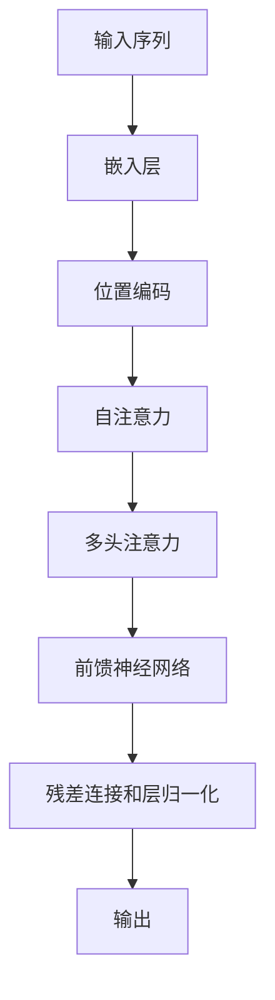

# Transformer

## 1.背景介绍

在自然语言处理（NLP）领域，Transformer模型的出现无疑是一个里程碑。自从Vaswani等人在2017年提出Transformer以来，它迅速成为了机器翻译、文本生成、情感分析等任务中的主流模型。Transformer的核心创新在于其完全基于注意力机制的架构，摒弃了传统的循环神经网络（RNN）和卷积神经网络（CNN），从而大大提高了并行计算的效率。

## 2.核心概念与联系

### 2.1 注意力机制

注意力机制是Transformer的核心。它允许模型在处理每个词时，动态地关注输入序列中的其他词。注意力机制的基本思想是通过计算输入序列中每个词对当前词的“重要性”来加权求和。

### 2.2 自注意力（Self-Attention）

自注意力是Transformer中最重要的部分。它允许模型在处理一个序列中的每个词时，考虑该序列中所有其他词的信息。自注意力的计算过程包括三个步骤：计算Query、Key和Value，计算注意力权重，最后加权求和。

### 2.3 多头注意力（Multi-Head Attention）

多头注意力机制通过并行计算多个自注意力来捕捉不同的特征表示。每个头独立地执行自注意力计算，然后将结果拼接起来，通过线性变换得到最终的输出。

### 2.4 位置编码（Positional Encoding）

由于Transformer模型没有内置的顺序信息，需要通过位置编码来引入序列的位置信息。位置编码通常是通过正弦和余弦函数生成的。

## 3.核心算法原理具体操作步骤

### 3.1 输入处理

首先，将输入序列通过嵌入层转换为向量表示。然后，添加位置编码以引入位置信息。

### 3.2 自注意力计算

对于每个词，计算其Query、Key和Value。然后，计算注意力权重，公式如下：

$$
\text{Attention}(Q, K, V) = \text{softmax}\left(\frac{QK^T}{\sqrt{d_k}}\right)V
$$

其中，$Q$、$K$和$V$分别是Query、Key和Value矩阵，$d_k$是Key的维度。

### 3.3 多头注意力

将多个自注意力的结果拼接起来，通过线性变换得到最终的输出。

### 3.4 前馈神经网络

通过多层前馈神经网络对自注意力的输出进行进一步处理。每一层包括一个线性变换和一个激活函数。

### 3.5 残差连接和层归一化

在每个子层之后，添加残差连接和层归一化，以加速训练和提高模型的稳定性。

### 3.6 输出处理

最后，通过线性变换和softmax函数将模型的输出转换为概率分布。



## 4.数学模型和公式详细讲解举例说明

### 4.1 自注意力机制

自注意力机制的核心公式如下：

$$
\text{Attention}(Q, K, V) = \text{softmax}\left(\frac{QK^T}{\sqrt{d_k}}\right)V
$$

其中，$Q$、$K$和$V$分别是Query、Key和Value矩阵，$d_k$是Key的维度。这个公式的直观解释是：通过计算Query和Key的点积，得到每个词对当前词的相关性，然后通过softmax函数将其转换为概率分布，最后加权求和得到最终的表示。

### 4.2 多头注意力机制

多头注意力机制的公式如下：

$$
\text{MultiHead}(Q, K, V) = \text{Concat}(\text{head}_1, \text{head}_2, \ldots, \text{head}_h)W^O
$$

其中，每个头的计算公式为：

$$
\text{head}_i = \text{Attention}(QW_i^Q, KW_i^K, VW_i^V)
$$

$W_i^Q$、$W_i^K$和$W_i^V$是线性变换矩阵，$W^O$是输出的线性变换矩阵。

### 4.3 位置编码

位置编码的公式如下：

$$
PE_{pos, 2i} = \sin\left(\frac{pos}{10000^{2i/d_{model}}}\right)
$$

$$
PE_{pos, 2i+1} = \cos\left(\frac{pos}{10000^{2i/d_{model}}}\right)
$$

其中，$pos$是位置，$i$是维度索引，$d_{model}$是模型的维度。

## 5.项目实践：代码实例和详细解释说明

以下是一个简单的Transformer实现示例，使用PyTorch框架：

```python
import torch
import torch.nn as nn
import torch.nn.functional as F

class MultiHeadAttention(nn.Module):
    def __init__(self, d_model, num_heads):
        super(MultiHeadAttention, self).__init__()
        self.num_heads = num_heads
        self.d_model = d_model

        assert d_model % num_heads == 0

        self.depth = d_model // num_heads

        self.wq = nn.Linear(d_model, d_model)
        self.wk = nn.Linear(d_model, d_model)
        self.wv = nn.Linear(d_model, d_model)

        self.dense = nn.Linear(d_model, d_model)

    def split_heads(self, x, batch_size):
        x = x.view(batch_size, -1, self.num_heads, self.depth)
        return x.permute(0, 2, 1, 3)

    def forward(self, v, k, q, mask):
        batch_size = q.size(0)

        q = self.wq(q)
        k = self.wk(k)
        v = self.wv(v)

        q = self.split_heads(q, batch_size)
        k = self.split_heads(k, batch_size)
        v = self.split_heads(v, batch_size)

        scaled_attention, _ = self.scaled_dot_product_attention(q, k, v, mask)

        scaled_attention = scaled_attention.permute(0, 2, 1, 3).contiguous()
        original_size_attention = scaled_attention.view(batch_size, -1, self.d_model)

        output = self.dense(original_size_attention)

        return output

    def scaled_dot_product_attention(self, q, k, v, mask):
        matmul_qk = torch.matmul(q, k.transpose(-2, -1))

        dk = k.size()[-1]
        scaled_attention_logits = matmul_qk / torch.sqrt(torch.tensor(dk, dtype=torch.float32))

        if mask is not None:
            scaled_attention_logits += (mask * -1e9)

        attention_weights = F.softmax(scaled_attention_logits, dim=-1)

        output = torch.matmul(attention_weights, v)

        return output, attention_weights

class Transformer(nn.Module):
    def __init__(self, d_model, num_heads, num_layers):
        super(Transformer, self).__init__()
        self.layers = nn.ModuleList([MultiHeadAttention(d_model, num_heads) for _ in range(num_layers)])
        self.norm = nn.LayerNorm(d_model)

    def forward(self, x, mask):
        for layer in self.layers:
            x = layer(x, x, x, mask)
            x = self.norm(x)
        return x

# 示例用法
d_model = 512
num_heads = 8
num_layers = 6
transformer = Transformer(d_model, num_heads, num_layers)

x = torch.rand(64, 10, d_model)  # (batch_size, seq_len, d_model)
mask = None
output = transformer(x, mask)
print(output.shape)  # (64, 10, 512)
```

## 6.实际应用场景

### 6.1 机器翻译

Transformer最初是为机器翻译任务设计的。它在WMT 2014英德翻译任务中取得了显著的性能提升，成为了机器翻译领域的主流模型。

### 6.2 文本生成

Transformer在文本生成任务中也表现出色。GPT（Generative Pre-trained Transformer）系列模型通过预训练和微调，在文本生成、对话系统等任务中取得了优异的效果。

### 6.3 情感分析

Transformer模型可以用于情感分析任务，通过对文本进行编码，提取出情感特征，从而进行情感分类。

### 6.4 语音识别

Transformer在语音识别任务中也有广泛应用。通过将语音信号转换为特征向量，Transformer可以有效地进行语音识别和转录。

## 7.工具和资源推荐

### 7.1 PyTorch

PyTorch是一个流行的深度学习框架，提供了丰富的API和工具，适合实现和训练Transformer模型。

### 7.2 TensorFlow

TensorFlow是另一个流行的深度学习框架，提供了高效的计算图和自动微分功能，适合大规模模型的训练和部署。

### 7.3 Hugging Face Transformers

Hugging Face Transformers是一个开源库，提供了预训练的Transformer模型和便捷的API，适合快速实现和应用Transformer模型。

### 7.4 BERT

BERT（Bidirectional Encoder Representations from Transformers）是一个预训练的Transformer模型，广泛应用于各种NLP任务。

### 7.5 GPT

GPT（Generative Pre-trained Transformer）系列模型是生成式预训练模型，在文本生成、对话系统等任务中表现出色。

## 8.总结：未来发展趋势与挑战

Transformer模型在NLP领域取得了巨大的成功，但仍然面临一些挑战。首先，Transformer模型的计算复杂度较高，训练和推理的成本较大。其次，Transformer模型对大规模数据的依赖较强，需要大量的预训练数据。未来的发展趋势包括模型压缩、低资源环境下的模型训练和多模态Transformer模型的研究。

## 9.附录：常见问题与解答

### 9.1 Transformer模型的优点是什么？

Transformer模型的优点包括并行计算效率高、捕捉长距离依赖关系能力强、适用于多种NLP任务等。

### 9.2 Transformer模型的缺点是什么？

Transformer模型的缺点包括计算复杂度高、对大规模数据的依赖较强、训练和推理的成本较大等。

### 9.3 如何提高Transformer模型的效率？

可以通过模型压缩、混合精度训练、分布式训练等方法提高Transformer模型的效率。

### 9.4 Transformer模型适用于哪些任务？

Transformer模型适用于机器翻译、文本生成、情感分析、语音识别等多种NLP任务。

### 9.5 Transformer模型的未来发展方向是什么？

未来的发展方向包括模型压缩、低资源环境下的模型训练、多模态Transformer模型的研究等。

---

作者：禅与计算机程序设计艺术 / Zen and the Art of Computer Programming