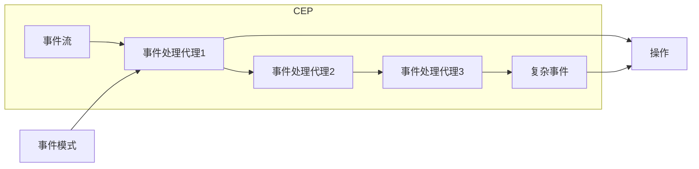
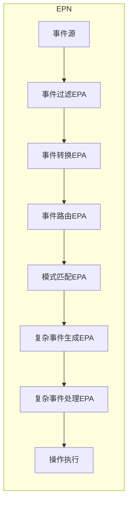

# 【AI大数据计算原理与代码实例讲解】CEP

## 1.背景介绍

在当今快速发展的数字时代，海量数据的实时处理和分析成为了各行业的迫切需求。传统的数据处理系统往往无法满足实时性和高吞吐量的要求,因此复杂事件处理(Complex Event Processing,CEP)应运而生。CEP是一种新兴的事件驱动架构,旨在实时检测、处理和响应来自多个数据源的事件流中的有意义模式。它广泛应用于金融交易监控、网络安全、物联网、智能交通等领域。

## 2.核心概念与联系

CEP的核心概念包括:

1. **事件(Event)**: 事件是系统中发生的一个原子性的、不可分割的动作或状态变化。每个事件都包含一些属性,例如时间戳、源头、类型等。

2. **事件流(Event Stream)**: 事件流是一系列按时间顺序排列的事件序列,可以是有界的或无界的。

3. **事件模式(Event Pattern)**: 事件模式定义了一系列事件之间的关系、顺序和条件,用于描述需要检测的复杂情况。

4. **事件处理网络(Event Processing Network,EPN)**: EPN由多个事件处理代理(EPA)组成,每个EPA负责执行特定的事件处理逻辑,如过滤、转换、模式匹配等。EPN定义了事件在各个EPA之间的流动路径。

5. **复杂事件(Complex Event)**: 当事件流中的事件序列与预定义的事件模式相匹配时,就会生成一个复杂事件。复杂事件可能需要进一步处理或触发相应的操作。

这些核心概念紧密相连,共同构建了CEP的基本框架。事件流作为输入,经过EPN中各个EPA的处理,最终生成复杂事件并执行相应的操作。



## 3.核心算法原理具体操作步骤

CEP的核心算法主要包括事件模式匹配和事件处理网络执行两个部分。

### 3.1 事件模式匹配

事件模式匹配是CEP的核心功能,旨在从连续的事件流中识别出符合预定义模式的事件序列。常见的事件模式匹配算法包括:

1. **有限状态机(Finite State Machine,FSM)**: 将事件模式表示为有限状态机,每个状态对应一个事件或事件组合。当事件流中的事件序列与状态机的转移路径相匹配时,即认为匹配到了事件模式。

2. **树结构(Tree)**: 将事件模式表示为一棵树,每个节点代表一个事件或事件组合。事件流中的事件序列与树的路径进行匹配。

3. **规则引擎(Rule Engine)**: 使用规则语言定义事件模式,规则引擎根据规则对事件流进行匹配和处理。

4. **时间窗口(Time Window)**: 将事件流划分为多个时间窗口,在每个窗口内进行事件模式匹配。常见的时间窗口类型包括滑动窗口、跳跃窗口等。

5. **复杂事件处理网络(Complex Event Processing Network)**: 将事件模式拆分为多个子模式,并构建一个事件处理网络来执行模式匹配和处理。

这些算法各有优缺点,需要根据具体场景和性能要求进行选择和组合使用。

### 3.2 事件处理网络执行

事件处理网络(EPN)定义了事件在各个事件处理代理(EPA)之间的流动路径和处理逻辑。EPN的执行过程如下:

1. **事件接收**: 从数据源接收原始事件,并将其推送到EPN的入口EPA。

2. **事件过滤**: 入口EPA根据预定义的规则对事件进行过滤,剔除无关事件。

3. **事件转换**: EPA可以对事件进行转换,如提取特征、归一化等。

4. **事件路由**: EPA将转换后的事件路由到下一个EPA或多个EPA。

5. **模式匹配**: 专门的EPA执行事件模式匹配算法,识别出符合模式的事件序列。

6. **复杂事件生成**: 当匹配到事件模式时,EPA生成对应的复杂事件。

7. **复杂事件处理**: 复杂事件可能需要进一步处理,如聚合、关联等。

8. **操作执行**: 根据复杂事件触发相应的操作,如发送警报、更新数据库等。

在整个过程中,EPA之间可以进行并行处理,提高系统的吞吐量和响应速度。EPN的设计和优化是CEP系统性能的关键因素之一。



## 4.数学模型和公式详细讲解举例说明

在CEP系统中,常见的数学模型和公式包括:

### 4.1 事件模式匹配模型

事件模式匹配可以使用有限状态机(FSM)或正则表达式进行建模。给定一个事件模式$P$和一个事件序列$E=\{e_1,e_2,...,e_n\}$,我们需要判断$E$是否匹配$P$。

#### 4.1.1 有限状态机模型

有限状态机$M=(Q,\Sigma,\delta,q_0,F)$,其中:

- $Q$是有限状态集合
- $\Sigma$是事件字母表
- $\delta:Q\times\Sigma\rightarrow Q$是状态转移函数
- $q_0\in Q$是初始状态
- $F\subseteq Q$是终止状态集合

对于事件序列$E$,我们从初始状态$q_0$开始,对每个事件$e_i$应用状态转移函数$\delta$,得到新的状态$q_{i+1}=\delta(q_i,e_i)$。如果最终状态$q_n\in F$,则认为$E$匹配模式$P$。

#### 4.1.2 正则表达式模型

事件模式$P$可以用正则表达式$R$表示,事件序列$E$匹配$P$当且仅当$E\in L(R)$,其中$L(R)$是由$R$定义的语言。

例如,模式$P="a\;b\;c\;d"$可以用正则表达式$R=a.b.c.d$表示。事件序列$E=\{a,b,c,d\}$匹配$P$,因为$E\in L(R)$。

### 4.2 时间窗口模型

时间窗口是CEP中常用的概念,用于限制事件模式匹配的时间范围。给定一个时间窗口$W=[t_s,t_e]$和事件序列$E=\{e_1,e_2,...,e_n\}$,我们只考虑$W$内的事件子序列$E_W=\{e_i|t_s\leq t(e_i)\leq t_e\}$进行模式匹配,其中$t(e_i)$是事件$e_i$的时间戳。

常见的时间窗口类型包括:

1. **滑动窗口(Sliding Window)**: 窗口大小固定,随时间滑动。对于窗口大小$w$和滑动步长$s$,窗口序列为$W_1=[t_0,t_0+w],W_2=[t_0+s,t_0+s+w],...$

2. **跳跃窗口(Tumbling Window)**: 非重叠的固定大小窗口。对于窗口大小$w$,窗口序列为$W_1=[t_0,t_0+w],W_2=[t_0+w,t_0+2w],...$

3. **会话窗口(Session Window)**: 根据事件活动定义窗口,活动间隔超过阈值则开启新窗口。

4. **计数窗口(Count Window)**: 根据事件数量定义窗口,每个窗口包含固定数量的事件。

不同类型的时间窗口适用于不同场景,需要根据具体需求进行选择和配置。

### 4.3 事件处理网络优化模型

事件处理网络(EPN)的优化是提高CEP系统性能的关键。常见的优化目标包括:

1. **最小化事件处理延迟**: 对于事件$e_i$,minimze $t(e_i^{out})-t(e_i^{in})$,其中$t(e_i^{in})$和$t(e_i^{out})$分别是事件进入和离开EPN的时间戳。

2. **最大化吞吐量**: maximze $\frac{N}{T}$,其中$N$是在时间$T$内处理的事件数量。

3. **最小化资源消耗**: minimze $\sum_{i=1}^{n}c(EPA_i)$,其中$c(EPA_i)$是第$i$个EPA的资源消耗(如CPU、内存等)。

4. **最大化可扩展性**: 确保EPN能够轻松地水平扩展,以处理不断增长的事件流量。

这些优化目标通常需要在资源约束下进行权衡。常见的优化方法包括:

- **负载均衡**: 合理分配事件流到不同的EPA,避免热点问题。
- **并行处理**: 充分利用多核CPU和分布式计算资源,提高并行处理能力。
- **缓存和预取**: 缓存和预取事件数据,减少I/O开销。
- **代码优化**: 优化EPA内部的事件处理逻辑,减少CPU和内存开销。
- **自动扩缩容**: 根据实时流量自动调整EPN的规模,实现资源的按需分配。

优化EPN是一个复杂的过程,需要综合考虑多个因素,并结合具体的应用场景和硬件环境进行调优。

## 5.项目实践:代码实例和详细解释说明

为了更好地理解CEP的原理和实现,我们以一个简单的网络入侵检测场景为例,使用Python和Esper CEP引擎进行实践。

### 5.1 场景描述

我们需要从网络流量日志中实时检测可疑的入侵行为。具体来说,如果在5秒钟内有3次或更多来自同一IP地址的失败登录尝试,则认为是入侵行为,需要发送警报。

### 5.2 数据准备

我们使用Python生成模拟的网络流量日志,每条日志包含以下字段:

- `timestamp`: 事件发生的时间戳
- `src_ip`: 源IP地址
- `event_type`: 事件类型,可以是"login_success"或"login_failure"

```python
import random
import time
from datetime import datetime

# 模拟IP地址列表
ip_addresses = ['192.168.1.1', '192.168.1.2', '192.168.1.3', '192.168.1.4', '192.168.1.5']

# 生成模拟网络流量日志
def generate_log(num_events):
    logs = []
    for i in range(num_events):
        timestamp = datetime.now().timestamp()
        src_ip = random.choice(ip_addresses)
        event_type = random.choice(['login_success', 'login_failure'])
        logs.append({'timestamp': timestamp, 'src_ip': src_ip, 'event_type': event_type})
        time.sleep(random.uniform(0, 1))  # 模拟事件间隔
    return logs
```

### 5.3 Esper CEP引擎配置

我们使用Esper作为CEP引擎,它提供了基于SQL的事件处理语言(EPL)来定义事件模式和处理逻辑。

```python
import esperpy

# 创建Esper运行时环境
esperpy.initialize()
esperpy.start()

# 定义事件类型
esperpy.define_event_type('NetworkLog', 'timestamp double, src_ip string, event_type string')

# 创建事件流
network_log_stream = esperpy.create_window('NetworkLogStream', 'NetworkLog')
```

### 5.4 事件模式定义和处理逻辑

我们使用EPL定义事件模式和处理逻辑,以检测可疑的入侵行为。

```python
# 定义事件模式和处理逻辑
statement = """
INSERT INTO Failure