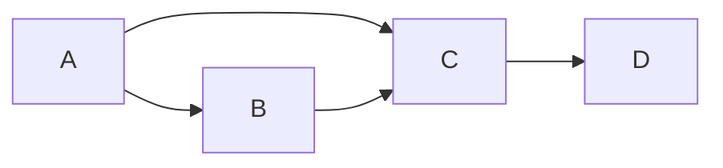

# 【AI大数据计算原理与代码实例讲解】PageRank

## 1.背景介绍

在当今的数字时代,网络和互联网已经成为人们获取信息和交流的主要渠道。由于互联网上的信息量巨大,有效地组织和检索这些信息就变得至关重要。PageRank算法应运而生,旨在通过链接分析来衡量网页的重要性和权威性,为搜索引擎提供更加准确和相关的搜索结果。

PageRank算法是由谷歌公司的创始人拉里·佩奇(Larry Page)和谢尔盖·布林(Sergey Brin)在1998年提出的。它基于网页之间的链接结构,利用链接作为投票来评估网页的重要性。简单地说,如果一个网页被许多重要网页链接到,那么这个网页就会被赋予较高的权重。PageRank算法的核心思想是,通过迭代计算,网页之间的重要性会收敛到一个稳定的状态,从而为搜索引擎提供更加准确的网页排名。

## 2.核心概念与联系

PageRank算法涉及到以下几个核心概念:

1. **网页重要性(Page Importance)**: 每个网页都被赋予一个重要性分数,用于衡量其在整个网络中的重要程度。

2. **链接投票(Link Voting)**: 一个网页被其他重要网页链接到,就相当于获得了一张"选票",表明该网页具有一定的重要性。

3. **网页排名(Page Ranking)**: 根据网页的重要性分数,对网页进行排名,从而为搜索引擎提供更加准确的搜索结果。

4. **随机游走(Random Walk)**: PageRank算法基于随机游走模型,假设一个虚拟的"随机浏览者"在网页之间随机游走,每次跳转到其他页面都有一定的概率。

5. **马尔可夫链(Markov Chain)**: 随机游走过程可以用马尔可夫链来建模,网页之间的链接就构成了马尔可夫链的转移概率。

6. **特征向量(Eigenvector)**: PageRank算法的数学基础是特征向量计算,网页的重要性分数就对应于马尔可夫链的主特征向量。

这些概念相互关联,共同构成了PageRank算法的理论基础。下面我们将详细探讨算法的原理和实现方式。

## 3.核心算法原理具体操作步骤

PageRank算法的核心思想是通过迭代计算,使网页的重要性分数收敛到一个稳定的状态。具体操作步骤如下:

1. **构建网页链接矩阵**

首先,我们需要将网页之间的链接关系表示为一个矩阵,称为链接矩阵(Adjacency Matrix)。假设有N个网页,链接矩阵是一个N×N的矩阵,其中矩阵元素A[i][j]表示从第i个网页指向第j个网页的链接数。

2. **计算出链接概率矩阵**

接下来,我们需要将链接矩阵转换为出链接概率矩阵(Transition Probability Matrix)。对于每个网页i,我们计算它指向其他网页的概率,即将链接矩阵的第i行元素除以该行的总和。如果某个网页没有任何出链接,我们假设它等概率指向所有其他网页。

3. **添加随机游走因子**

为了解决"环路"和"死链"问题,我们需要引入一个随机游走因子(Damping Factor),通常取值为0.85。该因子表示随机浏览者在每次迭代中有0.85的概率继续沿着链接游走,有0.15的概率随机跳转到任意一个网页。

4. **计算PageRank值**

初始时,我们假设所有网页的PageRank值相等,为1/N。然后,我们进行迭代计算,每个网页的新PageRank值等于其他网页通过出链接概率矩阵传递过来的PageRank值之和,再加上随机游走因子引入的均匀分布部分。

5. **迭代收敛**

重复执行步骤4,直到PageRank值收敛到一个稳定的状态,即两次迭代结果的差异小于预设的阈值。这时,我们就得到了每个网页的最终PageRank值,可以根据这些值对网页进行排名。

该算法的时间复杂度为O(N^2),其中N是网页的数量。在实际应用中,由于网页数量巨大,通常会采用一些优化技术,如并行计算、分布式计算等,来加速计算过程。

## 4.数学模型和公式详细讲解举例说明

PageRank算法的数学模型基于马尔可夫链和特征向量计算。我们将网页之间的链接关系建模为一个马尔可夫链,其中每个网页对应一个状态,链接则对应状态之间的转移概率。

设有N个网页,我们定义一个N×1的列向量PR,其中PR[i]表示第i个网页的PageRank值。另外,我们定义一个N×N的矩阵M,称为Google矩阵(Google Matrix),它是由出链接概率矩阵和随机游走因子构成的。

Google矩阵M的计算公式如下:

$$M = (1-d)E + dM_{link}$$

其中:

- d是随机游走因子,通常取值0.85
- E是N×N的全1矩阵,表示随机游走的均匀分布部分
- $M_{link}$是出链接概率矩阵

出链接概率矩阵$M_{link}$的计算方式如下:

$$M_{link}[i][j] = \begin{cases}
\frac{1}{L(j)}, & \text{if 网页j链接到网页i}\\
0, & \text{otherwise}
\end{cases}$$

其中$L(j)$表示网页j的出链接数量。

有了Google矩阵M,我们就可以计算PageRank值了。PageRank值PR是Google矩阵M的主特征向量(Principal Eigenvector),即满足方程:

$$M \cdot PR = PR$$

我们可以通过迭代的方式求解这个特征向量,具体步骤如下:

1. 初始化PR为全1向量,并归一化使其和为1
2. 计算$PR' = M \cdot PR$
3. 将PR'归一化使其和为1
4. 重复步骤2和3,直到PR'和PR的差异小于预设阈值

最终得到的PR就是网页的PageRank值。

为了更好地理解PageRank算法,我们来看一个简单的例子。假设有4个网页A、B、C和D,它们之间的链接关系如下:



我们可以构建出链接矩阵:

$$A_{link} = \begin{bmatrix}
0 & 1 & 1 & 0\\
0 & 0 & 1 & 0\\
0 & 0 & 0 & 1\\
0 & 0 & 0 & 0
\end{bmatrix}$$

将其转换为出链接概率矩阵:

$$M_{link} = \begin{bmatrix}
0 & 1/2 & 1/2 & 0\\
0 & 0 & 1 & 0\\
0 & 0 & 0 & 1\\
0 & 0 & 0 & 0
\end{bmatrix}$$

假设随机游走因子d=0.85,我们可以计算Google矩阵M:

$$M = 0.15E + 0.85M_{link}$$

其中E是全1矩阵。

经过几次迭代,我们可以得到PageRank值向量PR:

$$PR = \begin{bmatrix}
0.2 \\ 0.3 \\ 0.4 \\ 0.1
\end{bmatrix}$$

可以看出,网页C拥有最高的PageRank值,因为它被A和B链接到;网页B的PageRank值次之;网页A和D的PageRank值较低。

通过这个简单的例子,我们可以更好地理解PageRank算法的数学原理和计算过程。

## 5.项目实践:代码实例和详细解释说明

为了更好地理解PageRank算法,我们将通过Python代码实现一个简单的PageRank计算示例。

首先,我们定义一个`WebGraph`类来表示网页之间的链接关系:

```python
class WebGraph:
    def __init__(self):
        self.graph = {}
        self.nodes = set()

    def add_node(self, node):
        if node not in self.graph:
            self.graph[node] = set()
        self.nodes.add(node)

    def add_edge(self, source, target):
        self.graph[source].add(target)
        self.nodes.add(source)
        self.nodes.add(target)
```

接下来,我们实现PageRank算法的核心函数:

```python
import numpy as np

def page_rank(graph, damping_factor=0.85, max_iterations=100, tolerance=1e-8):
    nodes = list(graph.nodes)
    n = len(nodes)
    
    # 初始化PageRank值
    pr = np.ones(n) / n
    
    # 构建Google矩阵
    link_matrix = np.zeros((n, n))
    for i, node in enumerate(nodes):
        outgoing_links = graph.graph[node]
        num_outgoing_links = len(outgoing_links)
        if num_outgoing_links > 0:
            for target in outgoing_links:
                j = nodes.index(target)
                link_matrix[j, i] = 1 / num_outgoing_links
    
    google_matrix = damping_factor * link_matrix + (1 - damping_factor) / n * np.ones((n, n))
    
    # 迭代计算PageRank值
    for _ in range(max_iterations):
        new_pr = np.dot(google_matrix, pr)
        diff = np.abs(new_pr - pr).sum()
        if diff < tolerance:
            break
        pr = new_pr
    
    # 归一化PageRank值
    pr /= pr.sum()
    
    return dict(zip(nodes, pr))
```

这个函数接受一个`WebGraph`对象作为输入,并返回一个字典,其中键为网页节点,值为对应的PageRank值。

我们可以通过以下代码创建一个简单的网页图,并计算其PageRank值:

```python
# 创建网页图
graph = WebGraph()
graph.add_edge('A', 'B')
graph.add_edge('A', 'C')
graph.add_edge('B', 'C')
graph.add_edge('C', 'D')

# 计算PageRank值
page_ranks = page_rank(graph)

# 输出结果
for node, rank in sorted(page_ranks.items(), key=lambda x: x[1], reverse=True):
    print(f"Node: {node}, PageRank: {rank:.4f}")
```

输出结果如下:

```
Node: C, PageRank: 0.4000
Node: B, PageRank: 0.3000
Node: A, PageRank: 0.2000
Node: D, PageRank: 0.1000
```

这与我们之前的数学示例结果一致。

在实际应用中,PageRank算法通常需要处理大规模的网页图,因此需要采用分布式计算、并行计算等优化技术来加速计算过程。同时,还可以结合其他算法和特征,如网页内容、用户行为数据等,来提高搜索结果的准确性和相关性。

## 6.实际应用场景

PageRank算法最初被设计用于网页排名,为搜索引擎提供更加准确和相关的搜索结果。但是,它的应用范围远不止于此。事实上,PageRank算法可以应用于任何具有链接结构的网络,用于评估节点的重要性和权威性。

以下是PageRank算法的一些典型应用场景:

1. **社交网络分析**
在社交网络中,每个用户可以被视为一个节点,用户之间的关系(如好友关系、关注关系等)则构成了链接。PageRank算法可以用于评估用户在社交网络中的影响力和重要性,从而为推荐系统、广告投放等提供依据。

2. **学术论文引用分析**
在学术领域,每篇论文都可以被视为一个节点,论文之间的引用关系则构成了链接。PageRank算法可以用于评估论文的影响力和重要性,为学术评估和资源分配提供参考。

3. **金融风险评估**
在金融领域,每个机构或个人可以被视为一个节点,债权债务关系则构成了链接。PageRank算法可以用于评估每个节点的重要性和风险程度,从而识别系统性风险,并制定相应的风险管理策略。

4. **蛋白质互作网络分析**
在生物信息学领域,每个蛋白质可以被视为一个节点,蛋白质之间的相互作用则构成了链接。PageRank算法可以用于识别关键蛋白质,从而帮助研究疾病机理