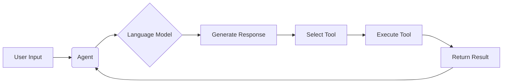

# 【LangChain编程：从入门到实践】代理的类型

## 1. 背景介绍
### 1.1 LangChain简介
LangChain是一个用于开发由语言模型驱动的应用程序的开源库。它可以帮助开发者将语言模型与外部数据源和计算相结合，从而创建更强大的语言模型应用。LangChain提供了一系列工具和组件，可以轻松地将语言模型与其他系统集成，例如数据库、API和其他软件。

### 1.2 代理(Agent)概念
在LangChain中，代理(Agent)是一个重要的概念。代理是一种可以使用语言模型来执行任务的实体。它们可以接收用户输入，使用语言模型生成响应，并根据需要采取行动。代理可以执行各种任务，例如回答问题、执行数据库查询、与API交互等。

### 1.3 代理类型的重要性
LangChain提供了多种类型的代理，每种代理都有其独特的特点和用途。了解不同类型的代理对于开发强大的语言模型应用至关重要。通过选择合适的代理类型，开发者可以根据具体的需求和场景，构建出更加智能和高效的语言模型应用。

## 2. 核心概念与联系
### 2.1 代理(Agent)
代理是LangChain中的核心概念之一。它是一个可以使用语言模型执行任务的实体。代理接收用户输入，使用语言模型生成响应，并根据需要采取行动。

### 2.2 工具(Tool)
工具是代理可以使用的功能或操作。例如，搜索工具允许代理在互联网上搜索信息，计算器工具允许代理执行数学计算。代理可以根据任务需要选择和使用适当的工具。

### 2.3 语言模型(Language Model)
语言模型是代理的核心组件。它负责理解用户输入并生成适当的响应。LangChain支持多种语言模型，如OpenAI的GPT系列模型。

### 2.4 代理类型(Agent Type)
LangChain提供了多种代理类型，每种类型都有其特定的行为和特点。常见的代理类型包括:
- 零知识代理(Zero-shot Agent)
- 反应代理(Reactive Agent)
- 自反代理(Self-ask Agent)
- 基于工具的代理(Tool-based Agent)

下面是代理、工具和语言模型之间关系的Mermaid流程图:



## 3. 核心算法原理具体操作步骤
### 3.1 代理的工作流程
1. 接收用户输入
2. 使用语言模型理解输入并生成响应
3. 根据响应选择合适的工具
4. 执行选定的工具
5. 返回工具执行结果
6. 重复步骤2-5，直到任务完成

### 3.2 零知识代理(Zero-shot Agent)
零知识代理是一种简单的代理类型，它直接使用语言模型来生成响应，不依赖任何额外的工具或知识。
1. 接收用户输入
2. 将输入传递给语言模型
3. 语言模型生成响应
4. 返回生成的响应给用户

### 3.3 反应代理(Reactive Agent)
反应代理根据预定义的规则和模式来选择和执行工具。
1. 接收用户输入
2. 使用预定义的规则和模式匹配输入
3. 根据匹配结果选择相应的工具
4. 执行选定的工具
5. 返回工具执行结果给用户

### 3.4 自反代理(Self-ask Agent)
自反代理可以通过问自己问题的方式来完善对任务的理解和执行。
1. 接收用户输入
2. 使用语言模型生成对输入的理解和可能的操作
3. 根据生成的理解和操作，提出进一步的问题
4. 使用语言模型回答自己提出的问题
5. 重复步骤3-4，直到对任务有充分的理解
6. 选择并执行合适的工具
7. 返回工具执行结果给用户

### 3.5 基于工具的代理(Tool-based Agent)
基于工具的代理可以根据任务需要动态选择和组合多个工具。
1. 接收用户输入
2. 使用语言模型理解输入并生成可能需要使用的工具
3. 选择生成的工具中最相关的一个
4. 执行选定的工具
5. 将工具执行结果作为新的输入，重复步骤2-4
6. 当所有相关工具都执行完毕，返回最终结果给用户

## 4. 数学模型和公式详细讲解举例说明
在代理的工作过程中，主要涉及自然语言处理和决策making的数学模型。以下是一些常用的数学模型和公式:

### 4.1 语言模型
语言模型用于计算一个句子或词序列的概率。给定一个词序列 $w_1, w_2, ..., w_n$，语言模型的目标是计算该序列的概率 $P(w_1, w_2, ..., w_n)$。常用的语言模型包括n-gram模型和神经网络语言模型。

- n-gram模型:
$$P(w_1, w_2, ..., w_n) = \prod_{i=1}^n P(w_i | w_{i-n+1}, ..., w_{i-1})$$

- 神经网络语言模型:
$$P(w_1, w_2, ..., w_n) = \prod_{i=1}^n P(w_i | w_1, w_2, ..., w_{i-1})$$

### 4.2 决策模型
决策模型用于根据当前状态选择最优行动。常见的决策模型包括决策树、马尔可夫决策过程等。

- 马尔可夫决策过程:
状态转移概率: $P(s' | s, a)$
奖励函数: $R(s, a)$
最优策略: $\pi^*(s) = \arg\max_a Q^*(s, a)$
其中，$Q^*(s, a)$ 是在状态 $s$ 下采取行动 $a$ 的最优Q值。

### 4.3 相关性计算
在选择工具时，需要计算用户输入与每个工具的相关性。常用的相关性计算方法包括余弦相似度、jaccard相似度等。

- 余弦相似度:
$$\cos(\theta) = \frac{\mathbf{A} \cdot \mathbf{B}}{\|\mathbf{A}\| \|\mathbf{B}\|} = \frac{\sum_{i=1}^n A_i B_i}{\sqrt{\sum_{i=1}^n A_i^2} \sqrt{\sum_{i=1}^n B_i^2}}$$

其中，$\mathbf{A}$ 和 $\mathbf{B}$ 是两个向量，$A_i$ 和 $B_i$ 是向量的第 $i$ 个元素。

## 5. 项目实践：代码实例和详细解释说明
下面是一个使用LangChain创建反应代理的简单示例:

```python
from langchain.agents import initialize_agent
from langchain.agents import load_tools
from langchain.llms import OpenAI

# 加载语言模型
llm = OpenAI(temperature=0)

# 加载工具
tools = load_tools(["serpapi", "llm-math"], llm=llm)

# 创建反应代理
agent = initialize_agent(tools, llm, agent="react-docstore", verbose=True)

# 运行代理
agent.run("What is the capital of France? What is the population?")
```

代码解释:
1. 首先，我们加载了OpenAI的语言模型，并设置temperature为0，以获得确定性的输出。
2. 然后，我们加载了两个工具:serpapi用于搜索，llm-math用于数学计算。
3. 接下来，我们使用initialize_agent函数创建了一个反应代理，指定使用的工具、语言模型和代理类型。
4. 最后，我们使用agent.run方法运行代理，并传入一个包含两个问题的字符串。

代理会自动使用serpapi工具搜索法国的首都和人口信息，并返回结果。

## 6. 实际应用场景
代理在许多实际应用场景中都有广泛的应用，例如:

### 6.1 客户服务聊天机器人
代理可以用于构建智能客户服务聊天机器人。通过使用自然语言处理和知识库，代理可以理解客户的问题并提供相关的答复和解决方案。

### 6.2 个人助理
代理可以充当个人助理，帮助用户完成各种任务，例如日程安排、信息查询、提醒等。代理可以通过对话理解用户的需求，并使用适当的工具和服务来满足这些需求。

### 6.3 智能搜索和问答系统
代理可以用于构建智能搜索和问答系统。用户可以用自然语言提问，代理会理解问题的意图，并使用搜索引擎、知识库等工具来查找相关信息并生成答案。

### 6.4 数据分析和可视化
代理可以帮助用户进行数据分析和可视化。用户可以用自然语言描述他们想要的分析和可视化，代理会理解需求并使用相应的工具和库来执行分析并生成可视化结果。

## 7. 工具和资源推荐
以下是一些用于开发和使用LangChain代理的有用工具和资源:

### 7.1 LangChain官方文档
LangChain的官方文档提供了详细的API参考、教程和示例，是学习和使用LangChain的重要资源。
https://docs.langchain.com/

### 7.2 OpenAI API
OpenAI提供了强大的语言模型，如GPT系列，可以用作LangChain代理的核心组件。
https://openai.com/api/

### 7.3 SerpAPI
SerpAPI是一个搜索引擎API，可以用作LangChain代理的搜索工具。
https://serpapi.com/

### 7.4 Wolfram Alpha API
Wolfram Alpha是一个知识计算引擎，提供了强大的数学、科学和常识计算能力，可以用作LangChain代理的计算工具。
https://products.wolframalpha.com/api/

### 7.5 LangChain社区
LangChain社区是一个活跃的开发者社区，可以在这里找到有用的讨论、问答和分享。
https://community.langchain.com/

## 8. 总结：未来发展趋势与挑战
LangChain和代理技术的发展前景广阔，但同时也面临着一些挑战:

### 8.1 更加智能和自主的代理
未来的代理将变得更加智能和自主，能够处理更加复杂的任务和场景。这需要更先进的自然语言处理、推理和决策技术的支持。

### 8.2 多模态交互
未来的代理将支持多模态交互，如语音、图像、视频等，以提供更自然和便捷的用户体验。这需要在LangChain中集成相应的多模态处理能力。

### 8.3 个性化和适应性
未来的代理将能够根据用户的个人偏好、习惯和上下文进行个性化和适应性调整，以提供更加贴心和高效的服务。这需要引入用户建模和个性化技术。

### 8.4 安全和隐私
确保代理的安全性和保护用户隐私是一个重要的挑战。需要在LangChain中引入安全和隐私保护机制，如访问控制、数据加密等。

### 8.5 伦理和责任
随着代理变得越来越智能和自主，如何确保其行为的伦理性和可解释性,以及如何界定其责任成为重要的问题。需要在代理的设计和开发中引入伦理原则和约束。

## 9. 附录：常见问题与解答
### 9.1 LangChain支持哪些语言模型？
LangChain支持多种主流的语言模型，如OpenAI的GPT系列、Anthropic的Claude、Google的PaLM等。

### 9.2 如何选择合适的代理类型？
选择代理类型需要根据具体的任务需求和场景。一般来说，对于简单的任务，可以使用零知识代理或反应代理；对于复杂的任务，可以使用自反代理或基于工具的代理。

### 9.3 LangChain代理可以处理哪些类型的任务？
LangChain代理可以处理各种类型的任务，如问答、对话、数据分析、代码生成等。只要有合适的语言模型和工具，LangChain代