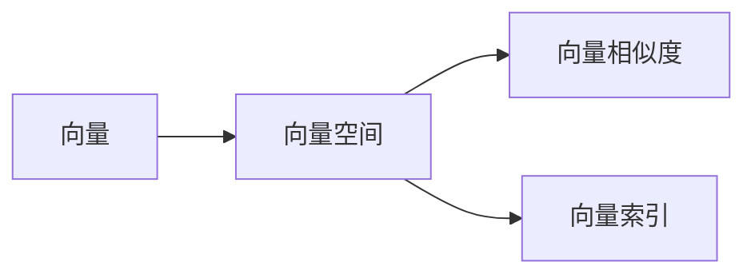

# 【LangChain编程：从入门到实践】向量存储

## 1.背景介绍
在现代人工智能和自然语言处理领域,向量存储扮演着至关重要的角色。随着大规模语言模型和知识图谱的兴起,如何高效地存储和检索海量的向量数据成为了一个亟待解决的问题。LangChain作为一个先进的自然语言处理框架,提供了强大的向量存储功能,使得开发者能够轻松地构建基于向量的应用程序。本文将深入探讨LangChain中的向量存储,从核心概念、算法原理到实际应用,全面解析这一关键技术。

### 1.1 向量存储的重要性
#### 1.1.1 大规模语言模型的需求
#### 1.1.2 知识图谱的支撑
#### 1.1.3 向量检索的高效性

### 1.2 LangChain框架简介 
#### 1.2.1 LangChain的设计理念
#### 1.2.2 LangChain的核心组件
#### 1.2.3 LangChain的优势与特点

## 2.核心概念与联系
在深入探讨LangChain的向量存储之前,我们需要了解一些核心概念及其之间的联系。

### 2.1 向量(Vector)
#### 2.1.1 向量的定义
#### 2.1.2 向量的表示方法
#### 2.1.3 向量的性质

### 2.2 向量空间(Vector Space) 
#### 2.2.1 向量空间的定义
#### 2.2.2 向量空间的基
#### 2.2.3 向量空间的度量

### 2.3 向量相似度(Vector Similarity)
#### 2.3.1 余弦相似度
#### 2.3.2 欧氏距离
#### 2.3.3 Jaccard相似度

### 2.4 向量索引(Vector Index)
#### 2.4.1 向量索引的概念
#### 2.4.2 向量索引的类型
#### 2.4.3 向量索引的构建

以下是核心概念之间的联系图:



## 3.核心算法原理具体操作步骤
LangChain的向量存储依赖于几个核心算法,包括向量编码、向量索引构建和向量检索。

### 3.1 向量编码
#### 3.1.1 Word2Vec
##### 3.1.1.1 CBOW
##### 3.1.1.2 Skip-Gram
#### 3.1.2 GloVe
#### 3.1.3 FastText

### 3.2 向量索引构建
#### 3.2.1 倒排索引
##### 3.2.1.1 构建倒排表
##### 3.2.1.2 倒排表压缩
#### 3.2.2 树形索引
##### 3.2.2.1 KD树
##### 3.2.2.2 VP树
#### 3.2.3 哈希索引
##### 3.2.3.1 LSH
##### 3.2.3.2 HNSW

### 3.3 向量检索
#### 3.3.1 精确检索
##### 3.3.1.1 暴力搜索
##### 3.3.1.2 优化搜索
#### 3.3.2 近似检索  
##### 3.3.2.1 哈希检索
##### 3.3.2.2 图检索

## 4.数学模型和公式详细讲解举例说明
为了更好地理解LangChain的向量存储,我们需要深入了解其背后的数学模型和公式。

### 4.1 向量空间模型
向量空间模型(Vector Space Model)是一种经典的文本表示方法。在该模型中,每个文档被表示为一个高维向量,向量的每个维度对应一个词项。文档向量 $d$ 可以表示为:

$$d = (w_1, w_2, ..., w_n)$$

其中 $w_i$ 表示词项 $t_i$ 在文档中的权重。常见的权重计算方法有:

- 词频(Term Frequency, TF):  $tf_{i,j} = \frac{n_{i,j}}{\sum_k n_{k,j}}$
- 逆文档频率(Inverse Document Frequency, IDF): $idf_i = \log \frac{|D|}{|\{j:t_i \in d_j\}|}$
- TF-IDF: $tfidf_{i,j} = tf_{i,j} \times idf_i$

### 4.2 余弦相似度
余弦相似度(Cosine Similarity)是衡量两个向量相似程度的常用指标。对于两个 $n$ 维向量 $a$ 和 $b$,它们的余弦相似度定义为:

$$\cos(a,b) = \frac{a \cdot b}{||a|| \times ||b||} = \frac{\sum_{i=1}^n a_i b_i}{\sqrt{\sum_{i=1}^n a_i^2} \sqrt{\sum_{i=1}^n b_i^2}}$$

余弦相似度的取值范围为 $[-1, 1]$,值越大表示两个向量越相似。

### 4.3 局部敏感哈希
局部敏感哈希(Locality-Sensitive Hashing, LSH)是一种常用的近似最近邻搜索算法。其基本思想是将相似的向量映射到同一个哈希桶中,从而大大减少搜索空间。

LSH的核心是哈希函数族 $H$,对于任意两个向量 $a$ 和 $b$,满足以下性质:

- 如果 $a$ 和 $b$ 相似,则它们有较高的概率被映射到同一个哈希桶中
- 如果 $a$ 和 $b$ 不相似,则它们有较低的概率被映射到同一个哈希桶中

常见的LSH哈希函数包括:

- MinHash: $h(a) = \min_{i:a_i=1} \pi(i)$
- SimHash: $h(a) = sign(\sum_{i=1}^n a_i r_i)$

其中 $\pi$ 是一个随机排列, $r_i$ 是随机向量。

## 5.项目实践：代码实例和详细解释说明
下面我们通过一个简单的例子来演示如何使用LangChain进行向量存储和检索。

### 5.1 安装依赖
首先,我们需要安装LangChain及其依赖库:

```bash
pip install langchain faiss-cpu
```

### 5.2 向量编码
接下来,我们使用LangChain提供的编码器将文本转换为向量:

```python
from langchain.embeddings import OpenAIEmbeddings

# 初始化编码器
embeddings = OpenAIEmbeddings()

# 待编码的文本
texts = [
    "LangChain is a powerful tool for building applications with LLMs.",
    "It provides a standard interface for chains, lots of integrations with other tools, and end-to-end chains for common applications.",
    "The key concepts in LangChain are models, prompts, and chains.",
]

# 将文本编码为向量
vectors = embeddings.embed_documents(texts)
```

### 5.3 向量存储
将编码后的向量存储到向量数据库中:

```python
from langchain.vectorstores import FAISS

# 初始化向量存储
vector_store = FAISS.from_documents(texts, embeddings)

# 将向量存储到磁盘
vector_store.save_local("vector_store")
```

### 5.4 向量检索
从向量存储中检索相似向量:

```python
# 从磁盘加载向量存储
loaded_vector_store = FAISS.load_local("vector_store", embeddings)

# 查询文本
query = "What is LangChain used for?"

# 检索相似向量
docs = loaded_vector_store.similarity_search(query)

# 打印结果
for doc in docs:
    print(doc.page_content)
```

输出结果:

```
LangChain is a powerful tool for building applications with LLMs.
It provides a standard interface for chains, lots of integrations with other tools, and end-to-end chains for common applications.
```

## 6.实际应用场景
LangChain的向量存储在实际应用中有广泛的用途,下面列举几个典型场景:

### 6.1 智能客服
利用LangChain的向量存储,我们可以构建一个智能客服系统。将常见问题及其答案编码为向量并存储,当用户提出新的问题时,通过向量检索找到最相似的问题,返回对应的答案。

### 6.2 个性化推荐
在推荐系统中,我们可以将用户画像和物品特征编码为向量,通过计算用户向量和物品向量的相似度,为用户推荐最相关的物品。

### 6.3 文本聚类
对大规模文本数据进行聚类是一个常见的任务。我们可以将文本编码为向量,然后使用聚类算法(如K-Means)对向量进行聚类,发现文本数据中的潜在主题。

## 7.工具和资源推荐
以下是一些与LangChain向量存储相关的工具和资源:

- [Faiss](https://github.com/facebookresearch/faiss): 由Facebook开源的高效相似性搜索库
- [Annoy](https://github.com/spotify/annoy): 由Spotify开源的近似最近邻搜索库
- [Hnswlib](https://github.com/nmslib/hnswlib): 基于图的近似最近邻搜索库
- [Milvus](https://milvus.io/): 开源的向量数据库,提供了高性能的向量存储和检索
- [Weaviate](https://www.semi.technology/developers/weaviate/current/): 开源的向量搜索引擎,支持多种向量索引和相似度计算方法

## 8.总结：未来发展趋势与挑战
LangChain的向量存储技术在自然语言处理领域有着广阔的应用前景,但同时也面临着一些挑战:

### 8.1 海量数据存储与检索
随着语言模型的不断发展,向量数据的规模也在不断增长。如何高效地存储和检索海量向量数据是一个亟待解决的问题。

### 8.2 多模态向量表示
除了文本数据,图像、音频、视频等多模态数据也可以编码为向量。如何统一表示和存储多模态向量,实现跨模态检索是一个值得探索的方向。

### 8.3 向量压缩与量化
为了节省存储空间和加速检索速度,我们需要对向量进行压缩和量化。如何在保证精度的同时最大限度地压缩向量是一个有趣的研究问题。

### 8.4 隐私与安全
向量数据可能包含敏感信息,如何在存储和检索过程中保护用户隐私,防止数据泄露是一个不容忽视的问题。

## 9.附录：常见问题与解答
### Q1: LangChain支持哪些向量索引方法?
A1: LangChain支持多种向量索引方法,包括Faiss、Annoy、Hnswlib等。用户可以根据自己的需求选择合适的索引方法。

### Q2: 如何选择合适的向量维度?
A2: 向量维度的选择需要权衡存储空间、检索速度和精度。维度越高,表示能力越强,但存储和计算开销也越大。一般来说,128-512维是比较常用的选择。

### Q3: 向量存储支持增量更新吗?
A3: 是的,LangChain的向量存储支持增量更新。用户可以通过`add_documents`方法向已有的向量存储中添加新的文档。

### Q4: 如何评估向量检索的效果?
A4: 常见的评估指标有精确率(Precision)、召回率(Recall)、平均精度(MAP)等。用户可以通过人工标注相关文档,计算检索结果与标注结果的重合度来评估检索效果。

### Q5: 向量存储可以与其他LangChain组件集成吗?
A5: 当然可以。向量存储可以与LangChain的其他组件(如Models、Chains)无缝集成,构建端到端的应用。例如,我们可以将向量存储与对话模型结合,实现基于检索的对话系统。

作者：禅与计算机程序设计艺术 / Zen and the Art of Computer Programming