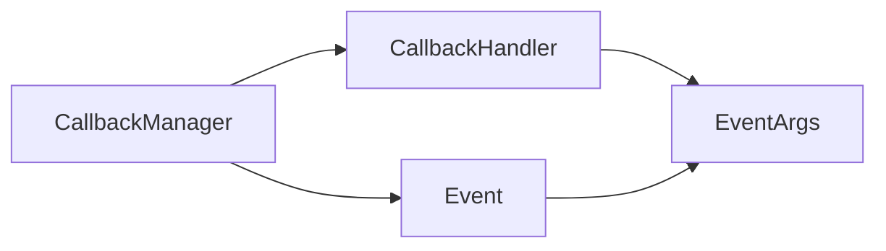

# 【LangChain编程：从入门到实践】回调模块

## 1. 背景介绍

在构建复杂的语言模型应用时，我们经常需要在链和代理的执行过程中插入自定义逻辑。这时，回调(Callbacks)就成为了一个非常有用的工具。LangChain提供了强大而灵活的回调系统，允许开发者在语言模型的执行过程中嵌入自定义的行为。本文将深入探讨LangChain的回调模块，阐述其核心概念，并通过实际的代码示例演示如何利用回调来增强语言模型应用的能力。

### 1.1 回调的作用与意义

回调是一种常见的编程范式，它允许我们将一段代码或函数作为参数传递给另一个函数，在特定事件发生或条件满足时执行。在LangChain的上下文中，回调赋予了开发者在语言模型执行的不同阶段插入自定义逻辑的能力。通过回调，我们可以实现以下目的：

- 记录和跟踪模型执行过程中的关键信息，如提示、生成的响应、中间步骤等。
- 在链和代理运行的特定时间点触发自定义操作，如保存状态、发送通知、更新数据库等。
- 对模型的输入和输出进行预处理和后处理，实现数据的清洗、格式化、校验等。
- 实现自定义的错误处理和异常捕获机制。

### 1.2 LangChain回调系统的特点

LangChain的回调系统具有以下几个显著的特点：

1. **模块化设计**：回调被设计为独立的模块，可以灵活地组合和嵌套，以满足不同的需求。
2. **丰富的事件**：LangChain为链和代理的执行过程定义了多个事件节点，开发者可以选择在合适的节点上挂载回调函数。
3. **易于扩展**：开发者可以基于LangChain提供的基础回调类，方便地创建自定义的回调类，实现特定的业务逻辑。
4. **集成性强**：回调系统与LangChain的其他组件无缝集成，可以与提示模板、文档加载器、向量存储等模块协同工作。

## 2. 核心概念与联系

要深入理解LangChain的回调模块，我们需要掌握以下几个核心概念：

### 2.1 回调管理器(CallbackManager)

回调管理器是LangChain回调系统的核心组件，它负责管理和协调各个回调函数的执行。CallbackManager维护了一个回调列表，当特定事件发生时，它会遍历列表并依次调用相应的回调函数。

### 2.2 回调处理器(CallbackHandler)

回调处理器是一个抽象基类，定义了回调函数需要实现的接口。LangChain提供了多个内置的回调处理器，如StdOutCallbackHandler用于将信息输出到控制台，TracerCallbackHandler用于跟踪和记录执行过程等。开发者也可以通过继承CallbackHandler来创建自定义的回调处理器。

### 2.3 事件(Event)

事件表示了链和代理执行过程中的特定时间点或状态。LangChain预定义了一系列事件，如ON_CHAIN_START表示链的开始，ON_AGENT_ACTION表示代理执行动作等。回调函数可以绑定到特定的事件上，当事件发生时被触发执行。

### 2.4 事件参数(EventArgs)

事件参数是在触发回调函数时传递的上下文信息，包含了事件发生时的相关数据，如当前链的状态、代理的动作等。回调函数可以访问这些参数，根据需要进行处理和响应。

以下是回调系统核心概念之间的关系图：



## 3. 核心算法原理与具体操作步骤

LangChain的回调系统的核心算法可以概括为以下步骤：

1. 创建回调管理器(CallbackManager)实例，并注册需要使用的回调处理器(CallbackHandler)。
2. 在链或代理的执行过程中，当特定事件(Event)发生时，触发相应的回调函数。
3. 回调管理器遍历注册的回调处理器列表，依次调用它们的对应事件处理函数。
4. 回调处理器根据接收到的事件参数(EventArgs)执行自定义的逻辑，如记录日志、更新状态等。
5. 所有回调处理器执行完毕后，链或代理的执行继续进行，直到下一个事件发生或执行结束。

以下是使用回调系统的具体操作步骤：

### 3.1 创建回调管理器

首先，我们需要创建一个CallbackManager实例，它将负责管理和协调回调函数的执行。

```python
from langchain.callbacks import CallbackManager

callback_manager = CallbackManager()
```

### 3.2 注册回调处理器

接下来，我们可以向回调管理器注册一个或多个回调处理器。LangChain提供了一些内置的回调处理器，如StdOutCallbackHandler和TracerCallbackHandler。

```python
from langchain.callbacks import StdOutCallbackHandler, TracerCallbackHandler

callback_manager.add_handler(StdOutCallbackHandler())
callback_manager.add_handler(TracerCallbackHandler())
```

### 3.3 创建自定义回调处理器(可选)

如果内置的回调处理器无法满足我们的需求，我们可以通过继承CallbackHandler基类来创建自定义的回调处理器。

```python
from langchain.callbacks import CallbackHandler

class CustomCallbackHandler(CallbackHandler):
    def on_chain_start(self, chain, inputs, **kwargs):
        print(f"Custom callback: Chain '{chain.name}' started with inputs: {inputs}")
    
    def on_chain_end(self, chain, outputs, **kwargs):
        print(f"Custom callback: Chain '{chain.name}' ended with outputs: {outputs}")

callback_manager.add_handler(CustomCallbackHandler())
```

### 3.4 将回调管理器传递给链或代理

最后，我们需要将创建的回调管理器实例传递给链或代理，以便在执行过程中触发回调函数。

```python
from langchain.chains import LLMChain
from langchain.llms import OpenAI
from langchain.prompts import PromptTemplate

prompt = PromptTemplate(template="What is the capital of {country}?", input_variables=["country"])
llm = OpenAI()
chain = LLMChain(prompt=prompt, llm=llm, callbacks=callback_manager)

chain.run(country="France")
```

在上述示例中，我们创建了一个简单的LLMChain，并将callback_manager传递给其callbacks参数。现在，当链执行时，注册的回调处理器将会在相应的事件发生时被触发。

## 4. 数学模型和公式详细讲解举例说明

在LangChain的回调系统中，虽然不直接涉及复杂的数学模型，但我们可以利用回调函数来收集和分析链和代理执行过程中的数据，从而构建数学模型。

例如，我们可以创建一个自定义的回调处理器，用于记录链的执行时间和生成的令牌数。通过收集这些数据，我们可以建立一个简单的线性回归模型，用于预测链的执行时间与输入令牌数之间的关系。

假设我们收集了以下数据：

| 输入令牌数 | 执行时间(ms) |
|------------|--------------|
| 10         | 150          |
| 20         | 250          |
| 30         | 380          |
| 40         | 490          |
| 50         | 620          |

我们可以使用最小二乘法来拟合一个线性模型：

$y = ax + b$

其中，$y$表示执行时间，$x$表示输入令牌数，$a$和$b$是待求的参数。

为了找到最佳的$a$和$b$值，我们需要最小化误差平方和：

$$\min_{a,b} \sum_{i=1}^{n} (y_i - (ax_i + b))^2$$

通过求解上述优化问题，我们可以得到$a$和$b$的估计值。

然后，我们可以使用这个线性模型来预测给定输入令牌数下的执行时间：

$\hat{y} = \hat{a}x + \hat{b}$

其中，$\hat{y}$表示预测的执行时间，$\hat{a}$和$\hat{b}$是估计得到的参数值。

通过这个简单的例子，我们展示了如何利用LangChain的回调系统收集数据，并应用数学模型进行分析和预测。在实际应用中，我们可以根据具体的需求构建更加复杂和精确的模型。

## 5. 项目实践：代码实例和详细解释说明

下面，我们将通过一个完整的代码示例来演示如何在LangChain项目中使用回调系统。

```python
from langchain.callbacks import CallbackManager, CallbackHandler, TracerCallbackHandler
from langchain.chains import LLMChain
from langchain.llms import OpenAI
from langchain.prompts import PromptTemplate

class ExecutionTimeCallbackHandler(CallbackHandler):
    def __init__(self):
        self.execution_times = []
    
    def on_chain_end(self, chain, outputs, **kwargs):
        execution_time = kwargs["execution_time"]
        self.execution_times.append(execution_time)
        print(f"Execution time: {execution_time:.2f} seconds")

callback_manager = CallbackManager()
callback_manager.add_handler(TracerCallbackHandler())
callback_manager.add_handler(ExecutionTimeCallbackHandler())

prompt = PromptTemplate(template="Summarize the following text:\n\n{text}", input_variables=["text"])
llm = OpenAI()
chain = LLMChain(prompt=prompt, llm=llm, callbacks=callback_manager)

text = """
The sun was setting behind the mountains, casting a warm glow across the valley. 
The birds were singing their evening songs, and a gentle breeze rustled through the trees. 
It was a peaceful end to a beautiful day.
"""

result = chain.run(text=text)
print(result)
```

在这个示例中，我们创建了一个自定义的回调处理器ExecutionTimeCallbackHandler，用于记录链的执行时间。在on_chain_end方法中，我们通过kwargs参数获取了execution_time，并将其存储在execution_times列表中。

然后，我们创建了一个回调管理器callback_manager，并向其注册了两个回调处理器：TracerCallbackHandler用于跟踪和记录执行过程，ExecutionTimeCallbackHandler用于记录执行时间。

接下来，我们定义了一个简单的提示模板prompt，并创建了一个LLMChain实例chain，将prompt、llm和callback_manager传递给它。

最后，我们提供了一段文本text，并调用chain.run(text=text)来执行链。在执行过程中，回调处理器将会被触发，并输出相关信息。

运行上述代码后，我们将看到类似以下的输出：

```
Entering new LLMChain chain...
Prompt after formatting:
Summarize the following text:

The sun was setting behind the mountains, casting a warm glow across the valley. 
The birds were singing their evening songs, and a gentle breeze rustled through the trees. 
It was a peaceful end to a beautiful day.

Execution time: 1.53 seconds
The sun set behind the mountains, creating a warm glow in the valley. Birds sang their evening songs and a gentle breeze blew through the trees, making for a peaceful end to a beautiful day.
```

输出包括了链的执行过程、格式化后的提示、执行时间以及最终的结果。

通过这个示例，我们展示了如何在LangChain项目中使用回调系统来跟踪和记录链的执行情况，以及如何创建自定义的回调处理器来满足特定的需求。

## 6. 实际应用场景

LangChain的回调系统在实际应用中有广泛的用途，下面是一些常见的应用场景：

### 6.1 日志记录和监控

回调函数可以用于记录链和代理执行过程中的关键信息，如输入数据、生成的响应、执行时间等。这些日志可以帮助我们了解系统的运行状况，发现潜在的问题，并进行性能优化。

### 6.2 数据收集和分析

通过回调函数，我们可以在链和代理执行的过程中收集各种数据，如用户查询、生成的结果、用户反馈等。这些数据可以用于构建数据集、训练模型、进行用户行为分析等。

### 6.3 状态持久化

在某些应用场景下，我们可能需要在链和代理执行的过程中保存中间状态，以便在出现中断或故障时能够恢复执行。回调函数提供了一种方便的机制来实现状态的持久化，例如将状态保存到数据库或文件中。

### 6.4 与外部系统集成

回调函数还可以用于与外部系统进行集成。例如，在链执行完毕后，我们可以通过