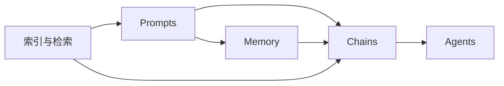

# 【LangChain编程：从入门到实践】大模型接口

## 1. 背景介绍
### 1.1 大语言模型的崛起
近年来，随着深度学习技术的飞速发展，大语言模型(Large Language Model, LLM)在自然语言处理领域取得了令人瞩目的成就。从GPT系列到BERT，再到最新的ChatGPT，这些模型展示了惊人的语言理解和生成能力，引发了学术界和工业界的广泛关注。

### 1.2 LLM应用开发的挑战
然而，对于普通开发者来说，直接使用这些大模型进行应用开发并非易事。一方面，这些模型体量庞大，部署和微调需要大量的算力和存储资源；另一方面，不同模型的接口和使用方式差异较大，开发者需要花费大量精力去适配和集成不同的模型。

### 1.3 LangChain的出现
在这样的背景下，LangChain应运而生。LangChain是一个专为LLM应用开发设计的编程框架，它提供了一套统一的接口和工具，帮助开发者快速构建基于LLM的应用，而无需关注底层模型的细节和差异。

## 2. 核心概念与联系
### 2.1 Prompts - 对话上下文
在LangChain中，Prompts是指与LLM进行交互时的对话上下文。它包含了一系列的指令、问题、以及之前的对话历史等信息，用于引导模型生成符合预期的回复。

### 2.2 Chains - 任务链
Chains是LangChain中的一个核心概念，它将多个LLM调用步骤组合成一个完整的任务流程。每个Chain由多个节点组成，节点可以是一次LLM调用、一次数据库查询、一个Python函数等。通过组合不同的节点，我们可以构建出复杂的LLM应用。

### 2.3 Agents - 智能代理
Agents是一种特殊的Chains，它可以根据用户的输入，自主决定执行哪些子任务，并动态调整任务的执行流程。Agents 让LLM 具备了一定的自主决策和推理能力，使其更加灵活和智能。

### 2.4 Memory - 记忆机制
Memory 是LangChain提供的一种记忆机制，用于在多轮对话中保持状态信息。它可以将之前的对话内容存储下来，并在后续的交互中提供给LLM，使得模型能够根据上下文生成更加连贯和一致的回复。

### 2.5 索引与检索
LangChain还提供了基于向量数据库的索引与检索功能。通过将文本数据编码为向量并建立索引，我们可以快速地从海量信息中找到与当前对话最相关的内容，从而增强LLM的知识获取和问答能力。

下面是这些核心概念之间的关系示意图：



## 3. 核心算法原理与具体操作步骤
### 3.1 Prompts的构建与优化
#### 3.1.1 Few-shot Prompts
Few-shot Prompts是一种常见的Prompt构建方法，它通过在Prompt中提供少量示例，来引导LLM生成相似的内容。具体步骤如下：

1. 收集并筛选高质量的示例数据
2. 将示例数据格式化为统一的格式
3. 将格式化后的示例数据插入到Prompt模板中
4. 在Prompt末尾添加具体的任务指令

#### 3.1.2 Prompt模板化
为了提高Prompt的复用性和可维护性，我们可以将Prompt中的不变部分抽象为模板，将变化部分作为参数传入。以下是一个简单的Prompt模板化示例：

```python
from langchain import PromptTemplate

template = """
根据以下几条产品评论，总结一下这款产品的优缺点：

{reviews}

优点：
缺点：
"""

prompt = PromptTemplate(
    input_variables=["reviews"],
    template=template,
)

reviews = [
    "外观精美，做工扎实，性价比高。",
    "电池续航一般，屏幕分辨率不够高。",
    "系统运行流畅，应用生态丰富。",
]

print(prompt.format(reviews="\n".join(reviews)))
```

#### 3.1.3 Prompt工程
Prompt工程是一门专门优化Prompt以提高LLM性能的技术。常见的优化技巧包括：

- 使用清晰、具体的指令，避免歧义
- 控制Prompt的长度，避免包含无关信息
- 在Prompt中提供反例，引导LLM避免常见错误
- 对不同的任务使用不同的Prompt模板

### 3.2 Chains的设计与组合
#### 3.2.1 顺序链(Sequential Chains)
顺序链是最基本的Chain类型，它按照固定的顺序依次执行各个节点。以下是一个简单的顺序链示例：

```python
from langchain.chains import LLMChain
from langchain.prompts import PromptTemplate
from langchain.llms import OpenAI

llm = OpenAI(temperature=0.9)

prompt = PromptTemplate(
    input_variables=["product"],
    template="What is a good name for a company that makes {product}?",
)

chain = LLMChain(llm=llm, prompt=prompt)

print(chain.run("colorful socks"))
```

#### 3.2.2 路由链(Router Chains)
路由链可以根据某个条件变量，动态选择执行哪个子链。这在处理多分支逻辑时非常有用。以下是一个简单的路由链示例：

```python
from langchain.chains import ConversationChain
from langchain.llms import OpenAI

llm = OpenAI(temperature=0)
conversation = ConversationChain(llm=llm)

output = conversation.predict(input="Hi there!")
print(output)

output = conversation.predict(input="I'm doing well! Just having a conversation with an AI.")
print(output)
```

#### 3.2.3 组合链(Combination Chains)
组合链允许我们将多个链组合成一个更大的链。常见的组合方式有：

- 串联(Series)：将多个链按顺序连接，前一个链的输出作为后一个链的输入
- 并联(Parallel)：同时执行多个链，将它们的输出合并为一个结果
- 嵌套(Nested)：将一个链作为另一个链的节点，形成层次化的结构

### 3.3 Agents的实现原理
Agents的核心思想是将任务分解为多个子任务，并根据当前的状态动态决策下一步执行哪个子任务。其基本实现步骤如下：

1. 定义Agent可以执行的动作(Action)，如查询数据库、调用API等
2. 定义Agent的任务分解逻辑，将复杂任务拆解为多个子任务
3. 实现Agent的决策逻辑，根据当前状态和用户输入，选择下一步要执行的动作
4. 执行选定的动作，并根据执行结果更新状态
5. 重复步骤3-4，直到任务完成或达到终止条件

以下是一个简单的Agent示例：

```python
from langchain.agents import load_tools
from langchain.agents import initialize_agent
from langchain.agents import AgentType
from langchain.llms import OpenAI

llm = OpenAI(temperature=0)
tools = load_tools(["serpapi", "llm-math"], llm=llm)

agent = initialize_agent(tools, llm, agent=AgentType.ZERO_SHOT_REACT_DESCRIPTION, verbose=True)

agent.run("What was the high temperature in SF yesterday in Fahrenheit? What is that number raised to the .023 power?")
```

### 3.4 Memory的使用方法
LangChain提供了多种Memory实现，适用于不同的场景。以下是几种常见的Memory类型：

- ConversationBufferMemory：将对话历史存储在内存中，适用于短期的多轮对话
- ConversationSummaryMemory：在ConversationBufferMemory的基础上，使用LLM自动总结对话内容，减少了存储开销
- ConversationKGMemory：将对话历史构建为知识图谱，支持更复杂的上下文关联和推理

下面是一个使用ConversationBufferMemory的示例：

```python
from langchain.llms import OpenAI
from langchain.chains import ConversationChain
from langchain.memory import ConversationBufferMemory

llm = OpenAI(temperature=0)
memory = ConversationBufferMemory()
conversation = ConversationChain(llm=llm, memory=memory)

output = conversation.predict(input="Hi there!")
print(output)

output = conversation.predict(input="What did I just say?")
print(output)
```

### 3.5 索引与检索的实现
LangChain通过封装流行的向量数据库，如Faiss、Pinecone等，来实现高效的文本索引与检索。以下是一个使用Faiss构建文本索引的示例：

```python
from langchain.vectorstores import FAISS
from langchain.embeddings import OpenAIEmbeddings

embeddings = OpenAIEmbeddings()
docs = [
    "苹果是一种水果，它的颜色通常是红色或绿色。",
    "香蕉是一种水果，它的形状是长条状，颜色是黄色。",
    "橙子也是一种水果，它的颜色是橙色，味道是酸甜的。",
]

db = FAISS.from_texts(docs, embeddings)

query = "一种黄色的水果是什么？"
docs = db.similarity_search(query)

print(docs[0].page_content)
```

## 4. 数学模型与公式详解
### 4.1 语言模型的数学原理
大语言模型的核心是基于Transformer架构的神经网络。Transformer的关键创新是引入了自注意力机制(Self-Attention)，让模型能够捕捉到输入序列中任意两个位置之间的依赖关系。

给定一个输入序列 $X=(x_1, x_2, ..., x_n)$，Transformer首先将其编码为一组向量 $H^{(0)}=(h_1^{(0)}, h_2^{(0)}, ..., h_n^{(0)})$。然后，通过多轮的自注意力和前向传播，迭代更新这组向量：

$$
\begin{aligned}
H^{(l+1)} &= \text{Transformer}(H^{(l)}), \quad l=0,1,...,L-1 \\
\text{Transformer}(H^{(l)}) &= \text{LayerNorm}(H^{(l)} + \text{MLP}(\text{LayerNorm}(H^{(l)} + \text{MultiHead}(H^{(l)})))) \\
\text{MultiHead}(H^{(l)}) &= \text{Concat}(\text{head}_1, ..., \text{head}_h)W^O \\
\text{head}_i &= \text{Attention}(H^{(l)}W_i^Q, H^{(l)}W_i^K, H^{(l)}W_i^V) \\
\text{Attention}(Q, K, V) &= \text{softmax}(\frac{QK^T}{\sqrt{d_k}})V
\end{aligned}
$$

其中，$W_i^Q, W_i^K, W_i^V$是注意力机制的参数矩阵，$W^O$是多头注意力的输出矩阵，$\text{MLP}$是一个前向神经网络。

最后，Transformer将最后一层的输出向量 $H^{(L)}$ 传入一个线性层，得到预测的概率分布：

$$
P(x_{n+1}|x_1, ..., x_n) = \text{softmax}(H^{(L)}W^{out})
$$

模型的训练目标是最大化正确预测下一个词的概率，即最小化交叉熵损失：

$$
\mathcal{L} = -\sum_{i=1}^{n}\log P(x_i|x_1, ..., x_{i-1})
$$

### 4.2 向量检索的相似度计算
在基于向量的文本检索中，我们需要计算查询向量与索引向量之间的相似度。常用的相似度度量包括：

- 欧几里得距离(Euclidean Distance)：
$$
d(x, y) = \sqrt{\sum_{i=1}^{n}(x_i - y_i)^2}
$$

- 余弦相似度(Cosine Similarity)：
$$
\cos(x, y) = \frac{x \cdot y}{||x|| \cdot ||y||} = \frac{\sum_{i=1}^{n}x_iy_i}{\sqrt{\sum_{i=1}^{n}x_i^2}\sqrt{\sum_{i=1}^{n}y_i^2}}
$$

- 点积(Dot Product)：
$$
x \cdot y = \sum_{i=1}^{n}x_iy_i
$$

在实际应用中，我们通常使用点积作为相似度度量，因为它计算简单，且可以通过近似最近邻(ANN)算法加速检索过