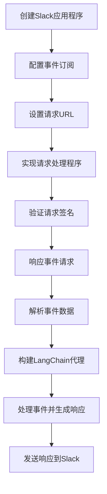

# 【LangChain编程：从入门到实践】构建Slack事件接口

## 1.背景介绍

### 1.1 什么是Slack

Slack是一款广受欢迎的团队协作工具,它提供了实时消息传递、文件共享、集成第三方应用等功能,可以极大地提高团队的工作效率和协作体验。随着远程办公和分布式团队的兴起,Slack已经成为许多公司和组织的必备工具。

### 1.2 Slack事件接口概述

Slack事件接口(Slack Events API)允许开发者构建应用程序来监听和响应各种Slack事件,例如新消息、新用户加入、反应添加等。通过事件接口,开发者可以创建自定义的工作流程,自动化任务,并与Slack进行双向交互。

### 1.3 LangChain简介

LangChain是一个用于构建应用程序的框架,旨在通过大型语言模型(LLM)和其他AI组件的组合来简化开发过程。它提供了一套模块化的Python库,用于构建基于LLM的应用程序。LangChain支持多种LLM提供商,如OpenAI、Anthropic和Cohere,并且可以轻松集成其他工具和服务。

## 2.核心概念与联系

### 2.1 Slack事件接口核心概念

- **事件订阅(Event Subscriptions)**:允许应用程序订阅感兴趣的Slack事件,例如消息事件、反应事件等。
- **事件请求(Event Request)**:当订阅的事件发生时,Slack会向应用程序发送一个HTTP POST请求,其中包含事件详细信息。
- **请求签名验证(Request Signature Verification)**:为了确保请求的安全性,Slack会对每个事件请求进行签名验证。
- **响应(Response)**:应用程序需要在3秒内对事件请求做出响应,以确认收到事件。
- **重试(Retries)**:如果应用程序未能及时响应,Slack会重试发送事件请求。

### 2.2 LangChain核心概念

- **代理(Agents)**:代理是LangChain中的核心概念,它将LLM与其他组件(如工具、内存等)结合起来,以执行特定任务。
- **工具(Tools)**:工具是可以由代理调用的函数或API,用于执行特定操作,如查询数据库、发送HTTP请求等。
- **内存(Memory)**:内存用于存储代理在执行任务过程中的中间状态和结果,以供后续使用。
- **语言模型(Language Model)**:LangChain支持多种LLM提供商,如OpenAI的GPT-3、Anthropic的Claude等。

### 2.3 将Slack事件接口与LangChain结合

通过将Slack事件接口与LangChain结合,我们可以构建一个智能代理系统,用于监听和响应Slack事件。代理可以利用LLM的自然语言处理能力来理解和生成响应,同时通过调用各种工具来执行特定操作,如查询数据库、发送通知等。这种结合可以极大地提高应用程序的智能化水平和自动化程度。

## 3.核心算法原理具体操作步骤

构建一个Slack事件接口应用程序涉及以下核心步骤:

1. **创建Slack应用程序**:在Slack开发者控制台中创建一个新的应用程序,并启用事件订阅功能。

2. **配置事件订阅**:选择要订阅的事件类型,如消息事件、反应事件等。

3. **设置请求URL**:配置一个公开可访问的URL,作为Slack发送事件请求的目标地址。

4. **实现请求处理程序**:编写一个Web服务器程序,用于接收并处理Slack发送的事件请求。

5. **验证请求签名**:使用Slack提供的签名验证机制,确保事件请求的合法性和安全性。

6. **响应事件请求**:在3秒内对事件请求做出响应,以确认收到事件。

7. **解析事件数据**:从事件请求中提取相关数据,如消息内容、发送者信息等。

8. **构建LangChain代理**:创建一个LangChain代理,将LLM与相关工具(如Slack API客户端)结合起来。

9. **处理事件并生成响应**:使用代理来理解事件数据,并根据需要调用相关工具执行操作,最终生成响应内容。

10. **发送响应到Slack**:将生成的响应发送回Slack,以与用户进行交互。

以下是一个简化的流程图,展示了构建Slack事件接口应用程序的核心步骤:



## 4.数学模型和公式详细讲解举例说明

在构建Slack事件接口应用程序时,我们可能需要使用一些数学模型和公式来处理和分析数据。以下是一些可能会用到的数学概念和公式:

### 4.1 请求签名验证

Slack使用HMAC (Hash-based Message Authentication Code)算法来验证事件请求的合法性。HMAC算法的公式如下:

$$
\text{HMAC}(K, m) = H\big((K' \oplus \text{opad}) \| H\big((K' \oplus \text{ipad}) \| m\big)\big)
$$

其中:

- $K$是密钥
- $m$是消息
- $H$是加密哈希函数,如SHA-256
- $K'$是密钥$K$经过处理后的形式
- $\oplus$表示异或运算
- $\|$表示连接操作

在Slack事件接口中,我们需要使用HMAC算法来计算请求签名,并与Slack提供的签名进行比较,以验证请求的合法性。

### 4.2 自然语言处理

在使用LangChain处理Slack事件数据时,我们可能需要使用一些自然语言处理(NLP)技术,例如:

- **词向量(Word Embeddings)**:将单词表示为向量,以捕捉语义和语法信息。常用的词向量模型包括Word2Vec、GloVe等。
- **命名实体识别(Named Entity Recognition, NER)**:识别文本中的命名实体,如人名、地名、组织名等。
- **情感分析(Sentiment Analysis)**:分析文本中的情感倾向,如正面、负面或中性。

这些技术可以帮助我们更好地理解和处理Slack消息的内容,从而生成更准确和相关的响应。

### 4.3 机器学习模型

在某些情况下,我们可能需要使用机器学习模型来处理和分析数据。以下是一些常见的机器学习模型:

- **线性回归(Linear Regression)**:用于预测连续值输出的模型。
- **逻辑回归(Logistic Regression)**:用于二分类问题的模型。
- **决策树(Decision Trees)**:基于特征的决策规则来进行分类或回归的模型。
- **支持向量机(Support Vector Machines, SVM)**:用于分类和回归的有监督学习模型。
- **神经网络(Neural Networks)**:包括前馈神经网络、卷积神经网络等,可用于各种任务,如分类、回归、序列建模等。

这些模型可以用于各种任务,如预测用户行为、分类消息内容、识别模式等,从而提高应用程序的智能化水平。

## 5.项目实践:代码实例和详细解释说明

在本节中,我们将提供一个示例项目,展示如何使用LangChain构建一个Slack事件接口应用程序。该示例将包括以下几个部分:

1. **设置Slack应用程序和事件订阅**
2. **实现Web服务器和请求处理程序**
3. **构建LangChain代理**
4. **处理事件并生成响应**
5. **发送响应到Slack**

### 5.1 设置Slack应用程序和事件订阅

首先,我们需要在Slack开发者控制台中创建一个新的应用程序,并启用事件订阅功能。以下是具体步骤:

1. 访问 https://api.slack.com/ 并登录您的Slack账户。
2. 点击"Create an App"按钮,为您的应用程序命名并选择工作区。
3. 在"Add features and functionality"部分,点击"Bots"选项卡,然后点击"Review Scopes to Add"。
4. 滚动到底部,点击"Install to Workspace"按钮,并确认安装。
5. 在"Event Subscriptions"部分,打开"Enable Events"开关。
6. 输入一个公开可访问的请求URL,作为Slack发送事件请求的目标地址。
7. 订阅所需的事件,如"message.channels"(频道消息事件)。
8. 记下应用程序的签名密钥,以便后续进行请求签名验证。

### 5.2 实现Web服务器和请求处理程序

接下来,我们需要实现一个Web服务器程序,用于接收并处理Slack发送的事件请求。以下是使用Python和Flask框架的示例代码:

```python
from flask import Flask, request
import hmac
import hashlib
import time

app = Flask(__name__)

# Slack签名密钥
SLACK_SIGNING_SECRET = "your_slack_signing_secret"

# 验证请求签名
def verify_signature(request_data, timestamp, signature):
    basestring = f"v0:{timestamp}:{request_data}".encode("utf-8")
    my_signature = hmac.new(
        SLACK_SIGNING_SECRET.encode("utf-8"), basestring, hashlib.sha256
    ).hexdigest()
    return hmac.compare_digest(my_signature, signature)

# 处理事件请求
@app.route("/slack/events", methods=["POST"])
def handle_events():
    # 获取请求数据
    request_data = request.get_data()
    timestamp = request.headers.get("X-Slack-Request-Timestamp")
    signature = request.headers.get("X-Slack-Signature")

    # 验证请求签名
    if not verify_signature(request_data, timestamp, signature):
        return "Invalid request signature", 403

    # 解析事件数据
    event_data = request.form.to_dict()
    event_type = event_data.get("event", {}).get("type")

    # 处理不同类型的事件
    if event_type == "message":
        handle_message_event(event_data)
    elif event_type == "reaction_added":
        handle_reaction_event(event_data)
    # 处理其他事件类型...

    # 响应事件请求
    return "", 200

# 处理消息事件
def handle_message_event(event_data):
    # 获取消息内容和发送者信息
    message_text = event_data.get("event", {}).get("text")
    user_id = event_data.get("event", {}).get("user")

    # 处理消息并生成响应
    response_text = process_message(message_text, user_id)

    # 发送响应到Slack
    send_response_to_slack(response_text, event_data)

# 处理反应事件
def handle_reaction_event(event_data):
    # 获取反应信息
    reaction = event_data.get("event", {}).get("reaction")
    user_id = event_data.get("event", {}).get("user")

    # 处理反应并生成响应
    response_text = process_reaction(reaction, user_id)

    # 发送响应到Slack
    send_response_to_slack(response_text, event_data)

# 启动Web服务器
if __name__ == "__main__":
    app.run(host="0.0.0.0", port=5000)
```

在上述代码中,我们首先定义了一个函数`verify_signature`用于验证请求签名。然后,我们创建了一个Flask应用程序,并定义了一个路由`/slack/events`用于处理Slack事件请求。

在`handle_events`函数中,我们首先验证请求签名的合法性。如果签名有效,我们就解析事件数据,并根据事件类型调用相应的处理函数,如`handle_message_event`和`handle_reaction_event`。

在处理函数中,我们可以获取事件相关的数据,如消息内容、发送者信息等。然后,我们可以调用其他函数(如`process_message`和`process_reaction`)来处理这些数据,并生成响应内容。最后,我们可以使用`send_response_to_slack`函数将响应发送回Slack。

需要注意的是,上述代码只是一个示例,实际实现中还需要添加更多功能,如构建LangChain代理、集成Slack API客户端等。

### 5.3 构建LangChain代理

为了使用LangChain处理Slack事件数据,我们需要构建一个代理(