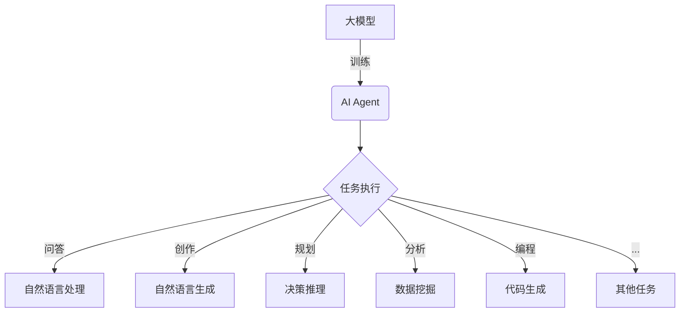

# 【大模型应用开发 动手做AI Agent】Agent带来新的商业模式和变革

## 1.背景介绍

### 1.1 人工智能发展历程

人工智能(Artificial Intelligence, AI)是当代科技发展的核心驱动力之一。自20世纪50年代AI概念被正式提出以来,经历了几个重要的发展阶段:

- 早期阶段(1950s-1960s):专家系统、博弈论等理论研究
- 知识迷思时期(1970s-1980s):AI研究遭遇瓶颈,资金短缺
- 统计学习时期(1990s-2000s):机器学习、深度学习等算法兴起
- 大数据时代(2010s-):benefiting 算力、数据和算法的飞速发展

### 1.2 大模型的崛起

近年来,AI迎来了新的重大突破——大模型(Large Language Model,LLM)的崛起。大模型是指具有超大规模参数(通常超过10亿个参数)、基于海量数据训练的深度学习模型。代表模型包括GPT-3、BERT、DALL-E等。

大模型展现出惊人的泛化能力,可应用于广泛的自然语言处理(NLP)、计算机视觉(CV)等任务,为AI发展开辟了新的战略方向。

### 1.3 AI Agent的兴起  

基于大模型,AI Agent应运而生。AI Agent是一种智能软件代理,能够根据用户需求执行各种任务,如问答、写作、编程、分析等。它具备较强的交互和推理能力,可像人一样思考、学习和创造。

AI Agent的出现,标志着AI从单一任务向通用智能迈进,将深刻影响商业模式和社会生活。本文将围绕AI Agent的技术原理、应用实践和发展趋势展开深入探讨。

## 2.核心概念与联系



AI Agent的核心是大模型,通过大规模参数和海量训练数据,赋予了Agent通用的认知和推理能力。Agent可执行多种任务:

### 2.1 自然语言处理(NLP)

包括问答、文本摘要、机器翻译等,是Agent最基本的能力。

### 2.2 自然语言生成(NLG)  

Agent可以生成高质量的文本内容,如新闻、小说、文案等,具有一定的创造力。

### 2.3 决策推理

基于对知识的理解,Agent能够进行逻辑推理、策略规划、多目标决策等高级认知活动。

### 2.4 数据挖掘与分析

结合大数据和机器学习技术,Agent可从海量数据中发现知识和见解。

### 2.5 代码生成

Agent可根据需求生成计算机程序代码,大大提高软件开发效率。

Agent的多功能特性,使其在各行业领域都有广阔的应用前景。

## 3.核心算法原理具体操作步骤  

### 3.1 自监督预训练

大模型的训练采用自监督学习范式,通过掩蔽语言模型(Masked Language Modeling)和下一句预测(Next Sentence Prediction)等任务,在大规模语料库上进行预训练。

具体步骤:

1. 收集海量语料数据(如网页、书籍等)
2. 对部分词元(token)进行掩蔽
3. 模型根据上下文,预测被掩蔽词元
4. 计算预测与真实词元的差异
5. 根据差异,反向传播调整模型参数
6. 重复以上过程,直至收敛

### 3.2 微调(Fine-tuning)

预训练获得通用知识后,可针对特定任务进行微调,进一步提高模型性能。

微调步骤:

1. 准备任务相关的训练数据集
2. 将预训练模型的部分参数固定
3. 在任务数据集上继续训练模型
4. 根据任务指标(如准确率)调整参数
5. 重复训练直至模型在验证集上表现最优

通过预训练+微调的策略,大模型可快速适应新任务,显著降低数据需求。

### 3.3 生成式模型

大模型采用生成式建模,通过自回归(Auto-Regressive)结构,根据上文生成下文。

例如,GPT-3使用Transformer解码器,给定文本前缀$x_1,...,x_t$,模型计算:

$$P(x_{t+1}|x_1,...,x_t) = \text{Decoder}(x_1,...,x_t)$$

然后基于概率分布采样生成$x_{t+1}$,重复该过程直至终止。

通过上下文相关性建模,大模型可生成连贯、合理的文本序列。

### 3.4 控制策略

为使生成结果满足特定需求,常采用控制策略对模型输出进行调整,如:

- 关键词引导(Keyword Prompting):给定关键词引导生成
- 分类头微调(Classifier Head):添加分类头微调模型
- 增量学习(Incremental Learning):持续学习新知识
- 奖赏建模(Reward Modeling):最大化生成质量奖赏

通过控制策略,可提高大模型在特定任务上的性能和可控性。

## 4.数学模型和公式详细讲解举例说明

大模型的核心是Transformer架构,由注意力(Attention)机制和前馈神经网络(Feed-Forward Network)构成。我们来看看Transformer的数学原理。

### 4.1 注意力机制(Attention)

注意力机制能够捕捉输入序列中不同位置元素之间的相关性。对于输入序列$\boldsymbol{x} = (x_1, x_2, ..., x_n)$,注意力机制计算:

$$\text{Attention}(\boldsymbol{Q}, \boldsymbol{K}, \boldsymbol{V}) = \text{softmax}(\frac{\boldsymbol{Q}\boldsymbol{K}^T}{\sqrt{d_k}})\boldsymbol{V}$$

其中:

- $\boldsymbol{Q}$为查询(Query)向量序列
- $\boldsymbol{K}$为键(Key)向量序列
- $\boldsymbol{V}$为值(Value)向量序列
- $d_k$为缩放因子,防止内积过大导致梯度消失

注意力权重$\alpha_{ij} = \text{softmax}(\frac{\boldsymbol{q}_i\boldsymbol{k}_j^T}{\sqrt{d_k}})$衡量查询$\boldsymbol{q}_i$与键$\boldsymbol{k}_j$的关联程度。

最终注意力输出为加权值向量$\sum_{j=1}^n \alpha_{ij}\boldsymbol{v}_j$的加权和。

### 4.2 多头注意力(Multi-Head Attention)

为捕捉不同子空间的关联信息,Transformer采用多头注意力机制:

$$\begin{aligned}
\text{MultiHead}(\boldsymbol{Q}, \boldsymbol{K}, \boldsymbol{V}) &= \text{Concat}(\text{head}_1, ..., \text{head}_h)\boldsymbol{W}^O\\
\text{where } \text{head}_i &= \text{Attention}(\boldsymbol{Q}\boldsymbol{W}_i^Q, \boldsymbol{K}\boldsymbol{W}_i^K, \boldsymbol{V}\boldsymbol{W}_i^V)
\end{aligned}$$

每个头$\text{head}_i$通过不同的线性投影$\boldsymbol{W}_i^Q,\boldsymbol{W}_i^K,\boldsymbol{W}_i^V$从不同表示子空间计算注意力,最后将所有头的注意力连接并线性投影作为输出。

### 4.3 前馈神经网络(Feed-Forward Network)

除注意力子层外,Transformer的每个编码器/解码器层还包含前馈全连接子层,对注意力输出进行进一步非线性映射:

$$\text{FFN}(\boldsymbol{x}) = \max(0, \boldsymbol{x}\boldsymbol{W}_1 + \boldsymbol{b}_1)\boldsymbol{W}_2 + \boldsymbol{b}_2$$

该子层由两个线性变换和一个ReLU激活函数组成,可实现复杂的特征交互和映射变换。

### 4.4 示例:机器翻译

以机器翻译任务为例,说明Transformer模型的工作过程:

1. 将源语言句子$\boldsymbol{x}$输入编码器
2. 编码器的多头注意力子层捕捉输入序列中元素的相关性
3. 前馈子层对注意力输出进行非线性映射,生成编码器输出$\boldsymbol{z}$
4. 将编码器输出$\boldsymbol{z}$和目标语言起始符<sos>作为解码器输入
5. 解码器结合编码器输出,生成第一个目标词$y_1$的概率分布
6. 将$y_1$作为新输入,重复上步骤生成$y_2,y_3,...$直至终止符<eos>
7. 最终生成的$\boldsymbol{y} = (y_1, y_2, ..., y_n)$即为译文

通过自注意力捕捉输入内部相关性,交叉注意力融合源语言编码信息,以及高效的残差连接和层归一化,Transformer模型展现出优异的序列到序列建模能力。

## 5.项目实践:代码实例和详细解释说明

以下是使用Hugging Face的Transformers库对GPT-2进行微调的Python代码示例,用于生成自然语言文本。

```python
from transformers import GPT2LMHeadModel, GPT2Tokenizer

# 加载预训练模型和分词器
model = GPT2LMHeadModel.from_pretrained('gpt2')
tokenizer = GPT2Tokenizer.from_pretrained('gpt2')

# 示例输入文本
input_text = "Writing a blog post on"

# 对输入文本进行编码
input_ids = tokenizer.encode(input_text, return_tensors='pt')

# 设置生成参数
max_length = 300
do_sample = True
top_k = 50
top_p = 0.95
num_return_sequences = 3

# 生成文本
output = model.generate(
    input_ids,
    max_length=max_length,
    do_sample=do_sample,
    top_k=top_k,
    top_p=top_p,
    num_return_sequences=num_return_sequences
)

# 解码输出
for i in range(num_return_sequences):
    text = tokenizer.decode(output[i], skip_special_tokens=True)
    print(f"Generated text {i+1}:\n{text}\n")
```

代码解释:

1. 导入GPT2模型和分词器。
2. 加载预训练的GPT-2模型和分词器。
3. 设置示例输入文本。
4. 使用分词器将输入文本编码为模型可接受的张量表示。
5. 设置生成参数,如最大长度、采样策略(top-k、top-p)和生成序列数量。
6. 调用`model.generate()`方法生成文本序列。
7. 使用分词器将输出序列解码为文本,并打印结果。

这个例子展示了如何利用预训练的GPT-2模型生成条件文本。通过微调,可以针对特定任务(如新闻生成、对话系统等)进一步优化模型性能。

## 6.实际应用场景

AI Agent由于其通用性和创造性,在诸多领域展现出巨大的应用潜力:

### 6.1 智能写作助手

Agent可辅助创作各类文本内容,如新闻、文案、小说等,提高写作效率。

### 6.2 智能问答系统

结合知识库,Agent可回答各领域的专业问题,为用户提供智能解答。

### 6.3 智能教育辅助

Agent能根据学生知识水平,生成个性化的教学内容和练习,实现在线智能辅导。

### 6.4 智能客服系统  

Agent可模拟人工客服,自动解决常见问题,提升客户体验。

### 6.5 智能医疗诊断

通过分析病史、症状等,Agent可为医生提供辅助诊断建议。

### 6.6 智能金融分析

Agent能分析金融大数据,发现投资机会,为投资者提供决策支持。

### 6.7 软件开发助手

Agent可自动生成代码,简化开发流程,提高软件质量和效率。

### 6.8 创意设计辅助

Agent可根据需求生成创意设