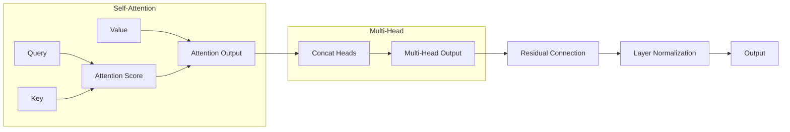
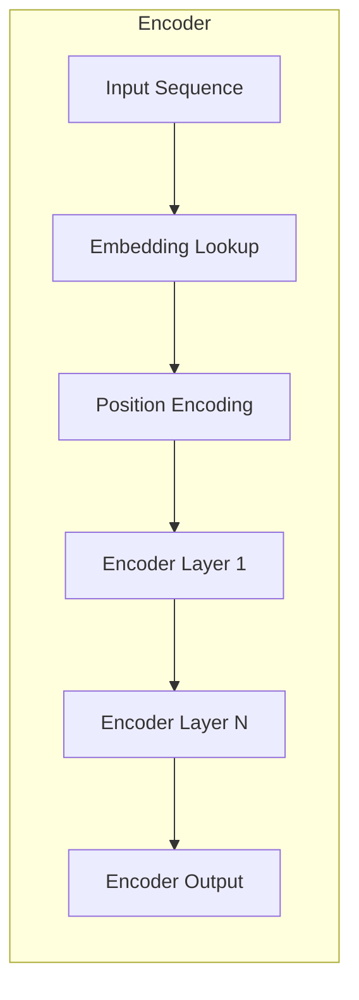

# 【大模型应用开发 动手做AI Agent】知识、记忆、理解、表达、推理、反思、泛化和自我提升

## 1. 背景介绍

### 1.1 人工智能的发展历程

人工智能(Artificial Intelligence, AI)是当代科技发展的前沿领域,它致力于使机器能够模仿人类的智能行为,如学习、推理、规划和创造等。自20世纪50年代AI概念被正式提出以来,这一领域经历了几个重要的发展阶段。

#### 1.1.1 早期阶段

早期的AI系统主要采用符号主义方法,通过构建规则和逻辑推理系统来模拟人类思维。这一时期取得了一些成就,如深蓝战胜国际象棋棋手,但也暴露出了符号主义方法的局限性。

#### 1.1.2 机器学习时代

20世纪90年代,机器学习(Machine Learning)技术的兴起,使AI进入了新的发展阶段。机器学习系统能够从大量数据中自主学习,无需显式编程,从而突破了符号主义的瓶颈。这一时期,AI在语音识别、图像识别等领域取得了长足进步。

#### 1.1.3 深度学习浪潮

2010年后,深度学习(Deep Learning)技术的兴起,推动了AI的又一次飞跃。深度神经网络能够自主学习数据的深层次特征,在计算机视觉、自然语言处理等领域展现出超人类的能力。

### 1.2 大模型的兴起

#### 1.2.1 大模型的概念

随着算力和数据的不断增长,训练大规模深度神经网络成为可能。拥有数十亿甚至上万亿参数的大型神经网络模型,被称为"大模型"(Large Model)。大模型能够从海量数据中学习丰富的知识,展现出强大的认知和推理能力。

#### 1.2.2 大模型的代表作

GPT(Generative Pre-trained Transformer)是大模型的代表作之一,由OpenAI开发。GPT-3拥有1750亿个参数,在自然语言处理任务上表现出色。另一个知名大模型是DeepMind的AlphaFold,它能够准确预测蛋白质的三维结构,为生物医药研究带来革命性突破。

#### 1.2.3 大模型的挑战

尽管大模型取得了令人瞩目的成就,但它们也面临着一些挑战,如庞大的计算资源需求、数据隐私和安全风险、缺乏可解释性等。如何高效训练和部署大模型,确保其安全可靠,是当前研究的重点课题。

## 2. 核心概念与联系

### 2.1 知识表示与记忆

#### 2.1.1 知识表示

大模型需要从海量数据中学习丰富的知识,并以高效的方式表示和存储这些知识。常见的知识表示方法包括:

1. **嵌入表示**(Embedding Representation):将符号(如单词)映射到连续的向量空间,相似的符号具有相近的向量表示。
2. **图表示**(Graph Representation):使用图结构(如知识图谱)表示实体之间的关系。
3. **规则表示**(Rule Representation):使用逻辑规则和公理来形式化表示知识。

#### 2.1.2 记忆机制

为了有效利用学习到的知识,大模型需要具备良好的记忆能力。常见的记忆机制包括:

1. **注意力机制**(Attention Mechanism):通过自注意力(Self-Attention)机制,模型可以动态地关注输入序列中的不同部分,实现长期记忆。
2. **外部记忆**(External Memory):将知识存储在外部存储器中,模型可以根据需要读写外部记忆,实现长期知识保存和检索。
3. **递归神经网络**(Recurrent Neural Network):通过内部状态的递归更新,实现对序列信息的记忆和建模。

### 2.2 理解与推理

#### 2.2.1 理解能力

理解是指模型能够捕捉输入数据的语义和上下文信息,而不仅仅是简单的模式匹配。理解能力是大模型实现高级认知任务的基础,包括:

1. **自然语言理解**(Natural Language Understanding):理解自然语言的语义和语用信息。
2. **视觉理解**(Visual Understanding):理解图像和视频中的内容和场景。
3. **多模态理解**(Multimodal Understanding):融合多种模态(如文本、图像、视频等)的信息,实现跨模态理解。

#### 2.2.2 推理能力

推理是指根据已有的知识和证据,得出新的结论或者决策。大模型需要具备以下推理能力:

1. **逻辑推理**(Logical Reasoning):基于规则和公理进行演绎推理。
2. **因果推理**(Causal Reasoning):推断事件之间的因果关系。
3. **概率推理**(Probabilistic Reasoning):基于概率模型进行归纳推理。
4. **模拟推理**(Simulative Reasoning):通过模拟环境动态,预测未来状态。

### 2.3 表达与交互

#### 2.3.1 自然语言生成

自然语言生成(Natural Language Generation)是大模型的一项核心能力,包括:

1. **文本生成**(Text Generation):生成连贯、流畅的自然语言文本。
2. **对话生成**(Dialogue Generation):根据上下文生成自然的对话响应。
3. **文本摘要**(Text Summarization):自动生成文本的摘要或概括。

#### 2.3.2 多模态交互

除了自然语言交互,大模型还需要支持多模态交互,如:

1. **视觉问答**(Visual Question Answering):根据图像内容回答相关问题。
2. **图像描述**(Image Captioning):为图像生成自然语言描述。
3. **多模态对话**(Multimodal Dialogue):融合视觉、语音等多种模态进行交互式对话。

### 2.4 反思与泛化

#### 2.4.1 反思能力

反思能力是指模型能够审视和评估自身的决策和行为,并进行自我修正。这种元认知能力对于构建可靠、可解释的AI系统至关重要,包括:

1. **决策解释**(Decision Explanation):解释模型做出某种决策的原因和依据。
2. **不确定性量化**(Uncertainty Quantification):量化模型预测的不确定性程度。
3. **偏差检测**(Bias Detection):发现和纠正模型中存在的偏差和不公平性。

#### 2.4.2 泛化能力

泛化是指模型能够将学习到的知识和技能应用到新的、未见过的环境和任务中。强大的泛化能力是通用人工智能(Artificial General Intelligence, AGI)的关键,包括:

1. **零射学习**(Zero-Shot Learning):在没有任何任务特定数据的情况下,完成新任务。
2. **少射学习**(Few-Shot Learning):利用少量示例数据快速学习新任务。
3. **迁移学习**(Transfer Learning):将在一个领域学习到的知识迁移到另一个领域。

### 2.5 自我提升

#### 2.5.1 自我监督学习

自我监督学习(Self-Supervised Learning)是一种无监督的学习范式,模型通过预测输入数据的某些属性(如下一个词、图像的变换等)来学习有用的表示。这种方法可以利用大量的未标注数据进行预训练,提高模型的泛化能力。

#### 2.5.2 元学习

元学习(Meta Learning)旨在让模型学会如何高效地学习新任务。通过在一系列相关任务上训练,模型可以捕捉到学习过程中的模式和规律,从而加快在新任务上的学习速度。

#### 2.5.3 持续学习

持续学习(Continual Learning)或终身学习(Life-Long Learning)是指模型能够不断地从新数据中学习新知识,同时保留已经学习到的知识和技能。这种能力对于构建通用人工智能系统至关重要。

## 3. 核心算法原理具体操作步骤

### 3.1 自注意力机制

自注意力机制是大模型中的核心算法之一,它允许模型动态地关注输入序列中的不同部分,捕捉长距离依赖关系。自注意力的具体操作步骤如下:

1. 计算查询(Query)、键(Key)和值(Value)向量:
   $$Q = XW^Q, K = XW^K, V = XW^V$$
   其中 $X$ 是输入序列, $W^Q$, $W^K$, $W^V$ 是可学习的权重矩阵。

2. 计算注意力分数:
   $$\text{Attention}(Q, K, V) = \text{softmax}(\frac{QK^T}{\sqrt{d_k}})V$$
   其中 $d_k$ 是缩放因子,用于防止内积值过大导致梯度饱和。

3. 多头注意力(Multi-Head Attention):通过多个注意力头捕捉不同的关系,最后将它们的结果拼接起来:
   $$\text{MultiHead}(Q, K, V) = \text{Concat}(\text{head}_1, \dots, \text{head}_h)W^O$$
   其中 $\text{head}_i = \text{Attention}(QW_i^Q, KW_i^K, VW_i^V)$, $W_i^Q$, $W_i^K$, $W_i^V$, $W^O$ 是可学习的权重矩阵。

4. 残差连接和层归一化:为了保持梯度流畅,自注意力模块通常会与残差连接和层归一化(Layer Normalization)相结合。

自注意力机制的优势在于它可以并行计算,捕捉长距离依赖关系,并且具有可解释性(注意力分数可视化)。它在机器翻译、语言模型等任务中发挥着关键作用。



### 3.2 transformer模型

Transformer是一种基于自注意力机制的序列到序列(Sequence-to-Sequence)模型,广泛应用于机器翻译、语言模型等任务。它的核心结构包括编码器(Encoder)和解码器(Decoder)两个部分。

#### 3.2.1 编码器(Encoder)

编码器的主要作用是将输入序列映射到一系列连续的表示向量,供解码器使用。编码器的具体操作步骤如下:

1. 将输入序列 $X = (x_1, x_2, \dots, x_n)$ 映射到嵌入向量序列 $(e_1, e_2, \dots, e_n)$。
2. 对嵌入序列进行位置编码,以引入位置信息。
3. 通过多层自注意力和前馈神经网络,逐层捕捉输入序列的上下文信息,得到编码器输出 $(h_1, h_2, \dots, h_n)$。



#### 3.2.2 解码器(Decoder)

解码器的作用是根据编码器的输出和目标序列的前缀,生成目标序列的下一个词。解码器的具体操作步骤如下:

1. 将目标序列前缀 $Y = (y_1, y_2, \dots, y_m)$ 映射到嵌入向量序列 $(e_1', e_2', \dots, e_m')$。
2. 对嵌入序列进行位置编码和遮挡(Masking),以确保每个位置只能看到它前面的词。
3. 通过多层自注意力、编码器-解码器注意力和前馈神经网络,逐层生成目标序列的下一个词。

```mermaid
graph LR
    subgraph Decoder
        PrevOutput[Previous Output] --> EmbeddingLookup
        EmbeddingLookup[Embedding Lookup] --> PositionEncoding
        PositionEncoding[Position Encoding] -->