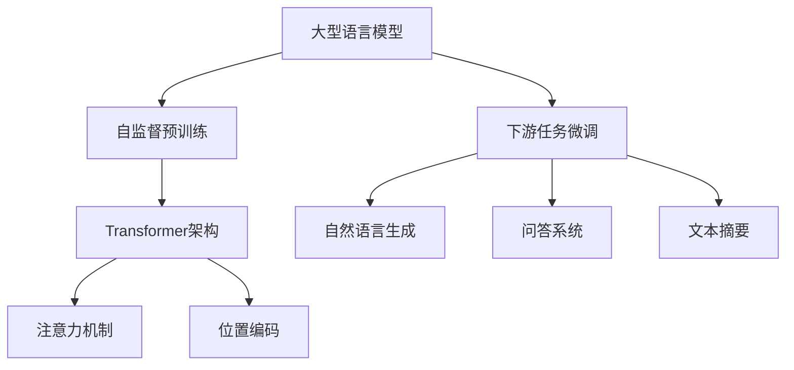
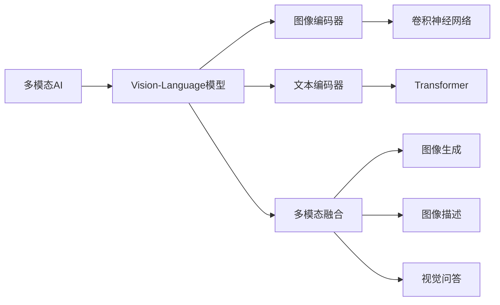
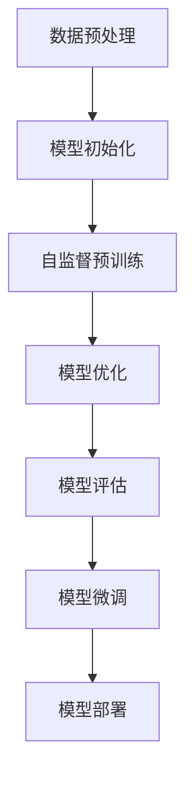
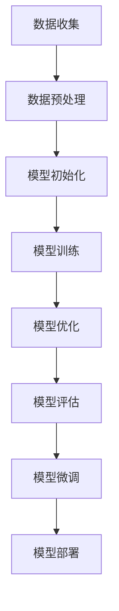

# 【大模型应用开发 动手做AI Agent】说说OpenAI这家公司

## 1. 背景介绍

### 1.1 人工智能的兴起

人工智能(Artificial Intelligence, AI)是当代科技发展的重要领域之一。近年来,AI技术取得了长足进步,尤其是在深度学习和大型语言模型等方向上,出现了一些突破性的进展。这些进展使得AI系统能够在语音识别、图像识别、自然语言处理等领域表现出超乎想象的能力,甚至在某些任务上超越了人类水平。

### 1.2 OpenAI的崛起

在这样的大背景下,OpenAI作为一家人工智能研究公司应运而生。OpenAI成立于2015年,由一批科技界知名人士共同创立,包括伊隆·马斯克(Elon Musk)、山姆·奥特曼(Sam Altman)等。OpenAI的使命是确保人工智能的发展有利于全人类,而不是被少数利益集团垄断。

OpenAI一直致力于推动人工智能技术的发展,尤其是在大型语言模型和强化学习等领域取得了卓越的成就。他们开发的GPT(Generative Pre-trained Transformer)系列大型语言模型,以及DALL-E等多模态AI模型,都在业界产生了巨大影响。

## 2. 核心概念与联系

### 2.1 大型语言模型

大型语言模型是OpenAI的核心技术之一。这种模型通过在海量文本数据上进行预训练,学习到丰富的语言知识和上下文信息,从而能够生成高质量、连贯的自然语言输出。

GPT(Generative Pre-trained Transformer)是OpenAI开发的著名大型语言模型系列,包括GPT、GPT-2、GPT-3等。这些模型在自然语言生成、问答、文本摘要等任务上表现出色,甚至能够完成一些需要推理和创造性思维的任务。



### 2.2 多模态AI

除了大型语言模型,OpenAI还在多模态AI(Multimodal AI)领域取得了重要进展。多模态AI系统能够同时处理多种模态的输入,如文本、图像、视频等,并生成相应的多模态输出。

DALL-E是OpenAI开发的一种多模态AI模型,它能够根据自然语言描述生成相应的图像。DALL-E的核心是一种新型的Vision-Language模型,通过大规模的图像-文本对训练,学习到了视觉和语言之间的映射关系。



## 3. 核心算法原理具体操作步骤

### 3.1 大型语言模型训练

大型语言模型的训练过程主要包括以下几个步骤:

1. **数据预处理**:从海量文本数据中抽取出高质量的语料,进行文本清洗、标记化等预处理操作。

2. **模型初始化**:初始化一个基于Transformer架构的大型语言模型,包括embedding层、encoder层和decoder层等。

3. **自监督预训练**:采用自监督学习的方式,在预处理后的语料上进行预训练。常用的预训练目标包括掩码语言模型(Masked Language Model)和下一句预测(Next Sentence Prediction)等。

4. **模型优化**:使用优化算法(如Adam优化器)对模型参数进行迭代更新,最小化预训练目标的损失函数。

5. **模型评估**:在下游任务的验证集上评估模型性能,根据需要进行超参数调整和模型微调。

6. **模型部署**:将训练好的大型语言模型部署到实际应用中,用于自然语言生成、问答等任务。



### 3.2 多模态AI模型训练

多模态AI模型的训练过程相对更加复杂,需要同时处理多种模态的输入数据。以DALL-E为例,其训练过程可概括为以下几个步骤:

1. **数据收集**:从互联网上收集大量的图像-文本对数据,包括图像及其对应的文本描述。

2. **数据预处理**:对图像和文本数据进行必要的预处理,如图像resize、文本标记化等。

3. **模型初始化**:初始化一个Vision-Language模型,包括图像编码器(如CNN)、文本编码器(如Transformer)和多模态融合模块。

4. **模型训练**:在图像-文本对数据上训练Vision-Language模型,使其能够学习到视觉和语言之间的映射关系。常用的训练目标包括图像描述生成、图像文本匹配等。

5. **模型优化**:使用优化算法对模型参数进行迭代更新,最小化训练目标的损失函数。

6. **模型评估**:在验证集上评估模型性能,根据需要进行超参数调整和模型微调。

7. **模型部署**:将训练好的多模态AI模型部署到实际应用中,用于图像生成、图像描述、视觉问答等任务。



## 4. 数学模型和公式详细讲解举例说明

### 4.1 Transformer模型

Transformer是大型语言模型中广泛使用的一种序列到序列(Sequence-to-Sequence)模型架构。它完全基于注意力机制(Attention Mechanism),不再使用传统的循环神经网络(RNN)或卷积神经网络(CNN)结构。

Transformer的核心组件是多头注意力(Multi-Head Attention)和前馈神经网络(Feed-Forward Neural Network)。多头注意力用于捕获输入序列中不同位置之间的依赖关系,而前馈神经网络则用于对每个位置的表示进行非线性变换。

Transformer的注意力机制可以用以下公式表示:

$$\text{Attention}(Q, K, V) = \text{softmax}(\frac{QK^T}{\sqrt{d_k}})V$$

其中,$$Q$$、$$K$$、$$V$$分别代表查询(Query)、键(Key)和值(Value)。$$d_k$$是缩放因子,用于防止点积的值过大导致softmax函数的梯度较小。

多头注意力则是将注意力机制应用于不同的子空间,并将结果拼接起来:

$$\text{MultiHead}(Q, K, V) = \text{Concat}(head_1, ..., head_h)W^O$$
$$\text{where } head_i = \text{Attention}(QW_i^Q, KW_i^K, VW_i^V)$$

其中,$$W_i^Q$$、$$W_i^K$$、$$W_i^V$$和$$W^O$$是可学习的线性变换矩阵。

### 4.2 Vision-Language模型

Vision-Language模型是多模态AI中常用的一种模型架构,它能够同时处理视觉和语言信息,并学习到两者之间的映射关系。

Vision-Language模型通常包括两个主要组件:图像编码器和文本编码器。图像编码器(如CNN)用于提取图像的视觉特征,而文本编码器(如Transformer)用于编码文本序列。

在训练过程中,Vision-Language模型需要最小化图像和文本之间的损失函数,例如对比损失(Contrastive Loss):

$$\mathcal{L}_\text{contrast} = -\log \frac{\exp(\text{sim}(I, T) / \tau)}{\sum_{I', T'} \exp(\text{sim}(I', T') / \tau)}$$

其中,$$\text{sim}(I, T)$$表示图像$$I$$和文本$$T$$之间的相似度分数,$$\tau$$是温度超参数。对比损失函数鼓励模型为正确的图像-文本对分配高分数,而为错误的对分配低分数。

在推理阶段,Vision-Language模型可以用于多种下游任务,如图像描述生成、图像文本匹配、视觉问答等。

## 5. 项目实践:代码实例和详细解释说明

以下是一个使用Hugging Face Transformers库实现GPT-2模型的示例代码:

```python
from transformers import GPT2LMHeadModel, GPT2Tokenizer

# 加载预训练模型和分词器
model = GPT2LMHeadModel.from_pretrained('gpt2')
tokenizer = GPT2Tokenizer.from_pretrained('gpt2')

# 定义输入文本
input_text = "OpenAI is a leading artificial intelligence research company. It was founded in"

# 对输入文本进行编码
input_ids = tokenizer.encode(input_text, return_tensors='pt')

# 使用模型生成文本
output = model.generate(input_ids, max_length=100, do_sample=True, top_k=50, top_p=0.95, num_return_sequences=1)

# 对输出进行解码
generated_text = tokenizer.decode(output[0], skip_special_tokens=True)

print(generated_text)
```

上述代码首先加载了预训练的GPT-2模型和对应的分词器。然后,它对输入文本进行了编码,并使用模型生成了一段文本。在生成过程中,我们设置了一些超参数,如`max_length`(最大生成长度)、`top_k`(只考虑前k个概率最高的token)和`top_p`(只考虑累积概率占比达到p的token)等,以控制生成文本的质量和多样性。

最后,代码对生成的输出进行了解码,得到了最终的文本结果。

对于Vision-Language模型,我们可以使用Hugging Face的`Vision-Transformer`库进行开发。以下是一个使用ViT模型进行图像分类的示例代码:

```python
from transformers import VisionEncoderDecoderModel, ViTFeatureExtractor, AutoTokenizer
import torch
from PIL import Image

# 加载预训练模型、特征提取器和分词器
model = VisionEncoderDecoderModel.from_pretrained("nlpconnect/vit-gpt2-image-captioning")
feature_extractor = ViTFeatureExtractor.from_pretrained("nlpconnect/vit-gpt2-image-captioning")
tokenizer = AutoTokenizer.from_pretrained("nlpconnect/vit-gpt2-image-captioning")

# 加载图像
image = Image.open("example_image.jpg")

# 对图像进行预处理
pixel_values = feature_extractor(images=image, return_tensors="pt").pixel_values

# 生成图像描述
output_ids = model.generate(pixel_values, max_length=50, num_beams=4, early_stopping=True)
preds = tokenizer.decode(output_ids[0], skip_special_tokens=True)

print(preds)
```

在这个示例中,我们加载了一个预训练的Vision-Transformer模型,用于生成图像描述。首先,我们使用`ViTFeatureExtractor`对输入图像进行了预处理,提取出图像的视觉特征。然后,我们将这些特征输入到Vision-Transformer模型中,并使用`generate`方法生成了图像描述。在生成过程中,我们设置了一些超参数,如`max_length`(最大生成长度)和`num_beams`(beam search的beam数量)等,以控制生成结果的质量。

最后,代码对生成的输出进行了解码,得到了最终的图像描述文本。

## 6. 实际应用场景

OpenAI开发的大型语言模型和多模态AI模型在许多实际应用场景中发挥着重要作用,包括但不限于:

1. **自然语言处理**:大型语言模型可以应用于自然语言生成、机器翻译、文本摘要、问答系统等任务。

2. **内容创作**:利用大型语言模型的文本生成能力,可以辅助内容创作,如新闻报道、故事写作、广告文案等。

3. **智能助手**:将大型语言模型和多模态AI模型集成到智能助