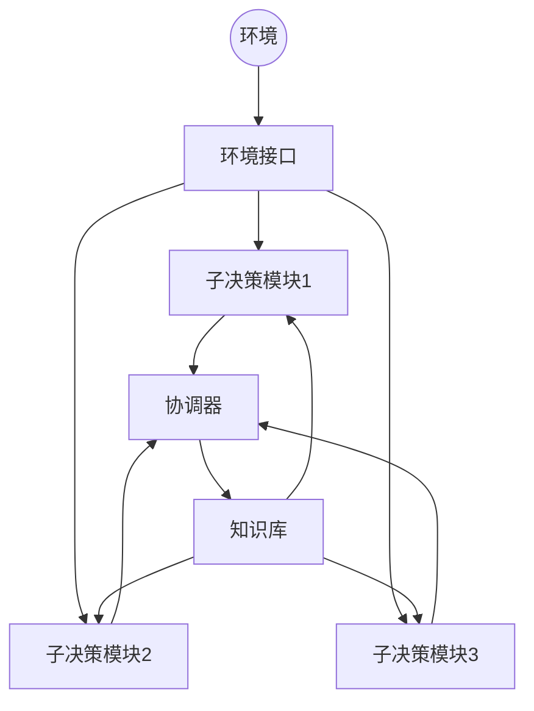

# 一切皆是映射：DQN在复杂决策系统中的模块化应用

## 1.背景介绍

### 1.1 复杂决策系统的挑战

在当今快节奏的商业环境中,企业不断面临着复杂的决策挑战。这些决策往往涉及多个相互关联的变量和约束条件,需要权衡各种利弊得出最优解。传统的决策方法通常依赖人工经验和启发式规则,难以有效处理高度动态和不确定的场景。

随着人工智能(AI)技术的不断发展,基于深度强化学习(Deep Reinforcement Learning, DRL)的决策系统逐渐受到关注。其中,深度Q网络(Deep Q-Network, DQN)作为DRL的一种核心算法,展现出了强大的决策优化能力。

### 1.2 DQN在决策系统中的应用前景

DQN通过从环境中学习最优策略,可以自主地做出决策。与传统方法相比,DQN具有以下优势:

1. **处理复杂环境**:DQN能够从高维观测数据中提取关键特征,处理复杂的状态空间。
2. **自适应性强**:DQN可以根据环境的变化自主调整决策策略,具有良好的自适应能力。
3. **高效探索**:DQN采用有效的探索策略,能够发现最优解决方案。
4. **可解释性**:DQN的决策过程可以被解释和分析,有助于提高透明度和可信度。

基于这些优势,DQN在复杂决策系统中具有广阔的应用前景,如智能调度、资源优化、投资组合管理等领域。然而,DQN在实际应用中仍面临一些挑战,如决策空间的扩展性、多目标决策等,需要进一步探索和创新。

## 2.核心概念与联系

### 2.1 强化学习基础

强化学习(Reinforcement Learning, RL)是一种基于环境交互的机器学习范式。其核心思想是通过试错和奖惩机制,让智能体(Agent)学习如何在给定环境中采取最优行为策略,以最大化累积奖励。

强化学习系统通常由以下几个核心组件构成:

- **环境(Environment)**:智能体与之交互的外部世界,描述了系统的状态和行为的后果。
- **状态(State)**:环境的instantaneous配置,反映了当前的情况。
- **行为(Action)**:智能体在给定状态下可以采取的操作。
- **奖励(Reward)**:环境对智能体行为的反馈,指导智能体朝着正确方向优化。
- **策略(Policy)**:智能体在每个状态下选择行为的策略,是强化学习的最终目标。

强化学习的目标是找到一个最优策略$\pi^*$,使得在该策略下的期望累积奖励最大化:

$$\pi^* = \arg\max_\pi \mathbb{E}_\pi \left[\sum_{t=0}^\infty \gamma^t r_t\right]$$

其中,$\gamma$是折扣因子,用于平衡当前奖励和未来奖励的权重。

### 2.2 Q-Learning和DQN

Q-Learning是一种基于价值函数的强化学习算法,它通过学习状态-行为对的价值函数(Q函数)来近似最优策略。Q函数定义为在给定状态下采取某个行为后,可获得的期望累积奖励:

$$Q(s, a) = \mathbb{E}_\pi \left[\sum_{t=0}^\infty \gamma^t r_t | s_0 = s, a_0 = a\right]$$

通过迭代更新Q函数,可以逐步逼近最优Q函数,从而得到最优策略。

然而,传统的Q-Learning算法在处理高维观测数据时存在局限性。深度Q网络(Deep Q-Network, DQN)通过将深度神经网络引入Q函数的近似,可以有效地从高维输入中提取特征,处理复杂的决策问题。

DQN的核心思想是使用一个深度神经网络$Q(s, a; \theta)$来近似Q函数,其中$\theta$是网络的可训练参数。在每个时间步,DQN根据当前状态$s_t$选择行为$a_t$,并观测到下一状态$s_{t+1}$和奖励$r_t$。然后,DQN使用下式更新Q网络的参数:

$$\theta_{t+1} = \theta_t + \alpha \left(r_t + \gamma \max_{a'} Q(s_{t+1}, a'; \theta_t^-) - Q(s_t, a_t; \theta_t)\right) \nabla_\theta Q(s_t, a_t; \theta_t)$$

其中,$\alpha$是学习率,$\theta_t^-$是目标Q网络的参数(用于稳定训练)。通过不断迭代这一过程,DQN可以逐步优化Q网络,从而学习到最优策略。

### 2.3 DQN在复杂决策系统中的模块化应用

虽然DQN展现出了强大的决策优化能力,但在实际应用中,复杂决策系统往往涉及多个相互关联的子决策问题。直接将整个系统建模为单一的DQN可能会导致状态空间和行为空间过于庞大,增加了训练的难度和计算开销。

为了解决这一挑战,我们可以采用模块化的方法,将复杂决策系统分解为多个相对独立的子模块,每个子模块由一个专门的DQN来处理。这些子DQN相互协作,共同优化整体决策过程。这种模块化设计具有以下优势:

1. **降低复杂度**:将整体问题分解为多个子问题,降低了每个DQN所需处理的状态空间和行为空间的复杂度。
2. **提高可解释性**:每个子DQN专注于解决特定的子决策问题,有助于提高决策过程的可解释性和透明度。
3. **增强可扩展性**:新的子决策模块可以被灵活地添加或移除,提高了系统的可扩展性和可维护性。
4. **促进协作**:子DQN之间可以相互协作,共享信息和经验,提高整体决策的质量。

在后续章节中,我们将详细探讨DQN在复杂决策系统中的模块化应用,包括核心算法原理、数学模型、实际应用场景等方面的内容。

## 3.核心算法原理具体操作步骤

在介绍了DQN在复杂决策系统中的模块化应用的背景和核心概念之后,我们将深入探讨其核心算法原理和具体操作步骤。

### 3.1 模块化DQN架构

模块化DQN架构将复杂决策系统分解为多个相对独立的子模块,每个子模块由一个专门的DQN来处理。这些子DQN相互协作,共同优化整体决策过程。

整体架构可以概括为以下几个关键组件:

1. **子决策模块**:每个子决策模块由一个DQN实现,负责处理特定的子决策问题。
2. **协调器(Coordinator)**:协调器负责管理子决策模块之间的交互和协作,确保整体决策的一致性和有效性。
3. **环境接口(Environment Interface)**:环境接口将复杂决策系统的状态和奖励信息传递给各个子决策模块,并执行它们的行为决策。
4. **知识库(Knowledge Base)**:知识库存储了子决策模块之间共享的信息和经验,促进它们之间的协作学习。

下面是模块化DQN架构的Mermaid流程图:

### 3.2 子决策模块训练

每个子决策模块都是一个独立的DQN,可以使用标准的DQN训练算法进行训练。具体步骤如下:

1. **初始化**:初始化DQN的Q网络参数$\theta$和目标Q网络参数$\theta^-$,并初始化经验回放池。

2. **采样行为**:根据当前状态$s_t$和Q网络,使用$\epsilon$-贪婪策略选择行为$a_t$。

3. **执行行为**:在环境中执行选择的行为$a_t$,观测到下一状态$s_{t+1}$和奖励$r_t$。

4. **存储经验**:将$(s_t, a_t, r_t, s_{t+1})$的经验转换存储到经验回放池中。

5. **采样批次**:从经验回放池中随机采样一个批次的经验$(s_j, a_j, r_j, s_{j+1})$。

6. **计算目标值**:计算每个经验的目标Q值:
   $$y_j = r_j + \gamma \max_{a'} Q(s_{j+1}, a'; \theta^-)$$

7. **更新Q网络**:使用均方误差损失函数,通过梯度下降法更新Q网络的参数$\theta$:
   $$\theta \leftarrow \theta - \alpha \nabla_\theta \frac{1}{N} \sum_j \left(y_j - Q(s_j, a_j; \theta)\right)^2$$

8. **更新目标Q网络**:每隔一定步数,将Q网络的参数$\theta$复制到目标Q网络的参数$\theta^-$中,以稳定训练过程。

9. **回到步骤2**:重复上述过程,直至Q网络收敛。

通过上述步骤,每个子决策模块都可以独立地学习到最优策略,处理特定的子决策问题。

### 3.3 子决策模块协作

为了实现整体决策的优化,子决策模块之间需要进行协作。协调器扮演了关键角色,负责管理子模块之间的交互和信息共享。

协作过程可以概括为以下几个步骤:

1. **状态共享**:每个子决策模块将其观测到的局部状态信息共享给协调器。

2. **决策协调**:协调器根据各个子模块的局部状态,协调它们的行为决策,确保整体决策的一致性和有效性。

3. **奖励分配**:协调器根据整体决策的结果,为每个子模块分配相应的奖励信号,用于指导它们的学习过程。

4. **经验共享**:子决策模块将它们的经验存储到共享的知识库中,供其他模块学习和借鉴。

5. **协作学习**:子决策模块可以从知识库中采样其他模块的经验,进行协作学习,提高整体决策的质量和泛化能力。

通过这种协作机制,子决策模块可以相互借鉴和补充,共同优化整体决策过程。同时,模块化设计也提高了系统的可扩展性和可维护性,新的子决策模块可以被灵活地添加或移除。

## 4.数学模型和公式详细讲解举例说明

在上一章节中,我们介绍了模块化DQN在复杂决策系统中的核心算法原理和具体操作步骤。现在,我们将深入探讨其中涉及的数学模型和公式,并通过具体示例进行详细说明。

### 4.1 Q-Learning的贝尔曼方程

Q-Learning算法的核心是基于贝尔曼方程(Bellman Equation)来更新Q函数。贝尔曼方程描述了在给定状态下采取某个行为后,可获得的期望累积奖励与当前状态的Q值之间的关系。

对于任意策略$\pi$,其对应的Q函数满足以下贝尔曼方程:

$$Q^\pi(s, a) = \mathbb{E}_\pi \left[r_t + \gamma \sum_{s'} P(s' | s, a) V^\pi(s')\right]$$

其中,$r_t$是在状态$s$下采取行为$a$后获得的即时奖励,$P(s' | s, a)$是从状态$s$采取行为$a$后转移到状态$s'$的概率,$V^\pi(s')$是在状态$s'$下按策略$\pi$行动所能获得的期望累积奖励(即状态值函数)。

我们的目标是找到一个最优策略$\pi^*$,使得对应的Q函数$Q^{\pi^*}$最大化期望累积奖励。根据最优性原理,最优