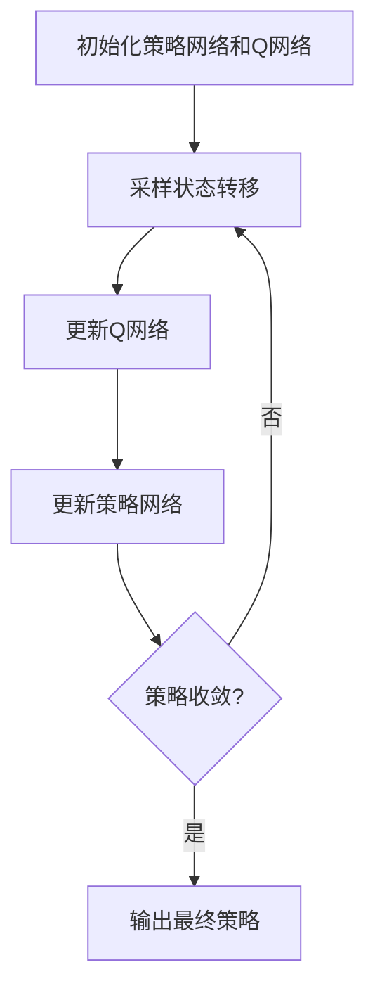

# 一切皆是映射：使用DQN解决连续动作空间问题：策略与挑战

## 1.背景介绍

### 1.1 强化学习和连续动作空间问题

强化学习是一种机器学习范式,旨在通过与环境的交互来学习最优策略。在强化学习中,智能体(agent)在环境中执行动作,并根据环境的反馈(奖励或惩罚)来调整其策略。这种学习方式非常适用于解决复杂的决策问题,例如机器人控制、游戏AI和自动驾驶等。

然而,许多实际问题涉及连续的动作空间,例如控制机器人关节角度或调整汽车的方向盘角度。在这些情况下,传统的离散动作空间强化学习算法可能无法直接应用,因为它们假设动作空间是有限和离散的。连续动作空间带来了新的挑战,需要开发新的算法来有效地解决这些问题。

### 1.2 深度Q网络(DQN)

深度Q网络(Deep Q-Network, DQN)是一种结合深度学习和Q-learning的强化学习算法,它可以直接从原始像素输入中学习控制策略。DQN利用深度神经网络来近似Q函数,从而估计在给定状态下执行某个动作的长期回报。通过不断与环境交互并更新网络参数,DQN可以逐步优化策略,最终达到最优控制。

DQN最初被设计用于解决离散动作空间问题,例如Atari游戏。然而,通过一些扩展和改进,DQN也可以应用于连续动作空间问题。本文将探讨如何使用DQN来解决连续动作空间问题,并讨论相关的策略和挑战。

## 2.核心概念与联系

### 2.1 策略与价值函数

在强化学习中,策略(policy)定义了智能体在给定状态下应该采取何种行动。价值函数(value function)则描述了在遵循某一策略时,从当前状态开始所能获得的预期累积回报。

对于连续动作空间问题,策略通常被表示为一个概率密度函数,描述在给定状态下选择每个可能动作的概率。价值函数则可以是状态价值函数(state value function)或状态-动作价值函数(state-action value function,也称为Q函数)。

### 2.2 确定性策略与随机策略

在连续动作空间中,策略可以是确定性的(deterministic)或随机的(stochastic)。

- 确定性策略直接将状态映射到一个确定的动作,例如 $\pi(s) = a$。这种策略通常更容易学习和执行,但可能会陷入次优解。
- 随机策略将状态映射到一个动作概率分布,例如 $\pi(a|s) = P(a|s)$。随机策略可以更好地探索动作空间,但也更难学习和执行。

DQN通常被用于学习确定性策略,但也可以扩展到学习随机策略。

### 2.3 DQN与连续动作空间

原始DQN算法是为离散动作空间设计的,因此需要进行一些修改才能应用于连续动作空间问题。主要的挑战包括:

1. 动作空间维数高:连续动作空间通常具有高维度,使得直接估计Q函数变得更加困难。
2. 无法枚举所有动作:与离散动作空间不同,连续动作空间中无法枚举所有可能的动作。
3. 动作值函数的近似:需要使用函数近似技术(如深度神经网络)来估计连续的动作值函数。

为了解决这些挑战,研究人员提出了多种扩展DQN的方法,例如使用actor-critic架构、应用策略梯度算法等。本文将重点介绍一种称为"确定性策略梯度"(Deterministic Policy Gradient, DPG)的方法。

## 3.核心算法原理具体操作步骤

### 3.1 确定性策略梯度算法

确定性策略梯度(DPG)算法是一种用于学习确定性策略的策略梯度方法。它的核心思想是直接优化确定性策略 $\mu(s)$,使其能够最大化期望的累积回报。

DPG算法的具体步骤如下:

1. 初始化确定性策略 $\mu(s|\theta^\mu)$ 和状态-动作价值函数 $Q(s,a|\theta^Q)$,它们都由深度神经网络参数化。
2. 从环境中采样一批状态转移 $(s_t, a_t, r_t, s_{t+1})$,其中动作 $a_t$ 由当前策略 $\mu(s_t|\theta^\mu)$ 生成。
3. 使用贝尔曼方程更新 $Q(s,a|\theta^Q)$ 的参数:

$$
y_t = r(s_t, a_t) + \gamma Q(s_{t+1}, \mu(s_{t+1}|\theta^\mu)|\theta^Q)
$$

$$
\theta^Q \leftarrow \theta^Q - \alpha \nabla_{\theta^Q} (y_t - Q(s_t, a_t|\theta^Q))^2
$$

4. 更新确定性策略 $\mu(s|\theta^\mu)$ 的参数,使其朝着最大化 $Q(s,a)$ 的方向优化:

$$
\theta^\mu \leftarrow \theta^\mu + \alpha \nabla_{\theta^\mu} Q(s, \mu(s|\theta^\mu)|\theta^Q)
$$

5. 重复步骤2-4,直到策略收敛。

在实际应用中,DPG算法通常与经验回放缓冲区(experience replay buffer)和目标网络(target network)等技术相结合,以提高训练稳定性和收敛速度。

### 3.2 算法流程图

下面是DPG算法的Mermaid流程图:



## 4.数学模型和公式详细讲解举例说明

### 4.1 策略梯度定理

策略梯度方法的理论基础是策略梯度定理(Policy Gradient Theorem)。对于任意可微分的策略 $\pi_\theta(a|s)$,其期望累积回报的梯度可以表示为:

$$
\nabla_\theta J(\theta) = \mathbb{E}_{\pi_\theta} \left[ \sum_{t=0}^\infty \nabla_\theta \log \pi_\theta(a_t|s_t) Q^{\pi_\theta}(s_t, a_t) \right]
$$

其中 $J(\theta)$ 是目标函数,即期望的累积回报; $Q^{\pi_\theta}(s_t, a_t)$ 是在策略 $\pi_\theta$ 下的状态-动作价值函数。

这个公式告诉我们,只要我们能够估计出 $Q^{\pi_\theta}(s_t, a_t)$,就可以通过梯度上升的方式来优化策略参数 $\theta$,从而提高期望的累积回报。

### 4.2 确定性策略梯度

对于确定性策略 $\mu(s)$,策略梯度定理可以进一步简化为:

$$
\nabla_\theta J(\theta) = \mathbb{E}_{s \sim \rho^\mu} \left[ \nabla_\theta \mu(s|\theta) \nabla_a Q^\mu(s, a)|_{a=\mu(s|\theta)} \right]
$$

其中 $\rho^\mu$ 是在策略 $\mu$ 下的状态分布, $Q^\mu(s, a)$ 是对应的状态-动作价值函数。

这个公式说明,我们可以通过计算 $Q^\mu(s, a)$ 对动作 $a$ 的梯度,并在 $a=\mu(s|\theta)$ 时进行评估,从而获得策略参数 $\theta$ 的梯度估计。

在DPG算法中,我们使用一个深度神经网络 $Q(s, a|\theta^Q)$ 来近似 $Q^\mu(s, a)$,并根据上述公式更新策略网络 $\mu(s|\theta^\mu)$ 的参数。

### 4.3 示例:机器人关节控制

考虑一个机器人关节控制的例子。假设机器人有 $n$ 个关节,每个关节的角度范围是 $[-\pi, \pi]$。我们的目标是控制机器人关节,使其能够到达指定的目标位置。

在这个问题中,状态 $s$ 可以表示为机器人当前的关节角度,动作 $a$ 则是要施加的关节扭矩。我们可以将策略 $\mu(s|\theta^\mu)$ 定义为一个多层感知机,它将状态 $s$ 映射到一个 $n$ 维的动作向量 $a$。

同时,我们使用另一个深度神经网络 $Q(s, a|\theta^Q)$ 来近似状态-动作价值函数 $Q^\mu(s, a)$。在训练过程中,我们根据DPG算法不断更新 $\mu(s|\theta^\mu)$ 和 $Q(s, a|\theta^Q)$ 的参数,直到策略收敛。

最终,我们得到一个确定性的策略 $\mu(s)$,它可以根据机器人当前的关节角度输出合适的关节扭矩,使机器人到达目标位置。

## 5.项目实践:代码实例和详细解释说明

在这一部分,我们将提供一个使用Python和PyTorch实现DPG算法的代码示例,并对关键部分进行详细解释。

### 5.1 环境设置

我们将使用OpenAI Gym中的`Pendulum-v1`环境作为示例。这个环境模拟了一个单摆系统,智能体需要通过施加力矩来控制摆的角度和角速度。

```python
import gym
env = gym.make('Pendulum-v1')
```

### 5.2 定义网络结构

我们使用两个独立的深度神经网络来表示策略 $\mu(s|\theta^\mu)$ 和状态-动作价值函数 $Q(s, a|\theta^Q)$。

```python
import torch
import torch.nn as nn

# 策略网络
class PolicyNetwork(nn.Module):
    def __init__(self, state_dim, action_dim, hidden_dim=64):
        super(PolicyNetwork, self).__init__()
        self.fc1 = nn.Linear(state_dim, hidden_dim)
        self.fc2 = nn.Linear(hidden_dim, hidden_dim)
        self.fc3 = nn.Linear(hidden_dim, action_dim)

    def forward(self, state):
        x = torch.relu(self.fc1(state))
        x = torch.relu(self.fc2(x))
        action = self.fc3(x)
        return action

# Q网络
class QNetwork(nn.Module):
    def __init__(self, state_dim, action_dim, hidden_dim=64):
        super(QNetwork, self).__init__()
        self.fc1 = nn.Linear(state_dim + action_dim, hidden_dim)
        self.fc2 = nn.Linear(hidden_dim, hidden_dim)
        self.fc3 = nn.Linear(hidden_dim, 1)

    def forward(self, state, action):
        x = torch.cat([state, action], dim=1)
        x = torch.relu(self.fc1(x))
        x = torch.relu(self.fc2(x))
        q_value = self.fc3(x)
        return q_value
```

### 5.3 DPG算法实现

接下来,我们实现DPG算法的核心部分。

```python
import torch.optim as optim

# 超参数设置
batch_size = 64
gamma = 0.99
tau = 0.005
policy_lr = 3e-4
q_lr = 3e-4

# 初始化网络和优化器
policy_net = PolicyNetwork(state_dim, action_dim)
q_net = QNetwork(state_dim, action_dim)
policy_optimizer = optim.Adam(policy_net.parameters(), lr=policy_lr)
q_optimizer = optim.Adam(q_net.parameters(), lr=q_lr)

# 目标网络
target_q_net = QNetwork(state_dim, action_dim)
target_q_net.load_state_dict(q_net.state_dict())

# 经验回放缓冲区
replay_buffer = ReplayBuffer(buffer_size=1000000)

# 训练循环
for episode in range(num_episodes):
    state = env.reset()
    episode_reward = 0

    for step in range(max_steps):
        # 根据当前策略选择动作
        action = policy_net(torch.from_numpy(state).float()).detach().numpy()
        next_state, reward, done, _ = env.step(action)
        replay_buffer.push(state, action, reward, next_state, done)
        episode_reward += reward
        state = next_state

        # 从经验回放缓冲区中采样批次数据
        states, actions, rewards, next_states, dones = replay_buffer.sample(batch_size)

        # 更新Q网络
        q_values =