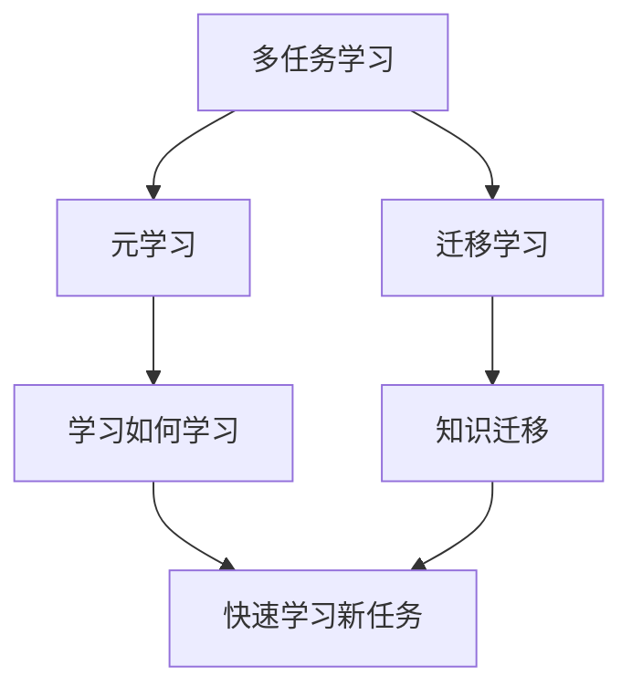

# 一切皆是映射：多任务元学习和知识迁移

## 1. 背景介绍
### 1.1 人工智能的发展历程
#### 1.1.1 早期人工智能
#### 1.1.2 机器学习的兴起 
#### 1.1.3 深度学习的突破

### 1.2 机器学习面临的挑战
#### 1.2.1 数据标注成本高
#### 1.2.2 模型泛化能力差
#### 1.2.3 训练效率低下

### 1.3 元学习和迁移学习的提出
#### 1.3.1 元学习的概念
#### 1.3.2 迁移学习的概念
#### 1.3.3 二者的关系与区别

## 2. 核心概念与联系
### 2.1 多任务学习
#### 2.1.1 多任务学习的定义
#### 2.1.2 多任务学习的优势
#### 2.1.3 多任务学习的分类

### 2.2 元学习
#### 2.2.1 元学习的定义
#### 2.2.2 元学习的分类
#### 2.2.3 元学习的优势

### 2.3 迁移学习
#### 2.3.1 迁移学习的定义 
#### 2.3.2 迁移学习的分类
#### 2.3.3 负迁移问题

### 2.4 三者之间的关系
#### 2.4.1 多任务学习与元学习
#### 2.4.2 多任务学习与迁移学习
#### 2.4.3 元学习与迁移学习



## 3. 核心算法原理具体操作步骤
### 3.1 基于度量的元学习
#### 3.1.1 孪生网络
#### 3.1.2 原型网络
#### 3.1.3 匹配网络

### 3.2 基于优化的元学习  
#### 3.2.1 MAML
#### 3.2.2 Reptile
#### 3.2.3 Meta-SGD

### 3.3 基于模型的元学习
#### 3.3.1 Memory-augmented neural networks
#### 3.3.2 Meta networks
#### 3.3.3 SNAIL

### 3.4 领域自适应
#### 3.4.1 Adversarial domain adaptation
#### 3.4.2 Domain-invariant representation learning
#### 3.4.3 Self-ensembling

## 4. 数学模型和公式详细讲解举例说明
### 4.1 孪生网络的三元组损失
$$L(a,p,n)=max(0, m+D(a,p)-D(a,n))$$
其中 $a$ 是anchor样本，$p$ 是positive样本，$n$ 是negative样本，$D$ 是距离度量函数，$m$ 是margin。

### 4.2 原型网络的原型表示
$$c_k=\frac{1}{|S_k|}\sum_{(x_i,y_i)\in S_k}\phi(x_i)$$
其中 $S_k$ 表示类别 $k$ 的支持集，$\phi$ 是嵌入函数，$c_k$ 是类别 $k$ 的原型向量。

### 4.3 MAML的目标函数
$$\min_\theta \sum_{\mathcal{T}_i \sim p(\mathcal{T})} \mathcal{L}_{\mathcal{T}_i}(f_{\theta_i}') \quad s.t. \quad \theta_i'=\theta-\alpha \nabla_\theta \mathcal{L}_{\mathcal{T}_i}(f_\theta)$$
其中 $\mathcal{T}_i$ 是第 $i$ 个任务，$\theta$ 是初始化参数，$\theta_i'$ 是任务 $\mathcal{T}_i$ 的适应后参数，$\alpha$ 是内循环学习率，$\mathcal{L}$ 是损失函数。

## 5. 项目实践：代码实例和详细解释说明
### 5.1 原型网络的PyTorch实现
```python
class PrototypicalNetwork(nn.Module):
    def __init__(self, encoder):
        super(PrototypicalNetwork, self).__init__()
        self.encoder = encoder
    
    def forward(self, support_images, support_labels, query_images):
        # 提取特征
        z_support = self.encoder(support_images)
        z_query = self.encoder(query_images)
        
        # 计算原型向量
        n_class = len(torch.unique(support_labels))
        z_proto = torch.cat([z_support[torch.nonzero(support_labels == label)].mean(0) 
                             for label in range(n_class)])
        
        # 计算距离并分类
        dists = euclidean_dist(z_query, z_proto)
        scores = -dists
        return scores
```

### 5.2 MAML的PyTorch实现
```python
class MAML(nn.Module):
    def __init__(self, model, inner_lr, outer_lr, n_inner_iter):
        super(MAML, self).__init__()
        self.model = model
        self.inner_lr = inner_lr
        self.outer_lr = outer_lr 
        self.n_inner_iter = n_inner_iter
    
    def forward(self, support_images, support_labels, query_images, query_labels):
        task_num, _, _, _ = support_images.size()
        querysz = query_images.size(1)
        
        losses_q = [0 for _ in range(self.n_inner_iter + 1)]
        
        for i in range(task_num):
            # 复制初始参数
            fast_weights = list(self.model.parameters())
            
            for k in range(0, self.n_inner_iter):
                # 内循环更新
                logits = self.model(support_images[i], fast_weights, bn_training=True)
                loss = F.cross_entropy(logits, support_labels[i])
                grad = torch.autograd.grad(loss, fast_weights)
                fast_weights = list(map(lambda p: p[1] - self.inner_lr * p[0], zip(grad, fast_weights)))
                
                logits_q = self.model(query_images[i], fast_weights, bn_training=True)
                loss_q = F.cross_entropy(logits_q, query_labels[i])
                losses_q[k+1] += loss_q
        
        # 外循环更新
        loss_q = losses_q[-1] / task_num
        self.model.train()
        optimizer = torch.optim.Adam(self.model.parameters(), lr=self.outer_lr)
        optimizer.zero_grad()
        loss_q.backward()
        optimizer.step()
        
        return loss_q
```

## 6. 实际应用场景
### 6.1 计算机视觉
#### 6.1.1 少样本图像分类
#### 6.1.2 目标检测与分割
#### 6.1.3 人脸识别

### 6.2 自然语言处理
#### 6.2.1 文本分类
#### 6.2.2 关系抽取
#### 6.2.3 机器翻译

### 6.3 语音识别
#### 6.3.1 说话人自适应
#### 6.3.2 低资源语音识别
#### 6.3.3 语音合成

### 6.4 强化学习
#### 6.4.1 策略迁移
#### 6.4.2 元强化学习
#### 6.4.3 连续控制

## 7. 工具和资源推荐
### 7.1 数据集
- Omniglot
- Mini-ImageNet 
- CIFAR-FS
- Fewshot-CIFAR100
- Meta-Dataset

### 7.2 开源代码库
- Torchmeta: https://github.com/tristandeleu/pytorch-meta
- learn2learn: https://github.com/learnables/learn2learn
- higher: https://github.com/facebookresearch/higher

### 7.3 教程与课程
- Chelsea Finn的CS330: Deep Multi-Task and Meta Learning: http://cs330.stanford.edu/
- 李宏毅的Meta Learning课程: https://speech.ee.ntu.edu.tw/~hylee/ml/2019-spring.html
- 张志华组的迁移学习教程: https://github.com/jindongwang/transferlearning-tutorial

## 8. 总结：未来发展趋势与挑战
### 8.1 元学习的可解释性
### 8.2 元学习的理论基础 
### 8.3 大规模元学习系统
### 8.4 元学习与因果推理
### 8.5 元学习在强化学习中的应用

## 9. 附录：常见问题与解答
### 9.1 元学习和迁移学习有什么区别？
元学习旨在学习如何快速学习新任务，而迁移学习旨在利用已学习的知识来改善新任务的学习。元学习更注重学习算法本身，迁移学习更注重知识的重用。

### 9.2 MAML为什么要二次求导？
MAML的目标是学习一个好的初始化，使模型能够在新任务上快速适应。二次求导允许我们计算损失函数对初始参数的梯度，从而实现对初始化的优化。 

### 9.3 如何选择内循环和外循环的学习率？
通常内循环学习率会设得比较大，以实现快速适应；外循环学习率会设得比较小，以保证元学习过程的稳定性。具体数值需要根据任务和数据集进行调参。

### 9.4 元学习是否容易过拟合？
由于元学习通常在元训练集上进行训练，而在元测试集上进行评估，所以也可能出现过拟合现象。解决方法包括增大元训练集的任务数量、使用正则化技术等。

### 9.5 如何解决负迁移问题？
负迁移指的是源域和目标域差异较大时，迁移学习反而导致性能下降的现象。解决方法包括进行域自适应、对抗训练、样本选择等。在实践中，需要根据具体任务和数据分布来选择合适的技术。

作者：禅与计算机程序设计艺术 / Zen and the Art of Computer Programming