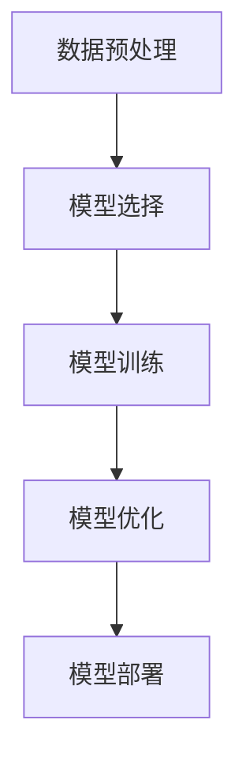

# 一切皆是映射：深度学习在边缘计算中的实现

## 1.背景介绍

随着物联网（IoT）设备的普及和数据量的爆炸性增长，传统的云计算模式面临着带宽、延迟和隐私等多方面的挑战。边缘计算作为一种新兴的计算模式，通过将计算资源下沉到网络边缘，能够有效地解决这些问题。与此同时，深度学习作为人工智能的核心技术，已经在图像识别、自然语言处理等领域取得了显著的成果。将深度学习与边缘计算结合，能够在边缘设备上实现智能化处理，从而提升系统的响应速度和效率。

## 2.核心概念与联系

### 2.1 边缘计算

边缘计算是一种分布式计算范式，它将计算和数据存储资源放置在靠近数据源的网络边缘。其主要目标是减少数据传输的延迟和带宽消耗，提高系统的响应速度和可靠性。

### 2.2 深度学习

深度学习是一种基于人工神经网络的机器学习方法，通过多层神经网络的训练和优化，能够自动提取数据中的特征并进行复杂的模式识别和预测。

### 2.3 边缘计算与深度学习的结合

将深度学习模型部署在边缘设备上，可以实现实时的数据处理和智能决策，减少对云端计算资源的依赖。边缘计算与深度学习的结合主要体现在以下几个方面：

- **实时性**：边缘计算能够在数据生成的源头进行处理，减少数据传输的延迟。
- **隐私保护**：数据在本地处理，减少了数据传输过程中的隐私泄露风险。
- **带宽节省**：减少了数据上传到云端的需求，节省了网络带宽。

## 3.核心算法原理具体操作步骤

### 3.1 数据预处理

在边缘设备上进行深度学习的第一步是数据预处理。数据预处理包括数据清洗、数据增强和数据标准化等步骤。

### 3.2 模型选择

根据具体的应用场景选择合适的深度学习模型。常见的模型包括卷积神经网络（CNN）、循环神经网络（RNN）和生成对抗网络（GAN）等。

### 3.3 模型训练

在边缘设备上进行模型训练需要考虑计算资源的限制。可以采用迁移学习的方法，将预训练的模型进行微调，以适应特定的应用场景。

### 3.4 模型优化

为了在边缘设备上高效运行深度学习模型，需要对模型进行优化。常见的优化方法包括模型剪枝、量化和知识蒸馏等。

### 3.5 模型部署

将优化后的模型部署到边缘设备上，进行实时的数据处理和预测。



## 4.数学模型和公式详细讲解举例说明

### 4.1 卷积神经网络（CNN）

卷积神经网络是一种专门用于处理图像数据的深度学习模型。其核心思想是通过卷积操作提取图像的局部特征。

卷积操作的数学表达式为：

$$
Y(i, j) = \sum_{m=0}^{M-1} \sum_{n=0}^{N-1} X(i+m, j+n) \cdot K(m, n)
$$

其中，$X$ 是输入图像，$K$ 是卷积核，$Y$ 是输出特征图。

### 4.2 循环神经网络（RNN）

循环神经网络是一种用于处理序列数据的深度学习模型。其核心思想是通过循环结构捕捉序列数据中的时间依赖关系。

RNN 的数学表达式为：

$$
h_t = \sigma(W_h \cdot h_{t-1} + W_x \cdot x_t + b)
$$

其中，$h_t$ 是当前时刻的隐藏状态，$x_t$ 是当前时刻的输入，$W_h$ 和 $W_x$ 是权重矩阵，$b$ 是偏置，$\sigma$ 是激活函数。

### 4.3 生成对抗网络（GAN）

生成对抗网络是一种用于生成数据的深度学习模型。其核心思想是通过生成器和判别器的对抗训练，生成逼真的数据。

GAN 的损失函数为：

$$
\min_G \max_D V(D, G) = \mathbb{E}_{x \sim p_{data}(x)}[\log D(x)] + \mathbb{E}_{z \sim p_z(z)}[\log(1 - D(G(z)))]
$$

其中，$G$ 是生成器，$D$ 是判别器，$p_{data}$ 是真实数据分布，$p_z$ 是噪声分布。

## 5.项目实践：代码实例和详细解释说明

### 5.1 数据预处理

```python
import cv2
import numpy as np

def preprocess_image(image_path):
    image = cv2.imread(image_path)
    image = cv2.resize(image, (224, 224))
    image = image / 255.0
    return image

image = preprocess_image('example.jpg')
```

### 5.2 模型选择

```python
from tensorflow.keras.applications import MobileNetV2

model = MobileNetV2(weights='imagenet', include_top=False, input_shape=(224, 224, 3))
```

### 5.3 模型训练

```python
from tensorflow.keras.layers import Dense, GlobalAveragePooling2D
from tensorflow.keras.models import Model

x = model.output
x = GlobalAveragePooling2D()(x)
x = Dense(1024, activation='relu')(x)
predictions = Dense(10, activation='softmax')(x)

model = Model(inputs=model.input, outputs=predictions)

model.compile(optimizer='adam', loss='categorical_crossentropy', metrics=['accuracy'])

# 假设我们有一个数据生成器
model.fit(data_generator, epochs=10, steps_per_epoch=100)
```

### 5.4 模型优化

```python
import tensorflow as tf

converter = tf.lite.TFLiteConverter.from_keras_model(model)
tflite_model = converter.convert()

with open('model.tflite', 'wb') as f:
    f.write(tflite_model)
```

### 5.5 模型部署

```python
import tensorflow as tf

interpreter = tf.lite.Interpreter(model_path='model.tflite')
interpreter.allocate_tensors()

input_details = interpreter.get_input_details()
output_details = interpreter.get_output_details()

input_data = np.array(image, dtype=np.float32)
interpreter.set_tensor(input_details[0]['index'], input_data)

interpreter.invoke()

output_data = interpreter.get_tensor(output_details[0]['index'])
print(output_data)
```

## 6.实际应用场景

### 6.1 智能家居

在智能家居中，边缘计算和深度学习可以用于实现智能监控、语音识别和设备控制等功能。例如，通过在摄像头中嵌入深度学习模型，可以实现实时的人脸识别和异常行为检测。

### 6.2 智能交通

在智能交通系统中，边缘计算和深度学习可以用于实现交通流量监测、车辆识别和自动驾驶等功能。例如，通过在交通摄像头中嵌入深度学习模型，可以实时监测交通流量和识别车辆类型。

### 6.3 工业物联网

在工业物联网中，边缘计算和深度学习可以用于实现设备故障预测、生产过程优化和质量检测等功能。例如，通过在工业设备中嵌入深度学习模型，可以实时监测设备状态和预测故障。

## 7.工具和资源推荐

### 7.1 边缘计算平台

- **NVIDIA Jetson**：NVIDIA Jetson 是一款高性能的边缘计算平台，适用于深度学习和计算机视觉应用。
- **Google Coral**：Google Coral 是一款专为边缘设备设计的 AI 加速器，支持 TensorFlow Lite 模型的加速推理。

### 7.2 深度学习框架

- **TensorFlow Lite**：TensorFlow Lite 是 TensorFlow 的轻量级版本，专为移动和嵌入式设备设计。
- **PyTorch Mobile**：PyTorch Mobile 是 PyTorch 的移动版本，支持在移动设备上运行深度学习模型。

### 7.3 数据集

- **ImageNet**：ImageNet 是一个大规模的图像数据集，常用于图像分类和物体检测任务。
- **COCO**：COCO 是一个大规模的图像数据集，常用于物体检测、分割和关键点检测任务。

## 8.总结：未来发展趋势与挑战

### 8.1 未来发展趋势

随着边缘计算和深度学习技术的不断发展，未来将会有更多的应用场景和创新解决方案出现。以下是一些可能的发展趋势：

- **边缘智能设备的普及**：随着硬件性能的提升和成本的降低，边缘智能设备将会越来越普及，应用范围也将不断扩大。
- **模型压缩和优化技术的发展**：为了在资源受限的边缘设备上高效运行深度学习模型，模型压缩和优化技术将会得到进一步的发展。
- **边缘计算与5G的结合**：5G 技术的普及将会进一步推动边缘计算的发展，提供更高的带宽和更低的延迟。

### 8.2 挑战

尽管边缘计算和深度学习的结合具有广阔的前景，但也面临着一些挑战：

- **计算资源的限制**：边缘设备的计算资源有限，如何在有限的资源下高效运行深度学习模型是一个重要的挑战。
- **数据隐私和安全**：在边缘设备上处理数据需要考虑数据隐私和安全问题，如何保护用户数据是一个重要的课题。
- **模型的可解释性**：深度学习模型的复杂性使得其可解释性较差，如何提高模型的可解释性是一个需要解决的问题。

## 9.附录：常见问题与解答

### 9.1 边缘计算和云计算有什么区别？

边缘计算和云计算的主要区别在于计算资源的位置。边缘计算将计算资源放置在靠近数据源的网络边缘，而云计算将计算资源集中在云端数据中心。边缘计算能够减少数据传输的延迟和带宽消耗，提高系统的响应速度和可靠性。

### 9.2 如何选择合适的深度学习模型？

选择合适的深度学习模型需要考虑具体的应用场景和计算资源的限制。常见的深度学习模型包括卷积神经网络（CNN）、循环神经网络（RNN）和生成对抗网络（GAN）等。可以根据任务的特点选择合适的模型，例如图像处理任务可以选择 CNN，序列数据处理任务可以选择 RNN。

### 9.3 如何在边缘设备上优化深度学习模型？

在边缘设备上优化深度学习模型可以采用以下几种方法：

- **模型剪枝**：通过剪枝减少模型的参数数量，提高模型的运行效率。
- **模型量化**：通过量化减少模型的存储和计算需求，提高模型的运行效率。
- **知识蒸馏**：通过知识蒸馏将大模型的知识迁移到小模型，提高小模型的性能。

### 9.4 边缘计算和深度学习的结合有哪些实际应用？

边缘计算和深度学习的结合在智能家居、智能交通和工业物联网等领域具有广泛的应用。例如，在智能家居中可以实现智能监控和语音识别，在智能交通中可以实现交通流量监测和自动驾驶，在工业物联网中可以实现设备故障预测和生产过程优化。

---

作者：禅与计算机程序设计艺术 / Zen and the Art of Computer Programming