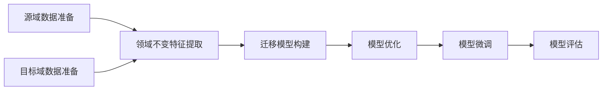

# 一切皆是映射：深度迁移学习：AI在不同域间的知识转移

## 1. 背景介绍
在人工智能的发展历程中，深度学习已经取得了令人瞩目的成就，但其对大量标注数据的依赖限制了其在数据匮乏领域的应用。深度迁移学习作为一种新兴的解决方案，通过迁移已有领域的知识到新领域，显著减少了对标注数据的需求，打开了AI技术在更广泛领域应用的大门。

## 2. 核心概念与联系
深度迁移学习的核心在于找到不同领域间的共性，并将这种共性作为桥梁，将一个领域的知识迁移到另一个领域。这涉及到几个关键概念：源域与目标域、领域不变特征、迁移策略等。

## 3. 核心算法原理具体操作步骤
深度迁移学习的算法原理可以分为几个步骤：源域和目标域数据的准备、领域不变特征的提取、迁移模型的构建和优化、迁移后模型的微调与评估。



## 4. 数学模型和公式详细讲解举例说明
深度迁移学习的数学模型通常涉及到损失函数的设计，例如领域适应性损失、分类损失等。以领域适应性损失为例，我们可以使用最大均值差异（MMD）来度量源域和目标域特征分布的相似度。

$$
\text{MMD}^2(X, Y) = \left\|\frac{1}{n}\sum_{i=1}^{n}\phi(x_i) - \frac{1}{m}\sum_{j=1}^{m}\phi(y_j)\right\|^2
$$

其中，$X$ 和 $Y$ 分别代表源域和目标域的特征集，$\phi(\cdot)$ 是映射函数，$n$ 和 $m$ 分别是两个域的样本数量。

## 5. 项目实践：代码实例和详细解释说明
以TensorFlow或PyTorch为基础，我们可以构建一个简单的迁移学习模型。代码实例将展示如何加载预训练模型，如何在新的数据集上进行迁移学习，以及如何进行模型的微调。

```python
# 代码示例（伪代码）
import tensorflow as tf

# 加载预训练模型
pretrained_model = tf.keras.applications.ResNet50(weights='imagenet', include_top=False)

# 构建迁移学习模型
model = tf.keras.Sequential([
    pretrained_model,
    tf.keras.layers.GlobalAveragePooling2D(),
    tf.keras.layers.Dense(target_num_classes, activation='softmax')
])

# 编译模型
model.compile(optimizer='adam', loss='categorical_crossentropy', metrics=['accuracy'])

# 在目标域数据上训练模型
model.fit(target_domain_data, target_domain_labels, epochs=10)
```

## 6. 实际应用场景
深度迁移学习在医疗图像分析、自然语言处理、无人驾驶等多个领域都有广泛的应用。例如，在医疗图像分析中，可以将在大型公共数据集上训练的模型迁移到特定疾病的诊断中，以提高模型的诊断准确率。

## 7. 工具和资源推荐
推荐几个深度迁移学习的开源工具和资源，如TensorFlow Hub、PyTorch Transfer Learning Toolkit、Domain-Adversarial Training of Neural Networks (DANN) 等。

## 8. 总结：未来发展趋势与挑战
深度迁移学习的未来发展趋势将更加注重领域适应性的提升、迁移效率的优化以及跨模态迁移的探索。同时，如何减少负迁移的风险、如何处理源域和目标域数据分布差异极大的情况等，仍是领域内的挑战。

## 9. 附录：常见问题与解答
Q1: 深度迁移学习和传统机器学习有何不同？
A1: 深度迁移学习侧重于利用深度神经网络在不同领域间迁移知识，而传统机器学习通常在单一领域内构建模型。

Q2: 如何评估迁移学习模型的效果？
A2: 可以通过在目标域的验证集上评估模型的准确率、召回率等指标来评估迁移学习模型的效果。

作者：禅与计算机程序设计艺术 / Zen and the Art of Computer Programming