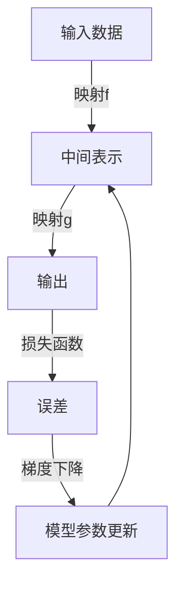

# 一切皆是映射：解构基于元认知的学习系统

## 1.背景介绍

在当今的数字时代,人工智能(AI)技术已经渗透到我们生活的方方面面。从语音助手到自动驾驶汽车,从推荐系统到医疗诊断,AI无处不在。然而,传统的AI系统大多基于手工设计的规则和算法,缺乏灵活性和通用性。为了突破这一局限,研究人员提出了一种新型的AI范式——基于元认知的学习系统。

元认知(Metacognition)是指对自身认知过程的认识和调节。在人类学习中,元认知扮演着至关重要的角色。我们不仅学习知识本身,还学习如何有效地学习。基于元认知的学习系统旨在模拟这一过程,赋予AI系统自我调节和自我完善的能力。

## 2.核心概念与联系

基于元认知的学习系统的核心思想是将一切视为映射(Mapping)。无论是输入数据、模型参数还是学习算法本身,都可以表示为从一个空间映射到另一个空间的函数。通过组合和嵌套这些映射,系统可以构建出复杂的表示和转换,从而实现强大的学习能力。



在上图中,我们可以看到一个典型的机器学习系统是如何被抽象为一系列映射的组合。输入数据首先通过映射$f$转换为中间表示,然后通过映射$g$生成最终输出。输出与ground truth之间的差异被映射为损失函数,并通过梯度下降算法更新模型参数,形成一个闭环。

值得注意的是,在基于元认知的学习系统中,这些映射本身也可以被视为可学习的对象。系统不仅可以优化映射的参数,还可以调整映射的结构和组合方式,从而实现自我调节和自我完善。

## 3.核心算法原理具体操作步骤

基于元认知的学习系统通常采用两阶段的训练过程:

1. **内循环(Inner Loop)**:在这一阶段,系统在一个特定的任务上进行训练,目标是优化映射函数的参数,使得输出尽可能接近ground truth。这一过程类似于传统机器学习算法的训练过程。

2. **外循环(Outer Loop)**:在内循环之后,系统会评估当前映射函数的性能,并根据评估结果调整映射函数的结构和组合方式。这一过程被称为"元学习"(Meta-Learning),因为它实际上是在学习"如何学习"。

更具体地说,外循环的操作步骤如下:

1. 从任务分布中采样一批任务
2. 对于每个任务:
    a. 使用当前的映射函数进行内循环训练
    b. 在验证集上评估映射函数的性能
3. 根据所有任务的评估结果,计算元梯度(Meta-Gradient)
4. 使用元梯度更新映射函数的结构和组合方式

通过不断地进行内外循环交替训练,系统可以逐步优化映射函数,使其在广泛的任务上表现出良好的泛化能力。

## 4.数学模型和公式详细讲解举例说明

为了更好地理解基于元认知的学习系统的数学原理,我们需要引入一些概念和符号。

假设我们有一个任务分布$p(\mathcal{T})$,每个任务$\mathcal{T}_i$由一个数据集$\mathcal{D}_i$和一个损失函数$\mathcal{L}_i$组成。我们的目标是找到一个映射函数$f_\theta$,其中$\theta$是可学习的参数,使得在所有任务上的期望损失最小化:

$$
\min_\theta \mathbb{E}_{\mathcal{T}_i \sim p(\mathcal{T})} \left[ \mathcal{L}_i\left(f_\theta, \mathcal{D}_i\right) \right]
$$

在内循环中,我们固定映射函数$f_\theta$,在单个任务$\mathcal{T}_i$上进行训练,得到最优参数$\theta_i^*$:

$$
\theta_i^* = \arg\min_\theta \mathcal{L}_i\left(f_\theta, \mathcal{D}_i\right)
$$

在外循环中,我们计算元梯度$\nabla_\theta$,并使用它来更新映射函数的结构和组合方式。元梯度可以通过以下公式计算:

$$
\nabla_\theta = \frac{1}{N} \sum_{i=1}^N \nabla_\theta \mathcal{L}_i\left(f_{\theta_i^*}, \mathcal{D}_i^{val}\right)
$$

其中$\mathcal{D}_i^{val}$是任务$\mathcal{T}_i$的验证集,用于评估映射函数的性能。

让我们通过一个简单的示例来说明这一过程。假设我们要构建一个图像分类系统,输入是图像,输出是对应的类别标签。我们可以将整个系统抽象为以下映射函数的组合:

$$
f_\theta(x) = g_3 \circ g_2 \circ g_1(x; \theta_1, \theta_2, \theta_3)
$$

其中$g_1$是一个卷积神经网络,用于从原始图像提取特征;$g_2$是一个全连接层,用于将特征映射到一个低维空间;$g_3$是一个分类器,将低维表示映射到类别标签。

在内循环中,我们固定映射函数的结构,只优化参数$\theta_1, \theta_2, \theta_3$。在外循环中,我们可以调整映射函数的结构,例如改变卷积层的数量、调整全连接层的维度或者更换分类器的类型。通过不断地进行内外循环交替训练,系统可以逐步优化映射函数,提高在各种图像分类任务上的性能。

## 5.项目实践:代码实例和详细解释说明

为了更好地理解基于元认知的学习系统,我们提供了一个简单的代码示例,实现了一个基于元认知的少样本图像分类系统。

```python
import torch
import torch.nn as nn
import torch.optim as optim
from torchvision import datasets, transforms

# 定义映射函数
class ConvNet(nn.Module):
    def __init__(self):
        super(ConvNet, self).__init__()
        self.conv1 = nn.Conv2d(3, 64, kernel_size=3, padding=1)
        self.conv2 = nn.Conv2d(64, 64, kernel_size=3, padding=1)
        self.pool = nn.MaxPool2d(2, 2)
        self.fc1 = nn.Linear(64 * 28 * 28, 256)
        self.fc2 = nn.Linear(256, 10)

    def forward(self, x):
        x = self.pool(nn.functional.relu(self.conv1(x)))
        x = self.pool(nn.functional.relu(self.conv2(x)))
        x = x.view(-1, 64 * 28 * 28)
        x = nn.functional.relu(self.fc1(x))
        x = self.fc2(x)
        return x

# 定义元学习器
class MetaLearner:
    def __init__(self, model, lr_inner, lr_outer):
        self.model = model
        self.lr_inner = lr_inner
        self.lr_outer = lr_outer

    def inner_loop(self, x, y):
        # 内循环训练
        optimizer = optim.SGD(self.model.parameters(), lr=self.lr_inner)
        criterion = nn.CrossEntropyLoss()
        self.model.train()
        for _ in range(5):
            optimizer.zero_grad()
            output = self.model(x)
            loss = criterion(output, y)
            loss.backward()
            optimizer.step()

    def outer_loop(self, x, y):
        # 外循环训练
        optimizer = optim.SGD(self.model.parameters(), lr=self.lr_outer)
        criterion = nn.CrossEntropyLoss()
        self.model.eval()
        output = self.model(x)
        loss = criterion(output, y)
        loss.backward()
        optimizer.step()

# 加载数据集
transform = transforms.Compose([
    transforms.ToTensor(),
    transforms.Normalize((0.5, 0.5, 0.5), (0.5, 0.5, 0.5))
])
trainset = datasets.CIFAR10(root='./data', train=True, download=True, transform=transform)
testset = datasets.CIFAR10(root='./data', train=False, download=True, transform=transform)

# 训练模型
model = ConvNet()
meta_learner = MetaLearner(model, lr_inner=0.01, lr_outer=0.001)

for epoch in range(10):
    for i, (x, y) in enumerate(trainset):
        meta_learner.inner_loop(x, y)
        if i % 10 == 0:
            x_test, y_test = next(iter(testset))
            meta_learner.outer_loop(x_test, y_test)

# 评估模型
model.eval()
correct = 0
total = 0
with torch.no_grad():
    for x, y in testset:
        output = model(x)
        _, predicted = torch.max(output.data, 1)
        total += y.size(0)
        correct += (predicted == y).sum().item()

print(f'Accuracy: {100 * correct / total:.2f}%')
```

在这个示例中,我们定义了一个简单的卷积神经网络`ConvNet`作为映射函数,用于少样本图像分类任务。`MetaLearner`类实现了内外循环训练过程。

在内循环中,我们使用随机梯度下降优化器在小批量数据上训练映射函数,更新参数。在外循环中,我们在验证集上评估映射函数的性能,并使用元梯度更新映射函数的参数。

通过不断地进行内外循环交替训练,系统可以逐步优化映射函数,提高在CIFAR-10数据集上的分类精度。

需要注意的是,这只是一个简单的示例,旨在说明基于元认知的学习系统的基本原理。在实际应用中,映射函数的结构和组合方式会更加复杂,元学习算法也会更加先进。

## 6.实际应用场景

基于元认知的学习系统已经在多个领域展现出了巨大的潜力,包括但不限于:

1. **少样本学习(Few-Shot Learning)**:在数据稀缺的情况下,基于元认知的学习系统可以快速学习新任务,并在有限的样本上取得良好的性能。这对于医疗、安全等领域具有重要意义。

2. **多任务学习(Multi-Task Learning)**:基于元认知的学习系统可以同时学习多个相关任务,并利用任务之间的相关性提高学习效率。这在自然语言处理、计算机视觉等领域有广泛应用。

3. **在线学习(Online Learning)**:基于元认知的学习系统可以在新数据到来时持续学习,而无需从头开始训练。这对于实时系统和流数据处理非常重要。

4. **机器人控制(Robot Control)**:基于元认知的学习系统可以帮助机器人快速适应新环境和任务,提高其自主性和灵活性。

5. **自动机器学习(AutoML)**:基于元认知的学习系统可以自动搜索和优化机器学习模型的结构和超参数,大大提高了机器学习系统的效率和性能。

总的来说,基于元认知的学习系统为我们提供了一种全新的AI范式,有望在多个领域带来革命性的突破。

## 7.工具和资源推荐

如果您对基于元认知的学习系统感兴趣,并希望进一步探索这一领域,以下是一些推荐的工具和资源:

1. **学习资源**:
   - 课程:"Meta-Learning: From Few-Shot Learning to Rapid Reinforcement Learning"(由斯坦福大学开设)
   - 书籍:"Meta-Learning: A Survey"(由Chelsea Finn等人撰写)
   - 论文:"Model-Agnostic Meta-Learning for Fast Adaptation of Deep Networks"(MAML算法的原始论文)

2. **开源库**:
   - Learn2Learn:一个用于元学习研究的PyTorch库,提供了多种元学习算法的实现。
   - Meta-Dataset:一个用于元学习的大规模数据集,包含了来自多个领域的任务。

3. **在线社区**:
   - Meta-Learning Google Group:一个讨论元学习相关话题的在线论坛。
   - Meta-Learning Slack Channel:一个专门的Slack频道,方便研究人员交流和合作。

4. **研讨会和会议**:
   - Meta-Learning Workshop:一个专门探讨元学习主题的年度研讨会,通常与顶级AI会议同期