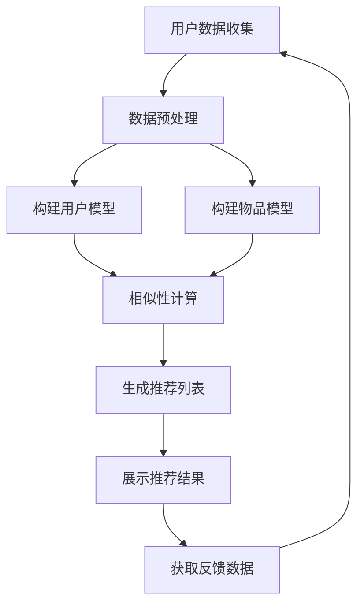

# 个性化推荐系统的研究和改进

## 1.背景介绍

在当今信息时代,我们被海量的数据所包围,信息过载已经成为一个普遍的问题。推荐系统应运而生,旨在从大量可用信息中为用户挑选出最相关、最感兴趣的内容,从而提高信息获取的效率。个性化推荐系统是一种基于用户个人偏好、行为习惯等数据,为其推荐最合适的信息、产品或服务的智能系统。

推荐系统广泛应用于电子商务、在线视频、音乐服务、社交网络、新闻资讯等多个领域,为用户提供个性化体验,同时也为企业带来了可观的经济收益。例如,亚马逊的个性化推荐系统可以根据用户浏览和购买记录推荐感兴趣的商品,这种精准营销大大提高了销售额;Netflix的推荐系统则能根据用户观影历史推荐合适的电影和电视剧,增强了用户粘性。

### 1.1 个性化推荐系统的重要性

随着互联网的发展和信息量的激增,个性化推荐系统变得越来越重要,主要有以下几个原因:

1. **信息过载** - 海量的信息资源使得用户很难找到真正感兴趣和有价值的内容,推荐系统能够帮助用户高效获取所需信息。
2. **个性化需求** - 不同用户对信息的需求存在很大差异,个性化推荐可以满足用户的个性化体验需求。
3. **提高用户体验** - 优质的个性化推荐能够增强用户粘性,提升用户对产品的满意度和忠诚度。
4. **商业价值** - 准确的个性化推荐可以提高营销转化率,带来可观的经济收益。

### 1.2 个性化推荐系统的挑战

尽管个性化推荐系统具有重要意义,但在实现过程中也面临着诸多挑战:

1. **数据质量** - 推荐系统的准确性很大程度上依赖于用户数据的质量和量,如何获取高质量的用户数据是一大挑战。
2. **隐私和安全** - 推荐系统需要收集和处理大量用户个人数据,如何在提供个性化服务的同时保护用户隐私至关重要。
3. **冷启动问题** - 对于新用户或新产品,由于缺乏足够的历史数据,很难做出准确推荐,需要特殊的冷启动策略。
4. **评估和优化** - 评估推荐系统的效果并不容易,需要合理的评估指标和持续优化。
5. **可解释性** - 很多推荐算法是黑盒子,缺乏可解释性,无法让用户了解推荐原因。

## 2.核心概念与联系

### 2.1 推荐系统的工作流程

推荐系统的基本工作流程如下所示:

1. **用户数据收集** - 收集用户的个人信息、浏览记录、购买历史、评分等数据。
2. **数据预处理** - 对收集的原始数据进行清洗、规范化、降维等预处理操作。
3. **构建用户模型和物品模型** - 基于预处理后的数据,构建用户兴趣模型和物品特征模型。
4. **相似性计算** - 计算用户之间或物品之间的相似度。
5. **生成推荐列表** - 根据相似度,为目标用户生成个性化的推荐列表。
6. **展示推荐结果** - 将推荐列表展示给用户。
7. **获取反馈数据** - 收集用户对推荐结果的反馈,如点击、购买等数据。
8. **迭代优化** - 基于反馈数据不断优化和改进推荐算法模型。

### 2.2 常见的推荐算法

推荐系统中常用的推荐算法主要有以下几类:

1. **协同过滤算法 (Collaborative Filtering)**
    - 基于用户的协同过滤: 根据用户之间的相似度进行推荐
    - 基于物品的协同过滤: 根据物品之间的相似度进行推荐
2. **基于内容的推荐 (Content-based)**
    - 利用物品内容特征与用户兴趣的相似度进行推荐
3. **基于知识的推荐 (Knowledge-based)**
    - 根据推荐对象的语义知识进行推理和匹配
4. **混合推荐 (Hybrid)**
    - 将多种算法融合,发挥各自的优势
5. **序列模式挖掘 (Sequential Pattern Mining)**
    - 挖掘用户行为序列模式,预测下一个可能的操作
6. **基于深度学习的推荐 (Deep Learning)**
    - 利用深度神经网络自动提取用户和物品的特征向量
7. **基于强化学习的推荐 (Reinforcement Learning)**
    - 将推荐问题建模为强化学习过程,最大化长期累积奖励

不同的推荐算法各有优缺点,在实际应用中需要根据具体场景选择合适的算法或算法组合。

## 3.核心算法原理具体操作步骤

在所有推荐算法中,协同过滤算法是最为经典和广泛使用的一类。下面将详细介绍基于用户的协同过滤算法的原理和具体实现步骤。

### 3.1 基于用户的协同过滤算法原理

基于用户的协同过滤算法的核心思想是:对于目标用户,在用户行为数据中找到与其兴趣爱好相似的邻居用户,然后根据这些邻居用户对物品的评分情况,预测目标用户对其他物品的兴趣程度,从而实现个性化推荐。

算法的主要步骤如下:

1. **计算用户相似度**
    - 基于用户对物品的评分数据,计算任意两个用户之间的相似度
    - 常用的相似度计算方法包括余弦相似度、皮尔逊相关系数、修正的余弦相似度等
2. **找到邻居用户**
    - 对目标用户,根据与其他用户的相似度大小,选取相似度最高的 K 个用户作为其邻居
3. **估计目标用户对物品的兴趣程度**
    - 基于邻居用户对该物品的评分情况,结合相似度权重,估计目标用户对该物品的兴趣程度
    - 常用的评分预测方法包括加权求和、基线加权求和等
4. **生成推荐列表**
    - 对目标用户未评分的物品,根据预测的兴趣程度从高到低排序
    - 将排序靠前的物品推荐给目标用户

### 3.2 算法实现步骤

下面以基于用户的协同过滤算法为例,详细阐述其具体实现步骤。

#### 步骤1: 数据收集和预处理

首先需要收集用户对物品的评分数据,通常以"用户ID-物品ID-评分值"的形式存储。然后对原始数据进行预处理,包括去除缺失值、异常值处理、数据规范化等。

#### 步骤2: 计算用户相似度

接下来,基于用户的评分数据,计算任意两个用户之间的相似度。常用的相似度计算方法包括:

1. **余弦相似度**

    $$sim(u,v)=\frac{\sum\limits_{i \in I_{uv}}r_{ui}r_{vi}}{\sqrt{\sum\limits_{i \in I_u}r_{ui}^2}\sqrt{\sum\limits_{i \in I_v}r_{vi}^2}}$$

    其中 $I_u$ 和 $I_v$ 分别表示用户 u 和用户 v 评分过的物品集合,$I_{uv}$表示两个用户都评分过的物品集合,$r_{ui}$和$r_{vi}$分别表示用户u和用户v对物品i的评分。

2. **皮尔逊相关系数**

    $$sim(u,v)=\frac{\sum\limits_{i \in I_{uv}}(r_{ui}-\overline{r_u})(r_{vi}-\overline{r_v})}{\sqrt{\sum\limits_{i \in I_u}(r_{ui}-\overline{r_u})^2}\sqrt{\sum\limits_{i \in I_v}(r_{vi}-\overline{r_v})^2}}$$

    其中 $\overline{r_u}$ 和 $\overline{r_v}$ 分别表示用户 u 和用户 v 的平均评分。

3. **修正的余弦相似度**

    $$sim(u,v)=\frac{\sum\limits_{i \in I_{uv}}(r_{ui}-\overline{r_u})(r_{vi}-\overline{r_v})}{\sqrt{\sum\limits_{i \in I_u}(r_{ui}-\overline{r_u})^2}\sqrt{\sum\limits_{i \in I_v}(r_{vi}-\overline{r_v})^2}}$$

    该方法结合了余弦相似度和皮尔逊相关系数的优点,通过减去用户平均评分来消除用户评分水平的影响。

#### 步骤3: 找到邻居用户

对于目标用户 u,根据与其他用户的相似度大小,选取相似度最高的 K 个用户作为其邻居,记为 $N_u$。常用的邻居选取策略包括:

1. **基于阈值的选取**
    - 设置一个相似度阈值 $\theta$
    - 选取所有与目标用户 u 的相似度大于 $\theta$ 的用户作为邻居
2. **基于数量的选取**
    - 设置一个最大邻居数 K
    - 选取与目标用户 u 相似度最高的 K 个用户作为邻居

#### 步骤4: 预测目标用户对物品的兴趣程度

对于目标用户 u 未评分的物品 i,可以基于其邻居用户对该物品的评分情况,结合相似度权重,估计目标用户对该物品的兴趣程度,即预测评分 $\hat{r}_{ui}$。常用的评分预测方法包括:

1. **加权求和**

    $$\hat{r}_{ui}=\frac{\sum\limits_{v \in N_u}sim(u,v)r_{vi}}{\sum\limits_{v \in N_u}sim(u,v)}$$

    即将邻居用户对物品 i 的评分,按照与目标用户的相似度加权平均。

2. **基线加权求和**

    $$\hat{r}_{ui}=\overline{r_u}+\frac{\sum\limits_{v \in N_u}sim(u,v)(r_{vi}-\overline{r_v})}{\sum\limits_{v \in N_u}sim(u,v)}$$

    该方法在加权求和的基础上,引入了用户平均评分 $\overline{r_u}$ 和 $\overline{r_v}$ 作为基线评分,可以有效消除用户评分水平的影响。

#### 步骤5: 生成推荐列表

对目标用户 u 未评分的所有物品,根据预测的兴趣程度 $\hat{r}_{ui}$ 从高到低排序,将排序靠前的物品推荐给用户。

需要注意的是,在实际应用中,还需要考虑一些其他因素,如推荐列表的多样性、新物品的冷启动问题等,并采取相应的优化策略。

## 4.数学模型和公式详细讲解举例说明

在上一节中,我们介绍了基于用户的协同过滤算法的核心步骤,其中涉及到一些数学模型和公式,下面将对这些模型和公式进行详细讲解和举例说明。

### 4.1 相似度计算

相似度计算是协同过滤算法的关键步骤,常用的相似度计算方法包括余弦相似度、皮尔逊相关系数和修正的余弦相似度。

#### 4.1.1 余弦相似度

余弦相似度用于计算两个向量之间的夹角余弦值,其公式如下:

$$sim(u,v)=\frac{\sum\limits_{i \in I_{uv}}r_{ui}r_{vi}}{\sqrt{\sum\limits_{i \in I_u}r_{ui}^2}\sqrt{\sum\limits_{i \in I_v}r_{vi}^2}}$$

其中 $