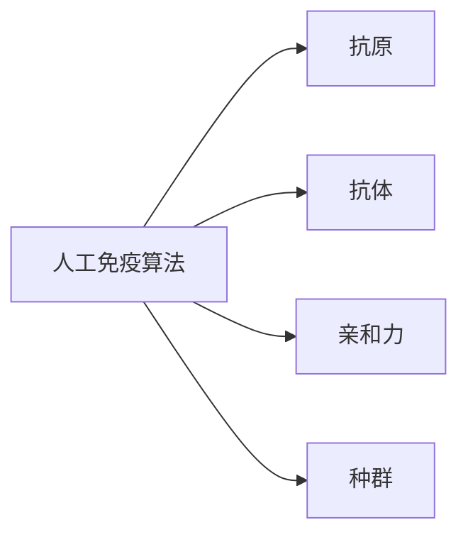
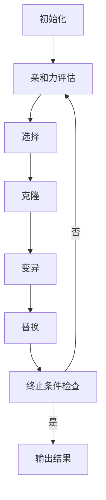

# 人工免疫算法(Artificial Immune Systems) - 原理与代码实例讲解

## 1.背景介绍

### 1.1 生物免疫系统概述

人体的免疫系统是一个复杂而精密的保护机制,旨在识别和消除入侵的病原体(如细菌、病毒和寄生虫)。它由多种细胞和分子组成,包括淋巴细胞(B细胞和T细胞)、抗体、细胞因子等。免疫系统通过多种方式来对抗病原体,包括产生抗体、激活杀手细胞、发出炎症反应等。

### 1.2 人工免疫算法的起源

人工免疫算法(Artificial Immune Systems, AIS)是一种计算智能技术,灵感来源于生物免疫系统的原理和过程。它将生物免疫系统的基本特征和机制抽象并应用于计算机算法中,用于解决复杂的问题。人工免疫算法最早可以追溯到20世纪80年代,当时一些研究人员开始探索将免疫系统的原理应用于计算机科学领域。

### 1.3 人工免疫算法的特点

人工免疫算法具有以下主要特点:

1. **分布式计算**: 没有集中控制,系统中的各个部分通过局部交互来完成整体功能。
2. **自适应性**: 能够根据环境的变化自主调整自身行为。
3. **多样性**: 存在多种不同的识别和响应机制,增强了系统的鲁棒性。
4. **记忆能力**: 能够记住以前遇到的问题及其解决方案,加快未来类似问题的处理速度。

## 2.核心概念与联系

### 2.1 人工免疫系统中的主要成分

人工免疫算法中的主要成分包括:

1. **抗原(Antigen)**: 表示需要被识别和处理的问题或模式。
2. **抗体(Antibody)**: 表示可能的解决方案或识别模式。
3. **亲和力(Affinity)**: 衡量抗体与抗原之间的匹配程度。
4. **种群(Population)**: 由多个抗体组成的集合。

### 2.2 人工免疫算法的主要过程

人工免疫算法通常包括以下主要过程:

1. **初始化**: 随机生成一个初始抗体种群。
2. **亲和力评估**: 计算每个抗体与抗原之间的亲和力。
3. **选择**: 根据亲和力值选择具有较高亲和力的抗体。
4. **克隆**: 对选择的抗体进行克隆,产生新的抗体种群。
5. **变异**: 对克隆的抗体种群进行变异操作,引入新的多样性。
6. **替换**: 用新的抗体种群替换原有种群的一部分或全部。
7. **重复**: 重复执行上述过程,直到满足终止条件。

## 3.核心算法原理具体操作步骤

### 3.1 初始化

在人工免疫算法中,初始化过程是随机生成一个初始抗体种群。这个种群通常是由一组随机生成的候选解(抗体)组成。初始化过程的目的是为算法提供一个初始的搜索起点,并确保种群具有足够的多样性。

初始化过程的步骤如下:

1. 确定抗体的编码方式,例如二进制编码、实数编码等。
2. 确定种群大小,即初始抗体数量。
3. 根据编码方式和问题约束,随机生成初始抗体种群。

### 3.2 亲和力评估

亲和力评估是人工免疫算法中的关键步骤,用于衡量每个抗体与抗原之间的匹配程度。亲和力的计算方式取决于具体的问题和编码方式。通常情况下,亲和力值越高,表示抗体与抗原的匹配程度越好。

亲和力评估的步骤如下:

1. 定义适当的亲和力函数,根据问题的特点和约束条件来设计。
2. 对于每个抗体,计算其与抗原之间的亲和力值。
3. 根据亲和力值对抗体进行排序或分类。

### 3.3 选择

选择过程的目的是从当前种群中选择具有较高亲和力的抗体,用于后续的克隆和变异操作。常见的选择方法包括锦标赛选择、轮盘赌选择、排名选择等。

选择过程的步骤如下:

1. 根据选择方法的要求,计算每个抗体的选择概率或适应度值。
2. 根据选择概率或适应度值,从种群中选择一定数量的抗体。
3. 将选择的抗体用于后续的克隆和变异操作。

### 3.4 克隆

克隆过程是根据选择的抗体,生成多个克隆抗体的过程。克隆数量通常与抗体的亲和力值成正比,亲和力值越高,克隆数量越多。这样可以更多地探索具有较高亲和力的解空间区域。

克隆过程的步骤如下:

1. 根据选择的抗体及其亲和力值,确定每个抗体的克隆数量。
2. 对于每个选择的抗体,生成相应数量的克隆抗体。
3. 将所有克隆抗体合并形成新的种群,用于后续的变异操作。

### 3.5 变异

变异过程是在克隆种群中引入新的多样性,以探索更广阔的解空间。变异操作通常是对抗体的部分或全部进行随机改变,产生新的抗体。变异的强度和概率需要根据具体问题进行调整。

变异过程的步骤如下:

1. 确定变异操作的方式,例如位翻转、数值扰动等。
2. 确定变异概率和变异强度。
3. 对克隆种群中的每个抗体进行变异操作,生成新的变异抗体。
4. 将变异后的抗体合并到种群中。

### 3.6 替换

替换过程是用新生成的抗体种群(包括变异后的抗体)替换原有种群的一部分或全部。替换策略决定了新旧抗体之间的比例,以及如何选择被替换的抗体。

替换过程的步骤如下:

1. 确定替换策略,例如全部替换、部分替换等。
2. 如果是部分替换,需要确定被替换抗体的选择方式,例如根据亲和力值或随机选择。
3. 根据替换策略,用新生成的抗体种群替换原有种群中的部分或全部抗体。
4. 将替换后的新种群用于下一轮迭代。

### 3.7 终止条件检查

终止条件检查是人工免疫算法的最后一步,用于判断是否满足算法终止的条件。常见的终止条件包括:

1. 达到最大迭代次数。
2. 种群中的最优解在一定迭代次数内没有改变。
3. 目标函数值达到预设的阈值。
4. 满足其他特定的终止条件。

如果终止条件满足,算法将输出当前种群中的最优解作为最终结果;否则,算法将进入下一轮迭代,重复执行上述过程。

## 4.数学模型和公式详细讲解举例说明

### 4.1 亲和力计算

亲和力是衡量抗体与抗原之间匹配程度的指标。在人工免疫算法中,亲和力的计算方式取决于具体的问题和编码方式。以下是一些常见的亲和力计算公式:

1. **欧几里得距离**:

对于实数编码的问题,可以使用欧几里得距离来计算亲和力。距离越小,亲和力越高。

$$
\text{affinity}(Ab, Ag) = \frac{1}{1 + d(Ab, Ag)}
$$

其中,$$d(Ab, Ag)$$是抗体$$Ab$$与抗原$$Ag$$之间的欧几里得距离。

2. **汉明距离**:

对于二进制编码的问题,可以使用汉明距离来计算亲和力。距离越小,亲和力越高。

$$
\text{affinity}(Ab, Ag) = \frac{1}{1 + h(Ab, Ag)}
$$

其中,$$h(Ab, Ag)$$是抗体$$Ab$$与抗原$$Ag$$之间的汉明距离。

3. **相似度**:

也可以直接使用相似度作为亲和力的度量。相似度越高,亲和力越高。

$$
\text{affinity}(Ab, Ag) = \text{similarity}(Ab, Ag)
$$

其中,$$\text{similarity}(Ab, Ag)$$是抗体$$Ab$$与抗原$$Ag$$之间的相似度函数。

### 4.2 变异操作

变异操作是在克隆种群中引入新的多样性,以探索更广阔的解空间。常见的变异操作包括:

1. **位翻转变异**:

对于二进制编码的问题,位翻转变异是将抗体的某些位进行翻转(0变1,1变0)。

$$
Ab' = \text{flip}(Ab, p_m)
$$

其中,$$Ab'$$是变异后的抗体,$$\text{flip}(Ab, p_m)$$是以概率$$p_m$$对抗体$$Ab$$进行位翻转操作。

2. **高斯变异**:

对于实数编码的问题,高斯变异是在抗体的每个维度上加上一个服从高斯分布的随机扰动。

$$
Ab'_i = Ab_i + \mathcal{N}(0, \sigma_i)
$$

其中,$$Ab'_i$$是变异后抗体的第$$i$$个维度,$$Ab_i$$是原抗体的第$$i$$个维度,$$\mathcal{N}(0, \sigma_i)$$是均值为0、标准差为$$\sigma_i$$的高斯分布。

### 4.3 种群多样性

为了保持种群的多样性,人工免疫算法通常采用以下策略:

1. **亲和力共享**:

对于亲和力值相似的抗体,降低它们的适应度值,从而减少被选择的概率。这可以防止种群过早收敛到局部最优解。

$$
\text{shared_affinity}(Ab_i) = \frac{\text{affinity}(Ab_i)}{n_i}
$$

其中,$$\text{shared_affinity}(Ab_i)$$是抗体$$Ab_i$$的共享亲和力值,$$n_i$$是与$$Ab_i$$亲和力值相似的抗体数量。

2. **种群编辑**:

在每次迭代后,从种群中删除亲和力值较低的抗体,并引入新的随机抗体,以维持种群的多样性。

### 4.4 选择策略

选择策略决定了如何从当前种群中选择具有较高亲和力的抗体,用于后续的克隆和变异操作。常见的选择策略包括:

1. **锦标赛选择**:

随机选择一定数量的抗体,并从中选择亲和力值最高的抗体。

2. **轮盘赌选择**:

每个抗体被选择的概率与其亲和力值成正比。亲和力值越高,被选择的概率越大。

$$
P(Ab_i) = \frac{\text{affinity}(Ab_i)}{\sum_{j=1}^{N} \text{affinity}(Ab_j)}
$$

其中,$$P(Ab_i)$$是抗体$$Ab_i$$被选择的概率,$$N$$是种群大小。

3. **排名选择**:

根据抗体的亲和力值进行排名,选择排名靠前的抗体。

这些选择策略可以根据具体问题和需求进行组合和调整。

## 5.项目实践:代码实例和详细解释说明

在本节中,我们将提供一个使用Python实现的人工免疫算法示例,用于解决旅行商问题(Traveling Salesman Problem, TSP)。TSP是一个经典的组合优化问题,目标是找到一条最短的路径,访问给定的一组城市并返回起点。

### 5.1 问题描述

给定一组城市及它们之间