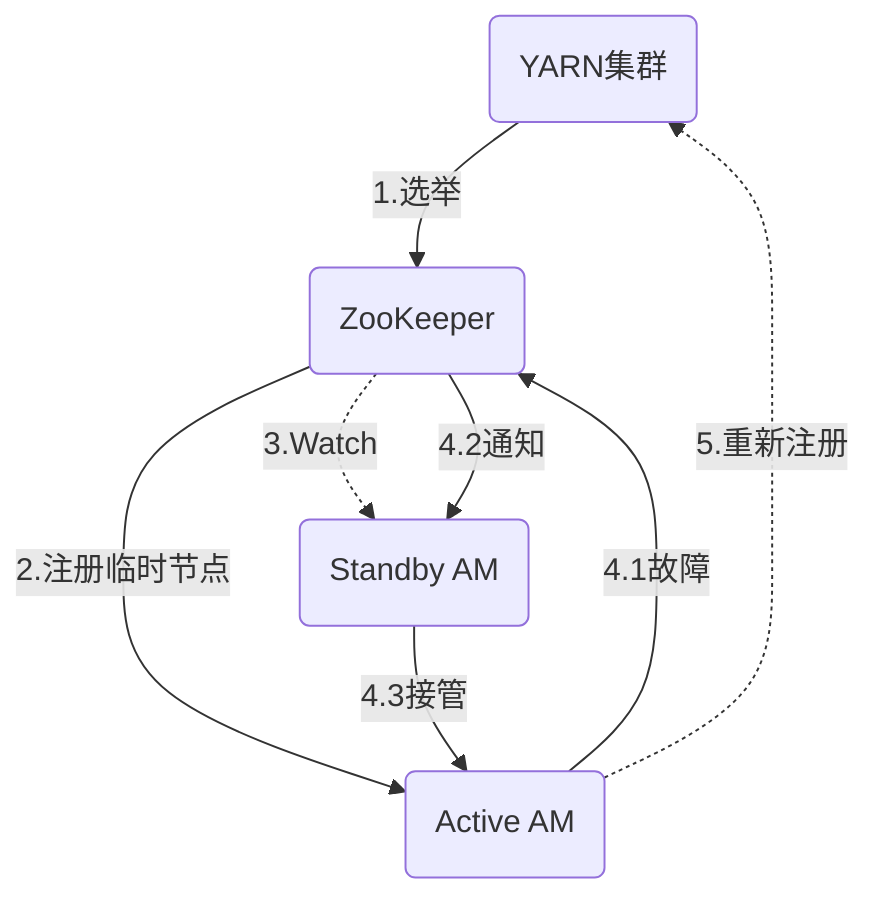
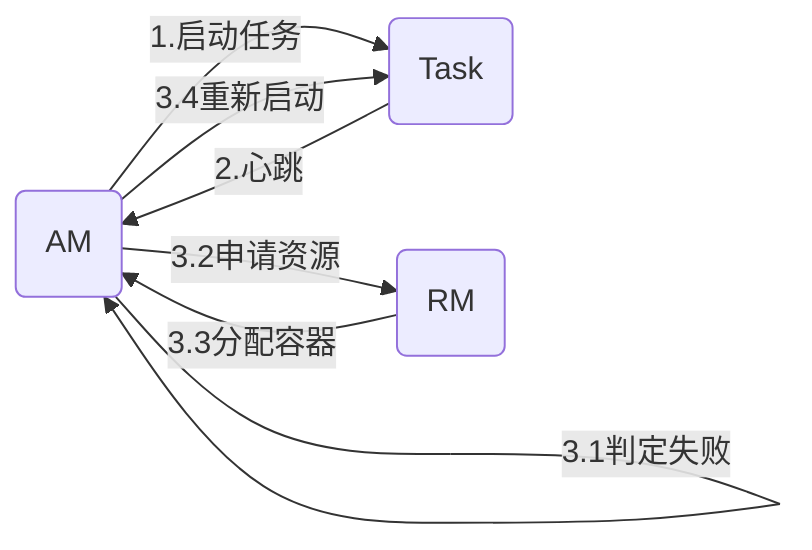

# 从ApplicationMaster借鉴:设计高可用系统

## 1.背景介绍
### 1.1 高可用系统的重要性
在当今互联网时代,系统的高可用性已经成为一个关键的话题。随着业务规模的不断扩大,任何一个系统的故障都可能带来巨大的经济损失和用户体验下降。因此,如何设计和构建一个高可用的系统架构,成为了工程师们面临的重要课题。

### 1.2 借鉴Hadoop YARN中ApplicationMaster的思路
在大数据领域,Hadoop YARN作为一个成熟的资源管理和任务调度框架,其ApplicationMaster组件为我们设计高可用系统提供了很好的思路。ApplicationMaster作为每个应用程序的控制器,负责应用的运行状态监控、资源申请和任务调度,是YARN应用程序的"大脑"。它的设计理念和实现方式,对于构建高可用的系统有很大的借鉴意义。

### 1.3 本文的主要内容
本文将从ApplicationMaster的角度出发,深入剖析其在可用性、容错性、扩展性等方面的特点,并探讨如何将这些经验应用到我们自己的系统设计中。通过对YARN源码的研读和思考,我们将总结出一些设计高可用系统的关键原则和最佳实践,为构建稳定、高效的系统架构提供参考。

## 2.核心概念与联系
### 2.1 高可用系统的特征
- 无单点故障:系统中的任何一个组件发生故障,都不会影响整个系统的可用性。
- 故障自动恢复:当系统发生故障时,能够自动进行故障转移和恢复,将业务中断时间降到最低。  
- 容量水平扩展:系统能够通过增加机器来线性地提升处理能力,从容应对业务增长。
- 在线升级维护:系统升级和日常运维可以在不停机的情况下完成,不影响业务连续性。

### 2.2 ApplicationMaster的功能与职责
- 作为YARN应用程序的控制器,负责应用的整个生命周期管理。
- 向ResourceManager申请资源,并与NodeManager通信启动任务。
- 监控任务的运行状态,重启失败的任务以保证应用的完整性。
- 动态调整应用的资源需求,高效利用集群资源。

### 2.3 ApplicationMaster的可用性保证
- 利用ZooKeeper等协调服务实现主备模式,备用AM随时待命接管。
- 定期向RM发送心跳,RM侦测到AM故障时可重新启动。
- 内部模块解耦,避免单个模块失效导致整个AM不可用。
- 资源申请和任务调度有容错和重试机制,应对局部故障。

## 3.核心算法原理与具体操作步骤
### 3.1 AM的主备切换流程
1. 利用ZooKeeper选举,确定主AM和备用AM。
2. 主AM在ZK上注册临时节点,并定期更新。
3. 备用AM通过ZK Watch机制监听主AM状态。
4. 主AM故障时,其节点自动消失,备用AM触发接管流程:
   - 在ZK创建新的临时节点,成为新的主AM
   - 恢复之前主AM的运行状态,重新接管应用管理
5. 发生切换的AM需通知RM,重新注册获取资源。



### 3.2 故障任务的恢复机制 
1. AM在任务启动时记录任务的元信息。
2. 运行中的任务定期向AM发送心跳报告状态。
3. 心跳超时的任务被判定为失败,AM触发重试机制:
   - 检查任务失败原因,是否需要调整资源
   - 重新向RM申请容器资源
   - 在新的容器中启动失败的任务
   - 恢复任务之前的运行状态和进度
4. 重试次数达到上限的任务,判定为最终失败。



### 3.3 资源调度的策略与算法
- 基于资源请求和队列容量,公平地为应用分配资源。
- 支持DRF(Dominant Resource Fairness)调度,平衡多维度资源。
- 结合应用优先级、资源使用情况动态调整资源分配。
- 应用内部采用延迟调度,优先为急需资源的任务分配。

## 4.数学模型与公式详解
### 4.1 资源公平分配模型
假设系统有$n$个应用,每个应用请求资源向量$R_i=(r_{i1},r_{i2},...,r_{im})$,其中$r_{ik}$表示应用$i$对资源$k$的需求量。
系统总资源向量为$C=(c_1,c_2,...,c_m)$,目标是让各应用获得的资源份额$A_i=(a_{i1},a_{i2},...,a_{im})$最大程度接近其请求量$R_i$,
同时满足资源总量约束:$\sum_{i=1}^{n} a_{ik} \leq c_k, \forall k \in {1,2,...,m}$

其中,应用$i$的资源份额满足比例:

$$\frac{a_{i1}}{r_{i1}}=\frac{a_{i2}}{r_{i2}}=...=\frac{a_{im}}{r_{im}}$$

最终的资源分配结果可通过求解下面的优化问题得到:

$$\begin{aligned} 
\max \limits_{A} & \sum_{i=1}^{n} \sum_{k=1}^{m} \log(\frac{a_{ik}}{r_{ik}}) \\
s.t. & \sum_{i=1}^{n} a_{ik} \leq c_k, \forall k \in {1,2,...,m} \\ 
& a_{ik} \geq 0, \forall i,k
\end{aligned}$$

### 4.2 DRF资源调度模型
DRF(Dominant Resource Fairness)是一种考虑多资源维度的公平性调度模型。
定义应用$i$的主导资源$d_i$为其对各资源需求量相对总量比例最大的一个:

$$d_i=\max_k(\frac{r_{ik}}{c_k})$$

DRF的原则是让各应用获得的主导资源份额尽量相等。一个DRF分配方案需满足:

1. 如果两个应用主导资源相同,则它们获得相等的主导资源份额。
2. 如果一个应用主导资源小于另一个,则其主导资源份额不小于另一个。

形式化地,令$s_i$表示应用$i$分配到的主导资源份额,DRF方案需满足:

$$s_i=s_j,\text{如果}d_i=d_j$$
$$s_i \geq s_j,\text{如果}d_i < d_j$$

在满足DRF原则的同时,最大化资源利用率,可以将问题建模为线性规划求解:

$$\begin{aligned}
\max \limits_{A} & \sum_{i=1}^{n} \sum_{k=1}^{m} a_{ik} \\
s.t. & \sum_{i=1}^{n} a_{ik} \leq c_k, \forall k \in {1,2,...,m} \\
& \frac{a_{ik}}{c_k} \leq s_i, \forall i,k \\
& s_i \leq s_j, \text{如果} d_i \leq d_j, \forall i,j \\
& a_{ik},s_i \geq 0, \forall i,k
\end{aligned}$$

## 5.项目实践:代码实例与详解
下面以YARN中的Fair Scheduler为例,展示资源调度的部分核心代码:

```java
// 计算应用fair shares
private void computeFairShares() {
  Collection<FSLeafQueue> queues = getLeafQueues();
  Resource totalResources = getClusterResource();
  
  // 统计active apps和待分配资源量
  int activeApps = 0;
  Resource remainingResources = Resources.clone(totalResources);
  for (FSLeafQueue queue : queues) {
    activeApps += queue.getNumActiveApps();
    Resources.subtractFrom(remainingResources, queue.getResourceUsage());
  }
  
  // 根据active apps平均分配资源
  Resource appFairShare = Resources.divide(remainingResources, activeApps);
  for (FSLeafQueue queue : queues) {
    int queueActiveApps = queue.getNumActiveApps();
    Resource queueFairShare = Resources.multiply(appFairShare, queueActiveApps);
    queue.setFairShare(queueFairShare);
  }
}

// 在队列内分配container
private Resource assignContainersToQueues(Resource cluster, 
    Collection<FSSchedulerNode> nodes) {
  Resource assigned = Resources.none();
  
  while (Resources.greaterThan(cluster, assigned, Resources.none())) {
    // 找出资源使用相对fair share最小的queue
    FSLeafQueue queue = getQueueWithMinShareRatio();
    
    // 为queue分配container,更新assigned
    assigned = Resources.add(assigned, 
      queue.assignContainers(cluster, nodes));
  }
  return assigned;
}
```

以上代码展示了YARN Fair Scheduler的两个核心方法:

1. computeFairShares根据active apps数量计算每个队列的fair share资源量。
2. assignContainersToQueues在队列间分配资源,每次选择资源使用相对fair share最小的队列,调用内部的assignContainers方法分配container。

可以看出,Fair Scheduler通过动态计算fair shares,结合队列间"最小share比例优先"的原则,在满足公平性的同时提高资源利用率。
AM需要基于这些调度结果,灵活地为不同任务请求和分配资源,高效完成应用计算。

## 6.实际应用场景
YARN及其ApplicationMaster为众多大数据应用提供了统一的资源管理和任务调度能力,在实际场景中得到了广泛应用:

- MapReduce:Hadoop MapReduce应用基于YARN构建,由MRAppMaster负责map/reduce任务的调度和容错。
- Spark:Spark on YARN利用ApplicationMaster管理executor,动态申请和分配资源。
- Flink:Flink的YARN模式同样基于ApplicationMaster调度task,并对其做了定制和优化。
- Hive:Hive on Tez将SQL查询转换为YARN上的DAG任务,由ApplicationMaster协调。
- HBase:HBase利用YARN资源管理能力,实现RegionServer的弹性伸缩。

这些大数据框架和应用都构建在YARN之上,充分利用了ApplicationMaster的资源管理、任务调度、状态监控等功能,极大地简化了应用开发和运维。同时,ApplicationMaster的高可用和容错能力,也为这些应用提供了SLA保证。

除了大数据领域,ApplicationMaster的设计思想还可以用于其他需要高可用和资源管理的分布式应用,如深度学习任务、流处理应用等。开发者可以参考YARN的架构,设计实现应用自己的"ApplicationMaster",提供更智能、更可靠的应用管理功能。

## 7.工具和资源推荐
- Apache YARN:https://hadoop.apache.org/docs/current/hadoop-yarn/hadoop-yarn-site/YARN.html
- Hadoop源码:https://github.com/apache/hadoop
- YARN ResourceManager REST API:https://hadoop.apache.org/docs/current/hadoop-yarn/hadoop-yarn-site/ResourceManagerRest.html  
- Spark on YARN:http://spark.apache.org/docs/latest/running-on-yarn.html
- Flink on YARN:https://ci.apache.org/projects/flink/flink-docs-release-1.12/deployment/resource-providers/yarn.html
- Hive on Tez:https://cwiki.apache.org/confluence/display/Hive/Hive+on+Tez
- 《Hadoop权威指南》:https://book.douban.com/subject/6523762/
- 《Hadoop技术内幕:深入解析YARN架构设计与实现原理》:https://book.douban.com/subject/26328859/

## 8.总结:未来发展趋势与挑战
ApplicationMaster作为YARN的核心设计,很好地解决了大数据应用的资源管理和任务调度问题,极大地提升了系统的可用性和运维效率。未来在大数据、云计算的发展中,类似ApplicationMaster这样的应用管理模式还将不断演进:

- 跨集群统一调度:打破数据中心边界,实现